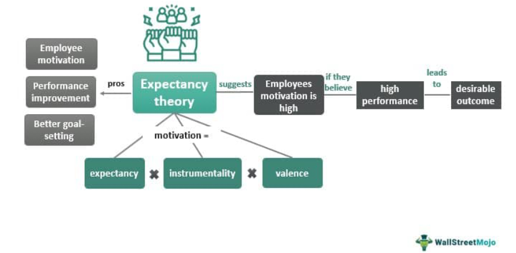

Algorithmic trading, commonly known as 'algo trading' or 'black-box trading', is integral to modern financial markets. Leveraging advanced mathematical models and automated systems, algo trading executes orders with precision and speed beyond human capacity. Since its inception, algorithmic trading has continuously evolved, influenced by rapid technological advancements and the pivotal role played by instrumentalities—entities that facilitate essential public functions while operating with private efficiency. 

The evolution of algorithmic trading is a testament to the ingenuity that has driven it from rudimentary beginnings to sophisticated operations. Key innovations in data transmission and communications laid the foundation for its rise. Nathan Mayer Rothschild's use of carrier pigeons for receiving stock price information faster than his competitors marked a revolutionary step in trading. This early form of exploiting communication technology foreshadowed a series of milestones, including the creation of the telegraph, stock tickers, and the first computerized trading systems, which collectively catalyzed the advent of modern algorithmic trading.



Instrumentalities, like Fannie Mae, Ginnie Mae, and Freddie Mac, have played crucial roles in supporting automated trading systems by bridging the service-oriented functions of public governance with the efficiency-driven goals of the private sector. Their strategic involvement underscores the critical balance between regulatory frameworks and market innovations, ensuring that the financial ecosystem remains both robust and flexible to accommodate algorithmic trading's dynamic nature.

Algo trading offers myriad benefits, such as enhancing market liquidity, improving price discovery, and reducing transaction costs. These advantages have made algo trading highly attractive to investors and market participants seeking to optimize their strategies and execute large-scale orders without incurring significant market impact. The automation inherent in algorithmic trading minimizes human errors and achieves operational efficiencies that were previously unimaginable.

The historical context that has shaped algorithmic trading is marked by technological revolutions and regulatory interactions that have collectively structured its current landscape. This ever-evolving field represents the intersection of finance, technology, and regulatory oversight, fostering a more efficient and stable market environment.

As algorithmic trading continues to transform financial markets, its foundational synergy with instrumentalities will remain essential. Navigating the balance between innovation, market stability, and regulatory compliance will be crucial for realizing the full potential of this powerful trading methodology. Understanding the trajectory and implications of algo trading is vital not only for its current participants but also for shaping the financial markets of the future.

## Table of Contents

## Understanding Instrumentality and Its Role in Automated Trading

Instrumentality within the context of automated trading refers to organizations that, although functioning independently, receive backing from the government owing to the critical public services they provide. Institutions such as Fannie Mae, Ginnie Mae, and Freddie Mac exemplify this concept and play pivotal roles within financial markets, particularly in mortgage-backed securities and the secondary mortgage market.

These entities contribute to the resilience and efficiency of automated trading systems primarily through their standardized processes and risk management frameworks. By establishing a reliable, government-supported infrastructure, they foster confidence among investors and other market participants. As a result, they facilitate a smoother execution of trades, which can be particularly beneficial in the high-stakes environment of [algorithmic trading](/wiki/algorithmic-trading).

Instrumentalities like Fannie Mae and Freddie Mac stimulate [liquidity](/wiki/liquidity-risk-premium) in the housing finance market by purchasing mortgages from lenders. This process provides lenders with capital to issue more loans, thus maintaining an active mortgage lending market. For automated trading systems, these institutional activities ensure a steady flow of tradeable securities and create a predictable market environment, which is essential for designing effective trading algorithms.

Furthermore, instrumentalities serve as a bridge between public interest and private sector efficiency. They operate with a dual purpose: fulfilling a public mandate—such as promoting homeownership in the U.S.—while simultaneously adhering to private sector operational efficiencies to remain competitive and financially viable. This dual role is critical in aligning the goals of market innovation with the need for financial stability and consumer protection.

The involvement of instrumentalities in the financial markets also encompasses the provision of standardized and transparent data, which is indispensable for algorithmic trading. Accurate data dissemination ensures that trading models can be developed and calibrated with a high degree of reliability, reducing the risks associated with misinformation or asymmetric information.

Instrumentalities are therefore integral to the robust functioning of automated trading systems, providing not only the infrastructure and liquidity necessary for these systems to thrive but also aligning their operations with broader economic and societal objectives. This dual role enhances the capacity of algorithmic trading to contribute positively to market dynamics while underscoring the importance of harmonizing public and private interests in financial markets.

## The History of Algorithmic Trading

Algorithmic trading has a rich history embedded in the advancements of data transmission and market communication. Its origins can be traced back to the early 19th century with Nathan Mayer Rothschild's innovative use of carrier pigeons. Rothschild deployed these birds to gain a competitive edge by receiving crucial financial information more quickly than his rivals, illustrating the early importance of speedy data transmission in trading.

The journey from carrier pigeons to today’s high-frequency trading has been marked by several key technological milestones. One significant advancement was the development of the telegraph in the 1830s and 1840s. The telegraph revolutionized market communication, enabling traders to transmit information over long distances almost instantaneously compared to previous methods. This technology drastically reduced the time lag between information dissemination and reaction.

As the telegraph technology matured, the introduction of the stock ticker in the 1860s further propelled the trading industry into a new era. The stock ticker was an electrical device that provided continuous, up-to-date share prices, allowing traders to make faster and more informed decisions. This innovation laid the foundation for more systematic approaches to trading, as it allowed for real-time data to be processed and acted upon.

The transition to computerized trading systems began in the late 20th century, fundamentally changing the landscape of financial markets. The 1970s saw the emergence of electronic trading platforms, which automated many aspects of trading previously handled manually. The introduction of the Designated Order Turnaround (DOT) system by the New York Stock Exchange in 1976 allowed trading orders to be routed electronically, significantly increasing the speed and efficiency of executing trades.

The evolution continued with the advent of sophisticated algorithmic trading systems in the late 20th and early 21st centuries. These systems are based on mathematical models and complex algorithms that can analyze market conditions and execute trades at speeds far beyond human capability. Modern high-frequency trading ([HFT](/wiki/high-frequency-trading-strategies)), a subset of algorithmic trading, leverages these developments, executing thousands of trades per second based on minute market movements.

Each of these technological advancements contributed to the development of the contemporary trading environment. They laid the groundwork for the high-speed, data-driven trading practices that dominate today's financial markets. This historical progression from carrier pigeons to ultra-fast electronic systems underscores the transformative impact of technology on trading dynamics, illustrating the continually evolving nature of financial markets.

## Benefits of Algorithmic Trading

Algorithmic trading plays a pivotal role in modern financial markets by offering numerous benefits, chiefly among them increased market efficiency and reduced transaction costs. The application of precise algorithms allows for the execution of trades at speeds and frequencies that human traders cannot achieve, enhancing both liquidity and market depth. 

One of the hallmark advantages of algorithmic trading is its ability to tighten bid-ask spreads. By employing various trading algorithms, market participants can execute large volumes of trades with minimal market impact. This increased liquidity leads to narrower bid-ask spreads, reflecting a more efficient and competitive market environment. As liquidity providers deploy these algorithms, the continuous interaction between buy and sell orders helps maintain balanced market conditions.

High-frequency trading (HFT), a subset of algorithmic trading, exemplifies the role of algorithms in enabling rapid trade execution and large-scale order processing. HFT strategies analyze and exploit minute price discrepancies across different trading venues, often within microseconds. This form of trading not only contributes to market liquidity but also disseminates information swiftly through price adjustments, thereby promoting transparency and price discovery.

Automation is another critical benefit, as it significantly reduces the possibility of human error and optimizes trading strategies. By removing emotional biases and ensuring adherence to predefined trade criteria, algorithmic trading enhances consistency and discipline in trade execution. Traders and firms use automated systems to back-test strategies against historical data, refine their models, and deploy strategies that have a higher likelihood of success. 

Python, a popular programming language for developing algorithmic trading systems, provides robust libraries such as pandas and NumPy for data manipulation and analysis. For instance, implementing simple moving average strategies can be handled efficiently using Python:

```python
import pandas as pd

# Sample data
data = {'Price': [100, 102, 104, 103, 108, 110, 111, 115, 117]}
df = pd.DataFrame(data)

# Calculate moving averages
df['SMA_3'] = df['Price'].rolling(window=3).mean()

print(df)
```

This script calculates a 3-period simple moving average, which traders can use to identify price trends and generate trade signals, demonstrating how algorithmic tools can optimize and automate trading tasks effectively.

Through these attributes, algorithmic trading not only improves trading efficiencies but also positions market participants to capitalize on emerging opportunities swiftly and systematically. The automation and precision inherent in algorithmic systems transform trading strategies into comprehensive solutions that adeptly navigate the complexities of financial markets.

## Instrumentalities in the Modern Trading Ecosystem

Instrumentalities, as entities backed by governmental support, play a pivotal role in shaping the landscape of automated trading systems. Their contributions are crucial in establishing a stable and efficient financial ecosystem. By acting as intermediaries between public service goals and private sector innovation, instrumentalities provide essential stability and growth prospects within modern trading platforms.

One of the primary contributions of instrumentalities is their ability to reduce systemic risk and promote financial stability. By providing guarantees or backing securities, these entities help maintain liquidity in the markets, ensuring smoother functioning even during periods of economic turbulence. For instance, organizations like Fannie Mae and Freddie Mac offer liquidity in the mortgage market, which directly affects large sectors of the economy, thereby promoting broader financial stability.

Instrumentalities also play a significant role in aligning public welfare with financial innovation. By bridging government regulatory frameworks with private sector efficiencies, these entities can foster environments where both innovation and public interests are served. This alignment is evident in how mortgage-backed securities, facilitated by these instrumentalities, have allowed greater access to housing loans for individuals, thus advancing public welfare while also enabling extensive financial product innovations.

The regulatory and operational frameworks governing these instrumentalities are designed to balance their dual roles of ensuring public service delivery and fostering financial innovation. These frameworks provide regulatory oversight to ensure that the activities of instrumentalities are in line with broader economic policy objectives, such as ensuring credit availability and protecting consumers. The frameworks also necessitate transparency and accountability, thereby maintaining public trust and encouraging responsible innovation.

Overall, instrumentalities are integral to the development of automated trading systems by enhancing systemic resilience, aligning civic goals with market development, and ensuring regulatory compliance. This synergy between governmental support and market efficiency enhances the robustness of the trading environment, ensuring that innovation can be leveraged for the benefit of broader society.

## Challenges and Future of Instrumentality in Algo Trading

Algorithmic trading, supported by various instrumentalities, encounters a unique set of challenges and opportunities. The integration of these entities within the financial ecosystem presents both benefits and complications. Here, we analyze the challenges, emerging trends, technological advancements, and ethical considerations associated with the future of instrumentality-driven trading.

### Challenges from Market Volatility and Regulatory Changes

Instrumentalities, those organizations operating with government backing due to their essential public functions, are uniquely positioned within the financial markets. However, the volatile nature of these markets presents a significant challenge. Market turbulence can lead to rapid changes in trading dynamics, affecting the liquidity provisions and hedging strategies employed by these entities. Consequently, the stability of automated trading systems can be threatened, requiring constant adaptation and improvement of algorithms.

Regulatory modifications further complicate the operations of instrumentalities. As global financial regulations evolve, these organizations must continuously align their strategies and operations to comply with new standards. This is particularly challenging when regulations impact cross-border trading operations or introduce constraints on the types of financial instruments that can be traded algorithmically.

### Emerging Trends and Technological Innovations

In response to these challenges, the landscape of instrumentality-driven trading is shaping up with several emerging trends and technological breakthroughs. One notable trend is the increase in [machine learning](/wiki/machine-learning) and [artificial intelligence](/wiki/ai-artificial-intelligence) applications within algorithmic trading. These technologies enhance the predictive accuracy of trading models and provide innovative solutions for risk management. For example, [reinforcement learning](/wiki/reinforcement-learning) algorithms can be employed to optimize decision-making processes in real-time trading scenarios.

Moreover, blockchain technology and distributed ledger systems are gradually being integrated into trading systems, promoting transparency and reducing the risk of fraudulent activities. By decentralizing transaction records, these technologies ensure a more secure and reliable trading environment.

### Ethical Considerations and Balancing Innovation with Regulation

The integration of powerful technologies in trading brings forth ethical implications that need careful consideration. Algorithmic trading, if unchecked, can contribute to market manipulation and the creation of 'flash crashes.' There is a pressing need for regulatory bodies and instrumentalities to establish robust guidelines that prevent unethical trading behaviors while ensuring market stability.

Balancing innovation with regulation requires a collaborative approach. Regulatory bodies must remain flexible to accommodate technological advancements without stymieing innovation. Likewise, instrumentalities need to work closely with regulators to develop frameworks that support ethical trading practices. This includes implementing algorithms designed to comply with existing regulations, such as the MiFID II directive in Europe, which aims to boost market transparency and investor protection.

In conclusion, while instrumentalities face numerous challenges within the rapidly evolving financial markets, they possess the potential to lead the sector towards a more efficient and ethical future. By harnessing emerging technologies and fostering cooperation between regulatory agencies and private sector innovations, instrumentalities can continue to play a crucial role in shaping the future dynamics of algorithmic trading.

## Conclusion

Algorithmic trading, supported by the robust framework of instrumentalities, is a transformative force in financial markets. This intricate synergy between government-backed entities and the rapidly evolving landscape of private sector technology creates a trading environment that is both efficient and resilient. Instrumentalities like Fannie Mae, Ginnie Mae, and Freddie Mac play a key role in bridging public welfare goals with market-driven efficiencies, ensuring that the advancements in algorithmic trading align with broader economic stability.

As algorithmic trading technologies continue to progress, the importance of instrumentalities in maintaining this balance cannot be overstated. These entities help manage systemic risks and ensure compliance with regulatory frameworks, which is crucial for sustaining market integrity amidst rapid innovations. In essence, they act as stabilizing forces that enable the seamless integration of cutting-edge technological solutions into well-regulated financial systems.

The future of financial markets heavily depends on the effective collaboration between traders and regulatory bodies. By working together, these stakeholders can fully harness the capabilities of algorithmic trading, maximizing benefits while minimizing risks. To achieve this, it's essential to strike a harmony between fostering innovation and ensuring market stability. Leveraging the insights and frameworks provided by instrumentalities, the financial industry can navigate the complex landscape of algorithmic trading more effectively, paving the way for a transparent, efficient, and stable market environment.

## References & Further Reading

[1]: Bergstra, J., Bardenet, R., Bengio, Y., & Kégl, B. (2011). ["Algorithms for Hyper-Parameter Optimization."](https://dl.acm.org/doi/10.5555/2986459.2986743) Advances in Neural Information Processing Systems 24.

[2]: ["Advances in Financial Machine Learning"](https://www.quantresearch.org/Lectures.htm) by Marcos Lopez de Prado

[3]: ["Evidence-Based Technical Analysis: Applying the Scientific Method and Statistical Inference to Trading Signals"](https://www.amazon.com/Evidence-Based-Technical-Analysis-Scientific-Statistical/dp/0470008741) by David Aronson

[4]: ["Machine Learning for Algorithmic Trading"](https://github.com/stefan-jansen/machine-learning-for-trading) by Stefan Jansen

[5]: ["Quantitative Trading: How to Build Your Own Algorithmic Trading Business"](https://www.amazon.com/Quantitative-Trading-Build-Algorithmic-Business/dp/1119800064) by Ernest P. Chan