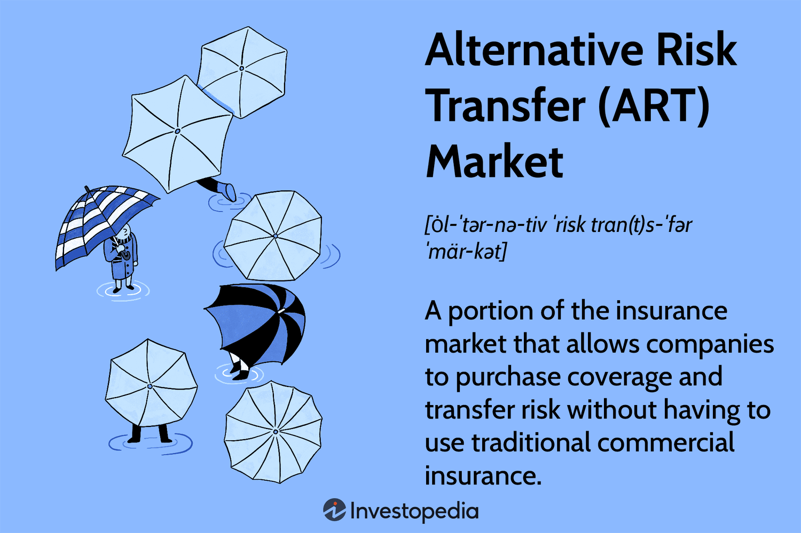

## Table of Contents

## What is alternative data in the context of insurance?

Alternative data in insurance refers to information that traditional insurance companies might not usually use when they make decisions about policies and risks. This can include things like data from social media, satellite images, or even information from smartphones and wearable devices. Insurance companies use this data to better understand their customers and to make more accurate predictions about risks and costs.

For example, an insurance company might look at how often someone posts about exercising on social media to guess if they are healthy. Or they might use satellite images to see if a house is in a flood-prone area. By using alternative data, insurance companies can offer more personalized policies and sometimes even lower prices for people who are seen as less risky. But, using this kind of data also brings up questions about privacy and fairness, so it's a topic that needs careful handling.

## How does alternative data differ from traditional insurance data?

Traditional insurance data includes things like a person's age, their job, their credit score, and their past insurance claims. This is the kind of information that insurance companies have used for a long time to decide how much to charge for a policy and what risks they are taking on. It's pretty straightforward and easy to get, but it might not tell the whole story about a person or their situation.

Alternative data, on the other hand, is newer and can come from lots of different places. It might include data from social media, like how active someone is online, or from devices like smartphones and fitness trackers, which can show how much someone exercises. It can even include satellite images to check out property locations and risks. This kind of data can give insurance companies a more detailed picture of a person's life and habits, which can help them make better decisions about policies and pricing. But, it also raises concerns about privacy and how fair it is to use this kind of information.

## What are the common sources of alternative data used in insurance?

Alternative data in insurance comes from many different places. One common source is social media, where insurance companies might look at what people post to learn about their lifestyles and habits. For example, if someone often posts about going to the gym, the insurance company might think they are healthy and less likely to need medical care. Another source is smartphones and wearable devices, like fitness trackers. These can tell insurance companies how active someone is or even how they drive, which can help decide car insurance rates.

Another source of [alternative data](/wiki/best-alternative-data) is satellite imagery. Insurance companies can use these images to see if a house is in an area that might flood or if it's near a forest that could catch fire. This helps them figure out how much risk they are taking on when they insure a property. Lastly, there's data from online transactions and shopping habits. By looking at what people buy and how they spend their money, insurance companies can get a better idea of their financial situation and lifestyle, which can affect insurance decisions.

## How can alternative data improve risk assessment in insurance?

Alternative data helps insurance companies understand risks better by giving them more details about people and properties. For example, by looking at someone's social media, an insurance company can see if they exercise a lot, which might mean they are healthy and less likely to get sick. Or, if they use data from a fitness tracker, they can tell how active someone is and adjust health or life insurance rates accordingly. This kind of information can make risk assessment more accurate because it shows what people actually do, not just what they say on a form.

Also, alternative data like satellite images can show if a house is in a place that might flood or catch fire. This helps insurance companies set the right price for home insurance because they know more about the risks. By using all this extra information, insurance companies can make better decisions about who to insure and how much to charge, which can lead to fairer prices and better coverage for everyone.

## What are the challenges associated with using alternative data in insurance?

Using alternative data in insurance can be tricky because it brings up big questions about privacy. When insurance companies look at someone's social media or data from their fitness tracker, it might feel like they're snooping. People might not like the idea of their personal information being used to decide how much they pay for insurance. Plus, there are rules about how data can be used, and insurance companies have to be careful to follow them. If they don't, they could get in trouble.

Another challenge is making sure the data is fair and accurate. Just because someone posts about exercising doesn't mean they're always healthy. And if insurance companies use this kind of data, they might end up treating people differently based on things that aren't really important. For example, someone might not post about their health online but still be very healthy. So, insurance companies have to be careful not to make decisions that could be unfair or wrong just because they have more data.

## How do insurers ensure the privacy and security of alternative data?

Insurers take privacy and security seriously when they use alternative data. They follow strict rules about how they can collect and use information. They make sure to get permission from people before using their data, and they only use it for what they said they would. They also use special computer systems to keep the data safe and make sure no one can get to it who shouldn't. This helps protect people's personal information and keeps it private.

Another way insurers protect alternative data is by being clear about what they do with it. They tell people how they use the data and why it's important. They also have people in their company who make sure they're following all the rules and keeping data secure. By doing all these things, insurers try to make sure they respect people's privacy while still using the data to help make better insurance decisions.

## What regulatory considerations must be taken into account when using alternative data?

When insurance companies use alternative data, they have to follow a lot of rules to make sure they're doing it the right way. These rules come from laws like the General Data Protection Regulation (GDPR) in Europe or the California Consumer Privacy Act (CCPA) in the United States. These laws say that insurance companies need to tell people what data they're collecting and why they're using it. They also need to get permission from people before using their data, and they have to let people see what data is being used about them. If they don't follow these rules, they could get in big trouble.

Another important thing is making sure the data is fair and accurate. Insurance companies have to be careful not to use data in a way that could be unfair to some people. For example, they can't use data to treat someone differently just because of their race or where they live. They also have to make sure the data they're using is correct and up-to-date. If they use old or wrong information, it could lead to bad decisions about insurance. So, they need to check their data often and make sure it's good quality.

## Can you provide examples of successful implementations of alternative data in insurance?

One good example of using alternative data in insurance is how some companies use fitness tracker data to offer better health insurance rates. For instance, John Hancock, a life insurance company, started a program where people can get discounts on their insurance if they share their fitness data. If someone shows they are active and healthy, they can pay less for their insurance. This makes people want to stay healthy and helps the insurance company understand their risks better.

Another example is how satellite imagery helps with property insurance. Companies like Zesty.ai use satellite images to see if a house is in a place that might flood or catch fire easily. This helps them set the right price for home insurance because they know more about the risks. By using this data, they can offer more accurate prices and help people in safer areas pay less for their insurance.

## How does alternative data impact pricing models in insurance?

Alternative data helps insurance companies make their pricing models better. By looking at things like social media posts or data from fitness trackers, insurance companies can see how healthy someone is or how they drive. This can help them set prices that are more fair and accurate. For example, if someone is very active and shares that on social media, the insurance company might charge them less for health insurance because they seem less likely to get sick.

Using alternative data also helps insurance companies understand risks better. For instance, satellite images can show if a house is in a place that might flood. This means the insurance company can charge more for homes in risky areas and less for homes in safer spots. By using all this extra information, insurance companies can make their pricing models more detailed and personalized, which can lead to better prices for everyone.

## What are the future trends for alternative data in the insurance industry?

In the future, alternative data will become even more important in the insurance industry. Insurance companies will use more and more data from places like social media, smartphones, and even smart home devices to understand their customers better. This will help them make better decisions about who to insure and how much to charge. They might use data from smart cars to see how safely someone drives, or from home devices to check if someone's house is safe. This will make insurance more personalized and could help people get better prices if they show they are less risky.

However, as insurance companies use more alternative data, they will need to be very careful about privacy and fairness. They will have to follow strict rules to make sure they are not using people's data in the wrong way. They will also need to make sure they are not treating some people unfairly just because of the data they have. So, while alternative data can make insurance better, insurance companies will need to balance this with respecting people's privacy and rights.

## How can machine learning and AI enhance the use of alternative data in insurance?

Machine learning and AI can make alternative data even more useful for insurance companies. They can look at huge amounts of data from places like social media, smartphones, and satellite images really quickly. This helps them find patterns and make predictions about risks that would be hard for people to see on their own. For example, AI can look at how someone drives using data from their car and guess if they are likely to have an accident. This helps insurance companies set fair prices for car insurance.

But using AI and [machine learning](/wiki/machine-learning) with alternative data also means insurance companies need to be careful. They have to make sure they are not using people's data in ways that could hurt their privacy or treat some people unfairly. AI can help find important information, but it needs to be used the right way. Insurance companies will need to keep working on making their AI systems better and fairer, so they can use alternative data to help people get better insurance without causing problems.

## What ethical considerations should be addressed when using alternative data in insurance?

When insurance companies use alternative data, they need to think about privacy and fairness. People might not like it if their personal information from social media or fitness trackers is used to decide how much they pay for insurance. So, insurance companies must be clear about what data they use and why. They also need to make sure they follow the rules about collecting and using data, like getting permission from people first. If they don't do this right, they could break the law and hurt people's trust.

Another big thing is making sure the data is fair and accurate. Insurance companies should not use data in a way that treats some people unfairly. For example, they shouldn't charge someone more just because of where they live or what they post online if it's not really related to the risk. They also need to make sure the data they use is correct and up-to-date. If they use old or wrong information, it could lead to bad decisions about insurance. So, they need to check their data often and make sure it's good quality.

## References & Further Reading

[1]: Marcos Lopez de Prado. (2018). ["Advances in Financial Machine Learning."](https://www.amazon.com/Advances-Financial-Machine-Learning-Marcos/dp/1119482089) Wiley.

[2]: Stefan Jansen. (2018). ["Machine Learning for Algorithmic Trading."](https://github.com/stefan-jansen/machine-learning-for-trading) Packt Publishing.

[3]: David Aronson. (2006). ["Evidence-Based Technical Analysis: Applying the Scientific Method and Statistical Inference to Trading Signals."](https://www.amazon.com/Evidence-Based-Technical-Analysis-Scientific-Statistical/dp/0470008741) Wiley.

[4]: Ernest P. Chan. (2008). ["Quantitative Trading: How to Build Your Own Algorithmic Trading Business."](https://www.amazon.com/Quantitative-Trading-Build-Algorithmic-Business/dp/0470284889) Wiley.

[5]: Bergstra, J., Bardenet, R., Bengio, Y., & Kégl, B. (2011). ["Algorithms for Hyper-Parameter Optimization."](https://dl.acm.org/doi/10.5555/2986459.2986743) Advances in Neural Information Processing Systems.