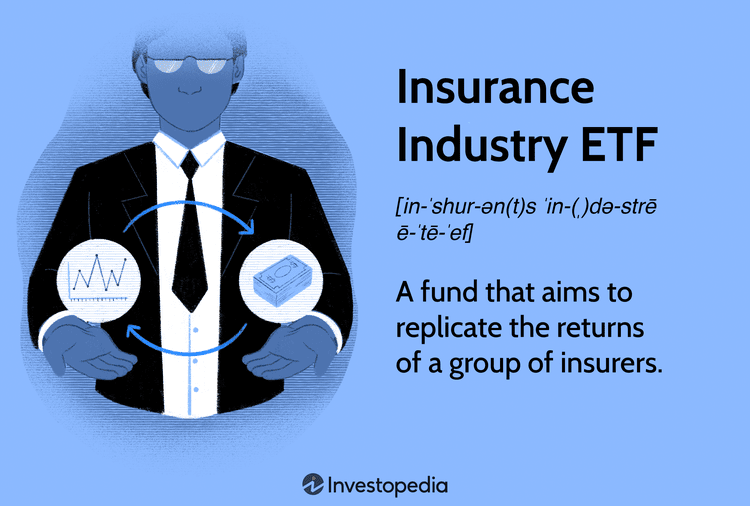

Exchange-Traded Funds (ETFs) have gained immense popularity among investors due to their inherent ability to offer both flexibility and diversification. Unlike traditional investment vehicles, ETFs are investment funds that are traded on stock exchanges, much like individual stocks. This feature allows investors to enjoy real-time pricing and liquidity benefits, distinguishing ETFs from mutual funds, which trade only at the end of the trading day.

The structure of an ETF enables it to track the performance of a specific index, industry, or commodity, providing a straightforward pathway for investors to access broad market exposure or focus on specific sectors. This article aims to explore the pros and cons of investing in ETFs, with a particular emphasis on the Insurance Industry ETF. These ETFs are designed to mimic the performance of an index comprised of insurance companies, including life, casualty, and property insurance firms, amongst others.

Moreover, we will discuss the emerging role of algorithmic trading within the ETF market. Algorithmic trading involves using automated and pre-programmed trading instructions to provide trading efficiency and liquidity in ETF investments. Understanding the intersection of algorithmic trading and ETFs is crucial, as it significantly impacts the pricing and liquidity of these funds.

ETFs are renowned for their capability to track industry-specific indices, making them particularly suited for sector-focused investments such as those in the insurance industry. Insurance Industry ETFs are characterized by their defensive investment nature, offering relative stability due to the steady business models associated with insurance companies.

By navigating through this article, you will gain a comprehensive understanding of the workings of insurance ETFs, including their benefits and inherent risks. Additionally, we will examine the influence of algorithmic trading on this investment vehicle, ensuring a holistic view of the current investment landscape. This knowledge is essential for making informed decisions surrounding investments in the insurance sector through ETFs.

## Table of Contents

## Understanding ETFs

Exchange-Traded Funds (ETFs) are a form of investment that merges the fundamental traits of both mutual funds and stocks, offering unique benefits to investors. Like stocks, ETFs are traded on stock exchanges, allowing buying and selling throughout the trading day. Unlike mutual funds, which are priced at the end of the trading day, ETFs have share prices that fluctuate continuously based on supply and demand dynamics.

ETFs are composed of a basket of assets that can include stocks, bonds, or commodities, and are specifically designed to mimic the performance of a chosen index. For instance, an [ETF](/wiki/etf-trading-strategies) might be set up to track the S&P 500 index, aiming to replicate its performance by holding a similar allocation of stocks. This structure allows ETFs to provide diversification across various asset classes and industry sectors while being more cost-effective compared to mutual funds. The expense ratios for ETFs are generally lower because they are passively managed, reducing management fees and operational costs.

One of the key features that distinguish ETFs from mutual funds is their flexibility in trading. Investors can execute trades at any point during market hours, enabling timely investment decisions and strategies akin to individual stock trading. This continuous pricing mechanism also permits the utilization of trading strategies such as limit orders and stop-loss orders, traditionally used for stocks, further enhancing [liquidity](/wiki/liquidity-risk-premium) and investor control.

ETFs are positioned as comparatively low-risk investment vehicles for individuals seeking a diversified portfolio without directly purchasing individual stocks. This characteristic stems from their inherent diversification, as owning an ETF that tracks a broad index reduces the exposure to idiosyncratic risk associated with any single asset. The risk is instead more aligned with the overall index or sector that the ETF is tracking.

In summary, ETFs offer a versatile and efficient means to gain exposure to a broad range of assets through methodologies designed to replicate index performance. Their combination of diversification, liquidity, and cost efficiency makes them an attractive option for investors aiming to balance risk and return within their investment portfolios.

## What Is an Insurance Industry ETF?

An Insurance Industry ETF is a type of exchange-traded fund that seeks to replicate the performance of an index comprised of insurance-related companies. This broad category of financial instruments includes various sectors within the insurance industry such as life insurance, casualty insurance, property insurance, as well as insurance brokers. By purchasing shares in an Insurance Industry ETF, investors gain exposure to a diversified basket of insurance-related stocks, which may include both domestic and international holdings.

Insurance Industry ETFs are considered to be defensive investments. This reputation stems from the relatively stable nature of insurance companies, which often generate consistent cash flows regardless of economic fluctuations. The business models of these companies typically involve collecting premiums and investing those funds, making them less volatile compared to other sectors.

In terms of returns, Insurance Industry ETFs aim to provide performance that closely follows the underlying index of selected insurance companies. This is achieved by holding a portfolio of stocks that mirror the composition and weighting of the target index. For instance, if the index heavily weights property insurance firms, the ETF will also allocate its assets similarly.

The inclusion of various types of insurance companies—as well as potentially insurance brokers—within the ETF contributes to its diversification benefits. This diversification can mitigate specific risks associated with individual stocks or subsectors within the insurance industry. As a result, investors can potentially lower their risk exposure while still participating in the overall growth of the insurance sector.

Overall, an Insurance Industry ETF provides an efficient and cost-effective way for investors to gain exposure to the insurance industry through a single investment vehicle, enhancing portfolio diversification while offering the potential for stable, long-term returns.

## Advantages of Investing in Insurance Industry ETFs

Exchange-Traded Funds (ETFs) dedicated to the insurance industry present several advantages that appeal to investors seeking diversified and stable investment options. A primary benefit is diversification, as these ETFs provide investors with exposure to a wide array of insurance companies, such as life insurance providers, property and casualty insurers, and brokerage firms. This broad exposure mitigates the risk associated with investing in individual stocks, given the varied nature of these companies which can buffer against isolated sector downturns.

Liquidity is another significant advantage of insurance ETFs. These funds can be traded on stock exchanges throughout normal trading hours, offering investors the flexibility to buy or sell shares as they would with any public stock. This feature contrasts with mutual funds, which are typically priced only at the end of the trading day, providing an added layer of convenience and strategy for active investors.

Cost efficiency is a hallmark of ETFs, often boasting lower expense ratios compared to mutual funds. This is due to the passive management style of many ETFs, which aim to replicate the performance of specific indices with minimal intervention. Reduced management costs are advantageous for the long-term investor seeking to maximize returns by minimizing overhead.

Tax efficiency is another notable benefit. ETFs generally incur fewer capital gains distributions compared to mutual funds. This occurs because ETF transactions between investors on exchanges do not lead to taxable events that affect all shareholders. Consequently, investors can potentially enjoy an improved post-tax return, making ETFs a tax-efficient vehicle for investment portfolios.

Finally, insurance industry ETFs often consist of defensive stocks, which typically maintain their value or appreciate even in economic downturns. The insurance sector's inherent stability, due to consistent demand for risk management and financial protection services, renders these stocks attractive during periods of economic [volatility](/wiki/volatility-trading-strategies). This defensive characteristic makes insurance ETFs suitable for risk-averse investors or those seeking to safeguard against economic uncertainties.

In summary, the diversification, liquidity, cost and tax efficiencies, alongside the defensive nature of insurance stocks, collectively position insurance industry ETFs as a compelling choice for investors looking to balance growth with stability.

## Disadvantages of Investing in Insurance Industry ETFs

Exchange-Traded Funds (ETFs) uniquely offer investors diversified access to the insurance industry's performance. However, they also encompass several disadvantages that must be considered carefully by potential investors to align with their risk tolerance and investment goals.

**Market Risks**

Insurance Industry ETFs are inherently exposed to overall market risks. These risks are reflective of fluctuations in economic conditions, with insurance stocks being particularly sensitive to cyclical changes. For instance, during periods of economic downturn, the ability of insurers to generate premiums and investment returns may be severely constrained, thus impacting the ETF's market performance. Since ETFs are baskets of securities, a decline in the insurance sector can lead to a corresponding decrease in an ETF's value.

**Expense Ratios**

A critical [factor](/wiki/factor-investing) to consider is the expense ratio, which, while typically lower than mutual funds, still requires active monitoring. High expense ratios, even by a few percentage points, can erode returns over time, impacting the overall profitability of the investment. Investors must perform due diligence in comparing different ETFs based on their expense ratios to ensure a favorable balance between cost and potential returns.

**Specific Risks**

Investors lacking a comprehensive understanding of the insurance industry might face specific risks. Insurance companies’ business models are intricate, involving actuarial science, underwriting processes, and exposure to catastrophic events. Poor investment decisions can arise from a lack of expertise in these areas. Awareness of how factors such as interest rates, regulatory changes, and technological advancements affect underwriting and claims processes is indispensable for investors.

**Cyclical Nature**

The cyclical nature of insurance stocks presents additional volatility risks. As insurers' profitability is linked to economic cycles, any adverse economic environments can lead to significant performance variability in the related ETFs. For example, low-interest rates can hurt the investment income of insurers, while a recession might lead to reduced insurance demand, causing unpredictable variations in stock prices.

**Underweighting**

Finally, some Insurance Industry ETFs may underweight particular sectors like property and casualty insurance. This underrepresentation can reduce the effectiveness of diversification, leaving investors exposed to unforeseen systematic risks. Lack of diversification across various insurance segments could result in a skewed risk-reward profile. Thus, investors must scrutinize the ETF's holdings and sector weightings to ensure alignment with their diversification strategies.

In summary, while Insurance Industry ETFs provide an attractive investment choice for exposure to the insurance sector, investors must remain vigilant regarding the market risks, expense ratios, specific industry understanding, cyclical nature, and potential underweighting within these funds.

## Algorithmic Trading and ETFs

Algorithmic trading leverages automated, pre-programmed trading instructions to execute trades in the ETF market. This trading method is designed to maximize efficiency, significantly affecting both the liquidity and pricing of ETFs. By implementing high-frequency trading ([HFT](/wiki/high-frequency-trading-strategies)) strategies, algorithms can facilitate rapid trade executions, contributing to tighter bid-ask spreads and enhanced market liquidity. This is particularly beneficial for insurance industry ETFs, where the trading landscape gains from improved market depth and more efficient price discovery.

In the context of ETFs, [algorithmic trading](/wiki/algorithmic-trading)'s role in enhancing market conditions is vital. Algorithms can analyze large datasets and identify patterns or anomalies that manual trading might overlook. This capacity allows for more accurate pricing models and timely adjustments to trade positions, which can lead to better alignment with market conditions. This precision is crucial for insurance industry ETFs, which need to correspond closely to their respective indices, reflecting the insurance sector’s performance accurately.

Despite the advantages, algorithmic trading comes with its own set of challenges and risks. The complexity of trading algorithms means that even minor flaws in code or strategy can lead to substantial financial loss. Furthermore, algorithm-driven markets can experience rapid swings due to automated reactions, potentially increasing volatility. Investors must therefore be vigilant, understanding the algorithms they deploy. This includes ensuring robust back-testing of strategies and continuously monitoring market conditions to mitigate adverse impacts.

For those investors who possess a deep understanding of algorithmic processes and their market implications, these technologies offer the potential to optimize returns. By carefully leveraging algorithmic trading strategies, investors can potentially capitalize on micro-market efficiencies. However, this demands a comprehensive grasp of the algorithms’ functioning, along with an awareness of the broader market environment affecting ETF performance. Thus, while algorithmic trading offers significant benefits in ETF investment, it requires informed and strategic implementation.

## Conclusion

Investing in insurance industry ETFs offers investors a solid avenue for diversification within the financial sector. This investment strategy provides a balance between the stability often associated with insurance stocks and the broader diversification benefits of ETFs. However, potential investors must consider the inherent risks posed by economic cycles and market fluctuations. Given that insurance companies can be cyclical, their financial performance may be influenced by broader economic trends, necessitating a careful evaluation of market conditions.

Algorithmic trading has introduced an additional layer of sophistication and efficiency to ETF investments. This approach can enhance liquidity and facilitate more precise pricing. Nonetheless, this complexity requires caution; understanding the algorithms' mechanisms and potential market effects is crucial to avoid unintended consequences. 

Ultimately, ETFs serve as an effective vehicle to access the defensive nature of the insurance sector, making them appealing to those prioritizing stability and growth. As with any investment decision, being well-informed is essential. Conducting thorough research on specific ETFs and staying informed of current market conditions is critical to making sound investment choices that align with individual financial goals.

## References & Further Reading

[1]: ["Advances in Financial Machine Learning"](https://www.amazon.com/Advances-Financial-Machine-Learning-Marcos/dp/1119482089) by Marcos Lopez de Prado

[2]: ["Machine Learning for Algorithmic Trading"](https://github.com/stefan-jansen/machine-learning-for-trading) by Stefan Jansen

[3]: ["Quantitative Trading: How to Build Your Own Algorithmic Trading Business"](https://www.amazon.com/Quantitative-Trading-Build-Algorithmic-Business/dp/1119800064) by Ernest P. Chan

[4]: Hühn, H., & Ostermeier, M. (2010). [“Algorithm Trading with Machine Learning”](https://www.aimspress.com/aimspress-data/dsfe/2022/4/PDF/DSFE-02-04-022.pdf). 2010 10th International Conference on Intelligent Systems Design and Applications.

[5]: Bhatt, S. (2017). ["Algorithmic Trading and Its Impact on Stock Market"](https://www.researchgate.net/publication/378548435_Algorithmic_Trading_and_AI_A_Review_of_Strategies_and_Market_Impact). International Journal of Scientific Research in Computer Science, Engineering and Information Technology.

[6]: ["Exchange-Traded Funds and the New Dynamics of Investing"](https://academic.oup.com/book/3366) by Ananth N. Madhavan