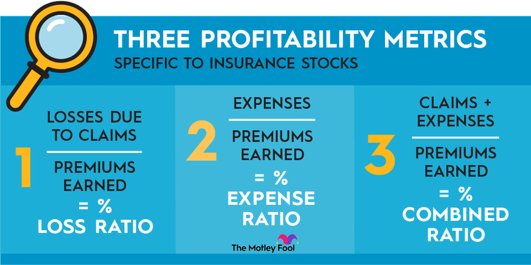

## Table of Contents

## What is insurance for stock market investments?

Insurance for stock market investments, often called investment protection insurance, is a type of financial product that helps protect your money if the stock market goes down. When you buy this insurance, you pay a fee, and in return, the insurance company promises to give you back some or all of your money if your investments lose value. This can give you peace of mind, knowing that you won't lose everything if the market takes a bad turn.

There are different types of investment protection insurance, and they work in different ways. Some policies might cover all your investments, while others might only cover specific stocks or funds. It's important to read the details carefully and understand what is covered and what isn't. Also, remember that this insurance comes with a cost, so you need to think about whether the protection is worth the extra money you'll have to pay.

## Why might someone need insurance for their stock market investments?

Someone might need insurance for their stock market investments because the stock market can be risky. Prices of stocks can go up and down a lot, and sometimes they can drop suddenly. If someone has a lot of money invested in the stock market, they might worry about losing it all if the market crashes. Insurance can help protect their money by promising to pay back some or all of what they lost if the market goes down.

Also, some people might need this insurance because they are not comfortable taking big risks with their money. They might be saving for something important, like buying a house or retiring, and they don't want to take chances with their savings. By getting insurance, they can feel safer and more confident about investing in the stock market, knowing that they have a safety net if things go wrong.

## What types of insurance products are available for stock market investments?

There are a few different types of insurance products for stock market investments. One type is called a variable annuity with a guaranteed minimum income benefit. This means you invest your money in the stock market, but the insurance company promises to give you a certain amount of money every month, no matter how the market does. It's like having a safety net for your retirement income.

Another type is called portfolio insurance. This is when you buy options or other financial products that can protect your investments from big drops in the market. For example, you might buy a put option, which gives you the right to sell your stocks at a certain price, even if the market price goes lower. This can help limit your losses if the market goes down.

There's also something called equity-indexed annuities. These are a bit like regular annuities but are linked to the performance of a stock market index, like the S&P 500. If the market goes up, you get some of the gains, but if it goes down, you're protected and won't lose your principal. This can be a good way to get some growth potential while still having some protection against market losses.

## How does stock market investment insurance work?

Stock market investment insurance works by helping you protect your money if the stock market goes down. When you buy this insurance, you pay a fee to an insurance company. In return, the insurance company promises to give you back some or all of your money if your investments lose value. For example, if you have a variable annuity with a guaranteed minimum income benefit, the insurance company will make sure you get a certain amount of money every month, even if the market drops. This can give you peace of mind and help you feel safer about investing in the stock market.

There are different ways this insurance can work. One way is through portfolio insurance, where you buy options or other financial products that can protect your investments. For instance, you might buy a put option, which lets you sell your stocks at a set price, even if the market price goes lower. This can help limit your losses if the market goes down. Another type is an equity-indexed annuity, which is linked to a stock market index like the S&P 500. If the market goes up, you get some of the gains, but if it goes down, your principal is protected. This way, you can still grow your money while having some protection against market losses.

## What are the costs associated with insuring stock market investments?

The costs of insuring stock market investments can vary depending on the type of insurance you choose. For example, if you get a variable annuity with a guaranteed minimum income benefit, you might have to pay an annual fee. This fee is usually a percentage of the money you have invested. Also, there might be other charges, like fees for managing the annuity or for withdrawing your money early. It's important to read all the details to know exactly what you'll be paying.

Another type of insurance, like portfolio insurance using options, can also have costs. When you buy options, you have to pay a premium, which is the price of the option. This premium can change depending on how much protection you want and how long you want it for. If you choose an equity-indexed annuity, you might have to pay fees for managing the annuity and for the insurance part that protects your principal. All these costs can add up, so it's a good idea to think about whether the protection is worth the extra money you'll have to pay.

## Can insurance protect against all types of investment risks?

Insurance for stock market investments can help protect you from some risks, but it can't cover everything. For example, if the stock market goes down a lot, insurance like a variable annuity with a guaranteed minimum income benefit can make sure you still get some money every month. Also, buying options as part of portfolio insurance can help you limit your losses if stock prices drop. But these types of insurance come with costs, like fees and premiums, so you need to think about whether the protection is worth the extra money.

However, insurance can't protect you from all risks. For instance, it can't stop a company you've invested in from going bankrupt or protect you if there's fraud in the market. Also, some types of insurance might not cover all your investments, only specific ones. So, even with insurance, you still need to be careful and do your research before investing. Insurance can help, but it's not a complete solution to all the risks in the stock market.

## How do you determine the right amount of insurance for your stock portfolio?

To figure out the right amount of insurance for your stock portfolio, you need to think about how much risk you're okay with and what you're trying to achieve with your investments. If you're saving for something important like buying a house or retiring, you might want more insurance to make sure you don't lose too much money if the market goes down. On the other hand, if you're okay with taking more risks and you have a long time before you need the money, you might not need as much insurance. It's all about finding a balance between protecting your money and paying for the insurance.

You also need to look at the costs of the insurance. Every type of insurance has fees or premiums, and these can add up. You have to decide if the protection is worth the extra money you'll have to pay. For example, if you buy a variable annuity with a guaranteed minimum income benefit, you'll pay a fee for that protection. If you use options for portfolio insurance, you'll pay a premium for those options. So, think about how much protection you need and compare that to the costs to make sure you're getting the right amount of insurance for your stock portfolio.

## What are the eligibility criteria for obtaining stock market investment insurance?

To get insurance for your stock market investments, you usually need to meet certain requirements set by the insurance company. These can include things like your age, how much money you want to insure, and sometimes even your income or financial situation. For example, some insurance products might only be available to people who are over a certain age or who have a certain amount of money to invest. It's important to check with the insurance company to see what their specific rules are.

Different types of insurance might have different rules. For instance, if you're looking at a variable annuity with a guaranteed minimum income benefit, the insurance company might need to know how much you plan to invest and how long you want the insurance to last. On the other hand, if you're using options for portfolio insurance, you might need to have a certain level of experience with trading options. Always make sure you understand the eligibility criteria before you decide to buy any insurance for your stock market investments.

## How does the claim process work for stock market investment insurance?

When you want to make a claim on your stock market investment insurance, you usually need to contact the insurance company and tell them what happened. For example, if you have a variable annuity with a guaranteed minimum income benefit and the market goes down, you might need to fill out a form or call the company to start the claim process. They will check to see if your claim fits the rules of your insurance policy. This might take some time, so it's important to be patient and keep good records of your investments and any communication with the insurance company.

Once the insurance company has looked at your claim, they will decide if you can get the money back that you lost. If everything is okay, they will pay you according to what your policy says. For instance, if you used options for portfolio insurance and the market dropped, the insurance company might pay you the difference between the market price and the price you set with your put option. The whole process can be different depending on the type of insurance you have, so make sure you understand how it works before you need to make a claim.

## What are the limitations and exclusions of stock market investment insurance?

Stock market investment insurance has some limits and things it doesn't cover. Not all types of insurance will protect you from every risk in the stock market. For example, if a company you've invested in goes bankrupt, the insurance might not help you get your money back. Also, if there's fraud or someone steals your money, the insurance usually won't cover that. Some policies might only cover certain stocks or funds, so you need to check what's included and what's not.

Another thing to know is that insurance can't stop the market from going down. It can only help you get some of your money back if it does. There might be a limit on how much you can get back, and you might have to wait for the insurance company to process your claim. Also, you have to pay for the insurance, and those fees can add up. So, while insurance can be helpful, it's important to understand its limits and not rely on it to solve all your investment problems.

## How does stock market investment insurance compare to other risk management strategies?

Stock market investment insurance is one way to manage risk, but there are other strategies you can use too. One common method is diversification, which means spreading your money across different types of investments, like stocks, bonds, and real estate. This can help lower your risk because if one investment goes down, the others might still do well. Another strategy is setting up a stop-loss order, which automatically sells your stocks if they drop to a certain price. This can help limit your losses, but it doesn't give you the same peace of mind as insurance because it doesn't promise to pay you back if you lose money.

Insurance for stock market investments can be helpful because it gives you a safety net if the market crashes. You pay a fee, and in return, the insurance company promises to give you back some or all of your money if your investments lose value. However, insurance comes with costs, and it might not cover all types of risks, like if a company goes bankrupt or there's fraud. Other strategies like diversification and stop-loss orders might not give you the same level of protection, but they can be cheaper and more flexible. It's important to think about your goals and how much risk you're okay with before deciding which risk management strategy is best for you.

## What trends and future developments can we expect in the field of stock market investment insurance?

In the future, we might see more types of insurance for stock market investments. As more people start investing in the stock market, insurance companies might come up with new products to meet their needs. These could include easier ways to buy insurance online or new types of policies that cover different kinds of risks. Also, technology might make it easier to understand and manage your insurance, like using apps to keep track of your investments and claims.

Another trend could be more personalized insurance options. With the help of data and [artificial intelligence](/wiki/ai-artificial-intelligence), insurance companies might be able to offer policies that are made just for you, based on your investment goals and how much risk you're okay with. This could make insurance more helpful and less expensive for some people. But, even with these new trends, it's important to remember that insurance can't cover all risks, and you still need to be careful with your investments.

## What are the strategies for risk management in algorithmic trading?

Risk management in [algorithmic trading](/wiki/algorithmic-trading) is a critical aspect that ensures stability and profitability in a trader's portfolio. An integral approach involves several key strategies, each designed to mitigate risks associated with high-speed automated trading. 

Stop-loss and take-profit orders are fundamental tools in algorithmic trading. A stop-loss order automatically sells a security when it reaches a certain price, thus limiting losses. A take-profit order works conversely by selling a security when it hits a specified profit level, ensuring profits are secured before market conditions change. For example, in Python, a simple script for setting a stop-loss order might look like this:

```python
def calculate_stop_loss(entry_price, stop_loss_percentage):
    return entry_price * (1 - stop_loss_percentage / 100)

entry_price = 100  # Example entry price
stop_loss_percentage = 5  # 5% stop loss
stop_loss_price = calculate_stop_loss(entry_price, stop_loss_percentage)
print(f"Stop-loss Price: {stop_loss_price}")
```

Diversifying trading algorithms across different asset classes reduces the risks associated with sector-specific volatilities. By employing algorithms that operate in distinct markets, traders can spread risk and minimize the impact of adverse movements in any single market. This strategy enhances stability and ensures that potential losses in one sector do not significantly impact the overall portfolio.

Dynamic position sizing is another effective risk management strategy. It involves adjusting the size of positions based on market conditions and [volatility](/wiki/volatility-trading-strategies). This flexibility allows traders to capitalize on favorable conditions while reducing exposure during periods of high volatility. Position sizing can be dynamically adjusted using the following formula:

$$
\text{Position Size} = \frac{\text{Total Investment} \times \text{Risk Factor}}{\text{Volatility Index}}
$$

Continuous [backtesting](/wiki/backtesting) and live-testing of trading algorithms are crucial for maintaining their reliability and efficiency. Backtesting involves running the algorithm on historical data to evaluate its performance. Live-testing, or paper trading, allows traders to test their strategies in real-time market conditions without financial risk. These processes help in identifying potential flaws or weaknesses in the algorithms, enabling iterative improvements to refine strategies before deploying them with actual capital.

By integrating these strategies, traders can better manage the inherent risks of algorithmic trading, ensuring both the mitigation of losses and the maximization of potential gains.

## References & Further Reading

[1]: Bergstra, J., Bardenet, R., Bengio, Y., & Kégl, B. (2011). ["Algorithms for Hyper-Parameter Optimization."](https://papers.nips.cc/paper/4443-algorithms-for-hyper-parameter-optimization) Advances in Neural Information Processing Systems 24.

[2]: ["Advances in Financial Machine Learning"](https://www.amazon.com/Advances-Financial-Machine-Learning-Marcos/dp/1119482089) by Marcos Lopez de Prado.

[3]: ["Evidence-Based Technical Analysis: Applying the Scientific Method and Statistical Inference to Trading Signals"](https://www.amazon.com/Evidence-Based-Technical-Analysis-Scientific-Statistical/dp/0470008741) by David Aronson.

[4]: ["Machine Learning for Algorithmic Trading"](https://github.com/stefan-jansen/machine-learning-for-trading) by Stefan Jansen.

[5]: ["Quantitative Trading: How to Build Your Own Algorithmic Trading Business"](https://www.amazon.com/Quantitative-Trading-Build-Algorithmic-Business/dp/1119800064) by Ernest P. Chan.

[6]: Kyle, A. S. (1985). ["Continuous Auctions and Insider Trading."](https://personal.utdallas.edu/~nina.baranchuk/Fin7310/papers/Kyle1985.pdf) Econometrica, 53(6), 1315-1335.

[7]: Cont, R. (2001). ["Empirical Properties of Asset Returns: Stylized Facts and Statistical Issues."](http://rama.cont.perso.math.cnrs.fr/pdf/empirical.pdf) Review of Financial Studies, 11(1), 1-41.

[8]: Pardo, R. (2011). ["The Evaluation and Optimization of Trading Strategies."](https://onlinelibrary.wiley.com/doi/book/10.1002/9781119196969) John Wiley & Sons.