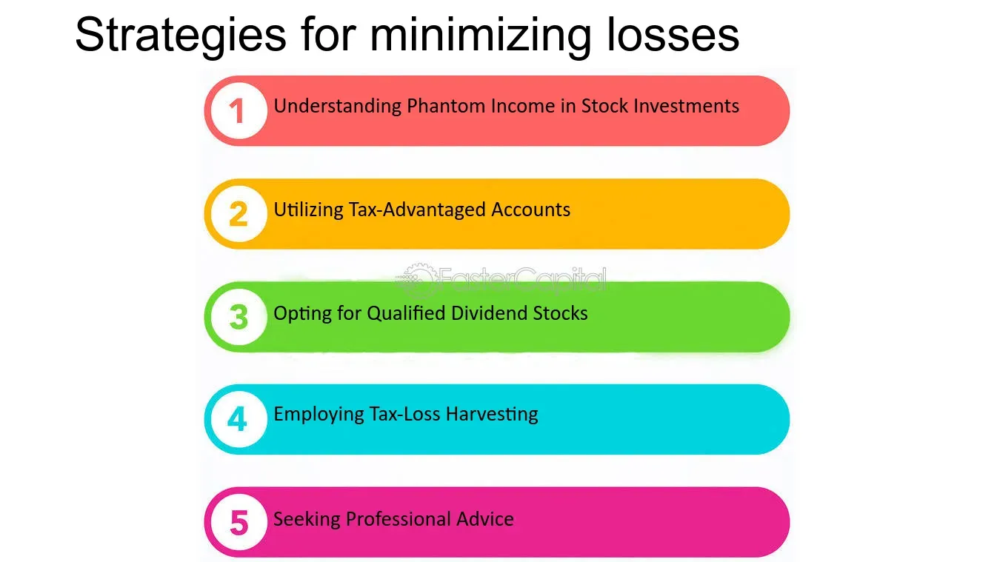

## Table of Contents

## What is stock market insurance and why is it important?

Stock market insurance, often referred to as portfolio insurance, is a strategy used by investors to protect their investments from big losses in the stock market. It works kind of like regular insurance, where you pay a little bit to protect against a big problem. In the stock market, this can mean using different financial tools, like options or stop-loss orders, to limit how much money you could lose if the market goes down.

This kind of insurance is important because the stock market can be unpredictable. Even if you think you've picked good investments, the market can still go down and cause you to lose money. By using stock market insurance, you can feel more secure knowing that you have a safety net. This can help you sleep better at night and keep investing, even when the market gets scary.

## How does a stop-loss order work to protect against stock market losses?

A stop-loss order is like a safety net for your stock investments. It's an order you place with your broker to sell a stock if it drops to a certain price. For example, if you bought a stock at $50 and you don't want to lose more than $5, you can set a stop-loss order at $45. If the stock price falls to $45 or lower, your broker will automatically sell the stock, limiting your loss to $5 per share.

Using a stop-loss order can help protect you from big drops in the stock market. It's especially useful during times when the market is unpredictable and stock prices can change quickly. By setting a stop-loss order, you don't have to watch the market all the time. You can go about your day knowing that if the stock price falls too much, the order will kick in and sell the stock for you, helping to minimize your losses.

## What are the basic types of insurance products available for stock market investments?

There are several basic types of insurance products that investors can use to protect their stock market investments. One common type is options, which are contracts that give you the right, but not the obligation, to buy or sell a stock at a certain price before a specific date. There are two main kinds of options: call options, which you can use to buy a stock at a set price, and put options, which you can use to sell a stock at a set price. By buying put options, you can protect your stocks from dropping too much in value because you can sell them at the price you set, even if the market price goes lower.

Another type of insurance product is a stop-loss order. This is an order you place with your broker to sell a stock if it falls to a certain price. It's like setting a safety net for your investment. If the stock price hits the price you set, the stop-loss order will automatically sell the stock, limiting how much money you can lose. This is a simple way to protect your investments without having to watch the market all the time. Both options and stop-loss orders can help you feel more secure when investing in the stock market.

## Can you explain how put options can be used as an insurance strategy for stocks?

Put options can be used as an insurance strategy for stocks because they give you the right to sell a stock at a certain price, even if the market price drops lower. Imagine you own a stock that's worth $100. You're worried it might go down, so you buy a put option that lets you sell the stock for $95. If the stock price falls to $90, you can use your put option to sell it at $95 instead, saving you from a bigger loss. It's like paying a small fee for the peace of mind that you won't lose too much money if the stock price goes down.

The cost of this insurance is the price of the put option, which is called the premium. You pay this premium upfront, and in return, you get the safety net of being able to sell the stock at the price you set, no matter how low the market price goes. This strategy can help you feel more secure about your investments, especially during times when the stock market is unpredictable. By using put options, you can protect your stocks from big drops and limit your losses, making it a useful tool for managing risk in your investment portfolio.

## What are the costs associated with different insurance strategies for stock market investments?

The costs of insurance strategies for stock market investments can vary depending on the type of strategy you use. For put options, you pay a premium, which is like an upfront fee for the right to sell your stock at a certain price. The cost of this premium depends on factors like how far the stock price is from the price you want to sell at, how long you want the option to last, and how much the stock price tends to move around. If the stock price stays above the price you set, you might lose the entire premium you paid for the put option, but if the stock price drops below your set price, the put option can save you from bigger losses.

Stop-loss orders, on the other hand, don't have a direct cost like a premium. You just set the order with your broker, and if the stock price hits your stop price, the order turns into a market order to sell your stock. However, there can be indirect costs if the stock price drops quickly. When your stop-loss order is triggered, it might sell your stock at a lower price than you expected because the market price can keep falling after the order is placed. This means you might end up selling at a lower price than your stop price, which can increase your loss.

Both put options and stop-loss orders have their own ways of helping you manage risk, but they come with different costs. Put options give you more control over the price you sell at, but you pay a premium for that control. Stop-loss orders are simpler and don't require an upfront payment, but they can be less predictable because they depend on market conditions at the time they're triggered. Choosing the right strategy depends on your comfort with risk and how much you're willing to pay for protection.

## How does portfolio diversification act as an insurance against stock market losses?

Portfolio diversification is like spreading your money across different types of investments instead of putting it all in one place. Imagine you have a basket of eggs. If you put all your eggs in one basket and drop it, you lose all your eggs. But if you spread your eggs across several baskets, dropping one basket won't ruin everything. In the stock market, this means buying different stocks, bonds, and maybe even things like real estate or commodities. If one type of investment goes down, the others might stay the same or even go up, helping to balance out your losses.

This strategy acts as insurance because it reduces the risk of losing all your money if one part of the market crashes. For example, if you only invest in tech stocks and the tech industry has a bad year, you could lose a lot. But if you also have money in healthcare, energy, and consumer goods, those other areas might do well even if tech stocks fall. By diversifying, you're not betting everything on one thing going well. It's like having multiple safety nets, making it less likely that a single bad event will wipe out your entire investment.

## What role do index funds and ETFs play in managing stock market risk?

Index funds and ETFs, or exchange-traded funds, help manage stock market risk by letting you invest in a big group of stocks all at once. Instead of [picking](/wiki/asset-class-picking) one or two stocks and hoping they do well, you can buy an index fund or [ETF](/wiki/etf-trading-strategies) that follows a whole bunch of stocks, like all the companies in the S&P 500. This spreads your money across many different companies and industries, which makes your investment less risky. If one company does badly, it won't hurt your whole investment as much because you own a little bit of a lot of companies.

Another way index funds and ETFs help manage risk is by being more predictable than individual stocks. Since they follow a big group of stocks, they usually move more slowly and steadily. This means they're less likely to have big sudden drops that can scare investors. By investing in index funds and ETFs, you can feel more secure knowing that your money is spread out and your investment is likely to grow over time, even if the stock market has ups and downs.

## How can investors use collars to manage potential losses in their stock portfolios?

A collar is a way for investors to protect their stocks from big losses without spending too much money. It works by using two types of options: a put option and a call option. When you own a stock, you can buy a put option to set a price where you can sell the stock if it goes down. This is like a safety net. At the same time, you sell a call option, which lets someone else buy your stock at a higher price. The money you get from selling the call option helps pay for the put option, so it doesn't cost you much to set up the collar.

Using a collar can help you feel safer about your investments. If the stock price falls a lot, the put option lets you sell it at the higher price you set, limiting your losses. But, there's a trade-off. If the stock price goes up a lot, the call option might make you sell your stock at the lower price you set, so you won't get to keep all the extra profit. This means a collar keeps your potential losses in check, but it also caps how much you can gain. It's a good strategy if you want to protect your money while still having a chance to make some profit.

## What advanced insurance strategies involve using futures and options to hedge stock market risk?

Advanced insurance strategies using futures and options to hedge stock market risk can be a bit tricky but very effective. One way to do this is by using futures contracts. Futures are agreements to buy or sell something at a set price on a future date. If you own stocks and are worried about the market going down, you can sell stock index futures. This means if the market falls, the value of your futures will go up, helping to offset the losses in your stock portfolio. It's like betting that the market will go down, so if it does, your futures gain can help cover your stock losses.

Another advanced strategy involves using options in more complex ways. For example, you can use a protective put strategy, where you buy put options for the stocks you own. This gives you the right to sell your stocks at a set price, protecting you from big drops in the market. But if you want to save money, you can also use a collar strategy. With a collar, you buy a put option to set a floor price for selling your stock, and at the same time, you sell a call option to set a ceiling price for selling. The money you get from selling the call option helps pay for the put option, making it cheaper. This limits how much you can lose if the market falls, but it also limits how much you can gain if the market goes up. Both futures and options can be powerful tools for managing risk, but they need careful planning and understanding.

## How do professional investors utilize insurance strategies in managing large stock portfolios?

Professional investors often use insurance strategies to protect their large stock portfolios from big losses. They might use options, like put options, to set a price where they can sell their stocks if the market goes down. This is like having a safety net that limits how much they can lose. They also use collars, which combine buying a put option and selling a call option. This helps them protect their stocks without spending too much money. The money they get from selling the call option pays for the put option, so it's a cheaper way to manage risk.

Another way professional investors manage risk is by using futures contracts. If they think the market might go down, they can sell stock index futures. This means if the market falls, the value of their futures goes up, helping to balance out the losses in their stock portfolio. It's like betting against the market, so if it goes down, their futures gain can cover some of their stock losses. These strategies help professional investors feel more secure and keep their large portfolios safe, even when the market is unpredictable.

## What are the tax implications of using insurance strategies for stock market investments?

Using insurance strategies for stock market investments can have different tax effects. When you use options like put options or collars, you might have to pay taxes on any money you make from them. If you buy a put option and then sell your stock at a higher price than the market, the money you save could be seen as a capital gain. You'll have to pay taxes on that gain. If you use a collar and sell a call option, the money you get from selling the call option is usually taxed as ordinary income right away, not as a capital gain. This can make your tax bill higher than if you just held onto your stocks.

Another thing to think about is how using futures contracts affects your taxes. If you use futures to hedge against losses in your stock portfolio, any money you make from the futures could be taxed as a 60/40 split. This means 60% of your gain is taxed at the long-term capital gains rate, and 40% is taxed at the short-term rate, which is usually higher. This can be different from how you're taxed on your stocks, where you might only pay long-term capital gains tax if you hold them for more than a year. It's a good idea to talk to a tax advisor to understand how these strategies might change your taxes, so you can plan the best way to protect your investments and keep more of your money.

## How can one evaluate the effectiveness of different insurance strategies in various market conditions?

Evaluating the effectiveness of different insurance strategies depends a lot on what the stock market is doing. In a bull market, where stock prices are going up, strategies like put options might seem like a waste of money because you're paying for protection you don't need. But if the market suddenly drops, those put options can save you from big losses. On the other hand, collars can be useful in any market because they limit both your losses and your gains. In a stable market, collars might not cost you much and still give you some protection, but in a very volatile market, the cost of setting up a collar could be higher, and you might miss out on big gains if the market goes up a lot.

Looking at how these strategies work over time can also help you see if they're worth it. For example, if you use stop-loss orders, they might protect you from big drops, but they can also make you sell your stocks too soon if the market bounces back quickly. Over time, you might find that stop-loss orders lead to more selling and buying, which can add up in fees and taxes. Futures contracts can be good for big investors in a bear market, where prices are falling, because they can help balance out losses. But they can be tricky to manage and might not be worth it if the market is mostly going up. By keeping an eye on how each strategy performs in different market conditions, you can decide which ones work best for your investment goals and risk comfort level.

## What is Understanding Financial Risk Management?

Financial risk management is a crucial aspect of modern investment strategy, requiring a strategic and systematic approach to identify, assess, and minimize potential financial risks that could impact investment returns. The objective is to create a balance between maximizing returns and minimizing risks through various techniques and tools. Three key methods in financial risk management are diversification, hedging, and asset allocation.

### Diversification

Diversification involves spreading investment capital across a variety of assets to reduce the overall risk of the investment portfolio. The principle is based on the idea that different assets will respond differently to the same economic event, thus minimizing the risk of poor performance in any single investment area. By investing in a wide range of asset classes, such as stocks, bonds, real estate, and commodities, investors can mitigate the [volatility](/wiki/volatility-trading-strategies) inherent in financial markets.

**Example:**
If an investor distributes their investments across different sectors—like technology, healthcare, and energy—they reduce the risk that a downturn in any single sector will significantly impact their portfolio.

**Mathematical Approach:**
The effectiveness of diversification can be determined using the correlation coefficient (ρ) between asset returns. A diversified portfolio typically aims for a low or negative correlation between its assets to minimize risk. The formula for the variance of a portfolio with two assets is:

$$
\sigma_p^2 = w_1^2 \sigma_1^2 + w_2^2 \sigma_2^2 + 2w_1w_2\sigma_1\sigma_2\rho_{12}
$$

Where:
- $\sigma_p^2$ is the variance of the portfolio.
- $w_1$ and $w_2$ are the weights of assets 1 and 2 in the portfolio.
- $\sigma_1^2$ and $\sigma_2^2$ are the variances of assets 1 and 2.
- $\rho_{12}$ is the correlation coefficient between the returns of the two assets.

### Hedging

Hedging is another critical method in financial risk management, involving the use of financial instruments to offset potential losses. Common hedging techniques include options trading and futures contracts, which provide investors with ways to protect against adverse price movements in their investment.

For instance, investors can use put options to guard against declines in stock prices or utilize futures contracts to lock in the prices of commodities, thereby stabilizing expected revenue or cost streams.

### Asset Allocation

Asset allocation is a crucial strategy that involves distributing investments across various asset categories to optimize risk-adjusted returns according to an investor's risk tolerance, investment goals, and time horizon. Unlike diversification, which focuses on spreading investments within asset classes, asset allocation emphasizes the proportion of the entire portfolio dedicated to each asset class.

**Python Example:**

```python
def optimal_portfolio(weights, covariance_matrix, risk_free_rate):
    # Assuming weights is a list of portfolio weights and covariance_matrix is the covariance matrix of your assets
    portfolio_return = sum(weights[i] * expected_returns[i] for i in range(len(weights)))
    portfolio_variance = sum(weights[i] * weights[j] * covariance_matrix[i][j]
                             for i in range(len(weights)) for j in range(len(weights)))
    sharpe_ratio = (portfolio_return - risk_free_rate) / portfolio_variance**0.5
    return sharpe_ratio

# Example usage:
weights = [0.4, 0.3, 0.3]  # Example weights
expected_returns = [0.1, 0.07, 0.05]  # Expected returns for your assets
covariance_matrix = [[0.002, 0.001, 0.001], [0.001, 0.003, 0.001], [0.001, 0.001, 0.002]]
risk_free_rate = 0.03  # Example risk-free rate
print(f"Optimal Sharpe Ratio: {optimal_portfolio(weights, covariance_matrix, risk_free_rate)}")
```

In conclusion, financial risk management through diversification, hedging, and asset allocation not only enhances the potential for stable investment returns but also provides a robust framework for managing uncertainties in the financial markets. Understanding and applying these methods effectively is crucial for investors looking to safeguard their investments against potential financial risks.

## References & Further Reading

[1]: Bodie, Z., Kane, A., & Marcus, A. J. (2018). ["Investments" (11th Edition)](https://books.google.com/books/about/EBOOK_Investments_Global_edition.html?id=BMsvEAAAQBAJ). McGraw-Hill Education.

[2]: Hull, J. C. (2017). ["Options, Futures, and Other Derivatives" (10th Edition)](https://www.amazon.com/Options-Futures-Other-Derivatives-10th/dp/013447208X). Pearson.

[3]: Markowitz, H. (1952). ["Portfolio Selection."](https://onlinelibrary.wiley.com/doi/abs/10.1111/j.1540-6261.1952.tb01525.x) The Journal of Finance, 7(1), 77-91.

[4]: Taleb, N. N. (2007). ["The Black Swan: The Impact of the Highly Improbable."](https://archive.org/details/10.1.1.695.4305) Random House.

[5]: Ivancevich, J., & Duening, T. N. (2006). ["Managing Investment Portfolios: A Dynamic Process."](https://books.google.com/books/about/Managing_organizations.html?id=fKxXAAAAYAAJ) CFA Institute Investment Series.

[6]: Fabozzi, F. J. (2010). ["Quantitative Investment Analysis"](https://www.amazon.com/Quantitative-Equity-Investing-Techniques-Strategies/dp/0470262478) (3rd Edition). Wiley.