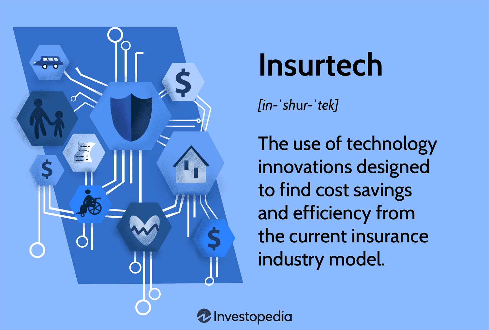

The insurance industry is currently witnessing a substantial transformation fueled by technological advancements. Insurtech, a portmanteau of "insurance technology," embodies this shift. It is an evolving field that harnesses cutting-edge technology to innovate and enhance various facets of the insurance sector. This article addresses the significant influence of insurtech and its integration with algorithmic trading, both of which play crucial roles in elevating the efficiency and effectiveness of insurance operations.

Insurtech is reshaping insurance by introducing more personalized customer interactions, automating processes, and leveraging big data analytics to make informed decisions. The advent of technologies such as artificial intelligence, machine learning, the Internet of Things (IoT), and blockchain is enabling insurers to offer tailored solutions, optimize operations, and manage risks more effectively. These technologies not only improve customer service but also help streamline core insurance functions like claims processing and policy underwriting.



Moreover, the intersection of insurtech with algorithmic trading signifies a transformative approach in financial strategies within the insurance domain. Algorithmic trading automates buying and selling processes based on pre-established criteria, optimizing portfolio management and risk assessment for insurers. This convergence enhances data utilization, allowing insurance companies to execute precise financial strategies swiftly and efficiently.

However, the adoption of these technologies is not without its challenges. Regulatory hurdles and data privacy concerns are significant obstacles that the industry must navigate. Traditional insurers often face difficulties in embracing new technologies due to the conservative nature of the industry and complex regulatory environments. Despite these challenges, the opportunities presented by insurtech and algorithmic trading are vast, promising a more agile, customer-centric, and data-driven insurance sector.

By understanding these developments, industry professionals can better prepare for the evolving landscape of insurance. Gaining insights into the integration of technology with insurance processes will empower stakeholders to anticipate changes, adapt to new business models, and ensure their competitive edge in a rapidly transforming industry.

## Table of Contents

## Understanding Insurtech

Insurtech refers to the application of technological innovations aimed at enhancing the efficiency and effectiveness of the insurance industry. The core objective of insurtech is to drive savings and streamline operations through the integration of advanced technologies such as data analytics, the Internet of Things (IoT), artificial intelligence (AI), and blockchain.

Data analytics is a cornerstone of insurtech, offering the capability to process and analyze vast amounts of information. This is vital for risk assessment and policy underwriting, where insurers need to evaluate numerous factors to determine appropriate premiums and coverages. By utilizing sophisticated algorithms and statistical models, insurers can predict risk more accurately and customize insurance products to meet individual customer needs.

The IoT plays a critical role by connecting smart devices, enabling the real-time collection of data. This continuous flow of information aids insurers in monitoring insured assets, such as vehicles or homes, enhancing the accuracy of risk assessment and enabling dynamic pricing models. For example, telematics in auto insurance allows for the adjustment of premiums based on actual driving behavior rather than generalized risk categories.

AI, including [machine learning](/wiki/machine-learning), automates complex processes like claims management and fraud detection. By applying AI algorithms, insurers can quickly process claims by evaluating data patterns and historical claims, significantly reducing processing time and minimizing human error. Machine learning models can detect fraudulent activities by recognizing anomalous patterns, thereby safeguarding both the insurer and policyholders.

Blockchain technology enhances transparency and security across insurance processes. It offers a decentralized ledger system for recording transactions, ensuring that once data is recorded, it cannot be altered retroactively without the consensus of the network. This feature is particularly valuable for managing insurance contracts and claims, reducing the potential for disputes, and building trust among stakeholders.

In parallel with the fintech sector, insurtech seeks to disrupt traditional insurance models by promoting agile business structures and delivering improved customer experiences. Fintech's focus on financial technologies mirrors insurtech's objectives in insurance, with both industries striving to leverage technological advancements to challenge and modernize conventional practices. Through these innovations, insurtech aims to provide more competitive pricing and enhanced customer service, fostering a more resilient and responsive insurance industry.

## The Role of Algorithmic Trading in Insurance

Algorithmic trading plays a crucial role in the contemporary insurance landscape by automating the buying and selling of assets based on predefined criteria. This technology allows insurance companies to efficiently manage their investment portfolios, leveraging complex algorithms that analyze vast amounts of data to forecast market trends and manage risks effectively.

In the context of insurtech, [algorithmic trading](/wiki/algorithmic-trading) enhances risk management by enabling precise asset allocation. Algorithms can swiftly adjust investment strategies in response to real-time market changes, ensuring optimal portfolio performance. For instance, an insurance company can use algorithmic trading to balance its asset and liability management, aligning its investment strategy with the obligation to pay out future claims.

The integration of algorithmic trading and insurtech solutions facilitates improved data utilization, allowing insurers to access and process real-time financial data swiftly. This capability enhances decision-making processes by providing insurers with immediate insights into market conditions, risk exposures, and potential opportunities. For example, algorithmic models can process historical data to identify patterns and predict future asset price movements, thereby informing strategic asset allocation decisions.

In practice, insurers leverage algorithmic trading to handle large volumes of data and execute precise financial strategies. This technology often employs sophisticated mathematical models and computational methods. Consider a scenario where an insurance company devises a strategy to minimize risk exposure while optimizing returns. This can be articulated using a linear optimization model as follows:

$$

\text{Maximize } \sum_{i=1}^{n} R_i \cdot x_i 
$$

subject to:

$$
\sum_{i=1}^{n} \sigma_i \cdot x_i \leq \text{Risk Tolerance}
$$

$$
\sum_{i=1}^{n} x_i = 1
$$

where $R_i$ represents the expected return of asset $i$, $\sigma_i$ its associated risk, and $x_i$ the proportion of each asset in the portfolio, constrained to the insurer’s risk tolerance.

Python is commonly used in algorithm implementation due to its robust libraries for data analysis and numerical computation. Here’s a basic Python snippet demonstrating the concept of portfolio optimization using a hypothetical dataset:

```python
import numpy as np
from scipy.optimize import minimize

# Hypothetical returns and risks for a portfolio of assets
expected_returns = np.array([0.05, 0.07, 0.12])
risks = np.array([0.1, 0.2, 0.3])
risk_tolerance = 0.25

# Objective function: Negative because we will be maximizing
def portfolio_return(weights):
    return -np.dot(expected_returns, weights)

# Risk constraint
def risk_constraint(weights):
    return risks.T @ weights - risk_tolerance

# Constraint to make sure the weights sum up to 1
constraints = [{'type': 'eq', 'fun': lambda weights: np.sum(weights) - 1},
               {'type': 'ineq', 'fun': risk_constraint}]

# Range of weights from 0 to 1
bounds = [(0, 1) for _ in range(len(expected_returns))]

# Initial weights
initial_weights = np.array([1/3, 1/3, 1/3])

# Optimize
opt_result = minimize(portfolio_return, initial_weights, bounds=bounds, constraints=constraints)

# Optimized weights
optimized_weights = opt_result.x
print("Optimized Asset Allocation:", optimized_weights)
```

Application of algorithmic trading enables insurers to not only optimize financial performance but also to better prepare for economic downturns and financial [volatility](/wiki/volatility-trading-strategies). While challenges such as regulatory compliance and technological implementation exist, the strategic advantages provided by algorithmic trading in risk management and portfolio optimization continue to make it an indispensable tool in the insurtech arsenal.

## Innovations Driving Insurtech

Several key technologies are revolutionizing the insurtech landscape, fundamentally transforming how insurers operate and interact with customers. Artificial intelligence (AI), machine learning, blockchain, and the Internet of Things (IoT) are at the forefront of this change.

AI and machine learning are integral to automating customer interactions and claims processing. These technologies enhance operational efficiency by reducing the likelihood of human error and enabling insurers to process claims and inquiries at unprecedented speeds. For instance, machine learning algorithms can analyze vast datasets to identify patterns in claims, facilitating quicker decision-making and risk assessment.

Blockchain technology plays a critical role by providing robust security solutions for data handling and the execution of smart contracts. Smart contracts, which are self-executing contracts with the terms of the agreement directly written into code, ensure transparency and reduce the need for intermediaries, thus lowering costs. Furthermore, blockchain's decentralized nature ensures that transactions are immutable and verifiable, enhancing trust between insurers and policyholders.

IoT devices are transforming data collection methods, allowing insurers to obtain real-time data that can be used for precise risk assessments and premium calculations. For example, IoT sensors in vehicles can monitor driving behavior and environmental conditions, providing insurers with accurate data to set personalized premiums based on individual driving habits. This real-time data facilitates the development of usage-based insurance and pay-how-you-drive (PHYD) models, which are becoming increasingly popular among consumers.

These technological innovations are collectively reshaping the insurance industry by delivering more personalized and flexible insurance solutions. They enable insurers to offer tailored policies that suit individual lifestyles and preferences, thereby enhancing customer satisfaction and retention. As insurtech continues to evolve, these technologies will play a pivotal role in crafting more responsive, data-driven insurance services that meet the demands of the modern consumer.

## Challenges and Criticisms

Despite its transformative potential, the integration of insurtech into the insurance industry is not without challenges, notably regulatory hurdles and data privacy concerns. Regulatory frameworks governing the insurance sector are often stringent and complex. As such, traditional insurers, with their conservative nature, may be hesitant to adopt new technologies. This reluctance is exacerbated by the intricate compliance requirements that vary across regions, creating a barrier to the seamless implementation of insurtech solutions. To overcome this, insurers must navigate these regulations meticulously, ensuring adherence while fostering innovation.

Data privacy is another critical issue confronting insurtech. With the industry heavily reliant on extensive data collection for personalized insurance offerings, concerns about privacy and data misuse are heightened. Consumers are increasingly wary of how their data is stored, used, and shared. Ensuring robust data protection measures is paramount in mitigating these fears and maintaining consumer trust. The challenge lies in implementing sophisticated cybersecurity protocols that safeguard sensitive information without stifling technological advancement.

Additionally, there is criticism regarding the potential erosion of personal interaction due to highly automated insurtech solutions. While automation enhances efficiency, it can lead to a depersonalized experience for customers who value human interaction in service provision. This loss of the personal touch can impact customer satisfaction and engagement, highlighting the need for a balanced approach that merges technology with personalized customer service.

Addressing these challenges involves finding a delicate balance between embracing technological innovation and preserving consumer trust and satisfaction. Insurers will need to invest in building transparent, compliant, and secure systems that respect user privacy while continuing to offer personalized services. By doing so, the insurtech industry can effectively address its critics and pave the way for a future where technology and trust coexist harmoniously.

## Impact on Customer Experience

Insurtech is significantly reshaping how customers interact with the insurance industry, focusing on enhancing user experience through innovative technology. The integration of advanced digital solutions has facilitated more engaging, efficient, and personalized platforms for customer interactions.

One of the most salient impacts of insurtech on customer experience is the availability of on-demand services. Customers can now access insurance services via mobile applications and online platforms, enabling them to manage their policies at their convenience. This accessibility extends to simplified policy management, where digital interfaces allow users to easily update details, compare policies, and handle renewals without navigating cumbersome paperwork. Additionally, the capability for instant claims processing is a notable advancement, significantly reducing the time between incident reporting and settlement. Automated systems assess claims in real-time, providing quicker resolutions and enhancing customer satisfaction.

The deployment of chatbots and virtual assistants in customer service has also been transformative. These AI-driven tools provide 24/7 support, immediately addressing queries and guiding users through standard procedures. As a result, insurers can maintain high levels of service accessibility, catering to customer needs without the delays typically associated with traditional call centers.

Furthermore, insurtech has enabled unprecedented levels of customization in insurance products. By harnessing data analytics and machine learning algorithms, insurers can offer tailored products that align with an individual's lifestyle and risk profile. This personalization not only matches coverage to specific needs but also fosters increased customer satisfaction and retention by presenting insurance as a more customer-centric service rather than a one-size-fits-all proposition.

Overall, the adoption of insurtech technologies marks a shift towards a more user-focused approach in the insurance industry, where the emphasis is placed on improving service accessibility, efficiency, and personalization. As these technologies continue to evolve, insurers will likely keep innovating to meet the ever-growing expectations of modern consumers.

## The Future of Insurtech and Algorithmic Trading

The future of insurtech is characterized by continuous advancements in data analytics, [artificial intelligence](/wiki/ai-artificial-intelligence) (AI), and automation, poised to further revolutionize the insurance industry. These technologies are set to enable insurers to process vast amounts of data with greater accuracy, develop predictive models for risk assessment, and automate routine processes such as claim handling and customer service. The seamless integration of these technological advancements is expected to enhance the accuracy, efficiency, and personalization of insurance services.

Algorithmic trading remains a cornerstone of this transformation, offering insurers sophisticated tools for financial management and risk mitigation. By employing algorithms to analyze market data and execute trades at optimal prices, insurers can better manage their investment portfolios, hedge against risks, and ensure financial stability. These algorithms can process complex datasets rapidly, facilitating the swift adaptation to market changes and enhancing overall financial efficiency.

As technology continues to evolve, insurtech is anticipated to extend its reach beyond traditional insurance offerings, potentially disrupting the broader financial services landscape. This will include developing more inclusive and holistic financial solutions that address a wider array of consumer needs, such as integrated insurance and financial planning services. This evolution necessitates insurers to shift towards digital transformation by adopting cutting-edge technology and refining business models to remain competitive.

Embracing this future landscape requires insurers to invest in digital transformation strategies, encompassing new technological infrastructure and personnel training. This investment will enable insurance companies to harness the full potential of insurtech and algorithmic trading by enhancing digital capabilities and fostering a culture of innovation. Successful adaptation to these changes can result in streamlined operations, improved customer experiences, and sustainable growth.

The integration of insurtech and algorithmic trading signifies a transformative convergence that promises to redefine the insurance industry for years to come. This dynamic interplay between technology and finance offers the potential to reshape traditional insurance paradigms, creating a more resilient and adaptable industry that meets the ever-evolving demands of modern consumers. By staying ahead of these technological trends, insurers can secure a competitive edge and contribute to the emergence of a more accessible and data-driven insurance ecosystem.

## Conclusion

The insurance industry is currently experiencing a profound transformation driven by technological advancements, with insurtech playing a crucial role in improving both efficiency and customer service outcomes. Through the integration of cutting-edge technologies such as artificial intelligence, blockchain, and the Internet of Things (IoT), insurtech is reshaping conventional insurance models to offer more personalized and customer-centric services.

Algorithmic trading serves as a pivotal tool in this transformative period by providing sophisticated financial management capabilities. It allows insurance companies to automate their asset management processes, optimize their investment portfolios, and manage risks more effectively. Utilizing algorithms, insurers can analyze large volumes of data rapidly and execute precisely calibrated trading strategies, which enhances overall financial performance and stability.

Nevertheless, despite the promising opportunities presented by these technologies, several challenges persist. Regulatory concerns and data privacy issues remain significant hurdles that need careful navigation. Traditional insurers may exhibit resistance to change due to the conservative nature of the industry and the complexities of integrating new technologies. Moreover, the potential erosion of the personalized touch in customer service, due to increased automation, is another area of concern.

However, the potential benefits of integrating insurtech and algorithmic trading into the insurance industry are vast. These technologies promise to deliver more accessible, personalized, and data-driven insurance services, which could significantly enhance customer satisfaction and retention. As the industry continues to evolve, stakeholders must remain informed about these technological trends to adapt and stay competitive in a rapidly changing landscape.

Ultimately, successfully integrating insurtech and algorithmic trading can offer insurers substantial competitive advantages. By embracing these advancements, insurance providers can foster enhanced resilience and adaptability, ensuring they are well-equipped to meet the demands of the future. This technological convergence could potentially redefine the insurance industry for decades to come, empowering it to serve consumers more effectively and efficiently.

## References & Further Reading

[1]: Bergstra, J., Bardenet, R., Bengio, Y., & Kégl, B. (2011). ["Algorithms for Hyper-Parameter Optimization."](https://papers.nips.cc/paper/4443-algorithms-for-hyper-parameter-optimization) Advances in Neural Information Processing Systems 24.

[2]: ["Advances in Financial Machine Learning"](https://www.amazon.com/Advances-Financial-Machine-Learning-Marcos/dp/1119482089) by Marcos Lopez de Prado

[3]: ["Evidence-Based Technical Analysis: Applying the Scientific Method and Statistical Inference to Trading Signals"](https://www.amazon.com/Evidence-Based-Technical-Analysis-Scientific-Statistical/dp/0470008741) by David Aronson

[4]: ["Machine Learning for Algorithmic Trading"](https://github.com/stefan-jansen/machine-learning-for-trading) by Stefan Jansen

[5]: ["Quantitative Trading: How to Build Your Own Algorithmic Trading Business"](https://www.amazon.com/Quantitative-Trading-Build-Algorithmic-Business/dp/1119800064) by Ernest P. Chan