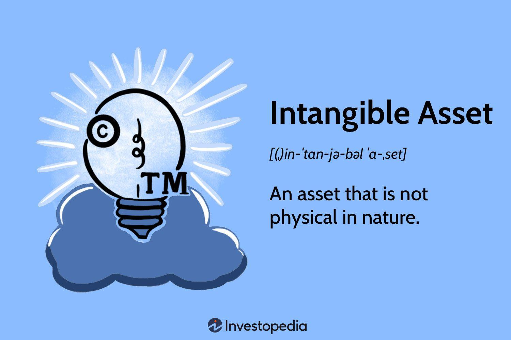

## Table of Contents

## What is an intangible asset?

An intangible asset is something valuable that you can't touch or see. It's different from things like buildings or machines, which are physical and easy to see. Examples of intangible assets include things like a company's brand name, its reputation, or special knowledge that helps it do business better than others.

These assets are important because they can help a company make money, even though they are not physical. For example, a well-known brand can help sell more products because people trust and like the brand. However, it can be hard to figure out exactly how much these intangible assets are worth because they don't have a clear price tag like a car or a computer does.

## How do intangible assets differ from tangible assets?

Intangible assets and tangible assets are two different kinds of things that a business can own. Tangible assets are things you can touch and see, like a factory, a computer, or a truck. They are physical items that have a clear value because you can see them and use them directly in the business. For example, a restaurant uses its kitchen equipment every day to make food.

On the other hand, intangible assets are not physical. You can't touch them, but they are still very important to a business. Examples include a company's brand name, its patents, or the special know-how that makes it better at what it does. These assets help the business make money in less obvious ways, like attracting customers because of a strong brand or using a patent to make a unique product. It's harder to put a price on intangible assets because their value isn't as clear as a tangible asset's value.

## Can you provide examples of common intangible assets?

Intangible assets are things a company owns that you can't touch or see, but they still have value. One common type of intangible asset is a brand name. For example, when you think of a company like Coca-Cola, the name itself is worth a lot of money because people recognize it and trust it. Another example is a patent. If a company invents something new, like a special way to make a phone battery last longer, they can get a patent. This gives them the right to be the only ones to use that invention, which can help them make more money.

Another type of intangible asset is goodwill. This is the value of a company's good reputation. If customers like a company and keep coming back, that's worth a lot, even though you can't touch it. Also, there's something called intellectual property, which includes things like copyrights and trademarks. For example, the music a band writes or the logo a company uses are protected by copyrights and trademarks, which means other people can't use them without permission. These assets are all important because they help a company earn money in ways that aren't as easy to see as selling a product.

## Why are intangible assets important for businesses?

Intangible assets are really important for businesses because they help make money in ways that you can't see right away. For example, a strong brand name can make people want to buy more from a company because they trust and like the brand. This means the company can sell more stuff without having to spend as much money on ads. Also, things like patents and special know-how can help a business be better than others. If a company has a special way to do something, like a new way to make a product, they can be the only ones to use it, which can help them make more money.

Another reason intangible assets are important is that they can help a business grow and last longer. A good reputation, which is called goodwill, can make customers keep coming back, even if other companies start selling similar things. This can help the business stay strong over time. Plus, having things like copyrights and trademarks can stop other people from copying what the business does, which protects the business's unique ideas and helps it keep making money from them. So, even though you can't touch intangible assets, they are a big part of what makes a business successful.

## How are intangible assets valued?

Valuing intangible assets can be tricky because they are not things you can touch or see. People usually use different ways to figure out how much they are worth. One way is to look at how much money the asset helps the business make. For example, if a brand name helps sell more products, you can guess its value by how much extra money it brings in. Another way is to see how much it would cost to make the asset again from scratch. If it's a patent, you might think about how much it would cost to invent it all over again.

Another method is to look at what other people are willing to pay for similar intangible assets. If another company bought a similar brand name for a certain amount of money, that can give you an idea of what yours might be worth. Sometimes, experts use a mix of these methods to come up with a number. It's not an exact science, so different people might come up with different values for the same asset. But the main goal is to get a fair idea of how much the intangible asset helps the business.

## What is the process for recognizing intangible assets on a balance sheet?

Recognizing intangible assets on a balance sheet means figuring out which ones a company has and how much they are worth. First, the company needs to know if an asset is really an intangible asset. This means it has to be something you can't touch, like a brand name or a patent, and it has to be something the company controls and expects to use for more than one year. If it fits these rules, the company can put it on the balance sheet.

After figuring out which intangible assets to include, the company needs to decide how much they are worth. This can be hard because there's no clear price tag on things like a brand or special know-how. The company might use different ways to guess the value, like looking at how much money the asset helps the company make or how much it would cost to make the asset again. Once they have a number, they put that value on the balance sheet under "Intangible Assets." This helps show everyone how much these invisible things are worth to the business.

## What are the different types of intangible assets?

Intangible assets are things a company owns that you can't touch or see, but they still have value. One type of intangible asset is a brand name. For example, when you think of a company like Nike, the name itself is worth a lot because people recognize it and trust it. Another type is a patent. If a company invents something new, like a special way to make a phone battery last longer, they can get a patent. This gives them the right to be the only ones to use that invention, which can help them make more money.

Another type of intangible asset is goodwill. This is the value of a company's good reputation. If customers like a company and keep coming back, that's worth a lot, even though you can't touch it. Intellectual property is also an intangible asset, which includes things like copyrights and trademarks. For example, the music a band writes or the logo a company uses are protected by copyrights and trademarks, which means other people can't use them without permission. These assets are all important because they help a company earn money in ways that aren't as easy to see as selling a product.

Lastly, there are also intangible assets like customer lists and proprietary technology. A customer list is valuable because it shows who might buy from the company again. Proprietary technology is special software or a unique way of doing things that only the company knows about. These types of intangible assets help the company work better and make more money, even though they are not physical things.

## How do legal rights affect the classification of intangible assets?

Legal rights play a big role in deciding what counts as an intangible asset. If a company has a legal right to something that you can't touch, like a patent or a trademark, it can be listed as an intangible asset on the balance sheet. For example, if a company invents a new kind of technology, they can get a patent. This legal right means no one else can use that technology without permission, so it becomes a valuable asset for the company. The same goes for trademarks, which protect things like brand names and logos. If a company has a trademark, it can stop others from using the same name or logo, making the trademark an intangible asset.

These legal rights are important because they help protect the value of intangible assets. Without a patent, anyone could copy a new invention, which would make it less valuable. With a patent, the company can use the invention to make money and keep others from doing the same. Trademarks work the same way. A strong brand name can help sell more products, and the trademark keeps other companies from using a similar name to confuse customers. So, legal rights not only help classify something as an intangible asset but also help the company keep that asset valuable over time.

## What is the amortization of intangible assets and how is it calculated?

Amortization of intangible assets is like spreading out the cost of something valuable that you can't touch over time. It's a way for businesses to show how much of the value of an intangible asset, like a patent or a trademark, they use up each year. Instead of writing off the whole cost at once, they break it down into smaller amounts and record those amounts as expenses over the life of the asset. This helps match the cost of the asset with the income it helps generate, giving a clearer picture of the company's financial health.

To calculate amortization, you first need to know the cost of the intangible asset and how long it will be useful, which is called its useful life. For example, if a company buys a patent for $10,000 and expects it to be useful for 10 years, they would amortize it at $1,000 per year. You do this by dividing the total cost of the asset by its useful life. Each year, the company would record $1,000 as an expense on their income statement and reduce the value of the intangible asset on their balance sheet by the same amount. This process continues until the asset's value is fully amortized, or until its useful life ends.

## How do intangible assets impact a company's financial statements?

Intangible assets can really change how a company's financial statements look. When a company buys an intangible asset, like a patent or a brand name, it shows up on the balance sheet. This makes the company's total assets bigger. But, because these assets don't have a clear price tag, figuring out their value can be tricky. Companies have to guess how much these assets are worth, and this guess can make the balance sheet look different from what it might if everything was easy to see and touch.

Also, intangible assets affect the income statement through something called amortization. This is when a company spreads out the cost of the intangible asset over time. Each year, a part of the cost is listed as an expense, which makes the company's profit look smaller. But, if the intangible asset helps the company make more money, like a strong brand name helping sell more products, it can also make the income statement look better in the long run. So, intangible assets can make a company's financial statements look both bigger and smaller in different ways.

## What are the challenges in managing and protecting intangible assets?

Managing and protecting intangible assets can be really hard for companies. One big problem is that these assets are not easy to see or touch, so it's tough to keep track of them. For example, a company's brand name or special know-how is valuable, but it's not like a machine or a building that you can lock up. This makes it harder to make sure no one else uses them without permission. Also, figuring out how much these assets are worth can be tricky because there's no clear price tag. Companies have to guess, and different people might come up with different numbers, which can cause problems.

Another challenge is protecting these assets from being copied or stolen. Legal rights like patents and trademarks help, but they're not perfect. It can take a long time and a lot of money to get these rights, and even then, other people might still try to use the company's ideas. Plus, the laws about intangible assets can be different in different countries, which makes it even harder to protect them everywhere. So, companies have to be really careful and smart about how they manage and protect their intangible assets to keep them safe and valuable.

## How do international accounting standards treat intangible assets compared to local standards?

International accounting standards, like the ones set by the International Financial Reporting Standards (IFRS), have specific rules for how companies should deal with intangible assets. These rules say that a company can only list an intangible asset on their balance sheet if it will help the company make money for more than one year and if the company can prove they control it. For example, if a company buys a patent, they need to show how much it cost and how long it will be useful. Then, they spread out that cost over time using something called amortization. This helps show how much of the patent's value the company uses each year.

Local accounting standards, like the Generally Accepted Accounting Principles (GAAP) in the United States, might have different rules. Under GAAP, companies can only list intangible assets on their balance sheet if they were bought from someone else, not if they were made by the company itself. This means that if a company creates a new brand or invents something new, they can't put it on their balance sheet unless they buy it from another company. Also, the way they figure out how much to amortize each year can be different from IFRS. So, depending on where a company is and what rules they follow, the way they treat intangible assets can be quite different.

## How do you value intangible assets?

Valuation of intangible assets poses significant challenges due to their non-physical characteristics and potential for future economic benefits. Unlike tangible assets, which can be easily assessed through observable attributes, intangible assets require more abstract valuation approaches.

Common methods for valuing intangible assets include the cost approach, market approach, and income approach.

1. **Cost Approach**: This method involves estimating the amount required to recreate or replace the intangible asset. It takes into account the replacement cost or reproduction cost of the asset, considering factors such as labor, materials, and time. While this approach provides a straightforward assessment, it might not always reflect the asset’s market value or future income potential, especially for unique or highly proprietary assets.

2. **Market Approach**: This approach evaluates the asset based on comparable market transactions. It requires identifying similar intangible assets that have been bought or sold in the market. The primary challenge here is the availability of comparable data, as many transactions involving intangible assets are confidential or unique, making direct comparison difficult.

3. **Income Approach**: This is a forward-looking method that values an intangible asset based on the present value of future economic benefits it is expected to generate. It commonly uses techniques such as discounted cash flow (DCF) analysis. Here, cash flows attributable to the intangible asset are projected and then discounted to their present value using an appropriate discount rate. This method is particularly suited for assets that directly contribute to revenue generation, like patents or copyrights. The formula for the DCF method is:
$$
   \text{PV} = \sum_{t=1}^{n} \frac{\text{CF}_t}{(1+r)^t}

$$

   where $\text{PV}$ is the present value, $\text{CF}_t$ is the cash flow in year $t$, $r$ is the discount rate, and $n$ is the number of years in the projection.

The choice of valuation method often hinges on the type of intangible asset and the availability of market data. For example, the cost approach may be more applicable to newly developed software programs, while the income approach is favored for assets with a clear revenue stream, such as established patents. The market approach, although challenging, is useful when access to transaction data exists.

In practice, a combination of methods is often employed to provide a comprehensive view, ensuring that the intangible asset’s value captures both its cost basis and potential market and income prospects.

## References & Further Reading

[1]: World Intellectual Property Organization. (2021). [World Intellectual Property Indicators](https://www.wipo.int/publications/en/details.jsp?id=4571). WIPO.

[2]: Bergstra, J., Bardenet, R., Bengio, Y., & Kégl, B. (2011). ["Algorithms for Hyper-Parameter Optimization."](https://dl.acm.org/doi/10.5555/2986459.2986743) Advances in Neural Information Processing Systems 24.

[3]: López de Prado, M. (2018). ["Advances in Financial Machine Learning"](https://www.amazon.com/Advances-Financial-Machine-Learning-Marcos/dp/1119482089). Wiley.

[4]: Chan, E. P. (2008). ["Quantitative Trading: How to Build Your Own Algorithmic Trading Business"](https://github.com/ftvision/quant_trading_echan_book). Wiley.

[5]: Jansen, S. (2020). ["Machine Learning for Algorithmic Trading"](https://github.com/stefan-jansen/machine-learning-for-trading). Packt Publishing.