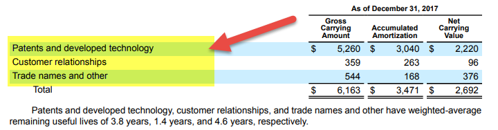

In the rapidly evolving financial landscape, understanding the interplay between balance sheet reporting, intangible assets, and algorithmic trading has become critical. Intangible assets, which include patents, trademarks, copyrights, and goodwill, have become increasingly pivotal to a company's success. These non-physical assets contribute significantly to competitive advantage and innovation, particularly in technology-driven industries where intellectual property can constitute a major portion of a company’s asset base.

Balance sheet reporting offers a structured representation of a company's financial position at a particular point in time, with intangible assets listed among the long-term assets. The proper valuation and disclosure of these intangibles are crucial as they provide insights into the potential future benefits and revenue-generating capability of a company. However, challenges exist due to their non-tangible nature, which makes accurate valuation complex. Critical guidelines and frameworks such as the International Financial Reporting Standards (IFRS) and Generally Accepted Accounting Principles (GAAP) help standardize the reporting of these assets.



Algorithmic trading, which utilizes advanced mathematical models and sophisticated software to make trading decisions, relies heavily on comprehensive data inputs, including financial statements like balance sheets. The integration of intangible asset metrics into these models has become essential as they offer deeper insights into a company's potential that might not be immediately obvious through traditional tangible asset evaluation. The leverage of such information can enhance the precision of trading strategies, leading to optimized decision-making and potentially greater returns.

This article explores how intangible assets are reported on the balance sheet, the challenges involved in their accurate representation, and their integration into algorithmic trading models, which further underscores their impact on financial analysis and market strategies.

## Table of Contents

## Understanding Intangible Assets

Intangible assets are non-physical in nature yet hold substantial value for companies, playing a pivotal role in defining competitive advantage in contemporary economies. Unlike tangible assets such as machinery or buildings, intangible assets include intellectual property, brand recognition, and customer lists. These assets, by nature, are unique and confer significant strategic advantages to businesses, making them essential components of a company's total value.

Intellectual property (IP), encompassing patents, copyrights, and trademarks, is a noteworthy category of intangible assets. These protect innovative ideas and brand identity, allowing companies to maintain market positioning and capitalizing on innovation. Another example is brand recognition, which can elevate a company's status and customer loyalty, translating into sustained revenue streams and market share. Customer lists, often comprising proprietary data and long-standing client relationships, can drive targeted marketing strategies and enhance customer retention.

The valuation and disclosure of intangible assets on balance sheets pose considerable challenges due to their non-physical nature. Unlike tangible assets, which can be readily appraised, intangible assets often lack a clear market value. This ambiguity makes it difficult to determine an accurate financial value for these assets. Furthermore, the absence of physical substance means there is often no direct method for calculating depreciation; instead, intangible assets are subjected to amortization.

Intangible assets are typically recorded on the balance sheet if they have been acquired externally through purchase or acquisition. In such cases, they appear as long-term assets and are recorded at their purchase cost, which is then systematically amortized over their useful life. However, internally generated intangible assets are not usually listed due to challenges associated with their valuation, relying heavily on subjective assessments and assumptions without a purchase cost to reference.

Thus, understanding the intricacies of intangible assets remains critical for stakeholders in the financial domain, as these assets significantly impact a company's valuation and are essential for maintaining a competitive edge in today's knowledge-driven economy.

## Intangible Assets on a Balance Sheet

Intangible assets are a distinct category of assets that appear on a company's balance sheet, contingent upon their acquisition through a purchase. This classification excludes internally developed intangible assets due to the complexities involved in their valuation and the inherent subjectivity in estimating future economic benefits. When intangible assets are acquired, they are recognized as long-term assets and valued at their purchase cost minus any accumulated amortization over their useful life.

The treatment of intangible assets on the balance sheet is dictated by accounting standards such as the International Financial Reporting Standards (IFRS) and Generally Accepted Accounting Principles (GAAP). According to these standards, for an intangible asset to be recognized on a balance sheet, it must be identifiable, non-monetary, and lacking physical substance. Furthermore, the asset must have been acquired in a business combination, contract, or similar event with a reliably measurable cost.

### Valuation Method

The value of an intangible asset is initially recorded at its purchase cost. Over time, this cost is systematically reduced to reflect depreciation of the asset's value through amortization. The formula for calculating the book value of an intangible asset is:

$$
\text{Book Value} = \text{Initial Purchase Price} - \text{Accumulated Amortization}
$$

Amortization is akin to depreciation for tangible assets and represents the gradual expensing of the intangible asset's cost over its estimated useful life. However, unlike tangible assets, not all intangible assets are subject to amortization. For instance, assets with indefinite useful lives, such as certain trademarks and goodwill, are subject to regular impairment tests rather than systematic amortization.

### Importance of Proper Reporting

Accurate reporting of intangible assets on a balance sheet is critical for ensuring transparency and aiding in the precise valuation of a company. Intangible assets, such as patents, trademarks, and customer relationships, often represent significant value for technology-driven and service-oriented businesses. Transparent reporting of these assets allows investors and other stakeholders to better assess the company's financial health and potential for future growth.

Misreporting or failing to properly account for intangible assets can lead to misvaluation and misinterpretation of a company's financial position. This can have downstream effects on investment decisions and the accuracy of financial forecasting models, underscoring the importance of adherence to recognized accounting principles in balance sheet reporting.

In summary, the inclusion of intangible assets on a balance sheet when acquired and valued correctly clarifies a company's asset base and financial standing, ensuring that stakeholders have accurate and comprehensive financial data for decision-making purposes.

## Algorithmic Trading and Financial Reporting

Algorithmic trading leverages mathematical models and data analysis to automate trading decisions, utilizing financial reports as foundational data sources. Balance sheets, as components of these reports, provide crucial insights into a company's financial health, influencing [algorithmic trading](/wiki/algorithmic-trading) strategies significantly. The integration of intangible asset valuations from balance sheets into trading algorithms is increasingly recognized for its potential to enhance decision-making precision.

Intangible assets, while challenging to quantify due to their non-physical nature, are often underrepresented on balance sheets. However, their strategic importance cannot be overstated, particularly as they represent a growing portion of corporate value in today's economy. For algorithmic trading purposes, incorporating these valuations involves estimating their fair value and potential impacts on financial performance, thereby optimizing trading strategies.

Algorithmically, balance sheet data, including intangible assets, can be used to calculate key financial ratios such as Return on Assets (ROA) and Debt-to-Equity Ratio. These ratios are essential for assessing company performance and risk, aiding in the development of more sophisticated trading models. For example, a Python algorithm might involve retrieving balance sheet data via an API, performing calculations to evaluate asset growth or financial leverage, and updating trading signals based on these computations. Here is a simple Python snippet that outlines this process:

```python
import requests

def fetch_balance_sheet_data(company_ticker):
    url = f'https://api.example.com/financials/{company_ticker}'
    response = requests.get(url)
    data = response.json()
    return data

def calculate_financial_ratios(balance_sheet_data):
    assets = balance_sheet_data['total_assets']
    liabilities = balance_sheet_data['total_liabilities']
    intangible_assets = balance_sheet_data.get('intangible_assets', 0)

    roa = (balance_sheet_data['net_income'] / assets) * 100
    debt_to_equity_ratio = liabilities / (assets - liabilities - intangible_assets)

    return roa, debt_to_equity_ratio

company_data = fetch_balance_sheet_data('AAPL')
roa, debt_to_equity_ratio = calculate_financial_ratios(company_data)

if roa > 10 and debt_to_equity_ratio < 1:
    print("Optimal trading conditions identified.")
```

The necessity of accurate balance sheet data, including valuations of intangible assets, is paramount to mitigate risks like mispricing and to maximize returns. Algorithms adept at adjusting to these valuations are more robust against market [volatility](/wiki/volatility-trading-strategies), ultimately enhancing predictive accuracy and trading performance. As the financial landscape continues to embrace digital transformations, the harmonization of accounting principles with algorithmic technologies is expected to drive innovation in trading strategies.

## Integrating Intangible Assets into Algo Trading

Integrating intangible assets into algorithmic trading presents several challenges, primarily due to the subjective nature of their valuation and the need for real-time data integration. Intangible assets, such as patents, trademarks, and brand equity, are not easily quantifiable, complicating their utilization within trading algorithms that rely on precise and quantitative inputs.

One of the main hurdles is adjusting algorithmic models to account for how intangible asset valuations can influence a company's financial performance. These assets, while non-physical, can significantly affect a company's market value and investment appeal. To properly incorporate them, algorithms need to evaluate the indirect impact of these assets on metrics like revenue growth, profit margins, and market sentiment.

Advanced data analytics tools and techniques are instrumental in overcoming these challenges. Machine learning and natural language processing (NLP) can be used to analyze unstructured data, such as news articles, patent filings, and social media sentiment, which can indirectly signal changes in the value of intangible assets. For instance, sentiment analysis can provide insights into brand reputation changes, while pattern recognition in patent data may yield competitive intelligence.

One strategic approach employed by algorithmic models is mean reversion, where the algorithm predicts that certain asset prices will revert to their historical mean over time. By incorporating real-time insights into how intangible assets influence perceived value, algorithms can better identify deviations from the mean that are driven by changes in intangible asset values.

Another approach is [trend following](/wiki/trend-following), where algorithms detect and capitalize on market [momentum](/wiki/momentum) that reflects shifts in a company's intangible asset value, such as increased brand recognition or a groundbreaking patent development. Here, timely data integration is crucial as the algorithm must adjust to these shifts rapidly to maintain a competitive trading edge.

Python, a favored language for developing trading algorithms, offers libraries such as NumPy and pandas for handling complex data structures, and [machine learning](/wiki/machine-learning) frameworks like Scikit-learn and TensorFlow for building sophisticated models. A simple Python example to apply a trend-following strategy incorporating an intangible asset sentiment index might look as follows:

```python
import pandas as pd
import numpy as np
from sklearn.linear_model import LinearRegression

# Example dataset with stock prices and sentiment index for an intangible asset
data = pd.DataFrame({
    'Date': pd.date_range(start='1/1/2023', periods=100, freq='D'),
    'Stock_Price': np.random.normal(loc=100, scale=10, size=100).cumsum(),
    'Sentiment_Index': np.random.uniform(low=0.0, high=1.0, size=100)
})

# Calculate rolling average trends
data['Price_Trend'] = data['Stock_Price'].rolling(window=5).mean()
data['Sentiment_Trend'] = data['Sentiment_Index'].rolling(window=5).mean()

# Linear regression to predict stock price influenced by sentiment trend
X = data[['Sentiment_Trend']].dropna().values
y = data['Price_Trend'].dropna().values
model = LinearRegression().fit(X, y)

# Predict and adjust trading strategy accordingly
predicted_trend = model.predict(X)
data['Adjusted_Trend'] = np.where(predicted_trend > data['Price_Trend'].values, 'Buy', 'Sell')

print(data[['Date', 'Stock_Price', 'Adjusted_Trend']].tail())
```

This script computes trends for stock prices and intangible asset sentiments, using regression to predict the influence of sentiments on price trends. Such models must continuously evolve to integrate real-time data inputs, enabling more adaptive and responsive trading strategies to the nuances of intangible asset valuation.

## Case Studies and Real-World Applications

### Case Study: Apple Inc.

Apple Inc. is renowned for its robust brand value, which serves as a significant intangible asset. The company's brand is not just a symbol of its products but also a representation of its innovation and quality. Apple's brand equity is often listed as an intangible asset in its financial statements, reflecting the company's efforts to monetize its brand through various channels. Apple's annual reports disclose these assets under "Goodwill and Other Intangible Assets", emphasizing the brand's financial impact on the firm's overall valuation.

From a market performance perspective, Apple's brand value contributes substantially to its stock price stability and investor confidence. The company's strong brand identity leads to customer loyalty and market leadership, allowing it to command premium pricing for its products. This pricing power and loyalty directly influence Apple's revenue and profit margins.

### Case Study: Coca-Cola

Coca-Cola leverages its global brand recognition and customer loyalty as key intangible assets. These assets are critical drivers of Coca-Cola's strategic positioning in the beverage industry. The brand value is reflected in the company's balance sheets under intangible assets, accounting for its widespread consumer base and extensive market reach. Coca-Cola's customer loyalty capitalizes on its consistent branding and marketing efforts, ensuring long-term profitability.

The strategic implication of Coca-Cola's brand and customer loyalty is evident in its sustained market performance over decades. The brand's strength allows it to navigate competitive pressures and maintain a leading market position. This performance is reflected in the positive investor perception, often seen through its stable stock performance and market capitalization.

### Analysis of Disclosure Impacts

The disclosure of intangible assets like brand value plays a crucial role in shaping market performance and investor perceptions for companies like Apple and Coca-Cola. When these intangible assets are transparently reported, they help in accurately reflecting the company's financial health and strategic potential. Investors rely on this information to assess the long-term viability and profitability of the company.

For algorithmic models, integrating these disclosures can optimize trading strategies by providing insights into aspects of the company that go beyond conventional financial metrics. Algorithms can incorporate these intangible asset values to gauge a company's growth potential and adjust trading signals accordingly.

### Integration into Strategic and Algorithmic Models

Both Apple and Coca-Cola integrate their intangible assets into strategic decisions, directly influencing product development, marketing strategies, and market positioning. These companies utilize data analytics to quantify customer sentiment and brand efficacy, aiding in the optimization of business operations.

Algorithmically, the inclusion of intangible assets can enhance models designed for trend analysis or market sentiment assessments. For instance, understanding the fluctuations in brand value could allow an algorithm to predict revenue variances, subsequently optimizing asset allocations and trading positions. By weighing brand equity as part of the broader data set, algorithms achieve a more holistic evaluation of the company's market value and potential risk factors.

In conclusion, through strategic reporting and utilization of intangible assets, companies like Apple and Coca-Cola enhance their competitive edge and align their operational and financial strategies with long-term market forces.

## Conclusion

Intangible assets are increasingly critical in assessing a company's value and competitiveness. These non-physical assets, such as intellectual property, brand recognition, and customer loyalty, underpin a firm's strategic positioning and market performance. As algorithmic trading becomes more prevalent, the accurate reporting and integration of intangible assets into trading models become essential for precise financial forecasting and optimal decision-making.

Effective reporting of intangible assets is not only pivotal for transparency but also for aligning trading strategies with a company's intrinsic value. With accurate balance sheet disclosures, trading algorithms can incorporate these insights to refine their models, improving predictions and responses to market fluctuations. The integration of detailed intangible asset metrics into these models presents an opportunity to enhance the accuracy of quantitative strategies, potentially leading to superior risk-adjusted returns.

This intersection of accounting principles and algorithmic trading offers new opportunities. The fusion of detailed financial reporting with advanced trading technologies can unveil previously untapped investment patterns and compute scenarios that predict future market behavior more precisely. 

Looking forward, there is a pressing need to enhance transparency and efficiency in the reporting and utilization of intangible assets. Greater clarity in the quantification and categorization of these assets on financial statements will ensure that algorithmic trading systems fully leverage their potential. This could involve the adoption of advanced analytics and machine learning algorithms capable of processing complex data sets and extracting valuable insights from them. Enhanced reporting standards, possibly through innovations in accounting frameworks such as the International Financial Reporting Standards (IFRS) and the Generally Accepted Accounting Principles (GAAP), will be crucial. 

By focusing on these advancements, the finance industry can further harness the power of intangible assets, creating a more accurate and efficient market ecosystem that benefits investors and corporations alike.

## References & Further Reading

International Financial Reporting Standards (IFRS) are essential for companies operating in multiple countries, providing a consistent framework for financial reporting across borders. These standards facilitate transparency, accountability, and efficiency in global financial markets [1]. They are particularly relevant when dealing with intangible assets, as they set the guidelines for recognizing and measuring these assets on financial statements.

Generally Accepted Accounting Principles (GAAP) in the U.S. offer another framework guiding the accounting of intangible assets. GAAP establishes how these assets should be treated in company balance sheets, offering more detailed rules compared to IFRS [2]. The understanding of GAAP is critical for accountants and financial analysts working with companies that prioritize comprehensive financial transparency.

Apple Inc. Annual Reports serve as practical examples of how a leading company handles intangible assets such as brand value and intellectual property. Apple's financial documentation offers insights into how these intangible elements are integrated into their balance sheets, reflecting the company's strategic value and market position [3].

The Coca-Cola Company Annual Reports provide another case study of intangible assets management, particularly customer loyalty and brand recognition. These reports illustrate how Coca-Cola quantifies and reports its intangible assets, offering insights into how such assets impact financial health and investor perceptions [4].

Books and articles on financial reporting and algorithmic trading offer deeper insights into how balance sheet data, including valuations of intangible assets, can be incorporated into algorithmic trading models. These resources explore the methodologies and techniques for integrating complex data sets into automated trading systems, enhancing decision-making and optimizing financial strategies [5].

References:
1. IFRS Foundation. (Year). "International Financial Reporting Standards".
2. Financial Accounting Standards Board. (Year). "Generally Accepted Accounting Principles".
3. Apple Inc. "Annual Reports".
4. The Coca-Cola Company. "Annual Reports".
5. Jorion, P. (Author). "Financial Risk Manager Handbook".

