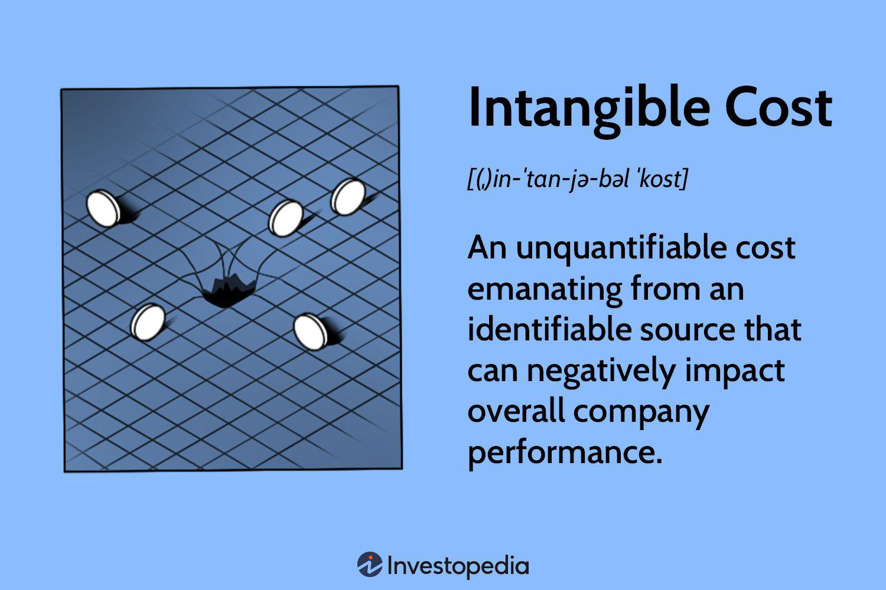

Algorithmic trading, often referred to as algo trading, is a popular method that employs automated and sophisticated algorithms to execute financial transactions at high speed and volume. It involves using pre-defined instructions based on various factors such as timing, price, and volume, enabling traders to perform a large number of trades within milliseconds. The efficiency offered by algorithmic trading has radically transformed financial markets, enabling continuous trade execution with minimal human intervention, thus reducing the impact of human psychology and error.

Markets involve numerous costs, which can broadly be classified into two main types: tangible and intangible. Tangible costs are easily identifiable and quantifiable, such as transaction fees or technology investments. These costs directly influence the trading process by impacting the overall expense structure of transactions. Intangible costs, while less apparent, are just as important. They include aspects like brand reputation and client trust, which are harder to quantify but have significant strategic implications.



Understanding the balance of these costs is vital for traders and firms, as they directly affect the efficiency and profitability of trading operations. An effective algorithmic strategy must account for both types of costs to optimize performance and returns. For example, while the tangible cost of upgrading a trading system might be evident, the potential intangible cost of a reputational hit due to system errors could be substantially higher.

This article investigates how tangible and intangible costs materialize within algorithmic trading environments, providing examples and discussing their implications on traders and firms. It further examines the distinctions between these costs and their impacts on investment strategies and market decisions, highlighting the importance of a balanced approach in achieving trading efficiency.

## Table of Contents

## Defining Tangible and Intangible Costs

Tangible costs in algorithmic trading are directly measurable financial expenditures related to executing trades or maintaining trading infrastructure. These costs include transaction fees, which are charges applied by brokers or exchanges for processing trades. Such fees are often calculated based on a per-trade basis or as a percentage of the trade value. Additionally, substantial investments in technology are necessary to support algorithmic strategies. This encompasses the acquisition of high-performance computing resources, high-speed internet connections, and specialized trading software. Infrastructure expenses, such as maintaining data centers or leasing colocated server space near exchanges for minimal latency, also fall under tangible costs.

Intangible costs, although not directly measurable like tangible ones, play a crucial role in the overall effectiveness and sustainability of algorithmic trading strategies. These costs frequently pertain to elements like brand reputation, employee morale, and trust among clients or consumers. In the competitive landscape of financial markets, a poor reputation or mistrust can lead to significant losses in clientele and business opportunities. For instance, a trading firm involved in unethical trading practices may suffer from a tarnished brand image, impeding its ability to attract new clients and retain existing ones.

Employee morale constitutes another critical intangible cost. Algorithmic trading environments can be high-pressure, and firms with elevated turnover rates or poor workplace environments may face increased recruitment and training costs. High turnover can disrupt team dynamics and decrease the overall effectiveness of trading operations.

Recognizing both tangible and intangible costs is pivotal for investors and firms to truly grasp the total expense landscape of their [algorithmic trading](/wiki/algorithmic-trading) strategies. This awareness allows for a more holistic evaluation of strategy effectiveness, enabling better decision-making and optimization of resources to achieve greater profitability and sustainability in trading operations.

## Examples of Tangible Costs in Algo Trading

Algorithmic trading systems rely heavily on a robust technological infrastructure, which inherently incurs numerous tangible costs. One of the primary tangible costs is the investment in high-speed internet and dedicated servers. These resources are imperative for executing trades rapidly and with minimal latency, a critical requirement in high-frequency trading where decisions and transactions occur in fractions of a second. The necessity for uninterrupted and fast connectivity means firms often have to rent data centers close to key market exchanges, further increasing capital outlay.

Transaction fees represent another palpable cost that algorithmic traders must [factor](/wiki/factor-investing) into their calculations. These fees are imposed by financial brokers or exchanges for executing trades on their platforms. Depending on the trading [volume](/wiki/volume-trading-strategy), transaction fees can accumulate rapidly, impacting the profitability of trading strategies. For instance, trading platforms typically charge a fee per transaction, which can vary based on factors such as trade size and execution speed.

Regular upgrades and maintenance of trading software and hardware also form a significant part of the tangible cost structure. Algo trading platforms depend on the latest software and hardware to maintain competitive advantage and operational efficiency. This requirement leads to recurring expenses, as firms must consistently invest in the latest computer hardware, trading software licenses, and necessary updates to ensure seamless and reliable operations.

The aggregate of these costs, when disclosed, ensures reliability and efficiency for the trading system; however, they also contribute significantly to the operational overhead. Managing these tangible costs is crucial for maintaining a sustainable algorithmic trading operation. While these investments are necessary to achieve an optimal trading system performance, they do require considerable financial outlay, necessitating strategic planning and budgeting to achieve economic efficiency without compromising on performance.

## Exploring Intangible Costs with Real-World Examples

Intangible costs in algorithmic trading are often overlooked due to their non-quantifiable nature, yet they can significantly affect a trading firm's success. One major intangible cost is the loss of reputation, which can occur if trading risks are not properly managed. For instance, a firm that aggressively pursues high-frequency trading strategies without a robust risk management framework may experience unexpected losses or market disruptions. Such scenarios can lead to reduced client trust, as investors may perceive the firm as reckless or unreliable.

Another critical intangible cost is high employee turnover. The intense and high-pressure nature of algorithmic trading environments can result in stress and burnout among employees. When talented traders or software developers leave, not only does it disrupt operations, but it also negatively impacts team morale. The loss of key personnel can hinder innovation and slow down the adaptation to new market conditions, ultimately affecting the firm's competitive edge.

Regulatory compliance breaches present additional intangible costs. While the immediate consequence of a breach might involve legal and financial penalties, the ripple effects can extend to brand damage. Regulatory bodies, such as the U.S. Securities and Exchange Commission (SEC), impose strict standards to ensure market integrity and protect investors. A firm caught violating these standards may see its reputation tarnished, leading to loss of confidence among clients and potential partners. Restoring a damaged brand can be a prolonged and costly process, requiring significant effort in public relations and compliance improvements.

## Switching Costs in Algorithmic Trading

Switching costs, both tangible and intangible, are pivotal considerations in the landscape of algorithmic trading, particularly when traders or firms transition from one trading platform to another. These costs can influence the decision-making process and impact the overall effectiveness and efficiency of trading operations.

Financially, switching costs manifest through various direct and indirect expenses. Traders may face costs associated with contract termination, especially if existing agreements contain penalty clauses for early termination. Additionally, transitioning to a new platform often requires investment in new technology acquisitions or upgrades, such as purchasing compatible hardware or software licenses, which can lead to substantial financial outlay.

Emotionally, the transition involves adapting to a different user interface and functionality, which can create a level of discomfort or resistance. Traders familiar with the specific features and nuances of a particular platform might be hesitant to shift, despite the potential advantages of another platform. This emotional aspect is subtle yet significant as it may slow down the adoption rate of more efficient or cost-effective platforms.

Time-based costs are another critical factor, encompassing the learning curve associated with new tools or systems. Even experienced traders may require a considerable period to become proficient in using a new platform. This period of reduced productivity can have an indirect cost in terms of lost trading opportunities. Efficient learning systems and comprehensive training modules can mitigate these time-based costs, facilitating smoother transitions and faster adaptability.

In conclusion, the presence of switching costs requires traders to carefully consider the trade-offs involved. Balancing the tangible costs of financial investments and time with the intangible emotional considerations is crucial for making strategic decisions that benefit long-term trading performance.

## Strategies to Mitigate Costs in Algo Trading

To mitigate costs in algorithmic trading, firms can adopt several strategies that address both tangible and intangible expenses associated with switching and initial adoption. 

Offering trial periods or special discounts is a practical approach to lower the financial barriers of switching or adopting new trading platforms. These incentives minimize the immediate financial burden for traders, encouraging them to consider new systems without the risk of incurring significant upfront costs.

Providing comprehensive training and educational resources is essential for reducing the time-based costs linked to learning new platforms. Training programs, webinars, and detailed documentation enable traders and firms to quickly acquire necessary skills and knowledge, thereby shortening the learning curve. For instance, an extensive video tutorial series can guide users through platform functionalities, fostering confidence and proficient use. Firms might implement automated training modules using Python scripts, which can simulate trading scenarios to offer hands-on experience:

```python
def simulate_trade_scenario():
    # Code to simulate trading scenarios
    # Provides hands-on training experience
    pass
```

Developing a user-friendly interface is crucial for minimizing emotional barriers. Intuitive design and seamless user experience encourage traders to explore and utilize advanced features without frustration. A well-designed interface reduces the cognitive load, making it easier for users to navigate the system and execute trades efficiently. UI/UX principles such as clear visual hierarchy, consistent layout, and responsive design contribute significantly to a positive user experience.

Lastly, effective risk management strategies are vital in reducing the hidden impact of intangible costs. Implementing robust risk assessment tools and protocols safeguards against unexpected market [volatility](/wiki/volatility-trading-strategies) and operational hiccups that could damage reputation or erode trust. For example, firms can employ [machine learning](/wiki/machine-learning) algorithms to analyze market data, predict potential risks, and adjust trading strategies accordingly. By carefully evaluating and mitigating risks, firms protect their brand image and maintain client confidence, addressing intangible costs proactively.

## Conclusion

Understanding the balance between tangible and intangible costs in algorithmic trading is crucial for maximizing profits and facilitating the evolution of financial markets. Tangible costs, such as transaction fees and technology investments, are directly measurable and significantly influence the operational efficiency of trading systems. Intangible costs, like reputation and employee morale, although less apparent initially, can have profound effects on long-term organizational success and market positioning.

By acknowledging the full spectrum of these costs, traders and firms can craft comprehensive strategies that enhance trading efficiency. This requires an in-depth analysis of cost structures and their impact on trading operations. For instance, optimizing transaction fees through bulk trading or leveraging cost-effective technology solutions can substantially reduce tangible expenses. Meanwhile, addressing intangible costs involves maintaining robust risk management practices, ensuring regulatory compliance, and fostering a positive organizational culture to uphold reputation and employee morale.

Strategies focused on reducing these costs help create a more adaptable and innovative trading environment. Firms can remain competitive by investing in emerging technologies and continuously refining their trading algorithms to exploit market opportunities effectively. Additionally, educating staff and encouraging a culture of continuous improvement can further align organizational goals with market demands.

Awareness and meticulous management of both tangible and intangible costs enable more informed and strategic financial decision-making. A balanced approach to cost management ensures that traders not only safeguard their immediate return on investment but also position themselves for sustainable growth in a rapidly evolving marketplace. By fully understanding and addressing these costs, firms enhance their ability to navigate complexities in algorithmic trading, ultimately contributing to long-term success and resilience in financial markets.

## References & Further Reading

[1]: Bergstra, J., Bardenet, R., Bengio, Y., & Kégl, B. (2011). ["Algorithms for Hyper-Parameter Optimization."](https://dl.acm.org/doi/10.5555/2986459.2986743) Advances in Neural Information Processing Systems 24.

[2]: ["Advances in Financial Machine Learning"](https://www.amazon.com/Advances-Financial-Machine-Learning-Marcos/dp/1119482089) by Marcos Lopez de Prado

[3]: ["Evidence-Based Technical Analysis: Applying the Scientific Method and Statistical Inference to Trading Signals"](https://www.amazon.com/Evidence-Based-Technical-Analysis-Scientific-Statistical/dp/0470008741) by David Aronson

[4]: ["Machine Learning for Algorithmic Trading"](https://github.com/stefan-jansen/machine-learning-for-trading) by Stefan Jansen

[5]: ["Quantitative Trading: How to Build Your Own Algorithmic Trading Business"](https://www.amazon.com/Quantitative-Trading-Build-Algorithmic-Business/dp/1119800064) by Ernest P. Chan