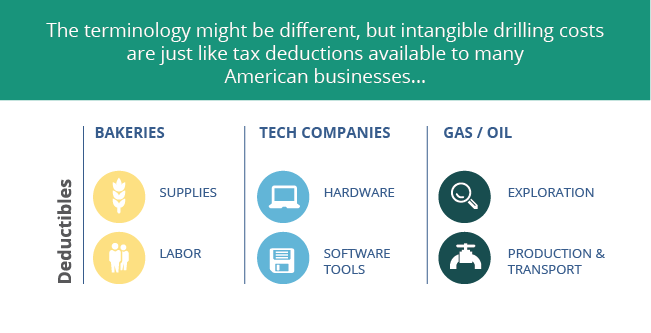

## Table of Contents

## What are Intangible Drilling Costs (IDCs)?

Intangible Drilling Costs (IDCs) are expenses that oil and gas companies incur when drilling a well, but these costs are not for physical items that you can touch. Instead, IDCs include things like labor, site preparation, and other services needed to drill the well. These costs are called "intangible" because they don't result in a tangible asset that can be sold or reused.

Oil and gas companies can deduct IDCs from their taxes right away, which helps them save money. This is different from tangible costs, like equipment, which can only be deducted over time. By being able to deduct IDCs immediately, companies can reduce their taxable income in the year they drill the well, making it easier to manage their finances and invest in more drilling projects.

## How do Intangible Drilling Costs differ from tangible drilling costs?

Intangible Drilling Costs (IDCs) and tangible drilling costs are two types of expenses that oil and gas companies have when they drill a well. IDCs are costs that you can't touch or see, like the money spent on workers, preparing the site, and other services needed to drill the well. These costs don't result in something physical that you can sell or use again. On the other hand, tangible drilling costs are for things you can touch, like drilling equipment, pipes, and other materials used in the drilling process. These items can be sold or reused, which makes them different from IDCs.

The way these costs are treated for taxes is also different. IDCs can be deducted from a company's taxes right away, in the same year they are spent. This means the company can lower its taxable income for that year, which helps them save money and invest in more drilling. Tangible drilling costs, however, can't be deducted all at once. Instead, they have to be deducted over time, usually over the life of the equipment or materials. This slower deduction process means that tangible costs don't help the company's finances as quickly as IDCs do.

## Why are Intangible Drilling Costs important in the oil and gas industry?

Intangible Drilling Costs (IDCs) are really important in the oil and gas industry because they help companies save money on their taxes. When a company drills a well, they spend a lot of money on things like workers, site preparation, and other services. These costs are called IDCs because you can't touch them, and they don't leave behind anything you can sell or reuse. The big advantage for oil and gas companies is that they can deduct these costs from their taxes right away, in the same year they spend the money. This means they can lower their taxable income for that year, which helps them keep more of their money and invest in more drilling projects.

IDCs also make it easier for companies to manage their finances. Drilling for oil and gas can be a risky business, and it costs a lot of money. By being able to deduct IDCs immediately, companies can reduce their financial risk. This is because they don't have to wait years to get the tax benefits from their drilling expenses. Instead, they can use the money they save on taxes to pay for other costs or to start new projects. This makes IDCs a key part of how oil and gas companies plan their budgets and keep their businesses running smoothly.

## Can you provide examples of Intangible Drilling Costs?

Intangible Drilling Costs (IDCs) are expenses that oil and gas companies have when they drill a well, but these costs are not for things you can touch. For example, the money spent on hiring workers to drill the well is an IDC. These workers might include drillers, geologists, and other experts who help with the drilling process. Another example of an IDC is the cost of preparing the drilling site. This can include clearing the land, building roads to the site, and setting up temporary offices or living quarters for the workers.

Other examples of IDCs include the costs of drilling mud, which is a special liquid used to cool the drill bit and carry away rock cuttings, and the costs of fuel and power needed to run the drilling equipment. These costs are considered intangible because they don't result in a physical item that can be sold or reused. By being able to deduct these costs from their taxes right away, oil and gas companies can save money and invest in more drilling projects.

## How are Intangible Drilling Costs accounted for in financial statements?

Intangible Drilling Costs (IDCs) are shown on a company's financial statements as expenses. When a company drills a well, they spend money on things like workers, site preparation, and other services. These costs are called IDCs because you can't touch them, and they don't leave behind anything you can sell or reuse. On the income statement, IDCs are listed as an expense in the year they are spent. This means the company can lower its taxable income for that year, which helps them save money and invest in more drilling projects.

On the balance sheet, IDCs don't show up as an asset because they don't result in something physical. Instead, they are treated as an expense that reduces the company's net income. This immediate expensing of IDCs helps oil and gas companies manage their finances better. By deducting these costs right away, companies can reduce their financial risk and use the money they save on taxes to pay for other costs or to start new projects.

## What are the tax implications of Intangible Drilling Costs for oil and gas companies?

Intangible Drilling Costs (IDCs) have important tax benefits for oil and gas companies. These costs, which include expenses like labor, site preparation, and other services needed to drill a well, can be deducted from the company's taxes in the same year they are spent. This means that the company can lower its taxable income for that year, which helps them save money. By being able to deduct these costs right away, oil and gas companies can reduce their financial risk and use the money they save on taxes to pay for other costs or to start new projects.

The ability to deduct IDCs immediately is different from how tangible drilling costs are treated. Tangible costs, like equipment and materials, have to be deducted over time, usually over the life of the equipment. This slower deduction process means that tangible costs don't help the company's finances as quickly as IDCs do. The immediate deduction of IDCs is a key part of how oil and gas companies plan their budgets and manage their finances, making it easier for them to invest in more drilling and keep their businesses running smoothly.

## How do regulations affect the treatment of Intangible Drilling Costs?

Regulations play a big role in how oil and gas companies can treat their Intangible Drilling Costs (IDCs). In the United States, the Internal Revenue Service (IRS) has rules that let companies deduct IDCs from their taxes right away. This helps companies save money because they can lower their taxable income in the year they spend the money on drilling. But, the rules can be different in other countries. Some places might not let companies deduct IDCs as quickly, or they might have different rules about what counts as an IDC.

These regulations can change over time, too. Governments might decide to change the tax laws to encourage more drilling or to raise more money from oil and gas companies. When the rules change, companies have to adjust how they handle their IDCs. This can affect their budgets and their plans for future drilling projects. So, it's important for oil and gas companies to keep up with the latest regulations to make sure they are following the rules and getting the most out of their tax benefits.

## What methods are used to estimate Intangible Drilling Costs before drilling begins?

Before drilling starts, oil and gas companies use different ways to guess how much they will spend on Intangible Drilling Costs (IDCs). One way is to look at past drilling projects. They check how much they spent on things like workers, site preparation, and other services in the past. This helps them make a good guess about how much they might spend on a new well. Another way is to talk to experts who know a lot about drilling. These experts can give advice on how much different parts of the drilling process might cost.

Companies also use special computer programs to help them estimate IDCs. These programs can take in a lot of information about the drilling site, the kind of well they want to drill, and other important details. The computer then uses this information to come up with a guess about how much the IDCs will be. By using these different methods, companies can get a pretty good idea of how much they will need to spend on IDCs before they start drilling. This helps them plan their budgets and make sure they have enough money to finish the project.

## How do Intangible Drilling Costs impact the overall economics of a drilling project?

Intangible Drilling Costs (IDCs) play a big role in the overall economics of a drilling project. These costs include things like paying workers, preparing the drilling site, and other services needed to drill a well. Since IDCs can be deducted from taxes right away, oil and gas companies can save a lot of money. This tax benefit helps lower the total cost of the project, making it more affordable for the company to drill. By reducing the financial risk, IDCs make it easier for companies to decide to start new drilling projects.

The ability to deduct IDCs immediately also helps companies manage their money better. When companies know they can get their tax benefits right away, they can use the money they save to pay for other costs or to start more drilling projects. This makes IDCs a key part of how oil and gas companies plan their budgets. Without the tax benefits from IDCs, drilling projects could be more expensive and riskier, which might make companies less likely to invest in new wells. So, IDCs have a big impact on whether a drilling project makes financial sense for a company.

## What are the challenges in managing and controlling Intangible Drilling Costs?

Managing and controlling Intangible Drilling Costs (IDCs) can be hard for oil and gas companies. One big challenge is that IDCs are for things you can't touch, like paying workers and preparing the drilling site. It's tough to keep track of these costs because they don't show up as physical items. Companies need to be careful to record all these expenses correctly so they can deduct them from their taxes. If they miss any costs or make mistakes, they might not get the full tax benefit they should.

Another challenge is that IDCs can change a lot from one project to another. The costs can be different depending on where the well is, how hard it is to drill, and other things. This makes it hard for companies to predict how much they will spend on IDCs before they start drilling. They have to use guesses based on past projects and expert advice, but these guesses might not always be right. If the actual costs are higher than expected, it can make the project more expensive and riskier for the company.

## How have Intangible Drilling Costs evolved with advancements in drilling technology?

As drilling technology has gotten better, Intangible Drilling Costs (IDCs) have changed a lot. New technology like better drilling rigs and computer programs can make some parts of drilling faster and cheaper. For example, using a special kind of drilling mud can help drill faster, which means less time paying workers. Also, new computer programs can help plan the drilling better, which can save money on site preparation and other services. But, using these new technologies can also add to IDCs because companies have to pay for training workers to use them and sometimes hiring experts to help.

Even though new technology can change IDCs, the basic idea of what counts as an IDC stays the same. IDCs are still costs for things you can't touch, like paying workers, preparing the site, and other services. The tax rules about deducting IDCs right away haven't changed much either. So, while the amounts and types of IDCs might be different because of new technology, oil and gas companies can still use these costs to save money on their taxes and manage their budgets better.

## What future trends might influence the nature and management of Intangible Drilling Costs?

In the future, new technology will keep changing how oil and gas companies handle Intangible Drilling Costs (IDCs). Things like better drilling rigs, smarter computer programs, and new ways to find oil and gas might make some parts of drilling cheaper and faster. This could mean less money spent on workers and site preparation, which are big parts of IDCs. But, using these new technologies might also add to IDCs because companies will need to train their workers and maybe hire experts to help. So, while the total amount of IDCs might change, the basic idea of what counts as an IDC will stay the same.

Another trend that could affect IDCs is changes in tax laws and regulations. Governments might decide to change the rules about how companies can deduct IDCs from their taxes. If the rules get stricter, it might be harder for companies to save money on their taxes, which could make drilling projects more expensive. On the other hand, if the rules get easier, companies might be able to save even more money. Keeping up with these changes will be important for oil and gas companies so they can plan their budgets and manage their IDCs well.

## What are some examples of IDC applications?

Intangible Drilling Costs (IDCs) play a crucial role in the financial strategy of oil and gas companies by allowing them to deduct expenses associated with non-tangible aspects of drilling. This section illustrates several examples and processes involved in the application of IDCs, highlighting their importance in the industry.

### Real-World Scenario: Exploration and Development

Consider a hypothetical company, "EcoDrill Inc.," which embarks on drilling a new exploratory well. The total cost incurred is $10 million; of this, $7 million falls under IDCs. These costs typically include wages for labor, site preparation, and any services related to the drilling operation, excluding the purchase of tangible equipment like rigs and drill bits. The remaining $3 million goes towards tangible costs. 

By declaring IDCs, EcoDrill Inc. can capitalize on immediate tax deductions against taxable income in the year these costs are incurred. This mechanism aids in improving cash flow by potentially reducing the taxable income significantly. Suppose the corporate tax rate is 21%; the immediate deduction on IDCs results in a tax saving of:

$$
\text{Tax Savings} = 7,000,000 \times 0.21 = 1,470,000
$$

### Process of Declaring IDCs

The declaration of IDCs involves detailed documentation and adherence to regulatory guidelines. Companies must categorize and report these costs accurately on their financial statements and tax returns. The Internal Revenue Service (IRS) in the U.S. provides specific guidelines for classifying expenses as IDCs. The steps involved include:

1. **Identification of Qualified Expenses**: Companies must first identify which expenses qualify as IDCs. These might include labor costs, ground clearing, and drilling fluids.

2. **Accurate Accounting**: Implement sound financial accounting practices to track these expenses separately from tangible drilling costs. This often involves using specialized accounting software tailored to the oil and gas sector.

3. **Tax Filing**: Prepare tax filings that reflect these deductions. This involves working with tax professionals who specialize in energy sector tax codes to ensure compliance. The IRS Form 1065, Schedule K-1, is typically used for partnerships declaring such expenses.

4. **Audit Preparedness**: Maintain detailed records and documentation to support IDC claims in case of an audit. This includes contracts, invoices, and cost allocation reports.

### Hypothetical Example: Enhanced Recovery Techniques

Another application of IDCs can be seen in a scenario where "GreenEnergy Corp." invests in enhanced oil recovery (EOR) techniques. The company decides to inject steam into an existing well to improve oil output. The costs associated with the design, engineering, and administrative work for the EOR project, amounting to $2 million, qualify as IDCs. 

By declaring these costs, GreenEnergy Corp. maximizes its immediate tax benefit, improving operational cash flow. In this example, the deduction directly supports reinvestment into further technological advancements or expansion projects, essential for maintaining competitive advantage.

These examples underscore the strategic significance of IDCs in managing the financials of oil and gas companies. By strategically applying these deductions, companies not only optimize their tax obligations but also enhance their capability to invest in future projects, thus sustaining operational viability.

## References & Further Reading

[1]: Minack, T., & Chezirgues, R. (2020). ["Taxation of the Extractive Industries."](https://www.elibrary.imf.org/view/book/9781475539660/9781475539660.xml) European Union. 

[2]: Jenkins, R. G., & Wright, S. (2014). ["The Financial Impact of Intangible Drilling Costs on Oil and Gas Company Valuation."](https://www.crfb.org/blogs/tax-break-down-intangible-drilling-costs) Journal of Applied Business and Economics.

[3]: Davidson, P., & Normann, R. (2008). ["Tax Policies and the Competitive Position of the Oil and Gas Industry."](https://www.taxnotes.com/featured-analysis/oil-and-gas-fiscal-policies-impact-oil-price-investment-and-production-trend/2020/10/09/2czcx) American International Law Review. 

[4]: Dichev, I. D. (2007). ["Measuring Cost of Equity Capital for Unlisted Start-Ups."](https://www.aeaweb.org/articles?id=10.1257/aer.97.1.386) Journal of Entrepreneurial Finance.

[5]: Musiał, W., Nash, P. H., & Narayan, P. K. (2015). ["Algorithmic Trading and Market Quality: Evidence from U.S. Stock Exchanges."](https://www.cambridge.org/core/journals/journal-of-financial-and-quantitative-analysis/article/abs/algorithmic-trading-and-market-quality-international-evidence/4B96E916E3E13AFF1DF9B5FCC188F4E0) Applied Economics Letters.