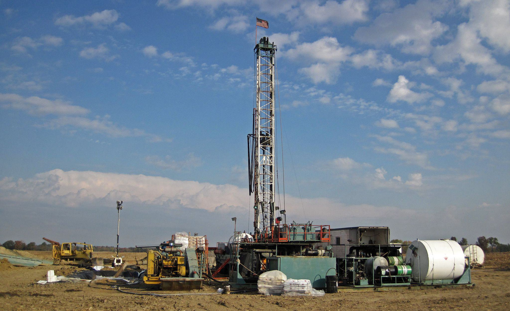

In contemporary society, oil and gas are essential components powering economies and daily life. This reliance underscores the importance of comprehending the financial frameworks that bolster these industries. One such framework is Intangible Drilling Costs (IDCs), which play a vital role, particularly in the U.S., by offering significant tax advantages that can influence operational decisions and profitability in oil and gas exploration.

IDCs encompass a range of costs associated with drilling, excluding tangible expenses like equipment. They include labor, chemicals, and any expenses necessary for making a well ready for production, yet do not have salvage value. Traditionally, these costs have been pivotal for oil and gas companies, enabling them to reduce taxable income significantly due to favorable IRS provisions permitting their full deduction in the year they are incurred. This taxation benefit often influences exploration intensities and financial structuring in the industry.



In parallel, advancements in technology have introduced algorithmic trading as a powerful tool in financial markets, optimizing portfolio returns through predictive analytics and automated decision-making processes. In the context of oil and gas, these algorithms can be designed to incorporate various data points, balancing traditional financial indicators with sector-specific information like IDCs. The interplay between IDCs and algorithmic trading presents a unique opportunity for oil and gas corporations to enhance financial efficiency, improve tax outcomes, and manage risk with precision.

The integration of IDCs with algorithmic trading not only modernizes financial approaches in the energy sector but also serves as a catalyst for innovation and strategic decision-making. Understanding these dynamics is crucial for stakeholders in navigating the ever-evolving landscape of global energy economics. This article aims to provide insights into the mechanisms and strategies that leverage Intangible Drilling Costs and algorithmic trading to optimize financial returns in the oil and gas industry.

## Table of Contents

## Understanding Intangible Drilling Costs (IDC)

Intangible Drilling Costs (IDCs) are defined as expenses associated with drilling oil and gas wells that do not result in the acquisition of physical assets. These costs encompass a range of expenses such as labor, fuel, repairs, construction, and other elements necessary for preparing and supporting the actual drilling process. IDCs are distinguished from tangible costs, which involve expenditures on physical equipment and properties like casing, wellheads, and machinery required for the drilling and extraction operations.

The primary characteristic of IDCs lies in their deductibility for tax purposes, which has made them a significant aspect of the oil and gas industry. Unlike tangible costs that are depreciated over time, IDCs can often be expensed immediately, providing substantial tax advantages to companies by reducing taxable income in the short term. This immediate expensing is crucial as it enhances cash flow, facilitating further investment in exploration and development activities.

In the historical context, the allowance for IDC deductions traces back to the early 20th century. The U.S. government, aiming to stimulate domestic energy production, implemented favorable tax treatments for the oil and gas sectors. The introduction of IDC deductions was part of these measures, intended to offset the high-risk nature of oil exploration and incentivize capital expenditure in the industry.

Under the U.S. Internal Revenue Code, IDCs are predominantly deductible in the year they are incurred. According to Section 263(c) of the code, taxpayers can elect to either deduct these expenses immediately or capitalize them. The immediate deductibility option allows companies to reduce their taxable income, thereby lowering their tax liabilities. This mechanism has been critical in shaping investment strategies within the industry.

Despite their financial benefits, IDC deductions have not been free from controversy. Critics argue that such incentives result in substantial revenue losses for the government and provide disproportionate advantages to large oil corporations. Debates have periodically emerged over whether these tax treatments align with broader economic and environmental policy goals.

In summary, IDCs play a vital role in the financial structure of the oil and gas industry by offering immediate tax advantages and fostering continued investment. Understanding their distinction from tangible costs and the historical motivations for their tax treatment provides insight into their enduring significance and the ongoing discussions surrounding their application.

## The Financial Implications of IDCs in Oil and Gas

Intangible Drilling Costs (IDCs) are a fundamental aspect of financial planning in the oil and gas industry. These costs encompass non-tangible expenses related to drilling wells, such as labor, fuel, and other related services that are necessary to make a well operational. For financial accounting purposes, IDCs can constitute a significant portion of the total drilling expenses, sometimes reaching up to 60-80% of these costs. This significant representation makes IDCs a focal point in financial strategies for oil and gas companies.

One of the primary financial benefits associated with IDCs is their tax deductibility. In the United States, oil and gas companies can elect to immediately expense their IDCs, allowing them to deduct these costs from their taxable income in the year they were incurred. This immediate expensing contrasts with tangible drilling costs, which must be capitalized and depreciated over time. This distinction between tangible and intangible costs can increase a company's cash flow by reducing its taxable income substantially in the initial years of investment, thus providing an efficient means of capital allocation.

The impact of IDC deductions on financial statements is profound. By reducing taxable income, companies can improve their net income and earnings per share (EPS) in the short term. However, from an investment analysis perspective, this short-term financial health must be evaluated alongside the long-term sustainability of such deductions. While advantageous, excessive reliance on these deductions can lead to inflated perceptions of financial stability, potentially masking the true economic performance of these firms over time.

Controversies and political debates surrounding IDCs primarily revolve around the perceived fiscal incentives offered to the oil and gas industry. Critics argue that these deductions amount to preferential treatment, fostering environmental concerns by encouraging continued fossil fuel exploration and extraction. Proponents, on the other hand, assert that these financial mechanisms are crucial for maintaining domestic energy production and that restricting them could undermine the industry's competitiveness globally.

Politically, the treatment of IDCs has been a topic of contention, particularly in debates regarding tax reform and climate change policies. Legislative changes could alter the landscape of IDC deductions, impacting both the financial statements of companies and the broader economic incentives associated with drilling activities. 

Overall, the financial implications of IDCs in oil and gas highlight a complex interaction between tax policy, corporate finance, and energy strategy, warranting careful consideration by stakeholders in both political and business spheres.

## Examples of IDC Applications

Intangible Drilling Costs (IDCs) play a crucial role in the financial strategy of oil and gas companies by allowing them to deduct expenses associated with non-tangible aspects of drilling. This section illustrates several examples and processes involved in the application of IDCs, highlighting their importance in the industry.

### Real-World Scenario: Exploration and Development

Consider a hypothetical company, "EcoDrill Inc.," which embarks on drilling a new exploratory well. The total cost incurred is $10 million; of this, $7 million falls under IDCs. These costs typically include wages for labor, site preparation, and any services related to the drilling operation, excluding the purchase of tangible equipment like rigs and drill bits. The remaining $3 million goes towards tangible costs. 

By declaring IDCs, EcoDrill Inc. can capitalize on immediate tax deductions against taxable income in the year these costs are incurred. This mechanism aids in improving cash flow by potentially reducing the taxable income significantly. Suppose the corporate tax rate is 21%; the immediate deduction on IDCs results in a tax saving of:

$$
\text{Tax Savings} = 7,000,000 \times 0.21 = 1,470,000
$$

### Process of Declaring IDCs

The declaration of IDCs involves detailed documentation and adherence to regulatory guidelines. Companies must categorize and report these costs accurately on their financial statements and tax returns. The Internal Revenue Service (IRS) in the U.S. provides specific guidelines for classifying expenses as IDCs. The steps involved include:

1. **Identification of Qualified Expenses**: Companies must first identify which expenses qualify as IDCs. These might include labor costs, ground clearing, and drilling fluids.

2. **Accurate Accounting**: Implement sound financial accounting practices to track these expenses separately from tangible drilling costs. This often involves using specialized accounting software tailored to the oil and gas sector.

3. **Tax Filing**: Prepare tax filings that reflect these deductions. This involves working with tax professionals who specialize in energy sector tax codes to ensure compliance. The IRS Form 1065, Schedule K-1, is typically used for partnerships declaring such expenses.

4. **Audit Preparedness**: Maintain detailed records and documentation to support IDC claims in case of an audit. This includes contracts, invoices, and cost allocation reports.

### Hypothetical Example: Enhanced Recovery Techniques

Another application of IDCs can be seen in a scenario where "GreenEnergy Corp." invests in enhanced oil recovery (EOR) techniques. The company decides to inject steam into an existing well to improve oil output. The costs associated with the design, engineering, and administrative work for the EOR project, amounting to $2 million, qualify as IDCs. 

By declaring these costs, GreenEnergy Corp. maximizes its immediate tax benefit, improving operational cash flow. In this example, the deduction directly supports reinvestment into further technological advancements or expansion projects, essential for maintaining competitive advantage.

These examples underscore the strategic significance of IDCs in managing the financials of oil and gas companies. By strategically applying these deductions, companies not only optimize their tax obligations but also enhance their capability to invest in future projects, thus sustaining operational viability.

## Algorithmic Trading in the Oil and Gas Sector

Algorithmic trading, commonly known as algo trading, refers to the use of computer algorithms to manage trading decisions and execute orders effectively in financial markets. This approach has significantly reshaped the landscape of modern trading due to its ability to process vast quantities of data at high speed, execute trades at optimal pricing, and minimize the impact of human emotions on trading.

In the oil and gas sector, algo trading plays a crucial role in managing and optimizing financial portfolios. These algorithms can analyze historical data, forecast price movements, and execute trades with high precision, ensuring that portfolio managers can capitalize on minute market inefficiencies. Given the high [volatility](/wiki/volatility-trading-strategies) and geopolitical sensitivity inherent in oil markets, [algorithmic trading](/wiki/algorithmic-trading) offers a vital tool for mitigating risks and enhancing returns.

Integrating Intangible Drilling Costs (IDCs) data into trading algorithms presents several advantages. IDCs, which include expenses related to drilling operations that cannot be recovered once spent, have significant tax implications and affect the financial dynamics of oil and gas entities. By incorporating IDC-related data, algorithms can more accurately model the financial position of these companies, adjusting investment strategies based on expected cost outlays and tax benefits.

For example, an algorithm could be programmed to adjust a portfolio's weightings in oil and gas stocks based on quarterly IDC reports. Python code for such an implementation might look as follows:

```python
def adjust_portfolio(holding, idc_projections):
    """
    Adjusts portfolio holdings based on IDC projections.

    :param holding: Dictionary of current holdings {company: percentage}
    :param idc_projections: Dictionary of IDC projections {company: projected_idc_value}
    :return: Adjusted holdings
    """
    total_idc_value = sum(idc_projections.values())

    # Adjust weightings inversely proportionally to projected IDCs
    for company, current_percentage in holding.items():
        idc_factor = idc_projections[company] / total_idc_value
        holding[company] = current_percentage * (1 - idc_factor)

    # Normalize holdings to sum to 100%
    total_percentage = sum(holding.values())
    for company in holding:
        holding[company] = (holding[company] / total_percentage) * 100

    return holding

# Example usage
current_holdings = {'CompanyA': 50, 'CompanyB': 30, 'CompanyC': 20}
idc_data = {'CompanyA': 150000, 'CompanyB': 100000, 'CompanyC': 50000}
adjusted_holdings = adjust_portfolio(current_holdings, idc_data)
```

Such strategies ensure that the portfolio adapts dynamically in accordance with IDC impacts, optimizing investment returns while maintaining tax efficiency. The advantage of this approach lies in the ability to continually refine investment strategies using real-time data inputs, thereby aligning financial decisions closely with business realities.

In summary, algorithmic trading equips oil and gas investors with refined tools for managing complex financial variables like IDCs. By embedding IDC data within trading strategies, firms can harness enhanced accuracy, optimized tax positioning, and ultimately, a more strategically aligned financial portfolio.

## Synergizing IDCs with Algo Trading Strategies

Algorithmic trading, a method that employs complex algorithms to automate and optimize trading strategies, can significantly enhance the financial benefits derived from Intangible Drilling Costs (IDCs) in the oil and gas sectors. By efficiently integrating technology and data analytics, companies can leverage algorithmic trading to maximize the tax advantages of IDCs and manage associated risks effectively.

IDCs are a substantial component of total drilling expenses in the oil and gas industry, often encompassing costs like labor, fuel, and drilling fluids. These expenses can be fully deducted in the year they are incurred, offering significant tax benefits. Algorithmic trading can help optimize these benefits by analyzing vast datasets and market conditions to make informed trading decisions, creating a synergy between tax deductions and financial investment strategies.

### Enhancing Financial Benefits through Technology

Technology and data analytics serve as the backbone of algorithmic trading, processing large quantities of data in real-time to identify market trends and trading opportunities. In the context of IDCs, these systems can analyze historical tax data, market conditions, and company performance metrics to develop predictive models that guide strategic trading decisions. By correlating IDC-related tax benefits with market performance, algorithms can optimize the timing and selection of trades, thereby increasing profitability.

For example, consider this Python code snippet that uses a simplified model to illustrate how algorithmic trading might be employed to maximize IDC tax benefits:

```python
import numpy as np
import pandas as pd

# Sample data: historical tax deductions and market prices
data = {'IDC_Tax_Deduction': [500000, 600000, 550000, 620000],
        'Market_Price': [50, 55, 53, 56]}
df = pd.DataFrame(data)

# Strategy: Invest more when tax deductions are higher
df['Investment'] = np.where(df['IDC_Tax_Deduction'] > df['IDC_Tax_Deduction'].mean(), 1.2, 0.8) * df['Market_Price']

# Calculate potential ROI
df['ROI'] = df['Investment'] * 0.05  # assuming a 5% return rate
print(df)
```

This example demonstrates a rudimentary strategy where investment levels are adjusted based on tax deduction trends, illustrating how algorithms can pinpoint optimal trading periods based on IDC fluctuations.

### Mitigating Risks with Algorithmic Trading

Although algorithmic trading offers numerous advantages, it is not without risks. Market volatility, algorithm errors, and unexpected regulatory changes can pose significant challenges. To mitigate these risks, companies can employ a variety of strategies within their algorithmic trading systems.

First, utilizing [machine learning](/wiki/machine-learning) models can enhance the adaptability of trading algorithms to changing market conditions. These models continuously refine themselves based on new data, reducing the likelihood of significant trading errors.

Second, risk management processes, such as stop-loss orders and automated portfolio rebalancing, can be integrated into trading algorithms to minimize potential losses. By establishing predefined thresholds, these systems can automatically liquidate positions or adjust investment strategies to handle adverse market movements.

Furthermore, rigorous [backtesting](/wiki/backtesting) and simulation of trading strategies under various market scenarios can provide insights into potential risks and allow for strategic adjustments before deployment in live trading environments.

In conclusion, algorithmic trading holds the potential to significantly amplify the financial benefits associated with IDCs by harnessing technology and data analytics. By optimizing trading decisions and effectively managing risks, companies can enhance their financial outcomes while taking full advantage of the tax benefits provided by IDCs.

## Future Perspectives

The evolution of Intangible Drilling Costs (IDCs) will likely be influenced by a combination of technological advancements and shifting economic dynamics within the global oil market. As renewable energy sources grow in prominence, the oil and gas industry faces pressures to optimize profitability from existing resources. IDCs, with their significant tax implications, remain a critical financial lever for firms navigating these pressures.

A key trend is the increasing integration of data analytics and technology in financial decision-making processes. The capability of algorithms to process large volumes of data in real-time is transforming many sectors, including energy. As the sophistication of algorithmic trading (algo trading) grows, its application in managing IDCs could become more prevalent. Such algorithms can leverage historical data and predictive analytics to identify optimal times for financial maneuvers related to IDCs, potentially enhancing tax benefits and financial outcomes for companies.

The future application of algo trading in energy markets, particularly concerning complex financial products like IDCs, may involve further sophistication. Algorithms could model various scenarios incorporating IDC data, market trends, and price volatility to optimize trading strategies. Machine learning and [artificial intelligence](/wiki/ai-artificial-intelligence) could contribute to more adaptive algorithms, capable of recalibrating strategies based on new data inputs. This evolution might also include integrating environmental, social, and governance ([ESG](/wiki/esg-investing)) criteria, as investors increasingly align portfolios with sustainability benchmarks.

However, potential regulatory changes present a significant [factor](/wiki/factor-investing) influencing the future of IDCs and algo trading. As governments worldwide scrutinize environmental impacts and subsidies benefitting fossil fuel industries, tax policies related to IDCs may come under revision. Regulations around algorithmic trading could also tighten, aiming to address market stability and transparency issues, which might require firms to adapt their strategies accordingly.

Anticipating these regulatory shifts will be crucial for energy companies and financial institutions utilizing algo trading. Proactive firms may develop adaptable financial frameworks capable of continuously assessing regulatory landscapes and optimizing IDC-related strategies in compliance with new legal standards. 

Overall, the convergence of financial innovation and regulatory adaptation will shape the leveraging of IDCs within the oil and gas sector, underlining the necessity for dynamic, informed approaches in an evolving market environment.

## Conclusion

Intangible Drilling Costs (IDCs) stand as a fundamental component in the fiscal management of the oil and gas industry, enabling operators to significantly reduce their taxable income through early cost deductions. This provision enhances the industry's cash flow, facilitating investment in new drilling ventures and contributing to the sector's overall economic vitality. IDCs serve as a bridge between the necessity for substantial initial investments and the long-term profitability of oil and gas projects, underlining their strategic importance in financial planning and execution within the sector.

Simultaneously, algorithmic trading emerges as a powerful instrument in optimizing financial performance across various industries, including energy. In the context of the oil and gas sector, the application of algorithmic trading can provide sophisticated data analysis, leading to more informed decision-making and risk management. By integrating IDC-related data into algorithmic models, companies can potentially maximize tax benefits while aligning trading activities with broader financial goals. Algorithmic trading systems can swiftly analyze market trends and respond with precision, offering a competitive edge in dynamic market environments.

The continuous exploration and adaptation of innovative financial strategies, particularly algorithmic trading, are encouraged to further amplify the advantages derived from IDCs. As the energy sector progresses, the fusion of tax-efficient approaches like IDCs with cutting-edge trading techniques promises to enhance financial outcomes and sustainability. Therefore, stakeholders should persist in leveraging technological advancements to refine their financial strategies, ensuring they capitalize on both current opportunities and future developments within the energy markets.

## References & Further Reading

[1]: Minack, T., & Chezirgues, R. (2020). ["Taxation of the Extractive Industries."](https://www.elibrary.imf.org/view/book/9781475539660/9781475539660.xml) European Union. 

[2]: Jenkins, R. G., & Wright, S. (2014). ["The Financial Impact of Intangible Drilling Costs on Oil and Gas Company Valuation."](https://www.crfb.org/blogs/tax-break-down-intangible-drilling-costs) Journal of Applied Business and Economics.

[3]: Davidson, P., & Normann, R. (2008). ["Tax Policies and the Competitive Position of the Oil and Gas Industry."](https://www.taxnotes.com/featured-analysis/oil-and-gas-fiscal-policies-impact-oil-price-investment-and-production-trend/2020/10/09/2czcx) American International Law Review. 

[4]: Dichev, I. D. (2007). ["Measuring Cost of Equity Capital for Unlisted Start-Ups."](https://www.aeaweb.org/articles?id=10.1257/aer.97.1.386) Journal of Entrepreneurial Finance.

[5]: Musiał, W., Nash, P. H., & Narayan, P. K. (2015). ["Algorithmic Trading and Market Quality: Evidence from U.S. Stock Exchanges."](https://www.cambridge.org/core/journals/journal-of-financial-and-quantitative-analysis/article/abs/algorithmic-trading-and-market-quality-international-evidence/4B96E916E3E13AFF1DF9B5FCC188F4E0) Applied Economics Letters.