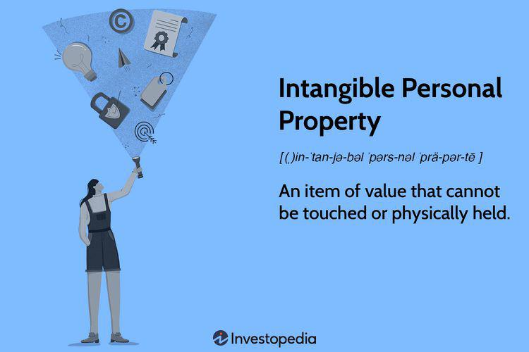

In the world of finance and trading, the concept of property extends well beyond tangible assets such as real estate or machinery. Property in this context encompasses both tangible and intangible personal assets, each with its own unique characteristics and significance. For investors, understanding the distinction between these two types of assets is crucial, as it impacts investment strategies, risk assessment, and valuation methods.

Tangible personal property consists of physical items that can be seen and touched, like vehicles, equipment, and inventory. These assets are typically valued based on their condition, market demand, and utility. In contrast, intangible personal property includes assets that lack a physical form but carry substantial value. Common examples are copyrights, patents, trademarks, and intellectual properties. These are often valued based on their potential to generate future income, their market position, and their legal protection.



This article aims to provide a comprehensive overview of different types of personal property, with a special focus on intangible assets. It examines how algorithmic trading—an increasingly prevalent tool in modern finance—intersects with these asset types. Algorithmic trading utilizes advanced mathematical models and high-speed computational power to make trading decisions, optimizing the management and valuation of both tangible and intangible assets.

Additionally, we will explore the implications of intangible property in real-world scenarios, highlighting its role in competitive advantage and business valuation. By the conclusion of this article, readers should have a clearer understanding of the dynamic nature of property in finance, the strategic value of intangible assets in investment portfolios, and the transformative role of algorithmic trading in asset management.

## Table of Contents

## Intangible Personal Property: Definition and Types

Intangible personal property represents assets that, while lacking a physical presence, hold significant value and contribute to a company's financial health. These assets are primarily categorized under intellectual properties, which include copyrights, patents, trademarks, trade secrets, and goodwill. 

Intellectual property rights provide legal recognition and protection of these non-physical assets. Copyrights grant the creator of original works exclusive rights to use and distribute them; this encompasses literary works, music, and software. Patents, on the other hand, protect inventors by providing them exclusive rights to their innovations for a specified period. Trademarks distinguish a company's goods or services from others by protecting logos, brand names, and symbols.

Trade secrets consist of confidential business information that provides a competitive edge, such as recipes, processes, or sales methods. Unlike patents, trade secrets are not registered with any government body, and their protection relies on maintaining their confidentiality. Goodwill represents the value of a business's reputation, encompassing customer loyalty and brand strength. It typically becomes apparent during mergers or acquisitions when a buyer spends more on a company than its tangible assets are worth.

The value of intangible assets plays a crucial role in corporate valuation and accounting. Methods such as the Relief from Royalty method, the excess earnings approach, and market or cost-based analyses are employed for valuation. Recognizing and managing these assets effectively is essential for sustaining competitive advantage and fostering innovation. However, their inherent non-physical nature complicates valuation and protection, challenging businesses to devise robust strategies to harness their potential fully.

## Examples of Intangible Property

Intangible assets, while not physically tangible, offer significant value to firms by enhancing competitive positioning and contributing to business valuation. Examples of such assets include software and trademarks, both of which have become integral to modern business operations.

Software, a prime example of intangible property, plays a critical role in the digital economy. Companies develop proprietary software to streamline operations, provide essential services, and create new products. For instance, software companies like Microsoft and Adobe generate considerable revenue from their proprietary software solutions, which are vital to users across various industries. The strategic development and implementation of software can provide a competitive advantage by improving efficiency, reducing costs, and creating unique customer experiences.

Trademarks, another form of intangible asset, are symbols, names, or slogans used to identify and distinguish products or services. They are crucial for brand recognition and loyalty, impacting a company’s market position. Strong trademarks like Apple’s logo or Nike’s “Just Do It” slogan are not only linked to the respective product quality but also [carry](/wiki/carry-trading) significant reputational value. These assets play a pivotal role in consumer perception and can influence purchasing decisions. The valuation of a trademark depends on its recognition, market reach, and ability to generate future economic benefits.

Beyond software and trademarks, intangible assets also encompass intellectual and reputational capital, which materially impact business valuation. Intellectual capital includes a company’s knowledge, experience, and intellectual property, such as patents. It is often evaluated by its potential to generate future profits and enhance innovation. Reputational capital, on the other hand, pertains to the perceived value of a company’s brand and its trustworthiness in the market, which can significantly affect investor interest and customer loyalty.

To quantitatively assess intellectual and reputational capital in business valuation, financial analysts may employ methodologies such as discounted cash flow analysis, which involves forecasting future cash flows generated by these intangible assets and discounting them back to their present value. Such rigorous analysis underscores the crucial role these non-physical assets play in shaping a company’s financial landscape.

In summary, intangible assets like software, trademarks, and intellectual capital form a critical part of a corporation's portfolio, serving as powerful tools for achieving competitive advantage and contributing significantly to overall business valuation.

## Tangible Personal Property vs. Intangible Personal Property

Tangible personal property and intangible personal property represent two fundamental categories of assets in financial and trading sectors. Tangible personal property includes physical items such as vehicles, machinery, and equipment. These assets are characterized by their material presence, making them susceptible to wear and tear, depreciation, and requiring physical maintenance. The benefits of possessing tangible assets include their straightforward valuation, which can often be appraised based on the market value or replacement cost method. For instance, a vehicle can be valued based on current market conditions and comparable sales data.

In contrast, intangible personal property comprises non-physical assets, which include intellectual property like patents, copyrights, trademarks, and trade secrets. These assets are intangible in nature, lacking a physical form yet holding significant value. Their valuation tends to be more complex, often involving methods like discounted cash flow (DCF) analysis or market comparables that take into account future income potential or the legal rights that accompany these assets.

The distinction between tangible and intangible assets carries implications for investment decisions and risk assessments. Tangible assets are usually considered less volatile and more secure due to their physical nature and easier baseline valuation. Investors typically acquire tangible assets for long-term stability and appreciable collateral value. However, they are also subject to risks such as theft, damage, and depreciation, which require insurance and ongoing maintenance expenditures.

Intangible assets, notwithstanding their lack of physical form, can offer substantial growth potential and competitive advantages, especially when they are proprietary technologies or brand-related. Nonetheless, the inherent risks involve legal challenges, obsolescence due to technological advancements, and fluctuations in market perceptions. Accurate valuation of intangible assets often requires expertise in intellectual property and market analysis. This complexity can influence investors to be cautious, factoring in the potential for high returns against the backdrop of uncertainty.

Ultimately, the decision to invest in either tangible or intangible personal property is guided by an investor's risk appetite and strategic objectives. While tangible assets provide a sense of security and tangible collateral, intangible assets offer innovation-driven growth opportunities and competitive differentiation in an increasingly digital economy. Understanding the nuances between these asset types is crucial for balanced portfolio management and informed financial planning.

## The Role of Algorithmic Trading in Asset Management

Algorithmic trading has become a cornerstone in the asset management industry, harnessing sophisticated technologies to optimize trading strategies and improve financial outcomes. Integrating [algorithmic trading](/wiki/algorithmic-trading) into asset management involves the use of automated and pre-programmed trading instructions, which can analyze multiple market conditions and execute orders at scale and speed unattainable by human traders.

Fintech and technological innovations play a significant role in this process. Big data analytics, [machine learning](/wiki/machine-learning), and [artificial intelligence](/wiki/ai-artificial-intelligence) have enabled these algorithms to evaluate vast datasets in real-time, identifying trading opportunities and predicting market trends. For example, machine learning algorithms can be trained to recognize patterns and anomalies in historical stock prices, adjusting trading strategies accordingly to maximize returns.

Python, an increasingly popular programming language in algorithmic trading, provides libraries such as pandas for data manipulation and TensorFlow for building machine learning models. Here's a simple illustration of a moving average crossover strategy using Python:

```python
import pandas as pd

# Load data
data = pd.read_csv('stock_data.csv')

# Calculate short and long moving averages
data['SMA_50'] = data['Close'].rolling(window=50).mean()
data['SMA_200'] = data['Close'].rolling(window=200).mean()

# Create a signal when short SMA crosses above long SMA
data['Signal'] = 0
data['Signal'][50:] = np.where(data['SMA_50'][50:] > data['SMA_200'][50:], 1, 0)

# Generate trading orders
data['Position'] = data['Signal'].diff()
```

This script calculates 50-day and 200-day simple moving averages (SMA) and generates a trading signal when the short-term average crosses above the long-term average, indicating potential buy opportunities. Such strategies, when enhanced with machine learning, can significantly contribute to decision-making processes in asset management.

The impact of algorithmic trading extends beyond strategy optimization. It has transformed property and asset valuation by ensuring more accurate and timely pricing models. High-frequency trading, a subset of algorithmic trading, provides [liquidity](/wiki/liquidity-risk-premium) and narrows bid-ask spreads, contributing to more efficient markets. The speed and precision of algorithmic trading reduce transaction costs and slippage, thus preserving value for investors.

Understanding asset [volatility](/wiki/volatility-trading-strategies) becomes integral when using algorithmic trading. By analyzing volatility metrics, algorithms can adjust exposure levels, thereby refining risk management practices. Precise assessment of property and asset values influences portfolio balancing and asset allocation decisions, underscoring the integral role algorithmic trading plays in modern finance.

In sum, algorithmic trading is reshaping asset management by enhancing the ability to discern market dynamics, automate execution processes, and recalibrate investment strategies, providing competitive advantages in a digital age where speed and data-driven insights dictate success.

## Special Considerations in the Evaluation of Intangible Assets

Evaluating intangible assets presents unique challenges due to their non-physical nature. These assets, which include patents, copyrights, trademarks, goodwill, and brand recognition, inherently lack the tangibility of physical property, complicating their assessment and management.

### Financial Implications and Tax Considerations

From a financial perspective, intangible assets often contribute significantly to a company's value despite their lack of physical form. The valuation of these assets is crucial, especially during mergers and acquisitions, affecting balance sheets and influencing investor perceptions. For instance, brands like Apple and Google have substantial brand value that plays a critical role in their overall market capitalization.

The tax implications of intangible assets are multifaceted. Different jurisdictions treat intangible assets in various ways, influencing how businesses account for them. For example, the U.S. Internal Revenue Service (IRS) defines certain intangibles under Section 197, allowing amortization over a 15-year period. This tax treatment can impact a company's financial strategy, influencing decisions on acquiring or developing intangibles. Additionally, international tax laws, such as those in the OECD's BEPS project, address the challenges of taxing intangibles, especially in cross-border transactions.

### Methodologies for Valuing Intangible Assets

Valuing intangible assets involves complex methodologies due to their abstract nature. Common approaches include:

1. **Cost Approach**: This method estimates the value of an intangible asset based on the cost to develop or replace it. It is often used for software and internally developed technologies, where the costs are quantifiable.

2. **Market Approach**: This involves comparing the intangible asset with similar assets that have been sold or licensed in the market. The challenge lies in finding comparable transactions, as intangibles, like proprietary technology or unique patents, often have unique characteristics.

3. **Income Approach**: This approach forecasts the future earnings attributable to the intangible asset and discounts them to present value. Techniques such as the Relief-from-Royalty method, which estimates the costs avoided by owning the asset, are commonly used. This method is particularly relevant for brands and other identifiable intangibles that directly influence revenue streams.

#### Example of Income Approach in Python

Here's a simple Python example using the Relief-from-Royalty method:

```python
def relief_from_royalty(revenue, royalty_rate, discount_rate, years):
    npv = 0
    for year in range(1, years + 1):
        royalty_savings = revenue * royalty_rate
        present_value = royalty_savings / ((1 + discount_rate) ** year)
        npv += present_value
    return npv

# Example values
projected_revenue = 5000000  # Projected annual revenue
royalty_rate = 0.05  # 5% royalty rate
discount_rate = 0.1  # 10% discount rate
project_years = 10  # 10-year projection

intangible_value = relief_from_royalty(projected_revenue, royalty_rate, discount_rate, project_years)
print("Estimated Intangible Asset Value:", intangible_value)
```

### Effective Management of Intangible Assets

Managing intangible assets requires a strategic approach to maximize their potential and mitigate risks. This includes regular reassessment of their value and relevance, considering technological advancements and market dynamics. Companies must also proactively protect these assets through intellectual property rights and monitor for potential infringement or misuse.

In conclusion, the evaluation and management of intangible assets demand a nuanced understanding of their unique characteristics and significant role in modern finance. Effective strategies can enhance their value contribution and ensure compliance with varying tax regulations, ultimately supporting a company's long-term growth and competitive advantage.

## Conclusion

Understanding different property types in finance, particularly distinguishing between tangible and intangible assets, is vital for informed investment strategies. Tangible assets are physical entities with a definite market presence, such as machinery or vehicles, offering investors a measure of security due to their physical nature. However, the growing significance of intangible assets has redefined modern investment portfolios, emphasizing their pivotal roles despite their non-physical nature. Intangible assets, such as patents, copyrights, and trademarks, hold substantial value by offering competitive advantages and facilitating revenue generation through innovation and branding.

In contemporary finance, intangible assets enhance the valuation of businesses, often surpassing the worth of tangible assets. The intellectual and reputational capital built around these intangible assets contributes significantly to the overall market value. Consequently, investors and asset managers must focus on evaluating these assets effectively, employing various methodologies to determine their true worth and potential risks.

Algorithmic trading has emerged as a transformative force in asset management, optimizing strategies through the use of advanced computational techniques and data analysis. This form of trading is particularly advantageous in managing diverse asset types, both tangible and intangible, by enhancing decision-making processes and improving market efficiency. Algorithmic trading's ability to process vast volumes of market data rapidly enables investors to identify opportunities and manage risks better, thus impacting property and asset valuation positively.

As the financial landscape continues to evolve with technological advancements, understanding the dynamics of both tangible and intangible properties and leveraging the capabilities of algorithmic trading is essential for ensuring robust asset management practices. This comprehension equips investors to adapt to market changes proactively, seizing opportunities while mitigating potential risks in an increasingly digitized financial environment.

## References & Further Reading

[1]: Damodaran, A. (2012). ["Investment Valuation: Tools and Techniques for Determining the Value of Any Asset"](https://books.google.com/books/about/Investment_Valuation.html?id=5SRHAAAAQBAJ). Wiley Finance.

[2]: Geist, M. (2019). ["Implementation of Algorithmic Trading Strategies in Python"](https://www.freecodecamp.org/news/algorithmic-trading-in-python/). Springer.

[3]: Hull, J. (2017). ["Options, Futures, and Other Derivatives"](https://elibrary.pearson.de/book/99.150005/9781292212920). Pearson.

[4]: Lhabitant, F.-S. (2004). ["Hedge Funds: Quantitative Insights"](https://www.wiley.com/en-us/Hedge+Funds%3A+Quantitative+Insights-p-9780470687772). John Wiley & Sons.

[5]: Myerson, R. B. (1991). ["Game Theory: Analysis of Conflict"](https://www.jstor.org/stable/j.ctvjsf522). Harvard University Press.

[6]: O'Regan, P., & Ghobar, P. (2020). ["Intellectual Property Valuation: A Survey of Industry Practices"](https://www.academia.edu/71499479/Recognition_and_Measurement_of_Intellectual_Resources_The_Accounting_Relating_Challenges_of_Intellectual_Capital). Wiley.

[7]: Segal-Horn, S., & Faulkner, D. (1999). ["The Dynamics of International Strategy"](https://archive.org/details/principlesofinte0000faul). Thomson Learning.