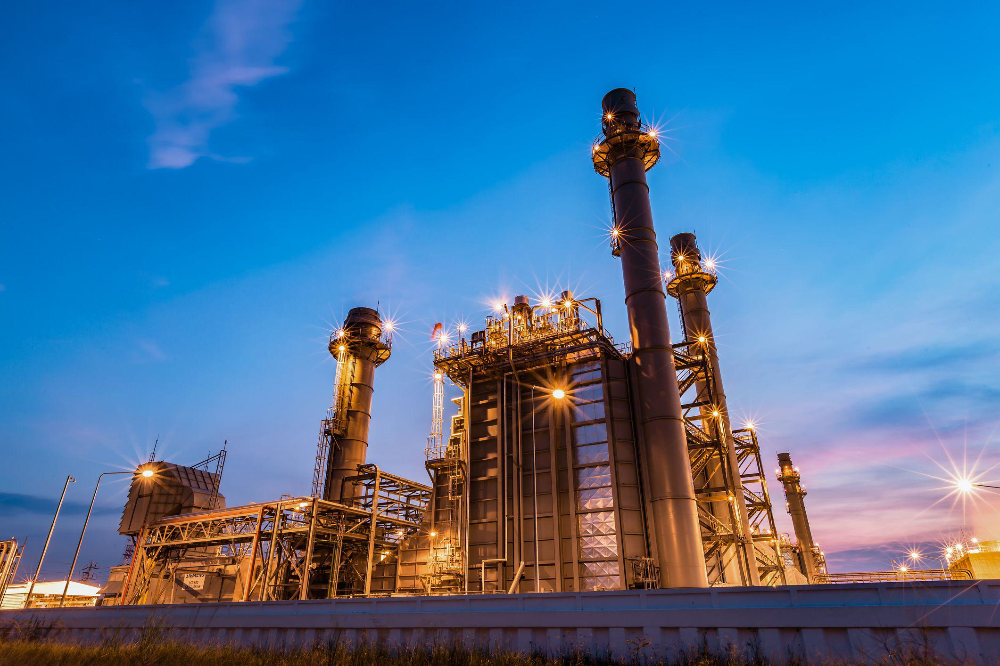

In this article, we examine the convergence of energy operations in the oil and gas industry with the strategic roles played by integrated energy companies. Within this context, the utilization of algorithmic trading emerges as a significant technological advancement, reshaping how the industry functions. As algorithmic trading continues to evolve rapidly, it is increasingly being applied to enhance efficiency, accuracy, and responsiveness to market dynamics in the oil and gas sector.

Integrated energy companies—those engaged across the entire energy value chain from exploration to distribution—stand at the forefront of this transformation. These companies, through their expansive operational scope, are ideally positioned to leverage algorithmic trading strategies to optimize their energy trading and operations. This article aims to highlight both the opportunities and challenges that integrated energy companies face in implementing algorithmic trading practices. By investigating their strategies and operations, we seek to provide a comprehensive overview of the potential benefits these innovations bring, as well as the inherent complexities and hurdles involved.



Through a detailed exploration of current practices and future trends, the article sheds light on how algorithmic trading is poised to influence the future direction of energy trading and broader energy operations. The integration of these technologies is set to redefine competitive dynamics in the industry, enabling companies to achieve greater operational efficiencies and strategic advantages in an increasingly volatile market environment.

## Table of Contents

## Understanding Integrated Oil and Gas Companies

Integrated oil and gas companies play a pivotal role in the energy industry by engaging in all stages of the oil and gas value chain. This involvement ranges from the initial exploration and production phases, through to the refinement and final distribution of oil and gas products. The comprehensive nature of these operations affords integrated firms several distinct advantages over those companies that focus solely on a single aspect of the oil and gas process.

Firstly, the structure of integrated oil and gas companies fosters diversified business models. By participating in multiple segments of the industry, these companies can create several revenue streams. This diversification helps mitigate the impacts of market volatility which can significantly affect the price and demand for oil and gas products. For example, when crude oil prices are low, the refining and marketing sectors often become more profitable as lower feedstock costs increase margins in these segments. Conversely, when prices are high, upstream operations such as exploration and production typically see greater profits.

In addition, integrated companies can exercise enhanced control over their operations. With oversight across many parts of the value chain, these firms can optimize supply chain logistics and manage costs more effectively. This control enables them to adapt quickly to changing market conditions and regulatory environments. For instance, ownership of both upstream and downstream assets allows these companies to manage the timing and scheduling of production operations in a way that optimizes overall supply chain efficiency.

Major industry players like Chevron, ExxonMobil, and BP exemplify the efficiencies gained through integration. These companies have developed complex, extensive networks that enable them to coordinate activities across different geographies and business units. Such coordination results in improved resilience against market shocks and cycles. An integrated company can, for example, offset the negative financial effects of a downturn in global oil prices by reaping the benefits of profitable downstream activities.

The integrated approach not only brings efficiency improvements but also facilitates innovation and investment in new technologies that can lead to sustainable energy solutions. By controlling several aspects of the oil and gas lifecycle, these companies are well-positioned to invest in research and development that can further enhance operational efficiencies and contribute to long-term sustainability goals.

In summary, the integration of operations across the oil and gas value chain enables companies to diversify their revenue streams, gain better control over operations, enhance their resilience to market changes, and invest in innovative solutions, thus maintaining a competitive edge in a dynamic industry landscape.

## The Role of Algorithmic Trading in the Oil and Gas Sector

Algorithmic trading refers to the use of complex algorithms to automate and optimize trading decisions in financial markets. These algorithms can process large volumes of data at high speed, enabling traders to respond swiftly to market fluctuations. In the context of the oil and gas industry, the application of [algorithmic trading](/wiki/algorithmic-trading) can significantly enhance a company's ability to react to market changes, thereby executing trades with increased efficiency and precision.

The integration of algorithmic trading in the oil and gas sector offers numerous advantages. One primary benefit is its capability to manage risk effectively. With market conditions often subject to rapid and unpredictable changes, algorithmic trading provides tools to adapt quickly, minimizing potential losses. By employing algorithms to analyze historical data and predict future price movements, companies can not only manage risk but also optimize their trading portfolios.

The algorithms used in this form of trading are sophisticated mathematical models designed to identify profitable trading opportunities. For example, they can incorporate financial indicators, market [volatility](/wiki/volatility-trading-strategies) measures, and statistical methods to predict price movements. This can be expressed in terms of a simple algorithmic model, such as a moving average crossover strategy, where the algorithm generates buy or sell signals based on short-term and long-term moving averages crossing each other. 

Moreover, algorithmic trading is a powerful tool for maximizing profits, especially in the face of volatile market conditions typical of the energy sector. Companies can leverage real-time market data to execute high-frequency trades, benefitting from even the smallest price fluctuations. This approach not only optimizes trading performance but also enhances market [liquidity](/wiki/liquidity-risk-premium), contributing to more stable market conditions.

The use of algorithmic trading also aids in the refinement of operational strategies. By utilizing various predictive analytics and models, integrated energy companies can make data-driven decisions that align with their overall business objectives. This strategic approach enables them to enhance their market intelligence, providing a competitive edge over companies that use traditional trading methods.

In summary, the role of algorithmic trading in the oil and gas industry is becoming increasingly essential. Its ability to automate trading processes, manage risks, and optimize portfolios makes it a critical component of modern energy trading strategies. As the industry continues to evolve, the application of algorithmic trading will likely play a pivotal role in shaping the future landscape of energy operations.

## Benefits of Algorithmic Trading for Integrated Energy Companies

Algorithmic trading offers several advantages for integrated energy companies looking to enhance their operational efficiency and financial performance. By streamlining operations and substantially reducing transaction costs, these companies can achieve a more competitive stance in volatile markets. 

One of the primary benefits of algorithmic trading is its ability to process vast amounts of real-time market data, facilitating informed decision-making. This access allows companies to swiftly react to market fluctuations and adjust their strategies accordingly. For instance, algorithms can analyze price patterns, trading volumes, and other key indicators to identify optimal trading opportunities. Such an approach significantly enhances market intelligence and sharpens operational strategies.

Algorithmic trading also plays a crucial role in risk management. With its predictive analytics and scenario modeling capabilities, it helps firms anticipate and mitigate potential risks. Predictive analytics uses statistical algorithms and [machine learning](/wiki/machine-learning) techniques to forecast future trends from existing data. For example, by examining historical price data and using predictive models, companies can estimate future price movements and adjust their positions to minimize risks. Scenario modeling can simulate various market conditions to test the resilience of trading strategies against unforeseen events, further strengthening risk management frameworks.

In summary, algorithmic trading equips integrated energy companies with the tools necessary to operate more efficiently and remain adaptive in a dynamic market environment. By leveraging real-time data and advanced analytics, these firms can improve decision-making, optimize risk management, and ultimately enhance their market position.

## Challenges and Considerations

Adopting algorithmic trading in the oil and gas industry brings distinct challenges alongside its numerous advantages. One primary concern lies in the technological infrastructure required for implementing and maintaining these systems. Algorithmic trading necessitates robust and sophisticated infrastructure to handle real-time data processing, complex computations, and rapid execution of trades. This infrastructure includes high-speed internet and servers capable of running complex algorithms effectively. Investing in such technology is essential for companies to fully leverage the benefits of algorithmic trading.

Another significant challenge is regulatory compliance. The financial markets, particularly those dealing with commodities like oil and gas, are subject to stringent regulations intended to maintain market integrity and prevent manipulation. Companies must ensure that their algorithmic trading systems adhere to these regulations, which might require significant adjustments to their operations and trading strategies.

Moreover, companies must invest not only in technology but also in skilled personnel. Professionals with expertise in both trading and technology are required to develop, implement, and manage algorithmic trading systems. This includes data scientists, software developers, and traders who understand the intricacies of the oil and gas markets. These professionals play a critical role in the continual updating and optimization of algorithmic systems to adapt to changing market conditions.

Protecting against system failures is another critical consideration. Given the nature of algorithmic trading, even minor technical glitches can lead to significant financial losses. Companies must implement fail-safes and redundancy systems to minimize the risk of system outages or failures. Regular testing, system audits, and the development of contingency plans are vital to ensure the resilience of trading systems.

Integrating algorithmic trading systems into existing operations can also pose substantial challenges due to their complexity. Existing legacy systems may not be compatible with new technology, requiring companies to undergo costly and time-consuming overhauls of their operational frameworks. Additionally, striking a balance between automation and human oversight is crucial, as reliance solely on automated systems without human intervention can lead to oversight of nuanced market dynamics.

In conclusion, while algorithmic trading offers substantial advantages for integrated energy companies, addressing these challenges is essential for successful implementation. Companies must commit to significant investments in technology and human capital, alongside developing strategies to manage system complexities and regulatory requirements, to fully capitalize on the benefits of algorithmic trading in the oil and gas sector.

## Case Studies: Success Stories and Lessons Learned

Analyzing successful case studies from major integrated energy companies like Shell and BP provides valuable insights into the effective implementation of algorithmic trading within the oil and gas sector. These companies have demonstrated the potential of leveraging advanced trading technologies for achieving superior market positioning and enhanced financial returns.

### Shell's Approach

Shell has been at the forefront of integrating algorithmic trading systems to optimize its trading strategies. By employing sophisticated algorithms, Shell has been able to process vast amounts of market data in real-time, enabling rapid decision-making and efficient execution of trades. This capability has allowed the company to better manage its exposure to volatile market conditions and improve overall profitability.

A key component of Shell's strategy has been its investment in technology and talent. By developing an in-house trading platform and continuously updating its technological infrastructure, Shell ensures that its systems remain capable of adapting to evolving market trends. Furthermore, the company has focused on recruiting and training skilled personnel capable of managing complex algorithmic systems, thereby enhancing its competitive advantage.

### BP's Strategic Investments

BP, another major player in the energy sector, has also capitalized on algorithmic trading to improve its market position. BP has strategically invested in [artificial intelligence](/wiki/ai-artificial-intelligence) (AI) and machine learning (ML) capabilities to augment its trading operations. These technologies facilitate predictive analytics, enabling BP to anticipate market movements and adjust its trading strategies accordingly.

By adopting algorithmic trading, BP has reduced transaction costs and improved the accuracy of its trades. This has been achieved through the automation of routine tasks, allowing traders to focus on higher-level decision-making processes. Additionally, BP has emphasized the importance of robust risk management practices, integrating scenario modeling and stress testing into its algorithmic trading framework to mitigate risks associated with market volatility.

### Lessons Learned

Both Shell and BP serve as examples of how integrated energy companies can successfully implement algorithmic trading systems. Key lessons from these case studies include:

1. **Continuous Innovation**: The rapidly changing landscape of global energy markets necessitates ongoing investment in technology and capabilities. Companies must prioritize the development and enhancement of their algorithmic trading systems to stay competitive.

2. **Adaptation to Market Trends**: Successful implementation of algorithmic trading requires a keen understanding of market dynamics and the ability to quickly adapt to emerging trends. This involves leveraging AI and ML to enhance the precision of trading activities and inform strategic decisions.

3. **Human Capital Development**: While technology plays a crucial role, the importance of skilled personnel cannot be overlooked. Companies must invest in training programs to ensure their workforce possesses the expertise required to manage complex trading systems and derive maximum value from algorithmic trading.

These examples underscore the potential benefits of adopting algorithmic trading in the oil and gas industry and highlight the critical factors that contribute to success in this domain.

## The Future of Algorithmic Trading in Energy Operations

The future of algorithmic trading in energy operations is closely tied to advancements in artificial intelligence (AI) and machine learning (ML). These technologies are poised to revolutionize trading strategies by providing enhanced predictive analytics, real-time market data processing, and automated decision-making capabilities. The integration of AI and ML in algorithmic trading systems enables more accurate forecasting of market trends and price movements, thereby improving the precision and profitability of trades.

Key to navigating the complexities of global energy markets is the continued integration of digital solutions. AI-driven algorithms can process vast amounts of data, identifying patterns and correlations that might be invisible to human traders. Machine learning models, particularly those employing [deep learning](/wiki/deep-learning) techniques, can refine these predictions over time, adapting to new data and evolving market conditions. For example, using historical trading data, a [neural network](/wiki/neural-network) can be trained to predict future energy prices or optimize trading strategies by minimizing losses and maximizing gains.

A simple Python implementation of a machine learning model for predicting prices might look like this:

```python
from sklearn.model_selection import train_test_split
from sklearn.linear_model import LinearRegression
import pandas as pd

# Load dataset (example dataset with 'features' and 'prices')
data = pd.read_csv('energy_market_data.csv')
X = data[['feature1', 'feature2', 'feature3']]  # example features
y = data['prices']

# Split the dataset into training and testing sets
X_train, X_test, y_train, y_test = train_test_split(X, y, test_size=0.2, random_state=42)

# Initialize and train the linear regression model
model = LinearRegression()
model.fit(X_train, y_train)

# Make predictions
predictions = model.predict(X_test)

# Evaluate the model
print("Model Coefficients:", model.coef_)
print("Model Intercept:", model.intercept_)
```

This simple linear regression model serves as a foundational example of how machine learning can be applied to forecast energy prices. In practice, more complex models, such as deep neural networks or ensemble methods, could be used for higher accuracy and reliability.

Embracing these technologies provides integrated energy companies with a strategic advantage, positioning them at the forefront of innovation. The ability to rapidly adapt to market fluctuations and anticipate trends allows these companies to optimize their operations and financial performance. As the sector evolves, the adoption of AI and ML in algorithmic trading is likely to be a critical differentiator, offering the potential for significant gains in market share and efficiency. Integrating these digital solutions into existing frameworks will be crucial for companies seeking to remain competitive in a dynamic and often unpredictable energy landscape.

## Conclusion

The convergence of energy operations, integrated energy companies, and algorithmic trading signifies a pivotal transformation in the oil and gas industry. This integration fosters reshaping traditional practices through enhanced efficiency and precision. As integrated energy companies adopt algorithmic trading, the potential benefits are profound, offering both competitive advantages and operational efficiencies. Algorithmic trading allows these companies to respond swiftly and effectively to market fluctuations, optimizing strategies and minimizing costs.

Careful implementation of algorithmic trading systems is essential to capitalizing on these potential benefits. Companies must focus on developing robust technological infrastructures and agile strategies that can swiftly adapt to the changing dynamics of global energy markets. This adaptability, coupled with the ability to leverage real-time data, empowers companies to make informed decisions, ultimately leading to improved risk management and profitability.

Moreover, by embracing technological advancements such as artificial intelligence and machine learning, integrated energy companies can position themselves at the forefront of industry innovation. These technologies can enhance algorithmic trading strategies, allowing companies to navigate complex market scenarios with greater accuracy and foresight. Sustained growth in a competitive landscape requires continuous innovation and the willingness to embrace emerging technologies.

In conclusion, the strategic adoption of algorithmic trading by integrated energy companies marks a significant evolution in the operational framework within the oil and gas sector. By prioritizing adaptability and leveraging cutting-edge technologies, these companies can secure their position as leaders in an increasingly dynamic marketplace, ensuring their growth and success in the future.

## References & Further Reading

[1]: Jha, M. (2020). ["Algorithmic Trading in Oil Markets: An Overview and Future Prospects."](https://www.researchgate.net/publication/378548435_Algorithmic_Trading_and_AI_A_Review_of_Strategies_and_Market_Impact) Energy Economics, 91.

[2]: Tilford, C., & Wong, J. (2019). ["Big Oil Turns to Big Data for Better Energy Trading."](https://www.researchgate.net/profile/Wilson-Wong/publication/362544059_Competing_perspectives_on_the_Big_Data_revolution_a_typology_of_applications_in_public_policy/links/62f33e3888b83e7320c09cec/Competing-perspectives-on-the-Big-Data-revolution-a-typology-of-applications-in-public-policy.pdf?_sg%5B0%5D=started_experiment_milestone&origin=journalDetail&_rtd=e30%3D) Financial Times.

[3]: Engle, R.F. (2001). ["GARCH 101: The Use of ARCH/GARCH Models in Applied Econometrics."](https://www.aeaweb.org/articles?id=10.1257/jep.15.4.157) Journal of Economic Perspectives, 15(4), 157-168.

[4]: Lopez de Prado, M. (2018). ["Advances in Financial Machine Learning"](https://www.amazon.com/Advances-Financial-Machine-Learning-Marcos/dp/1119482089). Wiley.

[5]: Chan, E.P. (2008). ["Quantitative Trading: How to Build Your Own Algorithmic Trading Business."](https://github.com/ftvision/quant_trading_echan_book) Wiley.

[6]: Aronson, D.R. (2007). ["Evidence-Based Technical Analysis: Applying the Scientific Method and Statistical Inference to Trading Signals."](https://onlinelibrary.wiley.com/doi/pdf/10.1002/9781118268315.fmatter) Wiley.

[7]: Jansen, S. (2018). ["Machine Learning for Algorithmic Trading."](https://github.com/stefan-jansen/machine-learning-for-trading) Packt Publishing.