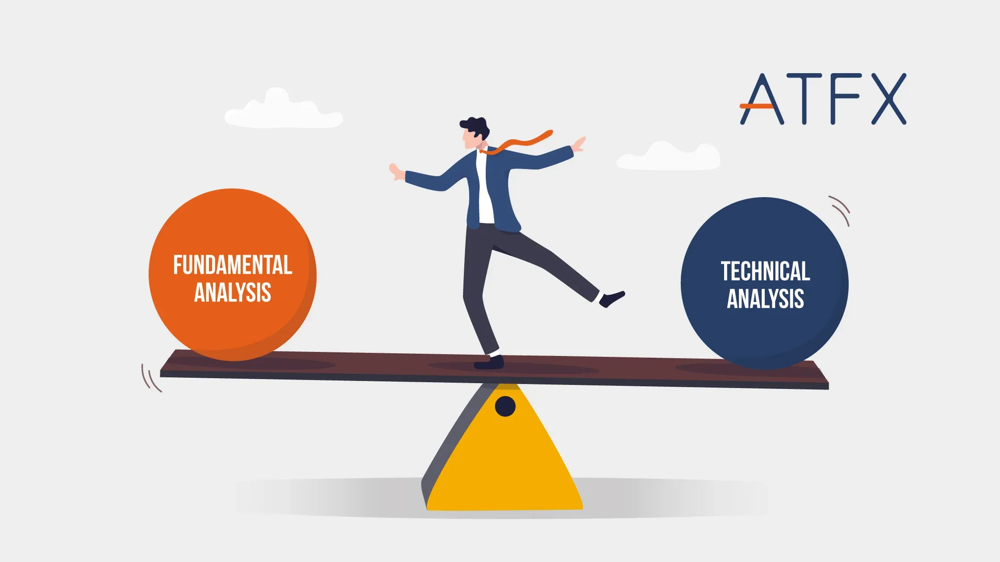

## Table of Contents

## What is technical analysis and how does it differ from fundamental analysis?

Technical analysis is a way to look at the stock market by studying past price movements and trading volumes. People who use technical analysis believe that by looking at charts and patterns, they can predict what the price of a stock will do next. They use tools like moving averages, trend lines, and other indicators to help them make decisions about when to buy or sell a stock. It's all about finding patterns in the data and using those patterns to make guesses about future price movements.

On the other hand, fundamental analysis is a different approach that focuses on the actual value of a company. Instead of looking at charts and patterns, people who use fundamental analysis look at things like the company's earnings, its financial health, and the overall economy. They try to figure out if a stock is a good buy by understanding how much the company is really worth. This method is more about understanding the business itself and less about predicting short-term price movements based on past data.

In summary, technical analysis and fundamental analysis are two different ways to make decisions about buying and selling stocks. Technical analysis is more about using historical data and patterns to predict future prices, while fundamental analysis is about understanding the true value of a company based on its financials and other factors. Both methods have their own strengths and can be useful depending on what you're trying to achieve in the stock market.

## Why is it important to integrate technical and fundamental analysis in trading or investing?

Integrating technical and fundamental analysis in trading or investing is important because it gives you a more complete picture of the market. Technical analysis helps you see the short-term trends and patterns in a stock's price movement. This can tell you when might be a good time to buy or sell based on what's happening right now. On the other hand, fundamental analysis helps you understand the long-term value of a company. By looking at a company's financial health and future growth potential, you can make more informed decisions about whether a stock is a good investment for the long haul.

Using both methods together can help you make better decisions. For example, if your fundamental analysis shows that a company is strong and likely to grow, but the technical analysis shows that the stock price is currently too high, you might decide to wait for a better entry point. Or, if the technical analysis shows a good buying opportunity, but the fundamental analysis suggests the company is not doing well, you might decide to avoid that stock altogether. By combining the insights from both approaches, you can balance short-term opportunities with long-term investment goals, leading to a more successful trading or investing strategy.

## What are the basic tools used in technical analysis?

Technical analysis uses a bunch of tools to help people understand what's happening with stock prices. One of the most common tools is the moving average, which is just a way to smooth out price data over time. It helps you see the overall trend by averaging out the ups and downs. Another tool is the Relative Strength Index (RSI), which tells you if a stock is overbought or oversold. This can help you figure out if it's a good time to buy or sell. Trend lines are also important; they're just lines drawn on a chart to show the direction of the price movement, making it easier to see if the stock is going up, down, or staying the same.

Another set of tools includes chart patterns, like head and shoulders or double tops and bottoms. These patterns can signal when a stock might change direction. Volume is another key tool; it shows how many shares are being traded and can help confirm if a price move is strong or weak. Lastly, there are indicators like the Moving Average Convergence Divergence (MACD), which can help you spot changes in the strength, direction, momentum, and duration of a trend. All these tools together help traders make sense of the market and decide when to buy or sell.

By using these tools, people can get a better idea of what might happen next with a stock's price. It's like putting together pieces of a puzzle to see the bigger picture. While no tool can predict the future perfectly, they can give you clues and help you make smarter decisions based on what's happening right now.

## How can fundamental analysis be applied to evaluate a company's financial health?

Fundamental analysis helps you figure out how healthy a company is by looking at its financial statements. You start by checking out the company's income statement, which tells you how much money the company made and how much it spent. If the company is making more money than it's spending, that's a good sign. You also look at the balance sheet, which shows what the company owns and what it owes. If the company has more assets than liabilities, it's in a good spot. Lastly, the cash flow statement shows how money is moving in and out of the company. If the company has positive cash flow, it means it's bringing in more money than it's using, which is another good sign.

Another part of fundamental analysis is looking at ratios that give you a quick snapshot of the company's financial health. For example, the debt-to-equity ratio tells you how much the company is borrowing compared to what the owners have put in. A lower ratio is usually better because it means the company isn't relying too much on debt. The price-to-earnings (P/E) ratio compares the stock price to how much money the company is making. If the P/E ratio is low, the stock might be a good buy because it's cheaper compared to the company's earnings. By putting all this information together, you can get a good idea of whether the company is strong and if its stock is a good investment.

## What are some common indicators used in technical analysis and how do they work?

Technical analysis uses different indicators to help traders understand what's happening with stock prices. One common indicator is the moving average, which is just a way to smooth out price changes over time. It helps you see the overall trend by averaging the prices over a certain period, like 50 or 200 days. If the stock price is above the moving average, it might be a good time to buy because the trend is going up. If it's below, it might be a good time to sell because the trend is going down. Another popular indicator is the Relative Strength Index (RSI), which measures how fast the price is moving. If the RSI is over 70, it means the stock might be overbought and could go down soon. If it's under 30, it might be oversold and could go up.

Another important indicator is the Moving Average Convergence Divergence (MACD), which helps you see changes in the strength and direction of a trend. It does this by comparing two moving averages and showing the difference as a line on a chart. When the MACD line crosses above the signal line, it's a sign that the stock price might go up, and when it crosses below, it might go down. Volume is also a key indicator because it shows how many shares are being traded. If the price goes up with high volume, it's a strong sign that the trend might continue. If the price goes up but the volume is low, the trend might not last long. By using these indicators, traders can get a better idea of what might happen next with a stock's price and make smarter decisions about when to buy or sell.

## How can fundamental analysis help in identifying undervalued or overvalued stocks?

Fundamental analysis helps you find out if a stock is undervalued or overvalued by looking at the company's financials and comparing them to the stock's current price. You start by checking the company's earnings, which is how much money it makes. If the company is making a lot of money but the stock price is low, the stock might be undervalued. On the other hand, if the company isn't making much money but the stock price is high, the stock might be overvalued. You also look at the company's assets and liabilities. If the company has a lot of valuable stuff and not much debt, it might be worth more than its current stock price suggests.

Another way fundamental analysis helps is by using ratios like the price-to-earnings (P/E) ratio. This ratio compares the stock's price to how much money the company is making. If the P/E ratio is lower than the average for similar companies, the stock might be undervalued. If it's higher, the stock might be overvalued. By putting all this information together, you can get a good idea of whether the stock's price is fair or if it's a good time to buy or sell. Fundamental analysis gives you a deeper understanding of the company's true value, helping you make smarter investment decisions.

## What are the key financial ratios to consider in fundamental analysis?

When doing fundamental analysis, there are several key financial ratios you should look at. One important ratio is the price-to-earnings (P/E) ratio, which compares the stock's price to how much money the company is making. A low P/E ratio might mean the stock is undervalued, while a high P/E ratio might mean it's overvalued. Another useful ratio is the debt-to-equity ratio, which shows how much the company is borrowing compared to what the owners have put in. A lower debt-to-equity ratio is usually better because it means the company isn't relying too much on debt. The price-to-book (P/B) ratio is also important; it compares the stock's price to the company's net assets. If the P/B ratio is low, it might mean the stock is a good buy because the company's assets are worth more than its stock price.

Another key ratio is the return on equity (ROE), which tells you how well the company is using the money that shareholders have invested. A high ROE means the company is making good use of the money and could be a good investment. The current ratio is also important; it shows if the company can pay its short-term debts with its current assets. A current ratio over 1 is good because it means the company has enough money to cover its debts. Lastly, the dividend yield tells you how much money you can expect to get back from the company in the form of dividends. A higher dividend yield might mean the stock is a good investment if you're looking for regular income. By looking at these ratios, you can get a good idea of the company's financial health and decide if the stock is a good buy.

## How can technical analysis help in determining the right entry and exit points for trades?

Technical analysis helps you figure out the best times to buy and sell stocks by looking at charts and patterns. It uses tools like moving averages, which smooth out price changes over time. If the stock price goes above the moving average, it might be a good time to buy because the trend is going up. If the price goes below the moving average, it might be a good time to sell because the trend is going down. Another tool is the Relative Strength Index (RSI), which tells you if a stock is overbought or oversold. If the RSI is over 70, the stock might be too expensive and could go down soon, so you might want to sell. If it's under 30, the stock might be a good buy because it could go up.

Another way technical analysis helps is by looking at chart patterns and volume. Patterns like head and shoulders or double tops and bottoms can signal when a stock might change direction. If you see these patterns, you can decide to buy or sell based on what the pattern is telling you. Volume is also important because it shows how many shares are being traded. If the price goes up with high volume, it's a strong sign that the trend might continue, so you might want to buy. If the price goes up but the volume is low, the trend might not last long, so you might want to wait before buying. By using these tools and watching the charts, you can find the best times to enter and exit trades.

## What are the limitations of using only technical analysis or only fundamental analysis?

Using only technical analysis can be limiting because it focuses just on past price movements and patterns. It doesn't tell you anything about the company itself, like how much money it's making or if it's in good financial shape. So, you might miss out on important information that could affect the stock's value in the long run. For example, if a company is doing poorly but the stock price looks good based on technical analysis, you might buy the stock and lose money when the company's problems come to light. Technical analysis is great for figuring out when to buy or sell based on short-term trends, but it doesn't give you the full picture of the company's health.

On the other hand, using only fundamental analysis has its own limitations. It gives you a lot of information about the company's financial health and future growth potential, but it doesn't help you time your trades well. You might know that a stock is a good buy based on the company's earnings and assets, but if you don't use technical analysis to find the right time to buy, you could end up buying at a high price and not making as much money as you could. Fundamental analysis is great for understanding the true value of a company, but it doesn't help you take advantage of short-term price movements. That's why using both types of analysis together can give you a more complete view of the market and help you make better investment decisions.

## How can an investor combine both analyses to create a comprehensive investment strategy?

An investor can create a comprehensive investment strategy by combining technical and fundamental analysis. First, you use fundamental analysis to find out if a company is strong and worth investing in. You look at things like the company's earnings, how much it owes, and how much it owns. If the company looks good, you might decide it's a good investment for the long term. But, you don't want to buy the stock just yet because the price might be too high right now. That's where technical analysis comes in. You use it to watch the stock's price and see when it might be a good time to buy. You look at moving averages, chart patterns, and other indicators to find the best entry point. By combining both types of analysis, you make sure you're investing in a strong company at a good price.

Once you've bought the stock, you can keep using both analyses to decide when to sell. Fundamental analysis helps you keep an eye on the company's health over time. If the company starts doing worse, you might decide to sell. Technical analysis helps you find the best time to sell by watching the stock's price and volume. If the price starts to go down and the technical indicators suggest a trend change, you can sell before the price drops too much. By using both technical and fundamental analysis together, you get a full picture of the stock's value and its price movements. This helps you make smarter decisions about when to buy and sell, leading to a more successful investment strategy.

## What are advanced techniques in technical analysis that can be integrated with fundamental insights?

Advanced techniques in technical analysis can give you even more tools to understand what's happening with a stock's price. One of these techniques is using the Fibonacci retracement levels, which help you see where the price might go next based on past movements. You draw lines on the chart at certain percentages, like 38.2%, 50%, and 61.8%, to find out where the price might stop or turn around. Another advanced tool is the Elliott Wave Theory, which looks at how prices move in waves. It can help you predict where the price might go by understanding the pattern of these waves. By using these advanced techniques, you can get a better idea of when to buy or sell a stock based on its price movements.

You can make your investment strategy even better by combining these advanced technical analysis techniques with fundamental insights. For example, if your fundamental analysis shows that a company is strong and likely to grow, you can use Fibonacci retracement levels to find a good time to buy the stock when its price is low. Or, if the Elliott Wave Theory suggests that the stock's price is about to go up, you can check the company's financials to make sure it's still a good investment. By putting both types of analysis together, you get a fuller picture of the stock's value and its price movements. This helps you make smarter decisions about when to buy and sell, leading to a more successful investment strategy.

## How can one evaluate the effectiveness of integrating technical and fundamental analysis in their investment decisions?

To evaluate how well you're doing by using both technical and fundamental analysis, you need to look at your investment results over time. Start by checking if your investments are making money. If you're buying stocks at good prices based on technical analysis and those stocks are from strong companies according to fundamental analysis, you should see your portfolio grow. Also, look at how often you're making the right decisions. If you're usually buying at the right times and selling at the right times, that's a good sign that your strategy is working. Keep track of your wins and losses to see if you're getting better at picking the right moments to trade.

Another way to see if your strategy is effective is by comparing it to other ways of investing. If you're doing better than if you just picked stocks randomly or followed a simple index fund, then combining technical and fundamental analysis is probably helping you. It's also important to think about how much time and effort you're putting into your analysis. If you're spending a lot of time but not seeing better results than simpler methods, you might need to adjust your approach. By looking at these things, you can figure out if integrating technical and fundamental analysis is making your investment decisions more successful.

## What is Exploring Technical Analysis?

Technical analysis is a methodology used in the stock market to predict future price movements by examining historical price data and market patterns. This approach is particularly effective for short-term trading, where quick decision-making is crucial. Traders employ a variety of tools and indicators, such as moving averages, the Relative Strength Index (RSI), and the Moving Average Convergence Divergence (MACD), to analyze price trends and assess market [momentum](/wiki/momentum).

Moving averages, one of the key indicators in technical analysis, help smooth out price data to identify the direction of a trend. The formula for a simple moving average (SMA) is:

$$
SMA = \frac{P_1 + P_2 + ... + P_n}{n}
$$

where $P$ represents the price points over a specified period $n$. By adjusting the period, traders can assess different timeframes, a process known as multiple-timeframe analysis, to better understand market dynamics.

The RSI is another popular tool that measures the speed and change of price movements. It is used to identify overbought or oversold conditions in a market, calculated as:

$$
RSI = 100 - \frac{100}{1 + RS}
$$

where $RS = \frac{\text{average gain}}{\text{average loss}}$. RSI values above 70 typically suggest overbought conditions, while values below 30 indicate oversold situations.

MACD, a trend-following momentum indicator, shows the relationship between two moving averages of a security’s price. The standard MACD is computed by:

$$
MACD = EMA_{12} - EMA_{26}
$$

where $EMA_{12}$ and $EMA_{26}$ are exponential moving averages. The MACD is often viewed alongside a signal line, typically the 9-day EMA of the MACD, to derive buy and sell signals.

Technical analysis involves the use of charts to spot trends and market patterns, including support and resistance levels, trend lines, and chart patterns like head and shoulders or double tops and bottoms. These tools assist traders in determining optimal entry and [exit](/wiki/exit-strategy) points for trades.

High-frequency trading, which involves executing numerous trades at extremely high speeds, often benefits from technical analysis due to the reliance on quantitative data and the short-term focus of these strategies. In summary, technical analysis offers a systematic approach to trading by leveraging historical data and quantitative indicators to make informed trading decisions.

## References & Further Reading

[1]: Bergstra, J., Bardenet, R., Bengio, Y., & Kégl, B. (2011). ["Algorithms for Hyper-Parameter Optimization."](https://dl.acm.org/doi/10.5555/2986459.2986743) Advances in Neural Information Processing Systems 24.

[2]: ["Advances in Financial Machine Learning"](https://www.amazon.com/Advances-Financial-Machine-Learning-Marcos/dp/1119482089) by Marcos Lopez de Prado  

[3]: ["Evidence-Based Technical Analysis: Applying the Scientific Method and Statistical Inference to Trading Signals"](https://www.amazon.com/Evidence-Based-Technical-Analysis-Scientific-Statistical/dp/0470008741) by David Aronson  

[4]: ["Machine Learning for Algorithmic Trading"](https://github.com/stefan-jansen/machine-learning-for-trading) by Stefan Jansen  

[5]: ["Quantitative Trading: How to Build Your Own Algorithmic Trading Business"](https://www.amazon.com/Quantitative-Trading-Build-Algorithmic-Business/dp/1119800064) by Ernest P. Chan  