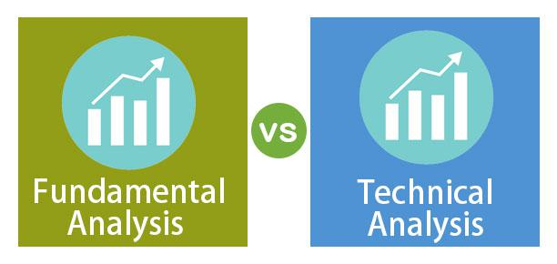

The world of stock market trading presents various analytical approaches that traders use to make informed decisions. To navigate the complexities of financial markets, traders employ multiple methods to analyze and predict market behavior effectively. Among the most prominent methods are fundamental analysis, technical analysis, and algorithmic trading. Each of these approaches offers distinct advantages and has particular strategies tailored to different types of trades. When combined, these methods can provide a deeper understanding and potentially more accurate assessments of market trends and stock performance.

Fundamental analysis, for instance, focuses on determining a company's intrinsic value by examining its financial statements and relevant economic data. This method is traditionally used for long-term investment strategies, as it emphasizes metrics such as revenue growth and price-to-earnings ratios. In contrast, technical analysis relies on historical price data and market patterns, using indicators like moving averages and the Relative Strength Index (RSI) to forecast future price movements. This approach is particularly effective for short-term trading strategies.



Algorithmic trading represents a modern blend of technical and fundamental analysis, leveraging advanced algorithms to execute trades with high speed and efficiency. By integrating large datasets and complex models, algorithmic trading offers a sophisticated means to react swiftly to changing market conditions, often combining multiple analytical perspectives for optimized decision-making.

This article explores these approaches, examining the ways in which each contributes to a comprehensive trading strategy. By understanding the intrinsic characteristics and potential synergies among fundamental analysis, technical analysis, and algorithmic trading, traders can better tailor their strategies to the nuances of the stock market, potentially improving their decision-making processes and financial outcomes.

## Table of Contents

## Understanding Fundamental Analysis

Fundamental analysis is a method utilized by traders and investors to assess a company's intrinsic value through an examination of financial statements and economic data. This approach aims to determine a company's true worth, which can guide long-term investment decisions. Central to fundamental analysis is the evaluation of financial metrics such as revenue growth, price-to-earnings (P/E) ratio, and debt levels, among others.

To understand the intrinsic value of a company, fundamental analysts scrutinize financial statements, including the balance sheet, income statement, and cash flow statement. These documents provide detailed insights into a company's financial performance and its ability to generate earnings. For example, revenue growth indicates the company's ability to increase sales over time, which is crucial for assessing long-term sustainability. On the other hand, the P/E ratio helps investors determine if a stock is overvalued or undervalued by comparing the current share price to its per-share earnings.

Debt levels are another critical metric, shedding light on a company's financial leverage and stability. A high debt-to-equity ratio may indicate that a company is financing a significant portion of its growth through borrowing, which can pose risks if not managed properly. Thus, assessing these financial metrics enables traders to gauge the financial health and operational efficiency of a company.

External economic indicators such as inflation rates, interest rates, and overall economic growth are integral to [fundamental analysis](/wiki/fundamental-analysis). These factors influence a company's market environment and potential profitability. Moreover, industry trends provide context on competitive dynamics and potential challenges or opportunities a company may face.

Fundamental analysis is particularly valuable for investors with a long-term horizon as it focuses on determining the underlying value of a business rather than short-term price movements. This approach allows investors to make informed decisions based on the company's fundamentals and market conditions. Analysts also consider qualitative factors such as management effectiveness, brand strength, and market position, which together with quantitative data, form a comprehensive view of the company's potential for long-term success.

## Exploring Technical Analysis

Technical analysis is a methodology used in the stock market to predict future price movements by examining historical price data and market patterns. This approach is particularly effective for short-term trading, where quick decision-making is crucial. Traders employ a variety of tools and indicators, such as moving averages, the Relative Strength Index (RSI), and the Moving Average Convergence Divergence (MACD), to analyze price trends and assess market [momentum](/wiki/momentum).

Moving averages, one of the key indicators in technical analysis, help smooth out price data to identify the direction of a trend. The formula for a simple moving average (SMA) is:

$$
SMA = \frac{P_1 + P_2 + ... + P_n}{n}
$$

where $P$ represents the price points over a specified period $n$. By adjusting the period, traders can assess different timeframes, a process known as multiple-timeframe analysis, to better understand market dynamics.

The RSI is another popular tool that measures the speed and change of price movements. It is used to identify overbought or oversold conditions in a market, calculated as:

$$
RSI = 100 - \frac{100}{1 + RS}
$$

where $RS = \frac{\text{average gain}}{\text{average loss}}$. RSI values above 70 typically suggest overbought conditions, while values below 30 indicate oversold situations.

MACD, a trend-following momentum indicator, shows the relationship between two moving averages of a security’s price. The standard MACD is computed by:

$$
MACD = EMA_{12} - EMA_{26}
$$

where $EMA_{12}$ and $EMA_{26}$ are exponential moving averages. The MACD is often viewed alongside a signal line, typically the 9-day EMA of the MACD, to derive buy and sell signals.

Technical analysis involves the use of charts to spot trends and market patterns, including support and resistance levels, trend lines, and chart patterns like head and shoulders or double tops and bottoms. These tools assist traders in determining optimal entry and [exit](/wiki/exit-strategy) points for trades.

High-frequency trading, which involves executing numerous trades at extremely high speeds, often benefits from technical analysis due to the reliance on quantitative data and the short-term focus of these strategies. In summary, technical analysis offers a systematic approach to trading by leveraging historical data and quantitative indicators to make informed trading decisions.

## The Role of Algorithmic Trading

Algorithmic trading utilizes sophisticated algorithms to execute trades with speed and precision that far surpasses human capabilities. This approach integrates both technical and fundamental analyses by employing quantitative models and data-driven strategies. By doing so, it automates decision-making processes, allowing trades to be executed based on real-time market conditions.

The core of [algorithmic trading](/wiki/algorithmic-trading) lies in its ability to process vast amounts of data rapidly. This enables traders to analyze price trends, market signals, and financial metrics almost instantaneously. For example, algorithms can incorporate technical indicators like moving averages or relative strength index (RSI) alongside fundamental data such as earnings reports or economic news releases. This hybrid approach ensures that trades are executed based on a thorough analysis that considers both short-term market movements and long-term asset value.

Algorithmic trading offers several competitive advantages, primarily its ability to handle large volumes of data and execute trades at optimal times, often in fractions of a second. This efficiency in trade execution can minimize transaction costs and capitalize on fleeting market opportunities. Moreover, sophisticated algorithms can manage multiple trades simultaneously, optimizing the portfolio by accounting for factors such as market [volatility](/wiki/volatility-trading-strategies) and [liquidity](/wiki/liquidity-risk-premium).

Customization is another critical benefit of algorithmic trading. Traders can tailor algorithms to align with their specific investment objectives and risk tolerance. This flexibility allows algorithms to be fine-tuned to react to particular market conditions or to focus on specific asset classes. For example, one might develop an algorithm that prioritizes trading in high-liquidity environments or emphasizes assets with strong fundamental performance metrics.

A Python example that demonstrates a simple moving average crossover strategy could look like this:

```python
import pandas as pd
import numpy as np

# Load historical price data
data = pd.read_csv('stock_prices.csv')

# Calculate short-term and long-term moving averages
data['Short_MA'] = data['Close'].rolling(window=40, min_periods=1).mean()
data['Long_MA'] = data['Close'].rolling(window=100, min_periods=1).mean()

# Generate trading signals
data['Signal'] = 0
data['Signal'][40:] = np.where(data['Short_MA'][40:] > data['Long_MA'][40:], 1, 0)

# Determine buy and sell orders
data['Position'] = data['Signal'].diff()

# Print orders
print(data[['Date', 'Close', 'Short_MA', 'Long_MA', 'Signal', 'Position']])
```

In this example, the algorithm tracks the short-term and long-term moving averages of a stock's closing prices. It generates a buy signal when the short-term average crosses above the long-term average and a sell signal when it crosses below. This simple algorithm can be part of a broader strategy that includes fundamental factors, enhancing the automated trading process.

By incorporating algorithmic trading, traders can optimize their execution strategy, reduce human error, and adapt swiftly to ever-changing market conditions. This aspect of trading is indispensable for those seeking to leverage modern technology to maximize their market presence.

## Blending Analytical Approaches

Combining fundamental and technical analysis can significantly enhance trading strategies by offering a more comprehensive view of the market. Fundamental analysis provides insights into a company's intrinsic value based on financial metrics and economic indicators. Technical analysis, on the other hand, focuses on historical price data and patterns to predict future movements. By integrating these approaches, traders can refine their decision-making process and align their strategies with market dynamics.

Technical indicators can serve as a valuable tool to confirm findings from fundamental analysis. For instance, if a company's strong financial health indicates a potential rise in stock value, technical indicators like moving averages or the Relative Strength Index (RSI) can validate whether the current market momentum supports this projection. This dual approach allows traders to avoid purely speculative decisions and root their strategies in both quantitative and qualitative data.

Algorithmic trading plays a crucial role in optimizing this blend of analytical approaches. It leverages advanced algorithms to automate and expedite trade executions, capitalizing on opportunities identified through fundamental and technical analyses. Algorithms can be programmed to react to specific financial health indicators and technical chart patterns, executing trades with precision and speed that human traders struggle to match. This integration not only improves execution efficiency but also helps traders mitigate bias and emotional influences.

Balancing these approaches reduces risk and enhances the potential to capitalize on market opportunities. Fundamental analysis identifies long-term investment prospects, while technical analysis pinpoints ideal entry and exit points. Algorithms can manage this balance by continuously scanning market conditions and adapting to new data. For example, a Python script utilizing libraries like `pandas` and `numpy` could be used to analyze fundamental data alongside technical indicators and automate buy or sell signals when certain conditions are met. Such a script could run continuously to monitor the confluence of these analytical signals in real-time.

The blend of fundamental, technical, and algorithmic trading strategies forms a robust framework for market participation, encouraging traders to exercise diligence in their approach. By combining these diverse methodologies, traders can increase the likelihood of achieving favorable outcomes in the stock market.

## Challenges and Risks

Each analytical method employed in stock market trading, while advantageous, presents distinct challenges and risks that traders must acknowledge and manage. 

Fundamental analysis, which relies extensively on evaluating a company’s intrinsic value, primarily through financial statements and economic data, often prioritizes long-term investment horizons. This can lead to an underestimation of short-term market fluctuations driven by investor sentiment, geopolitical events, or sudden economic changes. For instance, fundamental analysis may overlook the impact of speculative trading activities or temporary market hype, which can significantly influence short-term stock prices.

Technical analysis, focusing on historical price data and market patterns, is prone to the risk of misinterpreting data patterns. This analytical method assumes that past market behavior can predict future movements. However, markets are influenced by an array of factors, including economic news and investor behavior, which could lead to anomalies that charts and indicators might not accurately capture. The reliance on indicators such as moving averages or the Relative Strength Index (RSI) can result in false signals, leading to erroneous buy or sell decisions.

Algorithmic trading presents another set of challenges and risks. It requires highly precise algorithms that must account for numerous variables simultaneously. The complexity of designing and maintaining these algorithms can lead to bugs or errors that may cause unintended trading behavior. Moreover, technological glitches or latency issues in fast-paced market environments could result in significant financial losses. As these algorithms often operate with minimal human intervention, the potential for errors increases if rigorous testing and validation are not performed.

To mitigate these risks, traders can implement robust risk management strategies. Diversifying investment portfolios, continuously [backtesting](/wiki/backtesting) trading algorithms, and staying informed about market events are essential practices. By understanding the limitations and risks inherent in each method, traders can refine their strategies, achieve a balanced approach, and potentially minimize losses in volatile market conditions.

## Conclusion

The stock market landscape is rich with diverse analytical methodologies, each offering distinct benefits that enhance trading performance when effectively combined. Fundamental analysis provides insights into a company's intrinsic value through evaluation of financial metrics, while technical analysis focuses on historical price patterns and trends. Algorithmic trading brings efficiency and precision, utilizing algorithms to execute trades based on predefined parameters.

Traders are encouraged to strategically incorporate a blend of these analytical approaches to optimize their decision-making processes. By integrating fundamental analysis with technical analysis, traders can achieve a balanced perspective that accounts for both intrinsic value and market dynamics. Algorithmic trading further augments this blend by automating strategies, thus ensuring swift execution and minimizing human error.

In an ever-evolving market landscape, continuous learning and the ability to adapt are paramount. As new financial instruments, technologies, and market conditions emerge, traders must stay informed and refine their strategies accordingly. Successfully navigating the complexities of the stock market hinges on the ability to synthesize diverse analytical tools and continually update knowledge, facilitating informed and agile trading strategies.

## References & Further Reading

[1]: Bergstra, J., Bardenet, R., Bengio, Y., & Kégl, B. (2011). ["Algorithms for Hyper-Parameter Optimization."](https://dl.acm.org/doi/10.5555/2986459.2986743) Advances in Neural Information Processing Systems 24.

[2]: ["Advances in Financial Machine Learning"](https://www.amazon.com/Advances-Financial-Machine-Learning-Marcos/dp/1119482089) by Marcos Lopez de Prado  

[3]: ["Evidence-Based Technical Analysis: Applying the Scientific Method and Statistical Inference to Trading Signals"](https://www.amazon.com/Evidence-Based-Technical-Analysis-Scientific-Statistical/dp/0470008741) by David Aronson  

[4]: ["Machine Learning for Algorithmic Trading"](https://github.com/stefan-jansen/machine-learning-for-trading) by Stefan Jansen  

[5]: ["Quantitative Trading: How to Build Your Own Algorithmic Trading Business"](https://www.amazon.com/Quantitative-Trading-Build-Algorithmic-Business/dp/1119800064) by Ernest P. Chan