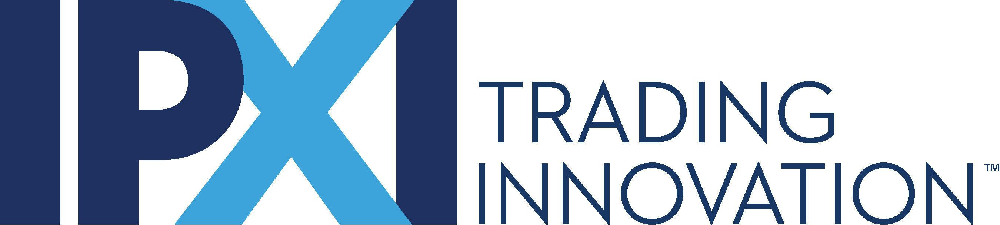

## Table of Contents

## What is Intellectual Property Exchange International (IPEI)?

Intellectual Property Exchange International (IPEI) is a company that helps people and businesses buy and sell intellectual property (IP). Intellectual property includes things like inventions, designs, and brand names. IPEI acts like a marketplace where people can list their IP for sale and others can come to buy it. This makes it easier for people to find and trade IP without having to search everywhere on their own.

IPEI also helps with the process of buying and selling IP. They make sure that all the legal steps are followed correctly. This is important because IP laws can be complicated. By using IPEI, people can feel more confident that their transactions are safe and legal. This service is helpful for inventors, businesses, and anyone else who wants to trade their ideas and creations.

## What types of intellectual properties are traded on IPEI?

On IPEI, you can find many different types of intellectual properties being traded. These include patents, which are for new inventions or ideas. Trademarks are also common, and they protect brand names and logos. Another type is copyrights, which cover things like books, music, and art. These are the main kinds of IP you'll see on IPEI, but there are others too.

Design patents are another type of IP that can be traded on IPEI. These protect the unique look of a product, like the shape of a new phone or a piece of furniture. Trade secrets are also sometimes listed, which are special ways of doing business that companies want to keep secret. All these different types of IP help people and businesses protect their ideas and creations, and IPEI makes it easier for them to buy and sell these rights.

## How does IPEI facilitate the buying and selling of intellectual property?

IPEI makes it easy for people to buy and sell intellectual property by acting like a big online store. If you have a patent, trademark, or any other type of IP that you want to sell, you can list it on IPEI's website. People who are looking to buy IP can then browse through the listings and find what they need. This makes the process of finding the right IP much simpler than searching everywhere on your own.

IPEI also helps with the legal side of buying and selling IP. They make sure that all the paperwork is done correctly and that the transaction follows the law. This is important because IP laws can be hard to understand. By using IPEI, people can feel safe knowing that their IP deals are handled properly. This service helps inventors, businesses, and anyone else who wants to trade their ideas and creations without worrying about the legal stuff.

## Who can participate in transactions on IPEI?

Anyone can take part in buying and selling on IPEI. This includes inventors who want to sell their new ideas, businesses looking to buy patents or trademarks to help them grow, and even regular people who might have a cool design or a catchy brand name they want to trade.

IPEI makes it easy for all these different people to come together. Whether you're a big company or just starting out, you can list your intellectual property on their website or look for something to buy. This way, everyone has a chance to find what they need and make deals that can help them succeed.

## What are the benefits of using IPEI for intellectual property transactions?

Using IPEI for intellectual property transactions makes things a lot easier. It's like a big online store where you can find all sorts of patents, trademarks, and other types of IP. If you want to sell your idea, you can list it on their website, and if you're looking to buy, you can browse through what's available. This saves you time and effort because you don't have to search all over the place to find what you need.

Another big benefit is that IPEI helps with all the legal stuff. Buying and selling IP can be tricky because there are a lot of rules and laws to follow. IPEI makes sure everything is done right, so you don't have to worry about making mistakes. This makes the whole process safer and more reliable, which is great for inventors, businesses, and anyone else who wants to trade their ideas and creations without the stress of handling the legal side on their own.

## How does IPEI ensure the security and authenticity of the intellectual properties listed?

IPEI works hard to make sure that the intellectual properties listed on their website are safe and real. They do this by checking each listing carefully before it goes up. This means they look at the documents and details to make sure everything is correct and that the person listing the IP actually owns it. This helps stop fake or wrong listings from being shown.

They also use secure ways to handle the buying and selling process. IPEI keeps all the information private and uses safe methods to transfer the IP rights from the seller to the buyer. This makes sure that both the seller's and buyer's information stays safe and that the transaction is done in a way that follows the law. By doing these things, IPEI helps everyone feel confident that the IP they are dealing with is real and secure.

## What are the fees associated with using IPEI's services?

Using IPEI's services comes with some fees, but they are set up to be clear and fair. If you want to list your intellectual property for sale, you'll need to pay a listing fee. This fee helps cover the cost of putting your IP on their website so that others can see it. The exact amount of the listing fee can change depending on what type of IP you're selling and how long you want it to stay listed.

When someone buys your IP through IPEI, there's also a transaction fee. This fee is a percentage of the total sale price and is taken out when the deal is done. The transaction fee helps IPEI cover the costs of making sure everything is legal and secure. Both the listing fee and the transaction fee are important because they help IPEI keep their services running smoothly and safely for everyone.

## Can you explain the process of listing intellectual property on IPEI?

To list your intellectual property on IPEI, you first need to go to their website and sign up for an account. Once you're signed in, you can start the listing process by filling out a form with details about your IP. This includes what type of IP it is, like a patent or a trademark, and any important information about it. You'll also need to upload any documents that prove you own the IP, like a patent certificate or a trademark registration. IPEI will check these documents to make sure everything is correct and that you really own the IP you're trying to sell.

After you've filled out the form and uploaded your documents, you'll need to pay a listing fee. This fee lets IPEI put your IP on their website so that other people can see it and maybe buy it. Once your listing is approved and goes live, people can start making offers on your IP. If someone wants to buy it, IPEI will help with the transaction, making sure everything is done legally and safely. They'll take a transaction fee from the sale price, and then the IP rights will be transferred to the buyer. This whole process makes it easy for you to sell your ideas and creations on IPEI.

## How does IPEI handle disputes or issues related to intellectual property rights?

When there are problems or disagreements about intellectual property rights on IPEI, they have a clear way to handle it. If someone thinks there's an issue with a listing or a transaction, they can let IPEI know. IPEI will then look into the problem carefully. They might ask for more information or documents from both the buyer and the seller to understand what's going on. This helps them figure out who is right and what needs to be done to fix the problem.

IPEI tries to solve these issues quickly and fairly. They might talk to both sides to see if they can reach an agreement. If they can't, IPEI might need to make a decision based on the information they have. They always follow the law and their own rules to make sure everything is handled the right way. This helps keep the buying and selling process safe and trustworthy for everyone using their service.

## What impact has IPEI had on the global intellectual property market?

IPEI has made a big difference in the global intellectual property market by making it easier for people to buy and sell IP. Before IPEI, finding the right patent or trademark could be hard and take a long time. Now, with IPEI's online marketplace, people from all over the world can quickly list their IP and find what they need. This has helped more people trade their ideas and creations, which is good for inventors, businesses, and anyone who wants to buy or sell IP.

Another way IPEI has changed the market is by making transactions safer and more reliable. They check each listing to make sure it's real and handle the legal side of buying and selling. This means people can trust that their deals are done the right way. As a result, more people feel comfortable using IPEI, which has made the global IP market more active and open to everyone.

## How does IPEI integrate with other intellectual property management systems?

IPEI works well with other systems that help people manage their intellectual property. They have tools that let you connect your IPEI account with other IP management software. This means you can keep track of your patents, trademarks, and other IP in one place, even if you're using different systems. For example, if you use a special program to manage your patents, you can link it to IPEI so that your listings and sales are all updated automatically.

This integration makes things easier for people who use multiple tools to handle their IP. By connecting these systems, IPEI helps make sure that all your information stays correct and up to date. This way, you don't have to enter the same information over and over again in different places. It saves time and helps keep everything organized, which is really helpful for inventors and businesses who want to manage their IP smoothly.

## What future developments or expansions are planned for IPEI?

IPEI is always looking to grow and improve its services. They want to make it even easier for people to buy and sell intellectual property all over the world. One of the big plans they have is to add more types of intellectual property to their website. Right now, they mostly deal with patents, trademarks, and copyrights, but they want to include things like trade secrets and industrial designs too. This will give people more options and make IPEI a one-stop shop for all kinds of IP.

Another thing IPEI is working on is making their website better and easier to use. They want to add new tools that help people find the right IP faster and make the buying and selling process even smoother. They are also thinking about adding more languages to their website so that people from different countries can use it more easily. These changes will help IPEI reach more people and make the global IP market even more connected and active.

## References & Further Reading

[1]: LoTempio, Vincent. "IPXI: Intellectual Property Exchanges of the Future?" *LoTempio Law Blog*, LoTempio Law, 18 Sept. 2015.

[2]: Contreras, Jorge L. "Intellectual Property Marketplaces and Exchanges: Introduction and Overview." *Handbook of Intellectual Property Research: Lenses, Methods, and Perspectives*, Emanuel De Groof and Neja Janezic (eds.), pp. 53–77.

[3]: Goldstein, Paul. ["Intellectual Property: The Tough New Realities That Could Make or Break Your Business."](https://www.amazon.com/Intellectual-Property-Tough-Realities-Business/dp/1591841771) Harvard Business Review Press, 2007.

[4]: ["Managing Intellectual Property: The Strategic Imperative."](https://books.google.com/books/about/MANAGING_INTELLECTUAL_PROPERTY_The_Strat.html?id=Dei2DAAAQBAJ) by V K Unni, Routledge, 2012.

[5]: Motohashi, Kazuyuki. ["Global Business Strategy: Multinational Corporations Venturing into Emerging Markets."](https://link.springer.com/book/10.1007/978-4-431-55468-4) Springer, 2015.