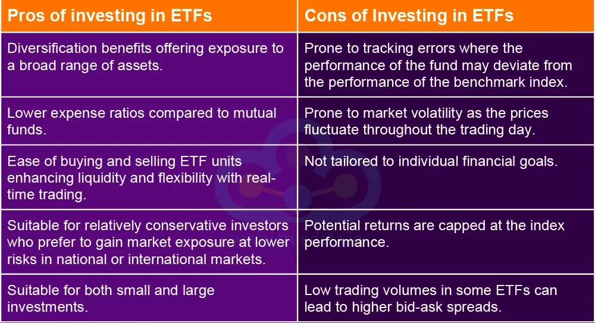

## Table of Contents

## What are Intelligent ETFs?

Intelligent ETFs, or Exchange Traded Funds, are a type of investment that uses advanced technology and data analysis to make smarter investment decisions. Unlike traditional ETFs, which often follow a simple index like the S&P 500, intelligent ETFs use computer algorithms and artificial intelligence to pick and choose investments. This means they can adapt to changes in the market more quickly and potentially offer better returns for investors.

These ETFs are designed to be more flexible and responsive. For example, an intelligent ETF might use machine learning to analyze thousands of data points, like company performance, economic indicators, and even social media trends, to decide which stocks to buy or sell. This approach can help the ETF perform better over time by reacting to new information faster than a human manager could. While they can be more complex, intelligent ETFs aim to make investing easier and more effective for everyday investors.

## How do Intelligent ETFs differ from traditional ETFs?

Intelligent ETFs and traditional ETFs both let you invest in a bunch of different things at once, but they work a bit differently. Traditional ETFs usually follow a set list of stocks or bonds, like the ones in the S&P 500. They don't change much unless the index they follow changes. This means they're pretty simple and predictable, but they might not react quickly to new information or changes in the market.

On the other hand, intelligent ETFs use fancy computer programs and [artificial intelligence](/wiki/ai-artificial-intelligence) to pick and choose what to invest in. They look at a lot of data, like how companies are doing, what's happening in the economy, and even what people are saying on social media. This helps them make smarter choices and adjust their investments more often. So, intelligent ETFs can be more flexible and might do better when the market changes a lot.

In short, traditional ETFs are like following a set recipe, while intelligent ETFs are like having a smart chef who can change the recipe based on what's fresh and what tastes good right now. Both have their place, but they offer different ways to invest your money.

## What are the main types of Intelligent ETFs?

Intelligent ETFs come in different types, each using smart technology in its own way. One type is called "Factor-based ETFs." These ETFs use computer programs to pick stocks based on certain things like how big a company is, how much it's growing, or how much it pays out to shareholders. They try to find stocks that do well based on these factors, which can help them do better than just following a simple index.

Another type is "Algorithmic ETFs." These use even more advanced computer programs, often with artificial intelligence, to make quick decisions about what to buy or sell. They look at tons of data, like news, company reports, and even social media, to figure out the best investments. This can help them react faster to changes in the market and potentially make more money for investors.

Lastly, there are "Thematic ETFs." These focus on specific trends or themes, like technology or green energy, and use smart tech to find the best companies in those areas. They try to take advantage of big changes happening in the world, like the shift to renewable energy, by [picking](/wiki/asset-class-picking) the companies that are leading the way.

## What are the key advantages of investing in Intelligent ETFs?

One big advantage of investing in Intelligent ETFs is that they can change and adapt quickly. They use smart computer programs to look at a lot of information and make decisions faster than a person could. This means they can react to new news or changes in the market right away, which can help them do better than traditional ETFs that just follow a set list of stocks.

Another advantage is that Intelligent ETFs can pick stocks based on special things like how fast a company is growing or how much it pays out to shareholders. This can help them find the best investments and maybe make more money for you. They also focus on big trends or themes, like technology or green energy, which can be a good way to invest in the future.

Overall, Intelligent ETFs use technology to make smarter choices and can be a good way to invest your money if you want something that's more flexible and might do better in a changing world.

## Can you explain the potential disadvantages of Intelligent ETFs?

One potential disadvantage of Intelligent ETFs is that they can be more complicated and harder to understand than traditional ETFs. Because they use fancy computer programs and look at a lot of different information, it can be tough to know exactly why they are buying or selling certain stocks. This might make some people feel less comfortable investing in them, especially if they like to know exactly what's going on with their money.

Another downside is that Intelligent ETFs might cost more than traditional ETFs. The smart technology and data they use can be expensive, and these costs can be passed on to investors through higher fees. Over time, these higher fees could eat into the returns you get from your investment, which means you might end up with less money than if you had chosen a cheaper option.

Lastly, even though Intelligent ETFs use smart technology, there's no guarantee they will do better than traditional ETFs. The market can be unpredictable, and the computer programs they use might not always make the best choices. This means there's still a risk that you could lose money, just like with any other type of investment.

## How do Intelligent ETFs use algorithms and data analysis?

Intelligent ETFs use algorithms and data analysis to make smart choices about what to invest in. These ETFs look at a lot of different information, like how companies are doing, what's happening in the economy, and even what people are saying on social media. The algorithms help them sort through all this data quickly and find patterns or trends that might not be easy for a person to see. This way, they can pick the best stocks to buy or sell based on what the data tells them.

For example, an Intelligent [ETF](/wiki/etf-trading-strategies) might use [machine learning](/wiki/machine-learning) to analyze thousands of data points. This could include things like a company's earnings reports, news articles, and even tweets about the company. The algorithms can learn from this data over time and get better at predicting which stocks will do well. By using this technology, Intelligent ETFs can make quick decisions and adjust their investments to try to get the best returns for investors.

## What role do machine learning and artificial intelligence play in Intelligent ETFs?

Machine learning and artificial intelligence are super important for Intelligent ETFs. They help these ETFs look at a lot of information really fast and find patterns that people might miss. For example, machine learning can go through tons of data like company reports, news, and even social media posts to figure out which stocks might do well. The more data it looks at, the better it gets at making predictions, kind of like how you get better at a game the more you play it.

These smart technologies help Intelligent ETFs make quick decisions about what to buy or sell. Instead of just following a set list of stocks, Intelligent ETFs can change their investments based on what the data says. This means they can react to new information faster than a person could, which can help them do better in a changing market. So, machine learning and AI make Intelligent ETFs more flexible and potentially more profitable for investors.

## How can Intelligent ETFs improve portfolio diversification?

Intelligent ETFs can help make your investment portfolio more diverse by using smart computer programs to pick a wide range of stocks. Instead of just following a set list of stocks like traditional ETFs, Intelligent ETFs look at a lot of different information. They can choose stocks from different industries, sizes, and even countries, which means your money is spread out more. This can help lower the risk because if one stock or industry does badly, the others might do well and balance things out.

These ETFs use machine learning and artificial intelligence to find the best mix of investments. They can look at things like how fast a company is growing, how much it pays out to shareholders, or even what people are saying about it on social media. By considering all these different factors, Intelligent ETFs can find opportunities that might be hard for a person to see. This smart way of choosing investments can lead to a more balanced and diverse portfolio, which is good for managing risk and potentially getting better returns.

## What are the performance metrics to consider when evaluating Intelligent ETFs?

When you want to see how well an Intelligent ETF is doing, you should look at a few key things. One important thing is the return on investment, which shows how much money the ETF has made over time. You can compare this to other ETFs or to the overall market to see if it's doing better or worse. Another thing to look at is the [volatility](/wiki/volatility-trading-strategies), which tells you how much the ETF's value goes up and down. If it's very volatile, it might be riskier, but it could also mean bigger potential rewards.

You should also check the expense ratio, which is how much it costs to invest in the ETF. Intelligent ETFs can be more expensive than traditional ones because of the smart technology they use, so it's good to see if the extra cost is worth it. Finally, look at the tracking error, which shows how closely the ETF follows its strategy or benchmark. A lower tracking error means the ETF is doing a good job sticking to its plan, which can be a sign of good management.

## How do fees and costs associated with Intelligent ETFs compare to other investment vehicles?

Intelligent ETFs can be more expensive than traditional ETFs and other investment vehicles like mutual funds. This is because they use advanced computer programs and data analysis, which costs money to develop and maintain. The fees for Intelligent ETFs are often higher, with expense ratios that can be anywhere from 0.50% to 1.00% or more. In comparison, traditional ETFs might have expense ratios as low as 0.03% to 0.20%, and many mutual funds have expense ratios around 0.50% to 1.00%, though some can be higher.

These higher fees can affect how much money you make from your investment over time. If an Intelligent ETF charges 1.00% in fees and a traditional ETF charges 0.10%, the difference in costs can add up over the years. It's important to think about whether the potential for better performance from an Intelligent ETF is worth the extra cost. Sometimes, paying more for smart technology can lead to better returns, but it's not guaranteed, so you need to weigh the costs against the possible benefits.

## What are some real-world examples of successful Intelligent ETFs?

One good example of a successful Intelligent ETF is the Global X Millennial Consumer ETF (MILN). This ETF uses smart technology to pick stocks that are popular with millennials, like companies in tech, entertainment, and food. It looks at a lot of data to figure out what young people are buying and where they're spending their money. Since it started, MILN has done well, showing that using data and algorithms can help find good investments.

Another example is the ROBO Global Robotics and Automation Index ETF (ROBO). This ETF focuses on companies that are working on robots, artificial intelligence, and other new technologies. It uses computer programs to find the best companies in these areas, which are growing fast. ROBO has been successful because it taps into big trends in technology, and its smart way of choosing stocks has helped it do well over time.

## What future developments can we expect in the field of Intelligent ETFs?

In the future, we can expect Intelligent ETFs to get even smarter and better at picking investments. As technology keeps getting better, these ETFs will be able to look at more data and make even quicker decisions. They might start using things like real-time data from social media and news to react to changes in the market right away. This could make them even more flexible and able to find good investments that other ETFs might miss.

Also, we might see more Intelligent ETFs focusing on new and exciting areas like green energy, space travel, or even health tech. As these fields grow, smart ETFs can use their technology to find the best companies in these areas and help investors make money from big trends. Overall, Intelligent ETFs will probably keep getting more popular as people see how well they can do and how they can help make investing easier and more effective.

## References & Further Reading

[1]: ["The Basics of ETFs"](https://www.etf.com/sections/etf-basics/best-etfs-beginners-complete-guide) - Investopedia

[2]: ["The Intelligent Investor: The Definitive Book on Value Investing"](https://www.amazon.com/Intelligent-Investor-Definitive-Investing-Essentials/dp/0060555661) by Benjamin Graham

[3]: ["A Random Walk Down Wall Street"](https://en.wikipedia.org/wiki/A_Random_Walk_Down_Wall_Street) by Burton Malkiel

[4]: ["Algorithmic Trading and DMA: An Introduction to Direct Access Trading Strategies"](https://www.amazon.com/Algorithmic-Trading-DMA-introduction-strategies/dp/0956399207) by Barry Johnson

[5]: Lo, A. W., & MacKinlay, A. C. (1999). ["A Non-Random Walk Down Wall Street"](https://www.jstor.org/stable/j.ctt7tccx) Princeton University Press

[6]: Pojarliev, M., & Levich, R. M. (2010). ["A New Look at Currency Investing"](https://rpc.cfainstitute.org/-/media/documents/book/rf-publication/2012/rf-v2012-n4-1-pdf.pdf) CFA Institute Research Foundation

[7]: ["Smart Beta: Understanding the Basics"](https://www.jhinvestments.com/viewpoints/investing-basics/smart-beta-investing-understanding-the-basics) - Morningstar

[8]: Clarke, R., de Silva, H., & Thorley, S. (2006). ["Minimum-Variance Portfolios in the U.S. Equity Market"](https://www.hillsdaleinv.com/uploads/Minimum-Variance_Portfolio_Composition,_Roger_Clarke,_Harindra_de_Silva,_Steven_Thorley.pdf) The Journal of Portfolio Management

[9]: ["Exploring Artificial ETFs and Their Impact on Modern Investing"](https://www.forbes.com/sites/investor-hub/article/best-ai-etfs-to-buy-now/) - Forbes

[10]: BlackRock (2020). ["The Role of AI in Asset Management"](https://www.scribbledata.io/blog/role-of-ai-and-ml-in-asset-management-a-complete-guide/) - BlackRock Insights