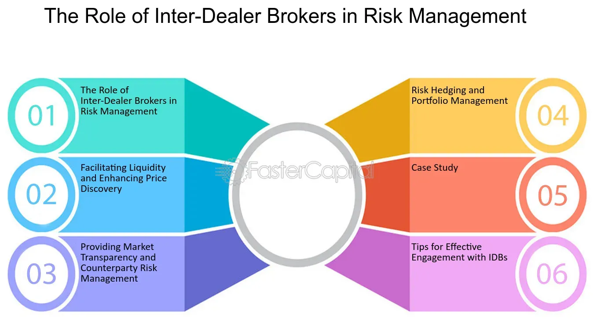

## Table of Contents

## What is an inter-dealer broker (IDB)?

An inter-dealer broker (IDB) is a company that helps other financial firms buy and sell things like stocks, bonds, and other financial products. They act as a middleman between big banks and other financial institutions, making it easier for them to trade with each other. IDBs use special systems and platforms to match buyers and sellers, ensuring that trades happen smoothly and efficiently.

IDBs are important because they help keep the financial markets running smoothly. They provide a way for large amounts of money to move around quickly and safely. By bringing together buyers and sellers, IDBs help make sure that there is always someone to trade with, which keeps the market stable and efficient.

## How do inter-dealer brokers operate in financial markets?

Inter-dealer brokers operate in financial markets by connecting big banks and other financial institutions that want to trade things like stocks, bonds, and currencies. They use special computer systems and platforms to match buyers and sellers. When a bank wants to buy or sell something, they tell the IDB, who then looks for another bank that wants to do the opposite trade. This way, the IDB helps make sure that trades happen quickly and smoothly.

IDBs are important because they help keep the financial markets running well. They make it easier for big amounts of money to move around safely and quickly. By bringing together buyers and sellers, IDBs make sure there is always someone to trade with, which helps keep the market stable. This is good for everyone because it means that prices stay fair and trades can happen without big delays.

## What types of financial instruments do IDBs typically deal with?

Inter-dealer brokers (IDBs) typically deal with a wide range of financial instruments. These include stocks, which are shares in companies, and bonds, which are loans to companies or governments. IDBs also handle currencies, helping banks and other institutions trade different types of money from around the world.

In addition to these common instruments, IDBs also trade more complex financial products. These can include derivatives, which are contracts that get their value from something else, like a stock or a commodity. They also deal with [interest rate](/wiki/interest-rate-trading-strategies) swaps, which are agreements to exchange interest payments over time, and other types of securities that are used for managing risk and investment.

Overall, IDBs play a key role in making sure that there's a market for all these different financial instruments. By connecting buyers and sellers, they help keep the financial system working smoothly and efficiently.

## Who are the primary clients of inter-dealer brokers?

The main clients of inter-dealer brokers are big banks and other big financial institutions. These clients use IDBs to buy and sell things like stocks, bonds, and currencies. They need IDBs to help them find other banks or institutions that want to trade the same things at the same time.

IDBs help these big clients by using special computer systems to match buyers and sellers quickly and safely. This makes it easier for the banks to trade large amounts of money without big delays. By working with IDBs, these big clients can manage their money and investments more efficiently.

## What are the key roles and responsibilities of an IDB?

Inter-dealer brokers (IDBs) have important jobs in the financial world. Their main role is to help big banks and other financial institutions trade things like stocks, bonds, and currencies. They do this by using special computer systems to match buyers and sellers. This makes trading quick and safe, which is important for the banks that need to move large amounts of money.

IDBs also have a responsibility to keep the financial markets running smoothly. They make sure there is always someone to trade with, which helps keep prices fair and stops big delays in trading. By doing this, IDBs help keep the financial system stable and efficient. This is good for everyone because it means that money and investments can be managed better.

## How do inter-dealer brokers facilitate liquidity in the market?

Inter-dealer brokers help make the market more liquid by connecting buyers and sellers quickly. They use special computer systems to match big banks and other financial institutions that want to trade things like stocks, bonds, and currencies. When a bank wants to buy or sell something, the IDB finds another bank that wants to do the opposite trade. This makes it easier for banks to trade large amounts of money without waiting too long.

By bringing together buyers and sellers, IDBs make sure there is always someone to trade with. This helps keep the market running smoothly and makes prices more fair. When there are lots of people trading, it's easier for everyone to buy and sell what they need. This is good for the whole financial system because it means money and investments can move around quickly and safely.

## What are the regulatory requirements for inter-dealer brokers?

Inter-dealer brokers have to follow rules set by financial regulators to make sure they work fairly and safely. These rules are different in each country but usually include things like registering with the regulators, keeping good records of their trades, and making sure they don't do anything that could cheat or hurt their clients. For example, in the United States, IDBs are overseen by the Securities and Exchange Commission (SEC) and the Commodity Futures Trading Commission (CFTC), which make sure that IDBs follow the laws and protect the market.

Another important part of these rules is that IDBs need to have strong systems to manage risks. This means they have to be careful with the money they handle and make sure their computer systems are safe from hackers. They also need to report any problems quickly to the regulators. By following these rules, IDBs help keep the financial markets honest and stable, which is good for everyone who uses them.

## What advantages do IDBs offer to their clients?

Inter-dealer brokers help their clients by making it easier to trade big amounts of money quickly and safely. When a bank wants to buy or sell stocks, bonds, or currencies, the IDB uses special computer systems to find another bank that wants to do the opposite trade. This means the bank doesn't have to wait long to make a trade, which is really important when dealing with large sums of money.

IDBs also help keep the market stable and fair. By bringing together lots of buyers and sellers, they make sure there's always someone to trade with. This helps keep prices fair and stops big delays in trading. When the market is stable and easy to use, it's better for everyone, especially the big banks and financial institutions that use IDBs to manage their money and investments.

## How do inter-dealer brokers manage risk?

Inter-dealer brokers manage risk by making sure they have strong systems in place. They use special computer systems to keep track of all the trades they help with. This helps them see if anything looks wrong or risky. They also have rules to make sure they are careful with the money they handle. By following these rules, they can keep the money safe and make sure everything is done right.

Another way IDBs manage risk is by being ready for problems. They have plans to deal with things like computer hacks or big changes in the market. If something goes wrong, they report it quickly to the people who make the rules. This helps keep the market safe and stable. By being careful and ready, IDBs can help their clients trade without worrying too much about risks.

## What are the technological tools used by IDBs to enhance their services?

Inter-dealer brokers use special computer systems to help them do their jobs better. These systems are called electronic trading platforms. They let IDBs connect buyers and sellers from all over the world really fast. The platforms show lots of information about prices and trades, which helps banks and other big clients make good decisions. By using these tools, IDBs can match trades quickly and make sure everything is done safely and correctly.

Another important tool for IDBs is something called a risk management system. This is a computer program that watches all the trades to make sure nothing risky is happening. It helps IDBs keep track of the money they handle and make sure it's safe. The system can also warn them if there's a problem, like a computer hack or a big change in the market. By using these tools, IDBs can help their clients trade without worrying too much about risks.

## How does the use of inter-dealer brokers impact market transparency?

Inter-dealer brokers help make the market more transparent by using special computer systems that show lots of information about prices and trades. When banks and other big clients use IDBs to buy and sell things like stocks and bonds, they can see what prices other people are getting. This makes it easier for everyone to know what's going on in the market and helps keep prices fair.

However, IDBs can also make the market less transparent in some ways. They often handle big trades between big banks that might not be seen by everyone else. These trades can affect prices, but if other people don't know about them, it can make it harder to understand what's really happening in the market. So, while IDBs help with transparency in some ways, they can also make it more complicated in others.

## What are the future trends and challenges facing the inter-dealer broker industry?

The inter-dealer broker industry is looking at a few big changes in the future. One big trend is the use of more technology, like [artificial intelligence](/wiki/ai-artificial-intelligence) and [machine learning](/wiki/machine-learning). These tools can help IDBs make trading faster and safer. They can also help IDBs give better information to their clients about what's happening in the market. Another trend is that more trades are happening online, which means IDBs need to keep their computer systems strong and safe from hackers.

There are also some challenges that IDBs will need to deal with. One challenge is keeping up with all the new rules that governments are making for the financial markets. These rules are meant to keep the markets fair and safe, but they can be hard for IDBs to follow. Another challenge is competition from other companies that want to do the same job as IDBs. These companies might use new technology or different ways of working to try to take business away from IDBs. So, IDBs will need to keep finding new ways to stay important and useful to their clients.

## References & Further Reading

[1]: Norman, Peter. (2008). ["The Risk Controllers: Central Counterparty Clearing in Globalised Financial Markets."](https://www.amazon.com/Risk-Controllers-Counterparty-Globalised-Financial/dp/0470686324) Oxford University Press.

[2]: Aldridge, Irene. (2013). ["High-Frequency Trading: A Practical Guide to Algorithmic Strategies and Trading Systems."](https://www.amazon.com/High-Frequency-Trading-Practical-Algorithmic-Strategies/dp/1118343506) Wiley.

[3]: Mackintosh, James. (2010). ["The Rise of the Machines: How Computer Models Became the Stock Market’s Master Traders."](https://www.msn.com/en-us/money/markets/this-record-stock-market-is-riding-on-questionable-ai-assumptions/ar-BB1nistR) Financial Times.

[4]: Harris, Larry. (2002). ["Trading and Exchanges: Market Microstructure for Practitioners."](https://www.amazon.com/Trading-Exchanges-Market-Microstructure-Practitioners/dp/0195144708) Oxford University Press.

[5]: Domowitz, Ian. (1993). ["Automated Trade Execution Systems: Definitional Parameters and the State of the Art."](https://www.sciencedirect.com/science/article/pii/026156069390028A)90035-U) Journal of Financial Services Research.

[6]: Bank for International Settlements. (2015). ["Electronic Trading in Fixed Income Markets."](https://www.bis.org/publ/mktc07.pdf) Committee on the Global Financial System Papers No. 52.