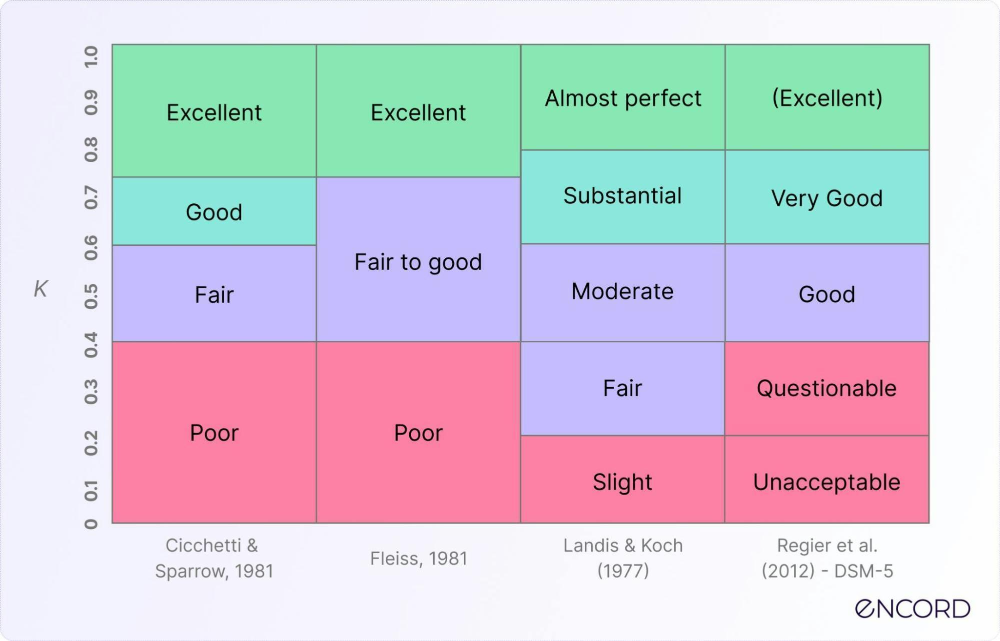

## Table of Contents

## What is Inter-Rater Agreement in the context of machine learning?

Inter-Rater Agreement is a measure used in machine learning and statistics to see how well different people or systems agree when they are labeling or categorizing the same data. Imagine you and your friend are looking at pictures of animals and trying to name them. If you both call a picture a "dog" most of the time, your agreement is high. This is important in machine learning because if human labelers don't agree, it can be hard for a computer to learn correctly from the data.

In machine learning, we often use a statistic called Cohen's Kappa to measure this agreement. Cohen's Kappa takes into account the agreement that happens by chance, so it gives a more accurate picture of how well raters are really agreeing. For example, if two people are labeling images as either "cat" or "dog," Cohen's Kappa helps us understand if their agreement is just luck or if they really see the images the same way. A higher Kappa value means better agreement, which is crucial for training reliable machine learning models.

## Why is Inter-Rater Agreement important in machine learning?

Inter-Rater Agreement is important in machine learning because it shows how well different people agree when they label data. If people don't agree on what they see in the data, it can be hard for a computer to learn the right patterns. For example, if one person labels a picture as a "dog" and another person labels the same picture as a "cat," the computer might get confused. By checking the agreement between labelers, we can make sure the data used to train the machine learning model is reliable.

A common way to measure Inter-Rater Agreement is by using Cohen's Kappa. This statistic helps us see if the agreement between labelers is just by chance or if it's because they really see the data the same way. A higher Kappa value means better agreement, which is good for training machine learning models. For example, if Cohen's Kappa is close to 1, it means the labelers agree a lot, and the data is more likely to help the model learn correctly. If Kappa is low, it might mean we need to train the labelers better or find a different way to label the data.

## What are the common metrics used to measure Inter-Rater Agreement?

Inter-Rater Agreement is often measured using Cohen's Kappa, which looks at how much two people agree when labeling the same data, but also takes into account the agreement that might happen by chance. If Cohen's Kappa is close to 1, it means the agreement is very good. If it's close to 0, it means the agreement might just be by chance. For example, if two people are labeling images as either "cat" or "dog," Cohen's Kappa helps us understand if their agreement is meaningful or not.

Another common metric is the Percentage Agreement, which is simpler. It just calculates the percentage of times two people agree on their labels. For instance, if out of 100 images, two people agree on 80 of them, the Percentage Agreement is 80%. While this is easy to understand, it doesn't account for chance agreement like Cohen's Kappa does. Both metrics are useful but serve different purposes in ensuring the data used for training [machine learning](/wiki/machine-learning) models is reliable.

## How do you calculate Cohen's Kappa for Inter-Rater Agreement?

Cohen's Kappa is a statistic that measures how well two people agree when they label the same data, while also considering the agreement that might happen by chance. To calculate it, you need to know the total number of items labeled and how often the two people agreed or disagreed. First, you figure out the observed agreement, which is just the percentage of times the two people picked the same label. Then, you calculate the expected agreement, which is what you'd expect if the two people were just guessing based on the overall frequency of each label.

The formula for Cohen's Kappa is $$ \kappa = \frac{P_o - P_e}{1 - P_e} $$, where $P_o$ is the observed agreement and $P_e$ is the expected agreement. For example, if two people are labeling 100 images as either "cat" or "dog," and they agree on 80 images, the observed agreement $P_o$ is 0.80. If one person labeled 60 images as "cat" and the other labeled 50 images as "cat," the expected agreement $P_e$ would be calculated based on these frequencies. If $P_e$ comes out to be 0.50, then Cohen's Kappa would be $\kappa = \frac{0.80 - 0.50}{1 - 0.50} = 0.60$. A Kappa value of 0.60 means there's a moderate level of agreement between the two people, beyond what you'd expect by chance.

## What is the difference between Cohen's Kappa and Fleiss' Kappa?

Cohen's Kappa and Fleiss' Kappa are both [statistics](/wiki/bayesian-statistics) used to measure agreement between raters, but they are used in slightly different situations. Cohen's Kappa is used when there are exactly two raters labeling the same set of items. It calculates the agreement between these two raters while accounting for the agreement that could happen by chance. The formula for Cohen's Kappa is $$ \kappa = \frac{P_o - P_e}{1 - P_e} $$, where $P_o$ is the observed agreement and $P_e$ is the expected agreement.

On the other hand, Fleiss' Kappa is used when there are more than two raters. It measures the agreement among multiple raters for a fixed number of items. Like Cohen's Kappa, it also takes into account the agreement that might occur by chance. The formula for Fleiss' Kappa is a bit more complex because it involves averaging the agreement across all pairs of raters. Both Kappa statistics are important in ensuring the reliability of data, especially in fields like machine learning where accurate labeling is crucial for training models.

## How can Inter-Rater Agreement be improved in a machine learning project?

Improving Inter-Rater Agreement in a machine learning project can start with better training for the people who are labeling the data. If everyone understands what they are looking for and how to label it, they will be more likely to agree. For example, if the project is about identifying dogs and cats in pictures, the labelers should be trained on what features make a dog a dog and a cat a cat. Clear guidelines and examples can help make sure everyone is on the same page. Also, having regular meetings where labelers can ask questions and discuss tricky cases can help them learn from each other and improve their agreement over time.

Another way to improve Inter-Rater Agreement is by using technology to help with the labeling process. Tools like active learning can identify which data points are causing disagreements and show them to the labelers for more focused training. Also, using Cohen's Kappa, calculated as $$ \kappa = \frac{P_o - P_e}{1 - P_e} $$, to regularly check the agreement between labelers can help spot issues early. If the Kappa value is low, it might be a sign that more training or clearer guidelines are needed. By combining good training with the right tools, a machine learning project can achieve higher Inter-Rater Agreement, leading to more reliable data for training models.

## What challenges are associated with achieving high Inter-Rater Agreement in machine learning?

Achieving high Inter-Rater Agreement in machine learning can be tough because people see things differently. Imagine you and your friends are looking at pictures of animals and trying to decide if they are dogs or cats. If one person thinks a picture looks more like a dog because of its ears, but another person thinks it looks like a cat because of its eyes, they won't agree. This difference in how people see things can make it hard for a computer to learn the right patterns from the data. If the labelers can't agree on what they see, the data used to train the machine learning model might be confusing and not very helpful.

Another challenge is that the task of labeling data can be really hard, especially if the categories are not clear. For example, if the project is about labeling emotions in text, like happy or sad, it can be tricky because emotions are not always easy to spot. To help with this, it's important to train the people who are labeling the data well. They need to know exactly what to look for and how to label it. Using tools like Cohen's Kappa, calculated as $$ \kappa = \frac{P_o - P_e}{1 - P_e} $$, can also help check how well the labelers are agreeing. If the Kappa value is low, it might mean more training or clearer guidelines are needed to get everyone on the same page.

## Can you explain how to use Inter-Rater Agreement in the annotation process for training data?

Inter-Rater Agreement is really helpful when you're getting data ready to train a machine learning model. Imagine you and your friends are looking at pictures and trying to label them as either "dog" or "cat." If you all agree most of the time, that means the data you're using to teach the computer is good. You can use something called Cohen's Kappa to check how well you and your friends are agreeing. It's calculated with this formula: $$ \kappa = \frac{P_o - P_e}{1 - P_e} $$. If the Kappa value is high, it means you're all seeing things pretty much the same way, which is great for the computer to learn from.

If the agreement isn't so good, you might need to train everyone better on how to label the pictures. Maybe you could have meetings where you talk about the pictures that are hard to label and agree on how to do it. Using tools that show which pictures are causing disagreements can also help. By working on getting everyone to agree more, you make the data better for teaching the machine learning model. This way, the computer will learn the right patterns and be more accurate when it's used later.

## How does Inter-Rater Agreement impact the performance of machine learning models?

Inter-Rater Agreement is really important for how well a machine learning model works. Imagine you and your friends are teaching a computer to tell the difference between pictures of dogs and cats. If you all agree on which pictures show dogs and which show cats, the computer will learn the right patterns. But if you and your friends don't agree, the computer might get confused. That's because the data it's learning from is not clear. To check how well you and your friends are agreeing, you can use something called Cohen's Kappa. It's calculated with this formula: $$ \kappa = \frac{P_o - P_e}{1 - P_e} $$. If the Kappa value is high, it means you're all seeing things the same way, which helps the computer learn better.

If the agreement between the people labeling the data is low, the machine learning model might not work as well. This is because the model is trying to learn from data that's not consistent. For example, if one person says a picture is a dog and another says it's a cat, the computer won't know what to think. To make sure the model performs well, it's important to train the people labeling the data so they agree more. Regular meetings and clear guidelines can help with this. By improving the agreement, the data becomes more reliable, and the machine learning model can learn the right patterns and make better predictions.

## What advanced statistical methods can be used to analyze Inter-Rater Agreement?

When looking at how well people agree on labeling data for machine learning, there are some fancy statistical methods that can help. One of these is called the Intraclass Correlation Coefficient (ICC). ICC is used when the data being labeled is on a scale, like rating something from 1 to 10. It looks at how similar the ratings are between different people. Another method is the Gwet's AC1, which is a bit like Cohen's Kappa but works better when the agreement between raters is not just by chance. Gwet's AC1 can be more reliable when the data has many categories or when the raters are not very consistent.

These advanced methods can give a deeper look into how well people agree when labeling data. For example, ICC can help understand if the ratings from different people are close enough to be useful for training a machine learning model. Gwet's AC1 can be used to check the agreement when the labels are more complicated, like labeling emotions in text. By using these methods, you can make sure the data used to train the model is as reliable as possible, which helps the model learn the right patterns and work better.

## How do you handle disagreements among multiple raters in machine learning?

When multiple people are labeling data for a machine learning project, disagreements can happen because everyone sees things a bit differently. For example, if you and your friends are looking at pictures and trying to label them as either "dog" or "cat," you might not always agree. To handle these disagreements, you can start by having regular meetings where everyone talks about the pictures that are hard to label. By discussing these tricky cases, you can come up with clear rules that everyone follows, which helps everyone agree more often. Another way to handle disagreements is by using tools that show which pictures are causing the most disagreements. These tools can help you focus on the parts of the data that need more work.

One advanced way to measure how well people agree is by using Cohen's Kappa. It's calculated with this formula: $$ \kappa = \frac{P_o - P_e}{1 - P_e} $$. If the Kappa value is high, it means everyone is seeing things the same way, which is good for the computer to learn from. If the Kappa value is low, it might mean you need to train everyone better or make the labeling rules clearer. By working on getting everyone to agree more, the data becomes more reliable, and the machine learning model can learn the right patterns and make better predictions.

## What are the latest research trends in Inter-Rater Agreement for machine learning applications?

The latest research in Inter-Rater Agreement for machine learning focuses on improving the reliability of data labeling, especially in complex tasks like natural language processing and image recognition. One trend is the use of active learning, where machine learning models identify the most disagreed-upon data points and present them to human labelers for further review. This helps to refine the labeling process and improve agreement over time. Researchers are also exploring new statistical methods like Gwet's AC1, which is considered more robust than traditional Cohen's Kappa, especially when dealing with multiple categories or inconsistent raters. Gwet's AC1 helps in measuring agreement more accurately by accounting for chance agreement in a different way than Cohen's Kappa, calculated as $$ \kappa = \frac{P_o - P_e}{1 - P_e} $$.

Another trend is the integration of machine learning models themselves in the annotation process to assist human labelers. These models can suggest labels based on patterns they have learned, which can be reviewed and corrected by humans, leading to a more iterative and efficient labeling process. This approach not only speeds up the labeling but also helps in achieving higher Inter-Rater Agreement by providing a consistent starting point for human annotators. Additionally, there is growing interest in using crowdsourcing platforms to gather annotations from a larger and more diverse group of raters, which can provide a broader perspective but also introduces new challenges in managing and improving agreement among a larger pool of labelers.