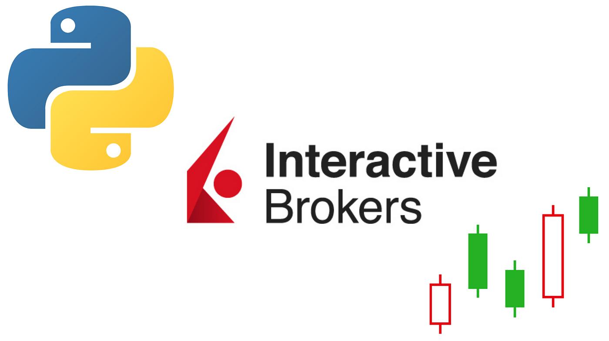

## Table of Contents

## What is the Interactive Brokers API and what can it be used for?

The Interactive Brokers API, also known as the Trader Workstation API (TWS API), is a tool provided by Interactive Brokers that allows you to connect your own software to their trading platform. This means you can create programs that automatically buy or sell stocks, options, futures, and other financial products without having to click buttons on the Interactive Brokers website.

With the Interactive Brokers API, you can do many things that would be hard to do manually. For example, you can set up your computer to watch the market all day and make trades based on specific rules you set. This can be useful for people who want to trade a lot or who want to use complex strategies. It's also helpful for people who want to test their trading ideas without having to watch the market all the time.

## How do I set up an account with Interactive Brokers to use their API?

To set up an account with Interactive Brokers and use their API, you first need to go to their website and sign up for an account. You'll need to fill out some personal information and choose the type of account you want. Once you've submitted your application, Interactive Brokers will review it and, if approved, you'll get an email with instructions on how to finish setting up your account. Make sure to follow all the steps carefully, including funding your account with the minimum required amount.

After your account is set up and funded, you can start using the API. You'll need to download the Trader Workstation (TWS) software from the [Interactive Brokers](/wiki/interactive-brokers-api) website. Once installed, you can log in to TWS and enable API access in the settings. Interactive Brokers will give you a unique API key that you'll use to connect your own software to their platform. With this setup, you can start writing your own programs to trade automatically or to get data from the market.

## What are the basic steps to start using the Interactive Brokers API?

To start using the Interactive Brokers API, first make sure you have an account with Interactive Brokers and it's funded with the minimum required amount. Then, download and install the Trader Workstation (TWS) software from their website. Once TWS is installed, log in to your account and go to the settings to enable API access. Interactive Brokers will provide you with a unique API key that you'll need to use in your own software.

After you've enabled API access and gotten your API key, you can start connecting your own programs to the Interactive Brokers platform. You'll need to write code that uses the API to send and receive data. There are libraries available for many programming languages, like Python, Java, and C++, that make it easier to work with the API. These libraries come with examples and documentation to help you get started. Once your program is set up, you can use it to automatically trade or to gather market data.

## What programming languages are supported by the Interactive Brokers API?

The Interactive Brokers API supports many programming languages, making it easy for different people to use it. Some of the languages you can use are Python, Java, C++, C#, and even Excel VBA. This means you can pick the language you know best or the one that works best for what you want to do.

Each language has its own set of tools and libraries that help you connect to the Interactive Brokers platform. For example, if you use Python, you can use the ibapi library, which has a lot of examples and guides to help you get started. This makes it easier to write programs that can trade automatically or get market data, no matter which language you choose.

## How do I install and configure the TWS API?

First, to install and configure the TWS API, you need to download the Trader Workstation (TWS) software from the Interactive Brokers website. After downloading, install the software on your computer and log in to your Interactive Brokers account. Once you're logged in, go to the settings or configuration menu and look for the option to enable API access. Enabling this will give you an API key, which is a special code you'll use to connect your programs to the Interactive Brokers platform.

After enabling API access and getting your API key, you need to choose a programming language to work with the API. Interactive Brokers supports many languages like Python, Java, C++, and others. For example, if you choose Python, you'll need to install the ibapi library. You can do this using a command like `pip install ibapi` in your command line. Once the library is installed, you can start writing your code to connect to the TWS API using your API key. This will let you send and receive data, and automate your trading or gather market information.

## What are some common use cases for the Interactive Brokers API?

One common use for the Interactive Brokers API is to automate trading. This means you can set up your computer to buy and sell stocks, options, or other financial products based on rules you create. For example, you could write a program that automatically buys a stock when its price goes below a certain level and sells it when the price goes up. This can save you time and help you trade more often than if you had to do everything by hand.

Another use is to gather and analyze market data. With the API, you can pull in lots of information about the market, like stock prices, trading volumes, and more. You can then use this data to look for patterns or to test out trading ideas without risking real money. This can be really helpful if you want to make better trading decisions based on what's happening in the market.

A third use is for managing a portfolio. The API lets you keep track of all your investments and make changes to them easily. For example, you could use it to automatically rebalance your portfolio, which means adjusting your investments to keep them in line with your goals. This can help you manage your money more effectively without having to check on it all the time.

## How can I manage risk and implement trading strategies using the API?

Using the Interactive Brokers API, you can manage risk by setting up rules in your program that automatically stop trades if they start to lose too much money. For example, you can use something called a "stop-loss order," which tells the computer to sell a stock if its price drops to a certain level. This helps you limit how much money you could lose on a single trade. You can also use the API to spread your money across different investments, which is called diversification. This way, if one investment goes down, the others might still do well, reducing your overall risk.

You can also use the API to implement trading strategies by writing code that follows specific rules for buying and selling. For example, you might want to use a strategy called "[momentum](/wiki/momentum) trading," where you buy stocks that are going up and sell them when they start to go down. With the API, you can set up your computer to watch the market and make these trades automatically, based on the rules you've written. This can help you stick to your strategy without getting distracted by emotions or other things happening in the market.

## What are the limitations and costs associated with using the Interactive Brokers API?

Using the Interactive Brokers API has some limitations you should know about. First, there are limits on how many requests you can make to the API in a certain amount of time. This means you can't send too many orders or ask for too much data all at once. Also, the API might not work perfectly all the time, so you need to be ready for things like delays or errors. Another thing is that some advanced features or data might need special permission from Interactive Brokers, so you might not be able to use everything right away.

There are also costs to think about when using the Interactive Brokers API. You'll need to pay for the data you use, like stock prices or market information. The cost depends on how much data you need and what kind it is. Also, Interactive Brokers charges fees for trading, so the more you trade using the API, the more you'll pay in fees. It's a good idea to look at all these costs and make sure they fit with your budget before you start using the API a lot.

## How can I handle errors and ensure the reliability of my API connections?

To handle errors when using the Interactive Brokers API, you need to write your code in a way that can deal with problems that might come up. For example, you can use something called "try-catch" blocks in your programming language to catch errors and do something about them, like stopping a trade or sending you a message. You should also keep an eye on the API's status to make sure it's working right. If you see a lot of errors, you might need to slow down your requests or wait a bit before trying again. This helps make sure your program doesn't break if something goes wrong.

To make sure your API connections are reliable, you should test your program a lot before you start using it for real. Try different situations and see how your program handles them. You can also set up your code to reconnect to the API if it gets disconnected. This way, if there's a problem with the connection, your program can try again without you having to do anything. Keeping your software up to date and following Interactive Brokers' guidelines can also help keep your connections strong and working well.

## What advanced features does the Interactive Brokers API offer for experienced traders?

The Interactive Brokers API offers advanced features that can help experienced traders take their strategies to the next level. One of these features is the ability to use algo trading, which means you can set up complex trading algorithms that can make trades based on many different factors all at once. This can help you follow very specific strategies without having to watch the market all the time. Another advanced feature is the ability to use options and futures trading, which can be more complex but also more powerful than just trading stocks. With the API, you can set up your program to automatically buy and sell these types of financial products based on your rules.

Another advanced feature is the ability to use real-time market data to make quick trading decisions. The API lets you get this data fast, so you can react to what's happening in the market right away. This can be really helpful if you want to use strategies that depend on quick changes in the market. Also, the API supports risk management tools, like setting up stop-loss orders and other ways to limit how much money you can lose. This can help you keep your trading under control, even when things get complicated.

## How can I optimize the performance of my applications using the Interactive Brokers API?

To make your programs that use the Interactive Brokers API work faster and better, you need to think about how you use the API. One way to do this is by making fewer requests to the API. Instead of asking for data all the time, you can set up your program to ask for data in bigger chunks or less often. This can help because the API has limits on how many requests you can make, and if you go over these limits, your program might slow down or even stop working. Another way to make your program run smoother is by using something called "asynchronous programming." This means your program can do more than one thing at the same time, like asking for data and making trades, without waiting for each task to finish before starting the next one.

Also, you should keep an eye on how much data your program is using and try to use less if you can. For example, if you only need certain parts of the market data, you can ask for just those parts instead of getting everything. This can save time and make your program run faster. It's also a good idea to test your program a lot to see where it's slow and fix those parts. By doing all these things, you can make your programs that use the Interactive Brokers API work better and faster, which can help you trade more effectively.

## What are the best practices for securing my applications that use the Interactive Brokers API?

When using the Interactive Brokers API, it's important to keep your programs safe. One of the best things you can do is to keep your API key secret. This key is like a special code that lets your program talk to Interactive Brokers, so if someone else gets it, they could use it to mess with your trades. Make sure to store the key in a safe place, like using environment variables or a secure file, instead of putting it right in your code where anyone can see it. Also, use strong passwords for your Interactive Brokers account and change them often to keep your account safe.

Another good practice is to use something called "encryption" to keep the information your program sends and receives private. This means that even if someone tries to look at the data while it's moving between your computer and Interactive Brokers, they won't be able to understand it. You should also set up your program to check if the person using it is really you, which is called "authentication." This can stop someone else from using your program without your permission. By following these simple steps, you can help make sure your programs that use the Interactive Brokers API are safe and secure.

## References & Further Reading

[1]: [RESTful API: A Simple Overview](https://www.redhat.com/en/topics/api/what-is-a-rest-api)

[2]: [TWS API Documentation - Interactive Brokers](https://www.interactivebrokers.com/en/index.php?f=5041)

[3]: [FIX Protocol Ltd. - FIX Overview](https://www.fixtrading.org/what-is-fix/)

[4]: [Interactive Brokers - Trader Workstation (TWS) Download](https://www.interactivebrokers.com/en/index.php?f=16040)

[5]: [`ib-insync` library on GitHub](https://github.com/erdewit/ib_insync)

[6]: [InfluxDB Official Documentation](https://www.influxdata.com/)

[7]: [PostgreSQL Official Website](https://www.postgresql.org/)

[8]: [Amazon S3 Official Page](https://aws.amazon.com/s3/)

[9]: [IB News and Bulletins API](https://interactivebrokers.github.io/tws-api/news.html)

[10]: [IB Market Scanners](https://interactivebrokers.github.io/tws-api/market_scanners.html)

[11]: [Interactive Brokers Options Trading](https://www.interactivebrokers.com/en/index.php?f=14193)

[12]: [Telegram Bots](https://core.telegram.org/bots)

[13]: [Event-Driven Architecture](https://www.ibm.com/cloud/learn/event-driven-architecture)

[14]: [IB API EClient](https://interactivebrokers.github.io/tws-api/annotated.html)

[15]: [IB API EWrapper](https://interactivebrokers.github.io/tws-api/interfaceIBApi_1_1EWrapper.html)

[16]: [Reddit AlgoTrading Community](https://www.reddit.com/r/algotrading/)

[17]: "[Working with Options](https://interactivebrokers.github.io/tws-api/options.html)." TWS API Guide.

[18]: "[Market Scanners](https://interactivebrokers.github.io/tws-api/market_scanners.html)." TWS API Guide.

[19]: "[News Feeds and Bulletins](https://interactivebrokers.github.io/tws-api/news.html)." TWS API Guide.

[20]: "[TWS API v9.72+: Error Handling](https://interactivebrokers.github.io/tws-api/error_handling.html)." TWS API Guide.