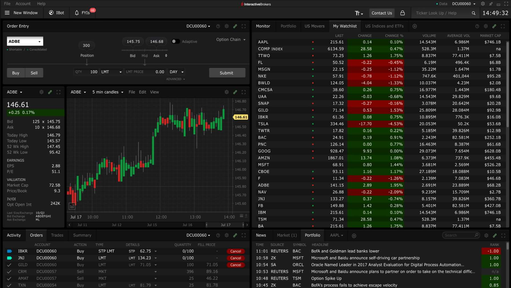

Application Programming Interfaces (APIs) stand as powerful tools that bridge the gap between software applications, enabling them to communicate, share data, and function in a synchronized manner. Essentially, APIs act as messengers, taking a request from one system and ensuring the other system receives and acts upon it. They play a pivotal role in modern trading by automating trades, fetching real-time market data, and executing complex trading strategies.

Interactive Brokers, a titan in the brokerage industry, has made significant strides in leveraging the power of APIs. Established in 1978, Interactive Brokers (often abbreviated as IBKR) has grown into a global trading platform, renowned for its advanced trading tools, diverse asset offerings, and robust technological infrastructure. What makes Interactive Brokers stand out, especially among tech-savvy traders, is its suite of APIs. These APIs not only provide direct access to the markets but also allow traders to create custom trading applications, tailored to their unique strategies and needs.



As trading continues to evolve, the synergy between brokerage platforms like Interactive Brokers and the world of APIs becomes even more profound. This guide investigates into the heart of this relationship, exploring the intricacies of Interactive Brokers' API offerings, and showcasing how they can be the linchpin in your trading journey.

## Table of Contents

## Understanding the Different Interactive Brokers APIs

### Client Portal API

The Client Portal API, offered by [Interactive Brokers](/wiki/interactive-brokers-api), is built upon the RESTful API standards[1]. REST (Representational State Transfer) is an architectural style that uses standard HTTP methods and status codes, making it easier for developers to interact with services using standard web technologies and protocols. With RESTful APIs, developers can perform CRUD (Create, Read, Update, Delete) operations using the standard HTTP verbs like GET, POST, PUT, and DELETE, which are intuitive and straightforward.

Key functionalities of the Client Portal API stand out, demonstrating its comprehensive nature. Users can efficiently place orders, making the trading process seamless. The API also provides WebSocket streaming, an advanced technology that facilitates real-time data transmission. This feature is vital for traders who rely on live [market data](https://paperswithbacktest.com/datasets), allowing them to receive updates instantaneously without the need for repeated requests. Furthermore, the Client Portal API offers functionalities like viewing trades, accessing account data, and more, making it a well-rounded tool for trading and portfolio management.

### Trader Workstation (TWS) API

The Trader Workstation (TWS) API is Interactive Brokers' proprietary, open-source API that facilitates automation of numerous trading and account management tasks[2]. As the backbone of IBKR's digital infrastructure, it is designed to integrate seamlessly with the Trader Workstation, one of the most powerful trading platforms available.

One of the distinct advantages of the TWS API is its extensive support for various programming languages. It caters to a wide range of developers by providing bindings for languages such as Java, C++, C#, Python, and more. This vast language support ensures that developers can integrate and build applications in an environment they are most comfortable with, [minimizing the learning curve](https://paperswithbacktest.com/[course](/wiki/best-algorithmic-trading-courses)) and speeding up development.

In terms of development environments, the TWS API is versatile. Whether one is building standalone applications, web-based platforms, or even [algorithmic trading](/wiki/algorithmic-trading) systems, the API's comprehensive documentation and code samples cater to a wide range of use cases, ensuring adaptability in different scenarios.

But what truly sets the TWS API apart from other APIs in the market is its depth and breadth of functionality. Traders can automate tasks ranging from order submission, portfolio management, to accessing real-time and [historical market data](https://paperswithbacktest.com/datasets). Its tight integration with the TWS platform ensures that users have a seamless experience, where manual and automated operations can coexist. Additionally, the fact that it's open-source ensures transparency, allowing traders and developers to scrutinize the codebase, adapt it to their needs, and even contribute to its improvement.

To put it succinctly, the TWS API offers a potent combination of flexibility, transparency, and robustness, making it an indispensable tool for traders and developers aiming to leverage the full potential of the Interactive Brokers ecosystem.

### FIX

The Financial Information eXchange (FIX) protocol stands as a beacon in the world of electronic trading, originally established to cater to real-time communication of trade-related messages. Recognized as a dynamic industry standard, FIX is a session-layer messaging standard designed to meet the real-time, multi-partner communication needs for complex trading strategies across a variety of asset classes[3].

Interactive Brokers, along with many in the industry, utilizes FIX for its sheer robustness. It offers a reliable, consistent method of communication, independent of underlying hardware systems, making it highly versatile. Additionally, its resilience is evident in its adaptability to ever-evolving market conditions and trading paradigms. FIX protocol can handle vast message [volume](/wiki/volume-trading-strategy)s without compromising speed or accuracy, making it indispensable for high-frequency trading setups.

However, there are inherent limitations to the FIX protocol, especially when deployed with Interactive Brokers. Notably, it does not provide [access to market data](https://paperswithbacktest.com/datasets) or account data, which means traders and developers might have to supplement FIX with another solution or method to access this critical information. Moreover, while FIX is superbly adept at order routing and execution report messages, other API solutions may offer broader functionalities and may be more suitable for certain applications.

For institutions or professional traders that already have a FIX infrastructure in place, integrating with Interactive Brokers using FIX is straightforward and logical. It's also an excellent choice for those who prioritize speed and reliability in order execution and are less concerned with broader functionalities. Moreover, for algorithmic traders aiming for low latency, high-frequency strategies, the FIX API's speed and efficiency are unmatched.

All in all, while the FIX protocol has its limitations, its undoubted strength lies in its robustness, making it an essential tool in the repertoire of many a trader.

## Getting Started with Interactive Brokers API

With a step-by-step approach, the process of getting started with the Interactive Brokers (IB) API becomes straightforward. Here's a distilled guide to get you started:

1. **Account Creation and Configuration**:
    - Before delving into the API, ensure you have an active account with Interactive Brokers. If not, register on their official website.
    - Once registered, log into the Client Portal. Navigate to the 'Settings' and then 'API'. Here, you will have the option to generate an API key for the Client Portal API or set up the necessary permissions for TWS API.
2. **Downloading the Necessary Software**:
    - For the TWS API: Download and install the Trader Workstation (TWS) platform[4].
    - For the Client Portal API: No additional software download is required, but ensure you have your API key saved.
3. **Picking the Right IDE**:
    - An Integrated Development Environment (IDE) is a crucial tool for any developer. It streamlines coding, debugging, and testing. Depending on your chosen programming language, some popular IDEs includelearn Eclipse, PyCharm, and Visual Studio.
    - For those using Python with IB's API, PyCharm is highly recommended due to its robust features tailored for Python development.
4. **Installation and SDK Setup**:
    - After downloading the TWS software, grab the corresponding Software Development Kit (SDK) for your programming language of choice from IB's official site. This kit contains code samples, libraries, and documentation.
    - Extract the SDK to your workspace, and ensure to reference the relevant libraries in your development environment.
5. **Third-Party Platforms and Excel Integrations**:
    - Many traders love Excel for its data visualization and manipulation capabilities. IB API supports direct integration with Excel, allowing real-time data fetching and trade placement directly from spreadsheets.
    - To set up, download the Excel DDE templates provided by IB. Load them into Excel and establish a connection with TWS or the Client Portal. Once connected, you can customize your trading operations within Excel.
    - Apart from Excel, the IB API can be integrated with numerous third-party platforms like NinjaTrader or Multicharts, enabling users to harness these platforms' unique features while benefiting from IB's extensive trade network.
6. **Documentation and First Steps**:
    - Familiarize yourself with IB's official API documentation. It's an invaluable resource, detailing functionalities and offering code samples.
    - Start with basic tasks: fetching account details, retrieving market data, or placing a simple order. As you grow more comfortable, you can explore advanced features and optimizations.

## Dive into Different API Implementations

### Python Integration with Interactive Brokers API

Python stands as one of the most popular languages in the financial sector due to its simplicity, versatility, and the extensive libraries it offers. When combined with trading, Python's powerful data manipulation and analysis capabilities enable traders to craft intricate trading strategies with ease. Its open-source nature means that a plethora of libraries, tools, and resources are continually being developed and refined by the community, making Python an ideal choice for algorithmic trading.

Interactive Brokers, recognizing Python's ubiquity in the trading world, has made efforts to accommodate Python developers. However, it's essential to understand that while there's no native Python API provided by Interactive Brokers, several third-party libraries bridge this gap.

IBridgePy and IbPy are two such renowned third-party libraries that facilitate Python integration with Interactive Brokers' API.

- [**IBridgePy**](http://www.ibridgepy.com/documentation/) is user-friendly and can be considered more beginner-centric. It allows for quick deployment of live trading algorithms and provides straightforward functionalities for fetching real-time data, historical data, and executing orders.
- [**IbPy**](https://github.com/blampe/IbPy), on the other hand, is an older third-party library that wraps the Java-based API for Python. Although not as intuitive as IBridgePy, many traders who've been in the field for a while might be familiar with this library.

Given the two options, for newcomers or those who prefer more straightforward implementations, IBridgePy might be more appealing. Experienced developers or those with specific needs might lean towards IbPy due to familiarity or for more in-depth customization.

For those looking to implement advanced trading algorithms, Python's expansive ecosystem comes into play. Libraries such as Pandas for data manipulation, NumPy for numerical operations, and TA-Lib for technical indicators can be integrated seamlessly with either IBridgePy or IbPy. This amalgamation allows traders to:

- Construct mean-reversion strategies using Bollinger Bands or moving averages.
- Deploy [momentum-based strategies](https://paperswithbacktest.com/paper/fact-fiction-and-momentum-investing) harnessing MACD or RSI indicators.
- Create machine learning models to predict price movements and execute trades accordingly.

The combination of Python's strengths with Interactive Brokers' comprehensive trading functionalities makes it a formidable tool in the hands of both novice and seasoned traders. Whether you're looking to deploy a simple moving average crossover strategy or a complex [neural network](/wiki/neural-network)-based prediction model, Python, in tandem with Interactive Brokers, provides the necessary arsenal.

### Excel API Integration

For many finance professionals, Excel is a trusted tool that they use daily. Bridging Excel with the Interactive Brokers API offers a seamless experience, merging the power of algorithmic trading with the familiarity and flexibility of spreadsheets. Here's how to do it:

**Step-by-step Guide to Set Up Excel for API Integration:**

1. **Install Interactive Brokers' Trader Workstation (TWS)**: Ensure you have the latest version of TWS installed.
2. **Enable ActiveX and Socket Clients**:
    - Launch TWS, navigate to `File` > `Global Configuration` > `API` > `Settings`.
    - Tick the checkbox for "Enable ActiveX and Socket Clients."
3. **Define a Port Number**: Still in the API settings, note down the port number (default is 7496 for live trading and 7497 for paper trading). This will be essential when connecting Excel.
4. **Download [IB's Excel Sample](https://interactivebrokers.github.io/tws-api/excel.html)**: Interactive Brokers provides a sample Excel file to help get you started. This file contains VBA code to facilitate the API connection.
5. **Open the Sample in Excel**: Make sure you enable macros. Navigate to `Developer` > `Visual Basic`. Within the VBA editor, you'll see the code used to integrate with the API.
6. **Connect Excel to TWS**: In the Excel sample, locate and click the "Connect" button. Input your TWS username, password, and the earlier noted port number. Upon successful connection, Excel can now fetch data from TWS and place orders.
7. **Customize as Needed**: The sample provides basic functionalities. Depending on your requirements, you can modify or expand the VBA code to suit your trading strategies.

**Use Cases and Benefits:**

- **Real-time Data Monitoring**: You can pull real-time stock, options, or futures data into Excel, allowing for live monitoring of market conditions.
- **Risk Management**: With Excel's computational capabilities, you can implement on-the-fly risk management calculations and conditional trading strategies.
- **Order Placement**: Directly place, modify, or cancel orders from within Excel, based on specific conditions or triggers you set.
- **Portfolio Analysis**: Combine the power of Excel's data analysis tools with live portfolio data, giving insights to optimize your trading strategies.
- **Historical Data Analysis**: Access and analyze historical data in a tabulated format, which can be instrumental in back-testing trading strategies.
- **Automation**: With VBA, automate repetitive tasks such as monitoring specific stocks, generating alerts, or even auto-trading under predefined conditions.

Integrating Excel with the Interactive Brokers API offers the best of both worlds – the algorithmic strength of an API and the flexibility of a spreadsheet. This combination opens a world of possibilities, from crafting intricate trading algorithms to detailed portfolio analysis and everything in between.

### Other Noteworthy Implementations

Interactive Brokers, with its extensive API, has paved the way for third-party platforms to integrate and offer additional features, catering to a wide variety of traders and developers. Exploring these third-party platforms can open doors to functionalities and ease that might not be immediately available with the native implementation.

**MetaTrader 4 and 5 (MT4/MT5)**: Recognized globally, the MetaTrader platforms offer advanced charting tools and automated trading capabilities. With the MT4/MT5 bridge, traders can seamlessly connect to Interactive Brokers and enjoy the benefits of both platforms.

**NinjaTrader**: Primarily designed for futures and forex trading, NinjaTrader has become a favorite for many due to its advanced charting and [strategy backtesting capabilities](https://blog.paperswithbacktest.com/p/backtesting-a-trading-strategy-on). Integration with Interactive Brokers allows traders to leverage NinjaTrader's features with IB's extensive market reach.

**TradeStation**: Another platform that's gained traction among serious traders, TradeStation offers strategy testing, optimization, and automation. Its EasyLanguage scripting language makes it simpler to design custom trading strategies. By integrating with Interactive Brokers, it extends its robustness to a broader market.

**Sierra Chart**: This platform stands out for its high-quality charting, technical analysis, and trading integration. The Sierra Chart bridge to Interactive Brokers provides a smooth trading experience, combining the depth of Interactive Brokers' market data with Sierra's comprehensive charting tools.

**Multicharts**: Known for its high-definition charting and precise backtesting, Multicharts offers a robust trading environment. Through its Interactive Brokers integration, it ensures traders get a versatile platform blending analytical prowess with expansive market data.

**Quodd**: A platform known for its real-time streaming data, Quodd's integration with Interactive Brokers ensures traders get a fast, reliable data stream, which is crucial for day trading and scalping strategies.

It's essential to recognize that the best platform is subjective and depends on individual trading needs. Whether it's advanced charting, high-frequency trading, [[backtesting](/wiki/backtesting)](https://blog.paperswithbacktest.com/p/backtesting-a-trading-strategy-on), or automation, there's likely a third-party platform integrated with Interactive Brokers that caters to those specific needs. Always trial a platform first, ensuring it aligns with your strategies and requirements, before fully diving in.

## Diving Deep with Python

### Interactive Brokers Python Native API: An Overview

Python's rise as a dominant programming language in the financial and trading sector isn't just by chance. Its simplicity combined with a vast ecosystem of libraries makes it a top choice for algorithmic trading. Interactive Brokers (IB), being forward-thinking, naturally provides native support for Python, allowing traders to harness the full potential of this popular language.

**Why Choose the Python Native API Over Others?**

1. **Simplicity & Versatility**: Python's syntax is clean, making the code easily readable and maintainable. This clarity is crucial when developing trading algorithms, where a single mistake can be costly.
2. **Vast Ecosystem**: Python boasts a rich selection of libraries for data analysis, machine learning, and financial modeling, such as pandas, numpy, and scikit-learn. This abundance makes it easier to integrate complex data analysis and modeling directly into trading strategies.
3. **Community Support**: The vibrant Python community means that any challenges faced during development can often be quickly resolved through community forums or existing documentation.

**Comparing IB Python Native API with Third-Party Libraries**:

While IB's native Python API is comprehensive, there are third-party libraries like `ib-insync`[5] that offer a more "Pythonic" approach to interacting with IB's services.

- **IB Python Native API**:
    - Directly developed by Interactive Brokers, ensuring optimal compatibility and regular updates.
    - Offers the most granular control over trading actions and data retrieval.
    
    ```python
    from ibapi.client import EClient
    from ibapi.wrapper import EWrapper
    
    class IBApp(EWrapper, EClient):
        def __init__(self):
            EClient.__init__(self, self)
    
    app = IBApp()
    app.connect("127.0.0.1", 7497, 0)
    app.run()
    ```
    
- **ib-insync**:
    - Provides a more intuitive, higher-level interface, reducing the amount of boilerplate code.
    - Especially beneficial for users looking for rapid development without delving deep into the intricacies of the API.
    
    ```python
    from ib_insync import IB
    
    ib = IB()
    ib.connect("127.0.0.1", 7497, clientId=1)
    print(ib.positions())
    ```
    

While both options have their strengths, the best choice often depends on the specific needs and familiarity of the trader. Those aiming for rapid development might lean towards `ib-insync`, while those looking for more granular control might prefer the native API.

By integrating Python into their trading strategies with the Interactive Brokers API, traders can effectively harness the language's simplicity, versatility, and vast ecosystem. Whether through the native API or third-party libraries, the combination of Python and IB offers a potent toolkit for modern algorithmic trading.

### Mastering Data Retrieval

The Interactive Brokers API provides robust tools for fetching this data, both in real-time and historically, enabling traders to make informed decisions.

**Fetching Real-Time Data for Various Assets**:

Interactive Brokers offers comprehensive market data across assets. Whether it's equities, [forex](/wiki/forex-system), or even cryptocurrencies, the API ensures you're equipped with the latest market information.

```python
from ibapi.client import EClient
from ibapi.wrapper import EWrapper
from ibapi.contract import Contract

class DataFetcher(EWrapper, EClient):
    def __init__(self):
        EClient.__init__(self, self)

    def realtimeBar(self, reqId, time, open, high, low, close, volume, wap, count):
        print("Real-time Bar:", time, open, close)

app = DataFetcher()
app.connect("127.0.0.1", 7497, 0)

## Defining the asset - e.g., Apple stock
stock = Contract()
stock.symbol = "AAPL"
stock.secType = "STK"
stock.exchange = "SMART"
stock.currency = "USD"

app.reqRealTimeBars(1, stock, 5, "MIDPOINT", True, [])
app.run()
```

**Harnessing Historical Market Data for Backtesting**:

For those looking to validate their trading strategies, historical market data is invaluable. With the IB API, you can easily [fetch past market data to fuel your backtesting engines](https://blog.paperswithbacktest.com/p/backtesting-a-trading-strategy-on).

```python
def historicalData(self, reqId, bar):
    print("Historical Data:", bar.date, bar.open, bar.close)

## Requesting the past 1 year of daily data
app.reqHistoricalData(2, stock, "", "1 Y", "1 day", "MIDPOINT", 0, 2, False, [])
```

**Best Practices for Storing and Managing Historical Data**:

1. **Database Integration**: Opt for time-series databases like InfluxDB[6] or relational databases like PostgreSQL[7] to efficiently store large sets of market data. These ensure quick retrieval times, essential for algorithmic trading.
2. **Consistent Data Format**: Ensure data consistency by storing it in universal formats like OHLCV (Open, High, Low, Close, Volume).
3. **Regular Backups**: Ensure periodic backups of your data. Cloud storage solutions like Amazon S3[8] offer affordable and reliable storage options.
4. **Avoid Duplication**: When updating your database, implement checks to avoid inserting duplicate data points.

With mastery over data retrieval through the Interactive Brokers API and best practices in storing and managing this data, traders can create a solid foundation for their algorithmic strategies, ensuring they're operating with accurate and timely market information.

### Trade Automation with Python

Trade automation, especially when executed proficiently, can significantly improve the efficiency and consistency of trading strategies. By utilizing the Interactive Brokers Python Native API, you can seamlessly integrate complex trade functions into your workflow. Here's a comprehensive guide on automating your trades with Python.

**Setting up Trades, Stop Losses, and Take Profits**:

The foundation of trade automation is to initiate trades and protect investments. With the Interactive Brokers API, you can set up trades, as well as implement stop losses and take profits.

```python
from ibapi.client import EClient
from ibapi.wrapper import EWrapper
from ibapi.order import Order
from ibapi.contract import Contract

class TradeBot(EWrapper, EClient):
    def __init__(self):
        EClient.__init__(self, self)

app = TradeBot()
app.connect("127.0.0.1", 7497, 0)

## Defining a stock contract, for instance, Microsoft
msft_contract = Contract()
msft_contract.symbol = "MSFT"
msft_contract.secType = "STK"
msft_contract.exchange = "SMART"
msft_contract.currency = "USD"

## Placing an order
order = Order()
order.action = "BUY"
order.totalQuantity = 10
order.orderType = "LMT"
order.lmtPrice = 300
order.tif = "GTC"  # Good Till Cancel
order.ocaType = 1  # One Cancels All
order.transmit = False

stop_loss = Order()
stop_loss.action = "SELL"
stop_loss.totalQuantity = 10
stop_loss.orderType = "STP"
stop_loss.auxPrice = 290
stop_loss.parentId = order.orderId
stop_loss.transmit = True

take_profit = Order()
take_profit.action = "SELL"
take_profit.totalQuantity = 10
take_profit.orderType = "LMT"
take_profit.lmtPrice = 320
take_profit.parentId = order.orderId
take_profit.transmit = True

app.placeOrder(1, msft_contract, order)
app.placeOrder(2, msft_contract, stop_loss)
app.placeOrder(3, msft_contract, take_profit)
app.run()
```

**Event-driven Trading Scenarios**:

These scenarios are guided by specific market events, such as significant price movements or news updates.

```python
def priceAlert(self, tickerId, tickType, price, attrib):
    if price > threshold_price:
        self.placeOrder(order_id, contract, buy_order)
```

**Advanced Techniques - Option Trading and Setting Contingent Orders**:

Options provide leverage, protection, and yield enhancement. With the API, you can seamlessly trade options and set contingent orders based on various conditions.

```python
## Defining an option contract
option_contract = Contract()
option_contract.symbol = "MSFT"
option_contract.secType = "OPT"
option_contract.exchange = "SMART"
option_contract.currency = "USD"
option_contract.lastTradeDateOrContractMonth = "20240120"
option_contract.strike = 300
option_contract.right = "C"

## Contingent order based on price condition
contingent_order = Order()
contingent_order.action = "BUY"
contingent_order.totalQuantity = 1
contingent_order.orderType = "LMT"
contingent_order.lmtPrice = 10

price_condition = app.PriceCondition(1, "SMART", 310, app.PriceCondition.Greater, triggerMethod=app.PriceConditionEnum.Last)
contingent_order.conditions.append(price_condition)

app.placeOrder(4, option_contract, contingent_order)
```

By automating trades with the Interactive Brokers Python Native API, you are essentially supercharging your trading strategies, allowing for more precise, timely, and efficient trades.

### Error Handling and Troubleshooting

Working with the Interactive Brokers Python Native API offers a streamlined experience, but like any tool, it’s not immune to errors. Efficient troubleshooting can save time and mitigate potential losses. Here's a rundown of common errors and how to address them.

**1. Connection Errors**:

These arise when there’s a failure to establish a connection between your application and the Interactive Brokers servers.

```python
from ibapi.client import EClient
from ibapi.wrapper import EWrapper

class ConnectionHandler(EWrapper, EClient):
    def __init__(self):
        EClient.__init__(self, self)

    def error(self, reqId, errorCode, errorString):
        print(f"Error {errorCode}: {errorString}")

app = ConnectionHandler()
app.connect("127.0.0.1", 7497, 0)
```

Here, the `error` method provides feedback. If you see `Error 502: Couldn't connect to TWS`, ensure that TWS is running and the IP and port configurations match.

**2. Invalid Contract Errors**:

Errors can pop up if you provide an incorrect contract specification.

```python
from ibapi.contract import Contract

def createContract():
    contract = Contract()
    contract.symbol = "AAPL"
    contract.secType = "INVALID_TYPE"
    contract.exchange = "SMART"
    contract.currency = "USD"
    return contract
```

The above snippet has an invalid `secType`, which would result in an error. Ensure you specify the correct `secType` like "STK" for stocks.

**3. Order Submission Errors**:

These occur if an order's parameters aren’t specified correctly.

```python
from ibapi.order import Order

def createOrder():
    order = Order()
    order.action = "BUY"
    order.totalQuantity = -10  # Invalid negative quantity
    order.orderType = "LMT"
    order.lmtPrice = 300
    return order
```

Ensure all parameters, like `totalQuantity`, are valid. Negative values or undefined fields can lead to submission errors.

**Insights on Efficient Debugging and Seeking Support**:

1. **Logging**: Regularly log all responses and errors. The IB API's `error` method provides valuable error information.
2. **Testing in Paper Trading**: Before deploying in a live environment, always test strategies and orders in a paper trading account to catch errors risk-free.
3. **Community and Official Support**: The Interactive Brokers API community is active, and numerous forums and discussion groups can offer insights. Additionally, the [official documentation](https://interactivebrokers.github.io/tws-api/) provides comprehensive guides on potential errors and their solutions.

```python
## A simple logging example:
import logging

logging.basicConfig(level=logging.INFO)

def error_handler(reqId, errorCode, errorString):
    logging.error(f"Error {errorCode}: {errorString}")

## This will log all errors, aiding in troubleshooting.
```

Remember, while errors are inevitable, efficient troubleshooting and error handling can ensure a smooth and optimized trading experience.

### Integrations and Extensions

Interactive Brokers offers a plethora of features that go beyond mere trading. Integrating these with your trading strategies can amplify results, help in informed decision-making, and streamline operations. Let’s deep dive into some powerful integrations and extensions available to IB users.

**1. Using IB Bulletins and News for Data-Driven Decisions**:

Real-time news and bulletins can significantly impact market dynamics. IB provides a News API that can fetch the latest financial news from various sources[9]. By integrating this feature, traders can ensure their strategies are informed by the most recent market developments.

```python
## Sample code to retrieve news headlines
newsArticle = ib.reqHistoricalNews(conId, providers, startDateTime='', endDateTime='', totalResults=10)
```

**2. Implementing Market Scanners for Trade Signals**:

Market scanners are vital tools for traders looking to identify opportunities based on specific criteria. IB’s API allows for the creation and customization of scanners to detect these trade signals[10].

```python
## Creating a simple market scanner
scannerSubscription = ScannerSubscription()
scannerSubscription.instrument = "STOCK.EU"
scannerSubscription.locationCode = "STK.EU.IBIS"
scannerSubscription.scanCode = "TOP_PERC_GAIN"

scanData = ib.reqScannerData(scannerSubscription, [])
```

**3. Exploring the World of Options**:

Options trading offers a wide range of strategies, from basic calls and puts to more advanced techniques like iron condors or butterflies. The Interactive Brokers API supports comprehensive options data retrieval and order placement, enabling both beginners and seasoned traders to deep dive into the versatility of options trading[11].

```python
## Sample code for an options contract and placing a simple call order
optionContract = Contract()
optionContract.symbol = "AAPL"
optionContract.secType = "OPT"
optionContract.exchange = "SMART"
optionContract.currency = "USD"
optionContract.lastTradeDateOrContractMonth = "20230120"
optionContract.strike = 150
optionContract.right = "C"

order = Order()
order.action = "BUY"
order.totalQuantity = 1
order.orderType = "LMT"
order.lmtPrice = 5.00

ib.placeOrder(optionContract, order)
```

**4. Automating Notifications and Updates**:

Staying updated on your trades and market conditions is crucial. With the API's capabilities, you can integrate notifications into platforms like Telegram[12], ensuring you’re instantly informed of significant account and market events.

```python
import telebot

TOKEN = 'YOUR_TELEGRAM_BOT_TOKEN'
bot = telebot.TeleBot(TOKEN)

@bot.message_handler(commands=['start', 'help'])
def send_welcome(message):
    bot.reply_to(message, "Your IB API bot is up and running!")

## Sending a notification on a filled order
def order_filled_notification(orderId, status, filled):
    if status == "Filled":
        bot.send_message(chat_id="YOUR_CHAT_ID", text=f"Order {orderId} has been filled with {filled} units!")

## Implement the function in your main event loop or appropriate callback
```

Harnessing these integrations and extensions optimizes the trading experience, equipping traders with a diverse toolkit for various market scenarios.

### Advanced Concepts and Technicalities

Interactive Brokers API, like any sophisticated trading software, has a multi-faceted architecture that allows traders to interact with markets efficiently. To leverage its full potential, one must grasp its foundational concepts and components.

**Architecture of Interactive Brokers API**:

At its core, the Interactive Brokers (IB) API is designed to facilitate communication between your custom application, be it an algorithmic trading strategy or a data analysis tool, and the IB servers. This is achieved through a two-pronged architecture:

1. **Client-Server Model**: Your application acts as the client, sending requests to and receiving responses from the IB servers, which play the role of the server. This model ensures that the API remains scalable and allows for multiple client applications to interact with the server simultaneously.
2. **Event-Driven Model**: The IB API is fundamentally event-driven, meaning that it responds to events (e.g., a market price change, an order execution, etc.) as they occur in real-time. This approach ensures low latency and real-time updates, which are essential for high-frequency trading strategies[13].

**Understanding EClient and EWrapper**:

- **EClient**: It's the gateway for all outgoing requests from your application to the IB servers. Whether you're placing an order, requesting market data, or querying account details, these tasks are initiated through the EClient. It handles the connection, manages server requests, and ensures data is transmitted securely and efficiently[14].
    
    ```python
    from ibapi.client import EClient
    client = EClient(wrapper)
    client.connect("127.0.0.1", 7497, 0)
    
    ```
    
- **EWrapper**: This is where the magic of the event-driven model shines. EWrapper is responsible for receiving the incoming data (responses from the IB servers) and handling them. For instance, if you request the current market price of a stock, once the data is received, the appropriate method in EWrapper is called to handle this data[15].
    
    ```python
    from ibapi.wrapper import EWrapper
    
    class IBapi(EWrapper):
        def error(self, reqId, errorCode, errorString):
            print("Error: ", reqId, " ", errorCode, " ", errorString)
    
    ```
    

**Handling Account and Portfolio Data for Strategy Development**:

Accurate and timely account and portfolio data are crucial when developing and deploying trading strategies. The IB API provides functionalities to request real-time updates on account values, portfolio contents, and account settings. By integrating this data into your algorithms, you can create dynamic strategies that adapt based on current portfolio holdings, available capital, or other account-specific metrics.

For instance, if you're implementing a risk-management module, real-time account data can be used to calculate and maintain an optimal level of leverage or to ensure specific position sizing rules:

```python
## Sample code to request account and portfolio data
client.reqAccountUpdates(True, "YOUR_ACCOUNT_CODE")

def updateAccountValue(self, key, value, currency, accountName):
    print("Account Update: ", key, " ", value, " ", currency, " ", accountName)

```

Understanding the depths of the Interactive Brokers API architecture and its core components can significantly enhance the efficiency, reliability, and performance of your trading applications. With a firm grasp of these concepts, traders and developers alike can build more resilient and powerful systems.

## Trading with Interactive Brokers API

### Understanding the Financial Instruments (Contracts)

Financial instruments, in the context of trading platforms like Interactive Brokers, are essentially contracts between parties. These contracts can take various forms, ranging from stocks to derivatives, and each comes with its own set of specifications and characteristics.

**Stocks**: Representing ownership in a company, stocks grant the holder a claim on a portion of the company's assets and earnings. Traders can buy and sell shares of companies listed on exchanges, and the price is determined by market demand and supply. Stocks are typically used for both short-term trading and long-term investment strategies.

**Options**: Options give the holder the right, but not the obligation, to buy or sell an underlying asset (like a stock) at a predetermined price within a set time frame. There are two main types of options - 'Call' (right to buy) and 'Put' (right to sell). Options trading can be used for hedging, income generation, or speculative purposes.

**Futures**: Futures contracts obligate the buyer to purchase, and the seller to sell, a set quantity of an underlying asset at a future date for a price agreed upon today. Commonly traded assets in futures include commodities, currencies, and stock indices.

**Forex (Foreign Exchange)**: This involves the buying of one currency and the simultaneous selling of another. The forex market is the world's largest financial market, operating 24 hours a day during weekdays, and is driven by economic, political, and social factors of various countries.

**Bonds**: These are debt securities where an investor loans money to an entity (corporate or governmental) which borrows the funds for a specific period at a variable or fixed interest rate.

**ETFs (Exchange-Traded Funds)**: ETFs are similar to mutual funds but trade on stock exchanges much like individual stocks. They hold multiple underlying assets, like stocks, bonds, or commodities.

**Mutual Funds**: These are investment vehicles pooling together money from many investors to purchase a diversified portfolio of stocks, bonds, or other securities.

**Warrants**: Similar to options, warrants provide the holder the right but not the obligation to purchase a stock at a specific price before expiration. They are often issued by the company itself.

When engaging with Interactive Brokers, understanding the nuances and specifications of each instrument is crucial. For instance, options come with expiration dates, and futures might have delivery obligations. Cryptocurrencies, still a nascent field, can be subject to high [volatility](/wiki/volatility-trading-strategies) and regulatory scrutiny in various jurisdictions.

### Market Data

Market data is the lifeblood of trading. It encompasses a vast array of information about financial instruments, including prices, volumes, and other pertinent details. By tapping into this data, traders can make informed decisions, analyze market dynamics, and execute successful trades.

Interactive Brokers API offers a robust mechanism to access both real-time (streaming) and historical market data.

**Accessing Streaming Market Data**

Streaming or real-time market data provides live updates about financial instruments. To access this using the Interactive Brokers API:

1. Use the `reqMktData` function, specifying the financial instrument (or contract) you're interested in.
2. The API will then stream live updates, such as bid/ask prices, last traded price, and volume directly to your application.
3. Ensure you've handled all the events like `tickPrice`, `tickSize`, etc., to capture the data elements you need.

**Interpreting Streaming Data**

Streaming data can be rapid and voluminous. It's essential to understand the data points:

- **Bid and Ask Prices**: The prices at which buyers are willing to purchase and sellers are willing to sell, respectively.
- **Last Traded Price (LTP)**: The price at which the last trade occurred.
- **Volume**: The number of shares or contracts traded.

**Historical Market Data**

Historical data provides insights into how financial instruments performed in the past. It's invaluable for backtesting strategies, understanding market seasonality, and making future predictions.

To access historical data via the Interactive Brokers API:

1. Utilize the `reqHistoricalData` function. Define the instrument, the duration for which you want the data, and the bar size (like 1 hour, 1 day).
2. The API will return the requested data, typically including open, high, low, and close prices for each period.

**Importance of Historical Data**

While real-time data allows traders to make instantaneous decisions, historical data serves several critical functions:

- **Backtesting**: Before deploying a strategy in real-time, it's wise to test it against past data to gauge its potential effectiveness.
- **Pattern Recognition**: Historical data can help identify recurring patterns, which can be predictors of future movements.
- **Risk Management**: By analyzing historical data, traders can understand potential risks and tailor their strategies accordingly.

**Methodology of Accessing Historical Data**

When accessing historical data, consider:

- **Granularity**: Depending on your strategy, you might want data at minute levels or daily levels.
- **Data Completeness**: Ensure there are no missing data points, especially if you're analyzing for algorithmic trades.
- **Adjustments**: Be aware of stock splits, dividends, and other corporate actions that might affect price data.

In sum, market data, both streaming and historical, is pivotal for successful trading. With Interactive Brokers API, this data is readily accessible, allowing traders to harness it effectively.

### Making Orders

Executing trades efficiently is a critical aspect of any trading strategy. The Interactive Brokers API offers a seamless experience for placing orders, ranging from basic to advanced techniques, allowing for precise control over trading activities.

**Basics of Firing Orders**

The process of placing an order involves creating a contract object to specify the financial instrument and an order object that outlines the order details.

1. **Contract Object**: Define the security (e.g., stock, option) including the symbol, exchange, and currency.
2. **Order Object**: Specify the order type (e.g., market, limit), action (buy/sell), quantity, and other parameters.
3. **Place Order**: Use the `placeOrder` function to send the order to Interactive Brokers.

Here's a quick example of a market order for purchasing 100 shares of AAPL:

```python
from ibapi.contract import Contract
from ibapi.order import Order

## Define contract
contract = Contract()
contract.symbol = 'AAPL'
contract.secType = 'STK'
contract.exchange = 'SMART'
contract.currency = 'USD'

## Define order
order = Order()
order.action = 'BUY'
order.totalQuantity = 100
order.orderType = 'MKT'

## Place order
orderId = getNextOrderId()
ib.placeOrder(orderId, contract, order)
```

**Advanced Order Techniques**

- **Conditional Orders**: You can place orders that only execute when certain conditions are met. For example, an order to buy stock X only if stock Y is trading above a certain price.

```python
## Create a price condition
condition = PriceCondition()
condition.conId = getConIdForSymbol('Y')
condition.isMore = True
condition.price = targetPrice

## Attach condition to the order
order.conditions.append(condition)
```

- **Stop Loss and Take Profit**: A stop loss order is placed to sell an asset once it reaches a particular price point to limit losses. Conversely, a take profit order specifies a price at which to sell to lock in profits.

```python
## Stop loss order
stopLoss = Order()
stopLoss.action = 'SELL'
stopLoss.totalQuantity = 100
stopLoss.orderType = 'STP'
stopLoss.auxPrice = stopLossPrice

## Take profit order
takeProfit = Order()
takeProfit.action = 'SELL'
takeProfit.totalQuantity = 100
takeProfit.orderType = 'LMT'
takeProfit.lmtPrice = takeProfitPrice
```

- **Bracket Orders**: These combine entry with stop loss and take profit orders in a single operation, allowing for comprehensive strategy implementation.

By understanding and utilizing these order types, traders can tailor their approach to best fit their risk tolerance and strategy, leveraging the robust capabilities offered by the Interactive Brokers API.

## Advanced Topics

### Account & Portfolio Data Analysis

Analyzing your account and portfolio data is pivotal for refining your trading strategies and ensuring optimal asset allocation. Interactive Brokers API provides efficient tools for extracting this data, allowing traders to conduct in-depth analysis.

**Extracting Account Data**

To obtain information related to your account, leverage the `reqAccountSummary` function. This provides details like available cash, net asset value, and realized P&L.

```python
from ibapi.wrapper import EWrapper
from ibapi.client import EClient

class AccountInfo(EWrapper, EClient):
    def __init__(self):
        EClient.__init__(self, self)

    def accountSummary(self, reqId, account, tag, value, currency):
        print("Account: ", account, "Tag: ", tag, "Value: ", value)

app = AccountInfo()
app.connect("127.0.0.1", 7497, 0)
app.reqAccountSummary(1, "All", "$LEDGER")
app.run()
```

The above code establishes a connection to the Interactive Brokers Trader Workstation (TWS) and fetches account summary details.

**Portfolio Data Extraction**

For detailed portfolio data, like positions and market values, use the `reqPositions` function.

```python
def position(self, account, contract, pos, avgCost):
    print("Position. ", "Account:", account, "Symbol:", contract.symbol, "SecType:",
          contract.secType, "Currency:", contract.currency,
          "Position:", pos, "Avg cost:", avgCost)
```

**Interpreting the Data**

1. **Performance Metrics**: Calculate metrics such as Sharpe ratio or Sortino ratio to measure risk-adjusted returns.
2. **Asset Allocation**: Breakdown portfolio holdings by asset class (e.g., equities, bonds, commodities) to ensure diversification.
3. **Realized vs. Unrealized P&L**: Differentiate between realized profits/losses (from closed trades) and unrealized ones (from open positions). This helps in assessing trade performance and making strategic exit decisions.
4. **Margin Utilization**: Monitor the percentage of your account being used as margin. High margin utilization can increase risks, especially during market volatility.

With the extracted data, traders can utilize various analytical tools and statistical models to refine strategies. Whether optimizing for tax purposes, rebalancing portfolios, or evaluating past trades, consistent account and portfolio analysis is crucial for informed trading.

### Options Trading with API

Options are derivative contracts that provide investors with the right, but not the obligation, to buy (call) or sell (put) an asset at a specified price within a set timeframe. Trading options can be complex, but Interactive Brokers API streamlines the process, making it simpler for traders to execute option trades programmatically.

**Defining the Option Contract**

Before placing an order, it's essential to define the option contract. In the Interactive Brokers API, this involves setting the contract details:

```python
from ibapi.contract import Contract

def create_option_contract(symbol, expiry, strike, option_type, exchange="SMART", currency="USD"):
    contract = Contract()
    contract.symbol = symbol
    contract.secType = "OPT"
    contract.exchange = exchange
    contract.currency = currency
    contract.lastTradeDateOrContractMonth = expiry
    contract.strike = strike
    contract.right = option_type  # 'C' for call, 'P' for put
    return contract
```

For example, for a call option on AAPL with a strike price of $150 expiring on December 15, 2023:

```python
apple_option = create_option_contract("AAPL", "20231215", 150, "C")
```

**Placing the Option Order**

Once the contract is defined, you can place the order. Here's how you can buy or sell a call or put option:

```python
from ibapi.order import Order

def place_option_order(action, quantity, price=None):
    order = Order()
    order.action = action  # 'BUY' or 'SELL'
    order.orderType = "LMT" if price else "MKT"
    order.totalQuantity = quantity
    if price:
        order.lmtPrice = price
    return order
```

For instance, to buy 10 contracts of the earlier defined AAPL call option at a limit price of $5.00:

```python
order = place_option_order("BUY", 10, 5.00)
```

After defining both the contract and order, use the `placeOrder` method of the `EClient` class to send the order to the exchange.

**Considerations for Trading Options**:

1. **Volatility**: Options prices are significantly impacted by the underlying asset's volatility. A tool like the API's `reqHistoricalData` can be utilized to analyze volatility patterns.
2. **Time Decay**: As options approach their expiry, their time value diminishes. This factor, termed 'theta', is crucial in options pricing and strategy planning.
3. **Option Greeks**: Delta, Gamma, Theta, Vega, and Rho – collectively known as the Option Greeks – play pivotal roles in option pricing and risk management. The Interactive Brokers API offers functions to fetch these values, helping traders in making informed decisions[17].

By integrating the Interactive Brokers API, traders can seamlessly execute, modify, or cancel option orders, harnessing the power of algorithmic strategies to potentially maximize returns and minimize risks.

### Cryptocurrency Trading with API

The digital currency revolution has marked a significant turning point in the world of finance, with cryptocurrencies like Bitcoin, Ethereum, and many others becoming increasingly popular assets among traders. The Interactive Brokers API provides an efficient framework for trading these digital assets. Here are some practical tips and strategies to keep in mind when using the API for [cryptocurrency](/wiki/cryptocurrency) trading.

**Understand the Contract Details**

Cryptocurrencies, like other assets on Interactive Brokers, are represented as contracts. It's crucial to ensure the contract details, such as the cryptocurrency symbol and exchange, are accurately specified. For example, to trade Bitcoin, set the symbol as 'BTC' and the secType as 'CRYPTO' in your contract.

**Harness the Power of Historical Data**

The API allows fetching historical data for cryptocurrencies using the `reqHistoricalData` method. Utilize this feature to analyze past price actions, detect patterns, and backtest your trading strategies.

**Implement Stop-Loss and Take-Profit Orders**

Given the high volatility of the cryptocurrency market, it's wise to use the API to set stop-loss and take-profit levels. These orders can help lock in profits and limit potential losses.

**Stay Updated with Market Data**

Subscribe to real-time market data using the `reqMktData` function to remain informed about price changes, [order book](/wiki/order-book-trading-strategies) depths, and trade volumes. Real-time insights can help in making timely trading decisions.

**Avoid Overtrading**

While the API provides seamless trading capabilities, it's essential to be cautious. Due to the crypto market's volatile nature, overtrading can lead to significant losses. It's advisable to have a clear strategy in place and stick to it.

**Diversify with Multiple Cryptocurrencies**

Instead of focusing solely on major cryptocurrencies like Bitcoin or Ethereum, consider diversifying your portfolio by trading altcoins available on Interactive Brokers. Diversification can potentially reduce risks associated with market fluctuations of a single currency.

**Keep Tabs on Network Fees**

Remember that transactions in the cryptocurrency world often come with network fees. Factor in these costs when calculating potential profits or losses.

**Security Measures**

While this is not directly related to the API, it's crucial to ensure that the devices and networks you use for trading are secure. Employ two-[factor](/wiki/factor-investing) authentication, strong passwords, and secure network connections to safeguard your assets.

**Monitor Global Events**

Cryptocurrencies are often influenced by global events and regulatory changes. Stay updated with global news to anticipate potential market shifts.

**Educate Yourself Continuously**

The cryptocurrency realm is continually evolving. Regularly update your knowledge about market developments, technological advancements, and emerging trading strategies.

Utilizing the Interactive Brokers API for cryptocurrency trading offers traders an edge by combining the power of algorithmic trading with the dynamic nature of the digital currency market.

### Working with Market Scanners, News, and IB Bulletins

In the rapidly changing world of finance, staying updated with market movements is indispensable. With Interactive Brokers' API, you have tools like market scanners, news feeds, and IB bulletins at your fingertips, designed to ensure you never miss a beat. Here's how to harness these tools for better trading decisions:

**Market Scanners**

The market scanner is a powerful tool that sifts through thousands of instruments to identify potential trading opportunities based on your criteria.

- **Setting Up a Scanner**:
    - Define a `ScannerSubscription` object where you can specify parameters like instrument type, location, volume, price change, etc.
    - Use the `reqScannerSubscription` function to initiate the scan. The API returns a list of instruments matching your criteria[18].
- **Interpreting Scanner Results**:
    - Each result contains the instrument's symbol, its latest price, volume, and other pertinent data.
    - Monitor these results and align them with your trading strategy to spot opportunities.

**News Feeds**

Staying updated with financial news is vital. Interactive Brokers provides integration with multiple news providers.

- **Accessing News**:
    - Use the `reqNewsProviders` function to get a list of available news sources.
    - To request news headlines related to a specific instrument, use `reqNewsArticle`[19].
- **Making Sense of the News**:
    - Always cross-reference news from multiple sources to ensure its accuracy.
    - Keep an eye on major economic announcements, as they can lead to high market volatility.

**IB Bulletins**

Interactive Brokers periodically releases bulletins containing important information about the market, system updates, or issues.

- **Subscribing to Bulletins**:
    - Implement the `updateNewsBulletin` event handler in your API client. This will trigger whenever there's a new bulletin.
- **Utilizing Bulletins**:
    - These bulletins often contain critical updates, so always pay attention to them.
    - For instance, system maintenance schedules can inform you of potential downtimes, ensuring you're not caught off guard.

Staying informed is half the battle in trading. By efficiently using market scanners, keeping abreast of the latest news, and heeding IB bulletins, you'll always be in a position to make informed trading decisions, maximizing potential profits while mitigating risks.

## Best Practices and Tips

When you're leveraging the power of APIs like Interactive Brokers, adhering to best practices is paramount for optimal performance and security.

**Securing API Communications and Ensuring Data Integrity**:

Trading involves sensitive financial data, so security should be a top priority. When communicating with the Interactive Brokers servers:

1. Always use secure connections, such as TLS/SSL, to encrypt data during transmission .
2. Regularly rotate and update your API keys to reduce the risk of unauthorized access.
3. Avoid hardcoding API keys in your codebase. Instead, use environment variables or encrypted configuration files.
4. Validate and sanitize all data inputs and outputs to prevent injection attacks or corrupted data. This ensures the integrity of the data being processed and transmitted.

**Achieving Optimal Performance and Avoiding Rate Limits**:

Even the most robust APIs have limitations to maintain server health and ensure equitable access for all users:

1. Be mindful of the API rate limits set by Interactive Brokers. Making requests too frequently can lead to temporary IP bans or service interruptions.
2. Use webhooks or event-driven architectures whenever possible to receive real-time data without constantly polling the servers.
3. Cache frequently accessed data locally to reduce unnecessary API calls and improve your application's responsiveness.
4. Efficiently structure your requests. For instance, when fetching data for multiple assets, try to bundle requests instead of making individual calls for each asset.

**Leveraging Resources and Communities for Continuous Learning**:

No trader or developer is an island, and the vast landscape of API trading is continually evolving:

1. Join online communities or forums like Stack Overflow, Elite Trader, or Reddit's r/algotrading[16], where many IB API users share their experiences, insights, and solutions.
2. Attend workshops, webinars, or conferences related to API trading. Interactive Brokers often hosts informative sessions.
3. Regularly check Interactive Brokers' official documentation and update logs to stay informed about any new features, fixes, or changes.
4. Experiment and prototype. Before deploying any new strategy or code in a live environment, always test it in a sandbox or paper trading account to ensure it operates as expected.

In algorithmic trading, where milliseconds can mean the difference between profit and loss, adhering to these best practices can set you on a path to success and safeguard your investments.

## Troubleshooting and Common Issues

Using the Interactive Brokers API provides vast opportunities to customize and automate your trading operations. However, as with any sophisticated piece of technology, users might occasionally run into problems. Addressing these effectively is the key to a seamless trading experience.

**Connection Issues**

- **Error**: ECONNRESET or "Failed to connect".
- **Cause**: The API can't establish a connection to the TWS or Gateway.
- **Solution**: Ensure that the TWS/Gateway is running and accepts incoming connections. Verify that the socket port in the TWS/Gateway matches the one in your API configuration.

**Request Rate Limit Exceeded**

- **Error**: "Max number of tickers has been reached".
- **Cause**: The number of instruments (tickers) you're trying to monitor exceeds the allowable limit.
- **Solution**: Reduce the number of tickers you're tracking simultaneously or upgrade your Interactive Brokers account for a higher ticker limit.

**Invalid Contract Errors**

- **Error**: "No security definition has been found for the request".
- **Cause**: The contract details provided don't match any instrument in the Interactive Brokers database.
- **Solution**: Double-check the contract details. Ensure that symbol, exchange, and currency are accurate.

**Historical Data Limitations**

- **Error**: "Historical Market Data Service error message:No data of this type is available for this period".
- **Cause**: Either the data type isn't available for the given period or you've reached the limit of historical data requests.
- **Solution**: Adjust your request period or wait for the server reset, which usually occurs overnight.

**Order Submission Errors**

- **Error**: "Order rejected – reason".
- **Cause**: There can be numerous reasons for order rejections, such as insufficient funds, or the market being closed.
- **Solution**: Check the specific reason provided in the error message. Ensure your account has sufficient funds or try submitting the order during market hours.

**Best Practices for Error Handling**

- **Logging**: Always log API responses, especially errors. This allows for post-issue analysis and helps identify patterns in issues.
- **Retry Mechanisms**: Implement a retry mechanism, especially for temporary errors. However, be cautious with retrying order placements to avoid unintentional duplicate orders.
- **Real-time Alerts**: Set up alerts for critical errors to address them immediately, especially if running automated strategies.
- **Understand Error Codes**: Familiarize yourself with common error codes and their meanings as provided in the Interactive Brokers documentation[20].
- **Stay Updated**: Ensure your API version is updated. Newer versions may contain bug fixes and improvements.

By understanding the most common issues and implementing robust error handling practices, you can mitigate risks and ensure a smoother trading experience.

## Automation and Notifications

### Automating Trades

Automating trades has become increasingly popular among traders, as it allows for swift, consistent responses to market conditions without human emotions interfering. With Interactive Brokers API, you have the tools to implement such strategies effectively. Here's a guide to setting up automated trades based on specific criteria using the API.

1. **Define Your Strategy:** Before diving into code, articulate your trading strategy clearly. For instance, you might want to automate buying a stock when its 50-day moving average crosses above its 200-day moving average. Understand the indicators and conditions you'll be working with.
2. **Access Market Data**: To make decisions, your algorithm needs real-time or historical market data. Use the `reqMktData()` method to fetch live market data or `reqHistoricalData()` for historical data. Remember, your decisions are only as good as your data.
3. **Code Your Strategy**: Using the data, implement your strategy. For the moving average example:
    
    ```python
    if current_50_day_moving_avg > current_200_day_moving_avg and previous_50_day_moving_avg <= previous_200_day_moving_avg:
        place_order("BUY")
    ```
    
4. **Implement Risk Management**: Never run automated strategies without risk controls. Set limits on how much capital the algorithm can use, and perhaps implement a maximum daily loss after which the algorithm will stop trading for the day.
5. **Place Orders**: Use the `placeOrder()` method to send orders to Interactive Brokers. Ensure you're using the right order types. For instance, use limit orders to define the worst price at which you're willing to buy or sell, ensuring you don't pay more (or receive less) than expected.
6. **Monitor and Adjust**: No algorithm is set-and-forget. Market conditions change, and strategies can become unprofitable. Regularly review your algorithm's performance and make necessary adjustments. Monitoring tools can alert you to significant drawdowns or other unexpected behavior.
7. **Backtest Before Going Live**: Before letting your algorithm trade with real money, backtest it on historical data to see how it would have performed. This can help spot potential issues or unprofitable conditions.
8. **Start Small**: When you first go live with an automated strategy, start with a smaller amount of capital. This gives you the chance to spot any unforeseen issues with minimal risk.

Remember, while automated trading can be profitable and remove some of the emotions from trading, it's not foolproof. Regular oversight is crucial, and having a manual kill switch is advisable to stop trading under unexpected market conditions or behavior.

### Setting Up Notifications

Setting up notifications ensures that you are immediately informed of key trading events, order executions, or any predefined criteria. With the versatility of the Interactive Brokers API, you can integrate it with messaging platforms like Telegram for real-time alerts. Here's a straightforward guide on setting up such notifications.

**Create a Telegram Bot**

To start, you need to create a Telegram bot:

- Open Telegram and search for the "BotFather" user.
- Start a chat and send the command `/newbot`.
- Follow the prompts, naming your bot and choosing a username.
- Once completed, BotFather will provide you with a token. Store this securely; you'll need it to interact with the Telegram API.

**Find Your Chat ID**

- Start a conversation with your newly created bot on Telegram.
- Access the following URL in your browser: `https://api.telegram.org/bot<YourToken>/getUpdates`. Replace `<YourToken>` with the token from the previous step.
- Look for the "chat" object in the returned JSON. Within that, find the "id" property. This is your chat ID.

**Interface with Interactive Brokers API**

With the Telegram bot ready, integrate it with the Interactive Brokers API. Depending on your programming language, use the suitable method to detect specific events. For instance, if you're using Python, use the `nextValidId` method to detect a new order.

**Send Notifications to Telegram**

When the specific event or criteria you want to be notified about occurs, send a message to your Telegram bot:

```python
import requests

def send_telegram_message(chat_id, token, message):
    url = f"<https://api.telegram.org/bot{token}/sendMessage?chat_id={chat_id}&text={message}>"
    requests.get(url)

## Use this function whenever you need to send a notification
send_telegram_message(your_chat_id, your_token, "Order executed!")
```

**Implement Error Handling**

Ensure that your notification system can handle any errors or issues gracefully. For instance, if the Telegram API doesn't respond, your code should retry sending the message or log the error for further inspection.

**Test Your Notifications**

Before relying on your notification system, simulate events and ensure that messages are sent to your Telegram chat promptly and accurately.

With this setup, you can have real-time insights into your trades, delivered directly to your preferred messaging platform. This not only keeps you informed but also can save crucial time in reacting to the fast-paced trading environment.

## API Architecture and Deep Dive

Interactive Brokers (IB) API, renowned for its robustness and flexibility, is the powerhouse behind many algorithmic trading strategies. To unlock its full potential, it's vital to have a deep understanding of its architecture and components.

**API Layers**

The IB API can be broadly divided into two layers:

1. **Socket Layer**: This is the communication layer where data is sent and received between the trader’s application and the IB server in an encrypted format.
2. **Client Layer**: This layer comprises the methods, classes, and functions which interact with the socket layer to send commands and receive data.

**Namespaces and Classes**

The API is organized into various namespaces, each catering to specific functionalities:

1. **EClientSocket**: This class is a pivotal part of the Client layer, responsible for sending requests to the server.
2. **EWrapper**: It acts as an interface containing all callback methods. These methods are invoked when a response is received from the server.
3. **Contract and Order classes**: These classes define the blueprint for financial instruments and orders, respectively. They contain attributes like symbol, exchange, order type, and more.

**Understanding Display Groups**

Display groups are a unique feature of the API, designed for organizing and managing multiple watchlists. The architecture facilitates:

1. **Creation of Display Groups**: Allows the creation of groups that can contain multiple tickers.
2. **Updating Display Groups**: Users can modify the tickers within a group.
3. **Receiving Data for Display Groups**: Once a display group is set up, it can be subscribed to, just like any other ticker, providing a consolidated stream of data.

**Handling Multiple Data Streams**

The architecture supports the simultaneous handling of multiple data streams. This is achieved by assigning a unique `reqId` (request ID) to each request. Whenever data is returned from the server, it carries this `reqId`, ensuring that the data is appropriately processed by the client.

**Continuous Model**

Unlike other APIs that operate on a request-response basis, the IB API adopts a continuous model. Once a request is made, the server continuously sends updates until the client unsubscribes from the data. This ensures that traders receive real-time updates without repeatedly polling the server.

**Socket Management**

The socket connection is essential to maintain a stable connection between the client and the IB server. The API provides functionalities like:

1. **Reconnection Logic**: In case of unintended disconnections, the API has built-in logic to attempt reconnections, ensuring minimal disruption.
2. **Heartbeat Mechanism**: Periodic "heartbeat" messages are exchanged between the client and server to confirm that the connection is alive and responsive.

For traders and developers aiming to harness the API's true capabilities, understanding the underlying architecture is paramount. Not only does it facilitate efficient utilization of the features, but it also empowers them to craft advanced trading strategies that are both stable and responsive.

## Storing and Analyzing Historical Data

Historical data, essentially a record of past market prices and trading volumes, is the backbone of many trading strategies. From the development of algorithmic models to backtesting and risk management, the significance of accurate and comprehensive historical data is hard to overstate.

Interactive Brokers API provides access to an extensive database of historical data across various asset classes and timeframes. But simply obtaining the data isn't enough; how you store, manage, and analyze this data can greatly impact the efficacy of your trading decisions.

**Importance of Historical Data in Trading**

- **Backtesting**: One of the most common uses of historical data is backtesting, where traders test their trading strategies on past data to gauge potential performance. An accurate dataset ensures that backtesting results are a closer representation of real-world outcomes.
- **Trend Analysis**: Analyzing past price movements can reveal [persistent patterns or trends](https://paperswithbacktest.com/paper/does-trend-following-work-on-stocks). Recognizing and capitalizing on these trends can be central to various trading strategies, from [momentum-based approaches](https://paperswithbacktest.com/paper/fact-fiction-and-momentum-investing) to mean-reversion techniques.
- **Risk Management**: Historical data allows traders to compute vital statistics such as volatility, maximum drawdown, and value at risk (VaR). Such metrics are crucial in assessing and managing the risk associated with different trading strategies.
- **Fundamental Analysis**: For traders and investors who base their decisions on the intrinsic value of assets, historical financial data, like earnings, balance sheets, and cash flows, provide insights into an asset's financial health and growth trajectory.

**Best Practices for Storing and Analyzing Data**

- **Database Selection**: Choose a robust and scalable database system. Time-series databases like InfluxDB or more traditional relational databases like PostgreSQL can handle large volumes of financial data effectively.
- **Data Integrity Checks**: Regularly verify the accuracy and completeness of the stored data. Look for gaps, outliers, or inconsistencies and address them promptly to ensure the reliability of your analyses.
- **Data Storage Costs**: While cloud storage solutions have become more affordable, costs can still accumulate, especially with vast datasets. Regularly archive or offload older data that's not frequently accessed to manage storage costs.
- **Optimized Queries**: When analyzing data, ensure your queries are optimized. Efficient queries prevent unnecessary computational overhead and ensure timely data retrieval, especially crucial for high-frequency trading strategies.
- **Regular Updates**: Financial markets are dynamic, and data becomes stale quickly. Ensure your historical data is updated frequently, preferably in real-time or at daily intervals, to keep your analyses relevant.
- **Data Visualization**: Tools like Tableau, Grafana, or Python's Matplotlib library can transform raw data into insightful visualizations. Charts, graphs, and heatmaps can make complex data patterns more discernible, leading to better-informed trading decisions.
- **Redundancy and Backup**: Always have backup procedures in place. Whether it's due to technical glitches or external factors, data loss can be detrimental. Regular backups and redundancy measures ensure data availability and integrity.
- **Stay Compliant**: Ensure you're compliant with any data-related regulations, especially if you're dealing with personal client data. This includes understanding data retention policies and ensuring the necessary encryption and security measures are in place.

In the era of algorithmic and [quantitative trading](/wiki/quantitative-trading), historical data's role has never been more critical. Interactive Brokers, with its expansive API offering, brings this data to your fingertips. But the onus is on traders and developers to store, manage, and analyze this data effectively, ensuring their strategies remain both competitive and profitable.

## Conclusion

The meteoric rise of algorithmic trading and the sheer volume of trades executed by algorithms today underscore the transformative impact of APIs in the trading arena. These digital gateways not only usher in efficiency and precision but also democratize access, allowing even individual traders to harness computational prowess in their trading strategies.

Interactive Brokers, as one of the vanguard institutions in the trading world, offers a comprehensive suite of APIs that cater to both novice and seasoned traders. Their tools provide a broad spectrum of functionalities, from the straightforward order placements to the more intricate real-time data analysis and trade automation. The versatility and robustness of the Interactive Brokers API suite make it an invaluable asset for those aiming to gain an edge in today's dynamic markets.

## References & Further Reading

[1]: [RESTful API: A Simple Overview](https://www.redhat.com/en/topics/api/what-is-a-rest-api)

[2]: [TWS API Documentation - Interactive Brokers](https://www.interactivebrokers.com/en/index.php?f=5041)

[3]: [FIX Protocol Ltd. - FIX Overview](https://www.fixtrading.org/what-is-fix/)

[4]: [Interactive Brokers - Trader Workstation (TWS) Download](https://www.interactivebrokers.com/en/index.php?f=16040)

[5]: [`ib-insync` library on GitHub](https://github.com/erdewit/ib_insync)

[6]: [InfluxDB Official Documentation](https://www.influxdata.com/)

[7]: [PostgreSQL Official Website](https://www.postgresql.org/)

[8]: [Amazon S3 Official Page](https://aws.amazon.com/s3/)

[9]: [IB News and Bulletins API](https://interactivebrokers.github.io/tws-api/news.html)

[10]: [IB Market Scanners](https://interactivebrokers.github.io/tws-api/market_scanners.html)

[11]: [Interactive Brokers Options Trading](https://www.interactivebrokers.com/en/index.php?f=14193)

[12]: [Telegram Bots](https://core.telegram.org/bots)

[13]: [Event-Driven Architecture](https://www.ibm.com/cloud/learn/event-driven-architecture)

[14]: [IB API EClient](https://interactivebrokers.github.io/tws-api/annotated.html)

[15]: [IB API EWrapper](https://interactivebrokers.github.io/tws-api/interfaceIBApi_1_1EWrapper.html)

[16]: [Reddit AlgoTrading Community](https://www.reddit.com/r/algotrading/)

[17]: "[Working with Options](https://interactivebrokers.github.io/tws-api/options.html)." TWS API Guide.

[18]: "[Market Scanners](https://interactivebrokers.github.io/tws-api/market_scanners.html)." TWS API Guide.

[19]: "[News Feeds and Bulletins](https://interactivebrokers.github.io/tws-api/news.html)." TWS API Guide.

[20]: "[TWS API v9.72+: Error Handling](https://interactivebrokers.github.io/tws-api/error_handling.html)." TWS API Guide.