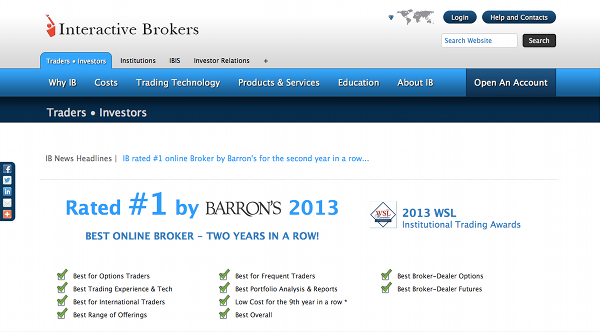

Algorithmic trading has become increasingly popular among traders and investors due to its ability to execute orders swiftly and reduce human error. Leveraging algorithms, traders can meticulously analyze vast datasets, identify profitable opportunities, and execute trades within milliseconds. This not only helps in capturing favorable prices but also enhances trading efficiency and precision.

For individuals looking to embark on the journey of algorithmic trading, a demo account serves as an indispensable tool. It offers a risk-free environment to test and refine trading strategies before deploying them in live markets. A demo account simulates real market conditions, providing traders with a realistic experience without incurring financial risks. This feature is crucial for beginners who need to test their strategies and understand market dynamics effectively.



Interactive Brokers (IBKR), a renowned entity in the brokerage sphere, provides a comprehensive demo account tailored for aspiring algorithmic traders. IBKR's demo account is designed to emulate live trading conditions closely, helping traders gain insights into the functioning of financial markets and the broker's trading platform. The demo account is equipped with a wide array of features such as real-time data, diverse order types, and sophisticated analytics tools that support the development and testing of algorithmic strategies.

This article explores the various features of the Interactive Brokers demo account and its pivotal role in enhancing the skills necessary for successful algorithmic trading. The demo account offered by IBKR proves to be a significant resource for honing trading strategies and improving decision-making skills. Aspiring algorithmic traders can leverage the tools and features of the IBKR demo account to not only refine their strategies but also to learn and adapt to the fast-paced nature of financial markets.

Through the Interactive Brokers demo account, traders have the opportunity to build a solid foundation in algorithmic trading, gaining familiarity with technical and strategic aspects of the trade. As the world moves towards increasingly automated trading solutions, utilizing such demo accounts becomes paramount for both retail and professional traders to remain competitive and effective in the financial markets.

## Table of Contents

## What is an Interactive Brokers Demo Account?

A demo account, often referred to as a practice account, is a simulated trading environment provided by brokerage firms that allows traders to practice and refine their trading strategies without financial risk. These accounts are instrumental for traders, especially beginners, as they provide a risk-free platform to understand market dynamics and the brokerage's trading system.

[Interactive Brokers](/wiki/interactive-brokers-api) (IBKR) offers a comprehensive demo account tailored specifically for [algorithmic trading](/wiki/algorithmic-trading). The IBKR demo account offers a suite of features designed to replicate real-world trading conditions closely, thereby serving as an invaluable educational tool for traders aiming to transition into live markets.

### Key Features of Interactive Brokers Demo Account

The Interactive Brokers demo account offers numerous features that make it a robust option for traders:

1. **Access to Global Markets**: The demo environment mirrors Interactive Brokers' live trading platform, granting access to a wide range of financial instruments including stocks, options, futures, forex, and bonds across global markets. This wide array of supported instruments allows for versatile strategy testing and learning.

2. **Advanced Trading Tools**: Traders have access to Interactive Brokers' proprietary trading platform, Trader Workstation (TWS), which includes advanced charting tools, simulated market depth, and order management capabilities. TWS's capability to support complex trading tools ensures traders can realistically simulate strategy execution.

3. **Realistic Market Simulations**: The demo account provides live market data, allowing traders to experience the ebb and flow of market conditions without the stress of financial loss. Although execution speeds might differ slightly from a live account, the demo account's high-fidelity environment allows traders to gain insights into real-world order flow and liquidity.

4. **Notebook and Coding**: For algorithmic traders, the demo account allows scripting in multiple programming languages including Python, C++, and Java. This feature enables traders to develop, backtest, and iterate strategies within the demo platform before moving them to a live market.

### Unique Advantages Versus Competitor Platforms

What sets the IBKR demo account apart from competitors such as TD Ameritrade’s thinkorswim or E*TRADE’s Power E*TRADE platform are the comprehensive market access and depth of available tools. Interactive Brokers is renowned for its low-cost trading fees and extensive international portfolio, making it particularly attractive to traders looking for cost-effective and diversified trading opportunities.

Many competitors may offer simpler, less complex demo accounts focused more on user-friendliness than on providing a platform that could be used by professional traders. IBKR, however, maintains a balance that caters to both beginners and advanced traders without sacrificing functionality or realism.

### Importance of a No-Risk Platform in Algo Trading

The no-risk environment of a demo account is crucial for beginners and seasoned traders alike. It allows traders to experiment with algorithmic strategies in scenarios that mimic real-world conditions. This testing phase is critical for stress-testing strategies against market [volatility](/wiki/volatility-trading-strategies) and system imperfections without the financial ramifications associated with live trading.

Emphasizing the risk-free nature, demo accounts become a sandbox where traders can not only test algorithms but also develop an understanding of trading-related emotions such as fear and greed, which can influence decision-making in high-stake situations.

### Realistic Trading Experience

Interactive Brokers ensures that its demo account provides an authentic trading experience by consistently updating its market simulations to reflect current market data. This simulation allows traders to engage with real-time news, market fluctuations, and economic announcements as they occur, providing a realistic experience that transitions smoothly to a live account.

By understanding how a demo account works and the comprehensive features offered by Interactive Brokers, traders can ensure they are well-prepared for the complexities of live market environments. This preparation is vital in building both confidence and competence in the domain of algorithmic trading.

## Getting Started with Algo Trading Using IBKR Demo Account

To embark on algorithmic trading using an Interactive Brokers (IBKR) demo account, begin by visiting the Interactive Brokers website. Select the demo account registration option, which typically involves filling out a form with your personal information. Once registered, you will receive login credentials to access the platform.

### Step-by-Step Setup Guide

1. **Account Registration**: Navigate to the Interactive Brokers website and sign up for a demo account. This process requires basic personal information to create your profile.

2. **Platform Access**: After registration, download the IBKR Trader Workstation (TWS) platform. This is the primary interface for managing trades and strategies.

3. **Login to Demo Account**: Use the credentials received during registration to log in to your demo account within the TWS platform.

4. **Navigating the Platform**: Familiarize yourself with the platform’s layout. The interface is equipped with various tools, panels, and menus designed to facilitate efficient navigation and usage.

### Tools and Resources for Algorithmic Traders

Interactive Brokers provides a comprehensive suite of tools for algorithmic traders:

- **TWS API**: Interactive Brokers offers a robust API that supports multiple programming languages, including Python, for implementing trading algorithms. This API allows traders to automate trading strategies directly on the platform.

- **Paper Trading Account**: The demo account serves as a paper trading account, enabling users to practice trading strategies without risking actual money.

- **Market Data**: Access real-time market data within the platform to test strategies under current market conditions.

- **Backtesting**: Utilize historical data to backtest your algorithms, ensuring strategies are sound before live deployment.

### User Interface and Ease of Use

IBKR’s TWS platform is designed to cater to traders of varying expertise levels. The user-friendly interface simplifies the navigation and execution of trades. Features include drag-and-drop functionality for ease in creating and modifying orders and a highly customizable workspace for a personalized trading environment.

### Supported Programming Languages

Interactive Brokers' API supports several programming languages, offering flexibility to traders:

- **Python**: Widely used due to its simplicity and vast ecosystem of libraries, making it suitable for developing intricate algorithms.

- **Java and C++**: These languages are also supported for traders who prefer a more traditional programming environment.

- **R**: Suitable for statistical analysis and advanced data mining tasks.

### Tips for Effective Utilization

- **Strategy Development**: Begin by developing simple strategies to understand the mechanics of algorithmic trading. Gradually, progress to more complex algorithms.

- **Comprehensive Testing**: Conduct extensive tests using both real-time and historical data to evaluate the robustness of your strategies. Include simulations of various market conditions to gauge performance.

- **Iterative Improvement**: Use insights gained from testing to refine algorithms continuously. Focus on optimizing both performance and risk management components.

By utilizing an IBKR demo account, traders can build, test, and refine their trading strategies effectively, paving the way for successful algorithmic trading in live markets.

## Benefits of Using IBKR Demo Account for Algo Trading

Demo accounts, such as the Interactive Brokers (IBKR) demo account, offer traders a platform to explore algorithmic trading without the financial risks associated with real market transactions. This risk-free environment is instrumental for traders to experiment with new strategies, making mistakes without the fear of financial loss. By using a demo account, traders can rigorously test and refine their algorithms, optimizing strategies through trial and error.

Monitoring and [backtesting](/wiki/backtesting) are two crucial features offered by the IBKR demo account. These capabilities allow traders to evaluate the performance of their algorithms against historical data, providing insights into their potential effectiveness. This process involves analyzing past market data to gauge the profitability and robustness of trading strategies. As a result, traders can adjust their algorithms to improve performance before applying them to live markets. For example, backtesting can be conducted using Python to simulate trades and analyze results:

```python
import pandas as pd

# Example historical data for backtesting
data = pd.DataFrame({
    'date': ['2023-01-01', '2023-01-02', '2023-01-03'],
    'price': [100, 102, 101]
})

def simple_moving_average(prices, window):
    return prices.rolling(window=window).mean()

# Calculate the 2-day simple moving average
data['SMA_2'] = simple_moving_average(data['price'], window=2)

print(data)
```

Beyond technical tests, the demo account plays a vital role in building traders' confidence. It provides a safe environment to make trading decisions in complex market situations. By simulating real market conditions, traders learn to make informed decisions without the pressure of actual financial implications. This practice helps to fine-tune decision-making skills critical for live trading.

Managing emotions is another critical aspect of successful trading, and a demo account is an excellent platform for learning to control emotions like fear and greed. These emotions can significantly impact trading decisions. Practicing in a demo environment helps traders recognize their emotional responses to market changes and develop strategies to manage them effectively, such as setting predefined rules for entering or exiting trades.

Gaining familiarity with order execution processes and experimenting with different order types in a demo account is an essential benefit. Traders can explore various order types, such as market orders, limit orders, and stop orders, understanding their execution mechanics and impacts on trading outcomes. This familiarity can be crucial in live trading environments, ensuring that traders are well-versed in placing and managing orders efficiently.

In summary, the Interactive Brokers demo account serves as a comprehensive tool for aspiring algo traders, providing a no-risk platform to refine strategies, build confidence, manage emotions, and understand order execution processes.

## Common Challenges and Solutions When Using an IBKR Demo Account

Interactive Brokers (IBKR) provides a demo account that is an excellent tool for traders to refine their algorithmic trading strategies without financial risks. However, there are several challenges users might encounter when employing an IBKR demo account. Understanding these challenges and knowing how to address them can optimize the trading experience.

One major limitation of demo accounts is their inability to fully replicate live market conditions. In a demo environment, slippage— the difference between the expected price of a trade and the actual executed price—might be minimized or not accurately represented. Moreover, demo accounts might not reflect real-time market [liquidity](/wiki/liquidity-risk-premium), which can lead to unrealistic trading outcomes. To mitigate these issues, traders can introduce their own slippage and liquidity constraints in testing environments. For instance, using historical data to simulate order slippage and adjusting order fills according to projected market conditions can provide a more realistic model.

The psychological differences between demo and live trading also present a significant challenge. In a demo account, the absence of real financial risk can lead to less disciplined trading behavior. Traders may engage in riskier strategies or fail to follow their predefined trading plans. To bridge this psychological gap, it is crucial for traders to adopt a disciplined approach even in a demo environment. This includes setting strict rules for entry and [exit](/wiki/exit-strategy) points, risk management, and consistently reviewing trading performance.

Technical challenges, such as system performance and connectivity issues, can impede the seamless operation of a demo account. Interactive Brokers provides considerable resources and support, but issues such as server downtime or latency can still occur. Regularly updating trading software, ensuring a stable internet connection, and keeping abreast of any system updates from IBKR can mitigate such technical hurdles.

Strategic consistency is critical when transitioning from a demo account to a live account. A common mistake is altering strategies unnecessarily upon moving to live trading. To ensure continuity, it is recommended to document and analyze all demo account trades meticulously, focusing on the strategies that have proven successful. A thorough backtest using different market scenarios helps in identifying robust strategies that can be carried over to live trading.

Finally, leveraging demo account data to inform real-world trading decisions is vital. This includes regular performance evaluations against specific metrics such as win/loss ratio, average profit/loss per trade, and drawdown levels. Using Python or another statistical tool can be advantageous for analyzing large data sets. For example:

```python
import pandas as pd

# Assuming 'demo_trades' is a DataFrame containing demo trade data
demo_trades['profit_loss'] = demo_trades['exit_price'] - demo_trades['entry_price']

performance_metrics = {
    'total_trades': len(demo_trades),
    'winning_trades': len(demo_trades[demo_trades['profit_loss'] > 0]),
    'losing_trades': len(demo_trades[demo_trades['profit_loss'] <= 0]),
    'average_profit_loss': demo_trades['profit_loss'].mean(),
    'max_drawdown': (demo_trades['profit_loss'].cumsum().expanding().max() - demo_trades['profit_loss'].cumsum()).max()
}

print(performance_metrics)
```

By using such tools, traders can derive insights into their trading strategies, identifying strengths and areas needing improvement, thus enhancing their readiness for live trading. In conclusion, while IBKR demo accounts present challenges, they also offer opportunities for traders to refine their strategies and build confidence.

## Conclusion

The Interactive Brokers demo account offers an invaluable platform for individuals embarking on algorithmic trading. Its risk-free nature provides a safe environment to test and refine trading strategies without the fear of financial loss. This approach allows traders to experiment with various algorithms, ultimately enhancing their decision-making skills and understanding of complex market dynamics. By simulating real market conditions, the demo account prepares users to transition smoothly to live trading, thereby minimizing potential challenges.

Practicing with a demo account is essential for building a strong foundation in algorithmic trading. It offers the opportunity to familiarize oneself with Interactive Brokers' powerful tools and features, leading to more confident and informed trading. Utilizing this account should be part of a comprehensive approach to developing trading strategies, ensuring that traders are well-prepared for the challenges of live markets.

Readers are encouraged to explore Interactive Brokers' offerings and consider integrating the demo account into their learning process. This experience can significantly enhance their trading skills, providing them with the confidence and expertise needed for successful execution in real-world scenarios.

As algorithmic trading continues to grow, it presents substantial potential for both retail and professional traders. The increasing accessibility of sophisticated trading platforms like Interactive Brokers democratizes the trading landscape, offering opportunities for innovation and advancement in trading strategies. By embracing these tools, traders can position themselves at the forefront of the evolving financial markets.

## References & Further Reading

[1]: Bergstra, J., Bardenet, R., Bengio, Y., & Kégl, B. (2011). ["Algorithms for Hyper-Parameter Optimization."](https://papers.nips.cc/paper/4443-algorithms-for-hyper-parameter-optimization) Advances in Neural Information Processing Systems 24.

[2]: ["Advances in Financial Machine Learning"](https://www.amazon.com/Advances-Financial-Machine-Learning-Marcos/dp/1119482089) by Marcos Lopez de Prado

[3]: ["Evidence-Based Technical Analysis: Applying the Scientific Method and Statistical Inference to Trading Signals"](https://www.amazon.com/Evidence-Based-Technical-Analysis-Scientific-Statistical/dp/0470008741) by David Aronson

[4]: ["Machine Learning for Algorithmic Trading"](https://github.com/stefan-jansen/machine-learning-for-trading) by Stefan Jansen

[5]: ["Quantitative Trading: How to Build Your Own Algorithmic Trading Business"](https://books.google.com/books/about/Quantitative_Trading.html?id=j70yEAAAQBAJ) by Ernest P. Chan