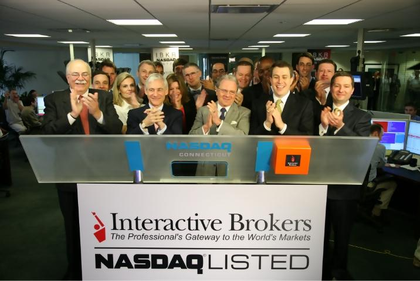

## Table of Contents

## What is Interactive Brokers Group?

Interactive Brokers Group is a company that helps people and businesses buy and sell things like stocks, options, futures, and forex. They have a platform where you can trade these financial products easily from your computer or phone. The company was started in 1977 and is known for having low costs and using advanced technology to make trading easier and faster.

The main part of Interactive Brokers Group is called Interactive Brokers LLC, which is where most of the trading happens. They work all around the world and have offices in many countries. This helps them serve customers from different places and in different languages. They focus on giving their customers a lot of tools and information so they can make smart choices about their investments.

## When was Interactive Brokers Group founded?

Interactive Brokers Group was founded in 1977. It's a company that helps people and businesses trade things like stocks, options, futures, and forex. They started with the goal of making trading easier and cheaper for everyone.

The main part of [Interactive Brokers](/wiki/interactive-brokers-api) Group is called Interactive Brokers LLC. This is where most of the trading happens. They use a platform that you can access from your computer or phone. The company has offices all over the world so they can help customers from many different countries.

## Who founded Interactive Brokers Group?

Interactive Brokers Group was founded by Thomas Peterffy. He started the company in 1977. Thomas wanted to make trading easier and cheaper for everyone. He used his background in engineering and finance to build a platform where people could trade stocks, options, futures, and [forex](/wiki/forex-system).

The main part of Interactive Brokers Group is called Interactive Brokers LLC. This is where most of the trading happens. They have offices all around the world so they can help customers from many different countries. The company focuses on using advanced technology to make trading faster and easier.

## What services does Interactive Brokers Group offer?

Interactive Brokers Group offers a wide range of services that help people and businesses buy and sell different financial products. They let you trade stocks, options, futures, forex, and more. They have a platform that you can use on your computer or phone, which makes trading easy and fast. They also offer tools and information that help you make smart choices about your investments.

They are known for having low costs, which means you don't have to pay a lot of money to use their services. They use advanced technology to make sure everything runs smoothly. Interactive Brokers Group works all around the world and has offices in many countries. This helps them serve customers from different places and in different languages. They focus on giving their customers the best tools and information so they can make the best decisions about their money.

## In which countries does Interactive Brokers Group operate?

Interactive Brokers Group works in many countries all over the world. They have offices in places like the United States, Canada, the United Kingdom, Switzerland, Hong Kong, Australia, Japan, India, and Singapore. This helps them serve customers from different parts of the world easily.

They focus on making trading easy and cheap for everyone. Their platform lets you buy and sell things like stocks, options, futures, and forex from your computer or phone. They use advanced technology to make sure everything works well and fast.

## How does Interactive Brokers Group compare to other brokerage firms?

Interactive Brokers Group stands out from other brokerage firms because of its low costs and advanced technology. They let you trade stocks, options, futures, and forex for very low fees. This makes it cheaper for you to buy and sell things. Their platform is easy to use on your computer or phone. They also give you a lot of tools and information to help you make smart choices about your investments. This is different from some other brokers who might charge more and not give you as many tools.

Another way Interactive Brokers Group is different is that they work all around the world. They have offices in many countries like the United States, Canada, the United Kingdom, and more. This means they can help customers from different places easily. Some other brokerage firms might only work in one country or a few countries. Interactive Brokers Group also focuses on using new technology to make trading faster and easier, which not all brokers do.

Overall, Interactive Brokers Group offers a lot of services and works in many countries, which makes them a good choice for people who want to trade different things without spending a lot of money. They use technology to make trading easy and give you the tools you need to make good decisions. This is why they are different from many other brokerage firms.

## What are the fee structures for trading with Interactive Brokers Group?

Interactive Brokers Group has low fees for trading, which is one of the reasons people like using them. They charge a small amount for each trade you make, and this amount can change based on what you're trading. For example, if you're trading stocks, you might pay around $0.005 per share, but there's a minimum fee of $1 per trade. If you're trading options, the fee is usually $0.65 per contract. For futures, it's around $0.85 per contract. These fees are lower than many other brokers, which helps you save money when you trade.

There are also other fees you might have to pay, like fees for using their platform or for not trading enough. If you don't trade very often, you might have to pay a small fee each month. This fee is usually around $10 if you don't meet their minimum trading activity. They also have fees for things like transferring money or closing your account. But overall, their fees are designed to be fair and clear, so you know exactly what you're paying for when you use their services.

## What types of accounts can be opened with Interactive Brokers Group?

Interactive Brokers Group offers different types of accounts to meet the needs of different people and businesses. You can open an individual account if you want to trade on your own. This is good for people who want to manage their own investments. They also have joint accounts, which are good if you want to trade with someone else, like a spouse or a partner. For businesses, they offer corporate accounts, which let companies trade and manage their money.

They also have special accounts for people who want to trade more advanced things. For example, you can open a margin account, which lets you borrow money to trade. This can help you make bigger trades, but it also comes with more risk. They also offer retirement accounts, like IRAs, which are good for saving for the future. These accounts have special tax benefits that can help you save money over time.

## What are the technological features of Interactive Brokers Group's trading platform?

Interactive Brokers Group's trading platform is known for its advanced technology that makes trading easy and fast. You can use their platform on your computer or phone, which means you can trade from anywhere. The platform has a lot of tools that help you see what's happening in the market and make smart choices about your trades. It also lets you trade many different things like stocks, options, futures, and forex all in one place. This makes it easier for you to manage all your investments without having to use different platforms.

The platform is also very fast and reliable. It uses the latest technology to make sure your trades go through quickly and without any problems. Interactive Brokers Group focuses on using technology to give you the best experience when you trade. They also have a lot of information and data available on their platform, which helps you understand the market better. This combination of speed, reliability, and information makes their platform a great choice for people who want to trade a lot and make smart decisions about their money.

## How does Interactive Brokers Group ensure the security of client funds and data?

Interactive Brokers Group works hard to keep your money and information safe. They use strong security measures like encryption to protect your data when you use their platform. This means your personal information and trading details are kept private and secure. They also have strict rules about who can access your data, making sure only the right people can see it. Plus, they regularly check their systems to make sure everything is working correctly and safely.

They also keep your money safe by following strict rules set by financial regulators. Your money is kept in separate accounts from the company's money, so even if something goes wrong with the company, your funds are safe. They also have insurance to protect your money if something unexpected happens. This way, you can feel confident that your money and information are well-protected when you use Interactive Brokers Group.

## What is the process for opening an account with Interactive Brokers Group?

Opening an account with Interactive Brokers Group is easy and straightforward. First, you go to their website and click on the "Open an Account" button. You'll need to fill out a form with your personal information like your name, address, and social security number. You'll also need to choose the type of account you want, like an individual account or a retirement account. After you submit the form, you'll need to verify your identity. This usually means uploading a copy of your ID, like a driver's license or passport, and maybe a utility bill to prove your address.

Once your identity is verified, you'll need to fund your account. You can do this by transferring money from your bank account. Interactive Brokers Group will give you instructions on how to do this. After your account is funded, you can start trading. They'll give you login details for their platform, where you can buy and sell stocks, options, futures, and more. The whole process usually takes a few days, but it can be quicker if you have all your information ready and complete the steps quickly.

## What advanced trading tools does Interactive Brokers Group provide for expert traders?

Interactive Brokers Group offers many advanced tools for expert traders to help them make better trading decisions. One of the main tools is the Trader Workstation (TWS), which is a powerful platform that lets you trade quickly and see a lot of market information at once. TWS has features like customizable charts, real-time data, and advanced order types that let you set up trades in very specific ways. For example, you can use [algorithmic trading](/wiki/algorithmic-trading) tools to automate your trades based on certain rules you set. This can save you time and help you trade more efficiently.

Another important tool is the API (Application Programming Interface) that Interactive Brokers Group provides. This tool lets expert traders connect their own software to the trading platform. This means they can build their own trading programs or use other programs to trade automatically. The API gives you a lot of flexibility to create the trading system that works best for you. Plus, Interactive Brokers Group has tools like risk management features that help you keep track of your trades and manage your risk better. These tools are designed to give expert traders the control and information they need to make smart trading choices.

## References & Further Reading

[1]: Bergstra, J., Bardenet, R., Bengio, Y., & Kégl, B. (2011). ["Algorithms for Hyper-Parameter Optimization."](https://proceedings.neurips.cc/paper/2011/file/86e8f7ab32cfd12577bc2619bc635690-Paper.pdf) Advances in Neural Information Processing Systems 24.

[2]: ["Advances in Financial Machine Learning"](https://www.amazon.com/Advances-Financial-Machine-Learning-Marcos/dp/1119482089) by Marcos Lopez de Prado

[3]: ["Evidence-Based Technical Analysis: Applying the Scientific Method and Statistical Inference to Trading Signals"](https://www.amazon.com/Evidence-Based-Technical-Analysis-Scientific-Statistical/dp/0470008741) by David Aronson

[4]: ["Machine Learning for Algorithmic Trading"](https://github.com/stefan-jansen/machine-learning-for-trading) by Stefan Jansen

[5]: ["Quantitative Trading: How to Build Your Own Algorithmic Trading Business"](https://www.amazon.com/Quantitative-Trading-Build-Algorithmic-Business/dp/1119800064) by Ernest P. Chan