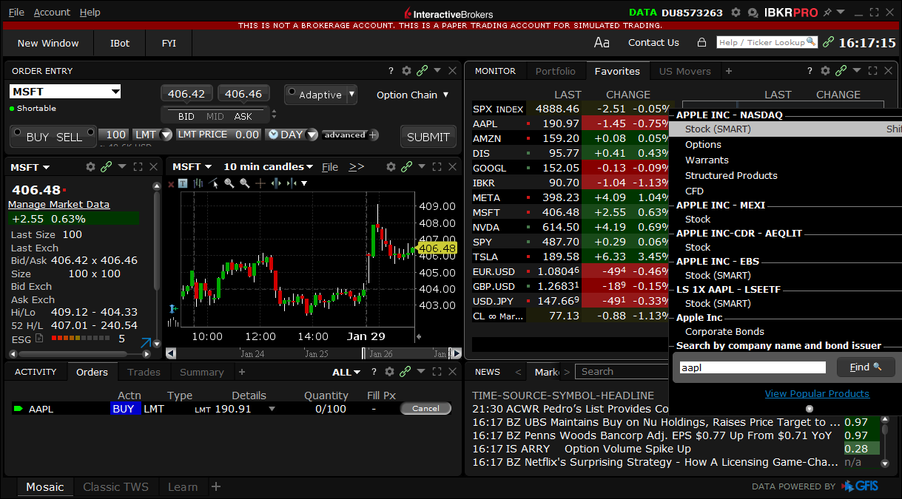

Online trading has undergone significant transformations with the advent of advanced platforms and sophisticated strategies. Interactive Brokers (IBKR) stands out in the brokerage industry by providing robust tools and resources for traders across various experience levels. A critical feature within IBKR's offerings is paper trading, which allows investors to practice and refine their trading strategies without the financial risk associated with real trading. 

Paper trading serves as a simulation where trades are executed in a virtual environment that mirrors real market conditions, making it particularly invaluable for algorithmic traders who rely on precision and strategy testing. By offering a platform that mimics real-time market dynamics, IBKR enables traders to fine-tune their strategies, identify potential weaknesses, and gain the necessary experience before deploying their algorithms in the live market. 



This article examines the pivotal role of IBKR's paper trading feature in algorithmic trading, highlighting its importance for those aiming to enhance their trading through strategic practice and innovation.

## Table of Contents

## What is Paper Trading?

Paper trading is a simulation of the actual trading process, where trades are executed using virtual money instead of real capital. This method provides a risk-free environment for traders to practice and hone their investment strategies. By engaging in paper trading, investors can evaluate their trading strategies and skills without the financial risks associated with the live market.

One of the primary benefits of paper trading is the experiential knowledge it offers. Traders can experiment with various strategies, allowing them to see which methods yield the best results under different market conditions. This practice is instrumental in helping traders understand market dynamics and the impact of various external factors on asset prices.

Moreover, by using a simulated environment, traders can test new ideas and hypotheses before venturing into the real market. This experimentation is crucial in the development and refinement of trading strategies. Interactive Brokers, a well-regarded firm in the brokerage industry, provides one of the most comprehensive paper trading features available. Their platform simulates real market conditions with high fidelity, ensuring that users can effectively prepare and adapt their strategies for the live trading environment.

[Interactive Brokers](/wiki/interactive-brokers-api)' paper trading services allow users to familiarize themselves with the full suite of trading tools and features the company offers. This exposure not only aids in strategy development but also in understanding the intricacies of using sophisticated trading platforms. As a result, traders are better equipped when transitioning from simulated trading to live markets, having gained confidence and competence through this invaluable practice tool.

## Understanding Algorithmic Trading

Algorithmic trading is a sophisticated method of executing trades using computer algorithms programmed with specific criteria for making buy or sell decisions. These algorithms can process vast amounts of data and execute orders faster and more accurately than human traders. The core objective is to capitalize on the speed and computational power of computers to achieve optimal trading outcomes.

There are various strategies employed in [algorithmic trading](/wiki/algorithmic-trading), each designed to exploit different aspects of market behavior:

1. **High-Frequency Trading (HFT)**: This strategy involves executing a large number of orders at extremely high speeds, often within fractions of a second. HFT traders profit from small price discrepancies that may exist for only a few milliseconds. The success of HFT relies heavily on powerful computers and fast execution speeds.

2. **Arbitrage**: Arbitrage strategies aim to profit from price inefficiencies between related assets, such as buying an asset in one market and selling it in another at a higher price. Algorithms are essential for identifying and acting on these inefficiencies before they disappear.

3. **Trend-Following**: This strategy is based on the assumption that asset prices tend to move in trends. Algorithms are programmed to recognize and trade based on these trends, buying assets with upward momentum and selling those with downward momentum.

The utilization of algorithmic trading offers several advantages, most notably time efficiency and the reduction of human error. Automated systems can process information and execute trades far faster than humans, which is crucial in fast-moving markets. Additionally, algorithms eliminate emotional decision-making, leading to more consistent trading performance.

Developing a successful trading algorithm involves a rigorous process of [backtesting](/wiki/backtesting) and strategy optimization. Backtesting involves simulating the algorithm on historical data to assess its performance, which helps traders understand how the strategy might perform in real-world conditions. Strategy optimization seeks to refine the algorithm's parameters to improve its effectiveness across various market conditions.

For instance, a simple moving average crossover strategy can be tested using Python:

```python
import pandas as pd
import numpy as np

# Load historical data
data = pd.read_csv('historical_data.csv')

# Calculate moving averages
data['SMA20'] = data['Close'].rolling(window=20).mean()
data['SMA50'] = data['Close'].rolling(window=50).mean()

# Generate trading signals
data['Signal'] = 0
data['Signal'][data['SMA20'] > data['SMA50']] = 1
data['Signal'][data['SMA20'] < data['SMA50']] = -1

# Calculate returns based on signals
data['Returns'] = data['Close'].pct_change()
data['Strategy'] = data['Signal'].shift(1) * data['Returns']

# Performance metrics
cumulative_return = np.exp(data['Strategy'].sum()) - 1
annualized_return = (1 + cumulative_return)**(252/len(data)) - 1
print(f"Cumulative Strategy Return: {cumulative_return:.2f}")
print(f"Annualized Strategy Return: {annualized_return:.2f}")
```

This code demonstrates how a trader can backtest a simple moving average crossover strategy by utilizing historical price data, calculating indicators, generating buy/sell signals, and finally evaluating the strategy's historical performance. This systematic approach allows for disciplined and data-driven decision-making in the trading landscape.

## Features of IBKR Paper Trading for Algo Traders

Interactive Brokers' (IBKR) paper trading platform is distinguished by its ability to closely replicate real-time market environments, making it an essential tool for algorithmic traders. The accuracy of this simulation is pivotal, as it allows traders to develop and refine their strategies under conditions that are akin to those of live markets. This fidelity to real-world functionality is a core aspect of IBKR's offering, enabling traders to anticipate how their algorithms would perform without exposing themselves to financial risk.

An advantage of IBKR's platform is the accessibility it provides to its comprehensive range of financial instruments and markets. This access ensures that traders can simulate trades across diverse asset classes, including stocks, options, futures, [forex](/wiki/forex-system), bonds, and funds, offering a broad spectrum for testing strategies. Such variety is crucial for algo traders looking to create robust and adaptable trading strategies that may involve multiple asset types or complex [arbitrage](/wiki/arbitrage) opportunities.

The platform is equipped with rich historical data, advanced charting capabilities, and extensive market analytics. This suite of tools is indispensable for algorithmic traders who require detailed data for backtesting strategies and analyzing market trends. Historical data allows traders to test their algorithms against past market conditions, which aids in understanding the potential performance of their strategies under various scenarios.

Furthermore, IBKR supports algorithmic trading through its sophisticated API suite, which enables seamless integration with a wide array of programming languages, such as Python, Java, and C++. This flexibility is beneficial for traders aiming to develop custom trading applications or refine existing ones. The APIs provide access to real-time and historical market data, enabling traders to execute orders, manage portfolios, and retrieve account information programmatically.

Overall, the features of IBKR's paper trading platform support a comprehensive and dynamic approach to testing and developing algorithmic trading strategies. With its accurate simulation of real-time conditions, extensive market access, robust data analytics tools, and flexible API integrations, the platform provides algo traders with the resources necessary to innovate and enhance their trading methodologies effectively.

## Advantages of Using IBKR Paper Trading

Interactive Brokers (IBKR) provides a sophisticated paper trading environment, offering substantial benefits to traders, particularly those interested in algorithmic trading strategies. A key advantage of using IBKR's paper trading platform is its risk-free nature. This is essential when testing sophisticated strategies before they are deployed in live markets, eliminating financial repercussions from potential errors or inefficiencies in the algorithms.

The platform allows traders to identify bugs or flaws in their algorithmic code without real-world financial losses. By simulating trades with virtual money, traders can rigorously assess their algorithms' performance under various market conditions. This process is vital for debugging strategies and refining algorithmic code to function efficiently. Given the complexity of algorithmic trading, oversight or misinterpretation of code can lead to substantial financial losses in live markets. Therefore, a comprehensive testing phase on paper is invaluable.

Paper trading also aids in practicing discipline and refining decision-making processes. Since traders are not influenced by the stress of potential financial losses, they can focus on developing and adhering to their trading strategies. This helps build the necessary psychological resilience and discipline required for successful trading. Additionally, the platform's realistic simulation of market conditions makes it possible for traders to cultivate habits and skills applicable in real trading scenarios.

Another notable advantage of IBKR’s paper trading is the ability to experiment with leverage, diverse asset classes, and portfolio strategies. Traders can simulate the effects of leverage, allowing them to understand the potential risks and rewards associated with leveraged trading before applying these strategies live. Furthermore, IBKR offers a range of simulated financial instruments and markets. This broad access enables traders to explore and test various asset classes and develop sophisticated portfolio strategies that encompass different investment vehicles.

In conclusion, IBKR's paper trading platform presents a comprehensive environment for testing and fine-tuning trading strategies without financial risks. It supports traders in debugging code, honing their decision-making capabilities, and experimenting with a variety of trading techniques, leading to more robust and successful algorithmic trading practices.

## Getting Started with IBKR Paper Trading

To begin utilizing Interactive Brokers' (IBKR) paper trading feature, it is necessary to first open an IBKR account. This involves completing the standard registration process, which includes providing personal information, agreeing to terms and conditions, and verifying your identity through relevant documentation. Once the account setup is finalized, users gain access to IBKR's comprehensive trading platform.

Upon accessing the IBKR platform, navigate to set up the paper trading configurations. This involves selecting 'Paper Trading Account' from the account management or trading settings. The platform offers an intuitive interface where configurations, such as virtual funds allocation and asset class preferences, can be adjusted according to personal trading objectives.

IBKR provides a wealth of educational resources and tutorials designed to enhance user proficiency with the platform's features. These resources are accessible directly via the IBKR website or client portal. Leveraging these materials helps users understand the practical applications of various tools and functionalities offered within the platform, enhancing their ability to navigate and optimize their trading strategies effectively.

With the account established and configurations set, users can proceed to build and test trading algorithms using IBKR's extensive API tools. The platform's API supports multiple programming languages, including Python, which is commonly used in algorithmic trading for its versatility and ease of use. A simple example of accessing market data via the IBKR API using Python might resemble the following code snippet:

```python
from ibapi.client import EClient
from ibapi.wrapper import EWrapper
from ibapi.contract import Contract

class MarketData(EWrapper, EClient):
    def __init__(self):
        EClient.__init__(self, self)

    def historicalData(self, reqId, bar):
        print(f"Date: {bar.date}, Close: {bar.close}")

app = MarketData()
app.connect("127.0.0.1", 7496, clientId=1)

contract = Contract()
contract.symbol = "AAPL"
contract.secType = "STK"
contract.currency = "USD"
contract.exchange = "SMART"

app.reqHistoricalData(1, contract, "", "1 D", "1 min", "MIDPOINT", 1, 1, False, [])
app.run()
```

This script sets up a connection to the IBKR API, requests historical data for a specific stock (e.g., Apple Inc.), and prints out the closing prices for each time interval specified. Such capabilities allow traders to automate data retrieval and backtesting processes, thereby enhancing the development and refinement of their trading algorithms in a simulated, risk-free environment.

## Tips for Effective Paper Trading

Treating paper trading with the same seriousness as real trading is fundamental to instilling authentic trading habits. This approach requires a disciplined mindset where each simulated trade is executed with intention and strategic analysis. By doing so, traders develop the routine and mental framework necessary for successful trading environments.

Documenting and analyzing each trade is crucial for gaining insights into effective strategies and identifying areas for improvement. By meticulously recording the details of every trade—entry and [exit](/wiki/exit-strategy) points, underlying logic, and outcomes—traders can discern patterns and trends that may influence future decision-making. This process allows for the identification of both successful tactics and recurrent mistakes.

Regularly reviewing and adjusting trading algorithms based on the outcomes of paper trading is pivotal. This iterative process of refinement ensures that algorithms are aligned with evolving market conditions and strategic objectives. By using the feedback loop inherent in paper trading, traders can optimize their algorithms for performance improvements. For instance, in Python, traders can employ libraries such as Pandas or NumPy to analyze past trading data effectively and make informed adjustments.

```python
import pandas as pd

# Example of loading past trades into a DataFrame
data = pd.read_csv('trades.csv')

# Analyzing trade outcomes
successful_trades = data[data['profit'] > 0]
failure_trades = data[data['profit'] <= 0]

print(f"Successful Trades: {successful_trades.shape[0]}")
print(f"Failed Trades: {failure_trades.shape[0]}")
```

Understanding the psychological differences between paper and live trading, such as stress factors, is also crucial. While paper trading does not involve real financial risk, live trading does, which introduces elements of stress that can affect decision-making. Recognizing these psychological differences allows traders to prepare for the emotional challenges posed by real trading environments. Strategies such as setting predefined stop-loss levels or using automated trading solutions can help mitigate the impact of stress during live trading sessions. 

By adopting these practices, traders can take full advantage of paper trading as a rigorous and valuable training ground, preparing their strategies and psychological resilience required for the competitive environment of live trading.

## Conclusion

IBKR's paper trading platform offers a dependable setting for the crafting and refinement of algorithmic trading strategies. The platform's zero-risk feature enables users to test and improve strategies without the fear of financial loss, making it an essential tool for both novice and experienced traders. By simulating real market conditions, traders can practice and refine their strategies to address potential market variations, helping to prevent detrimental mistakes in live trading scenarios.

Leveraging the advanced technology provided by Interactive Brokers, traders can significantly enhance their algorithmic trading operations. Through access to a comprehensive range of markets and financial instruments, they can explore and dissect numerous trading strategies. The integration capabilities with multiple programming languages through IBKR's APIs enable seamless strategy development and testing, allowing traders to automate and scale their operations effectively.

To remain competitive in algorithmic trading, continuous learning and strategy refinement are crucial. Traders must adapt to ever-evolving market conditions and technological advancements, analyzing the outcomes of their paper trades systematically to improve their strategies. By routinely updating their algorithms and embracing new insights and methodologies, traders can sustain their success and maintain an edge in the competitive world of algorithmic trading.

## References & Further Reading

[1]: Bergstra, J., Bardenet, R., Bengio, Y., & Kégl, B. (2011). ["Algorithms for Hyper-Parameter Optimization."](https://papers.nips.cc/paper/4443-algorithms-for-hyper-parameter-optimization) Advances in Neural Information Processing Systems 24.

[2]: ["Advances in Financial Machine Learning"](https://www.amazon.com/Advances-Financial-Machine-Learning-Marcos/dp/1119482089) by Marcos Lopez de Prado

[3]: ["Evidence-Based Technical Analysis: Applying the Scientific Method and Statistical Inference to Trading Signals"](https://www.amazon.com/Evidence-Based-Technical-Analysis-Scientific-Statistical/dp/0470008741) by David Aronson

[4]: ["Machine Learning for Algorithmic Trading"](https://github.com/PacktPublishing/Machine-Learning-for-Algorithmic-Trading-Second-Edition) by Stefan Jansen

[5]: ["Quantitative Trading: How to Build Your Own Algorithmic Trading Business"](https://books.google.com/books/about/Quantitative_Trading.html?id=j70yEAAAQBAJ) by Ernest P. Chan