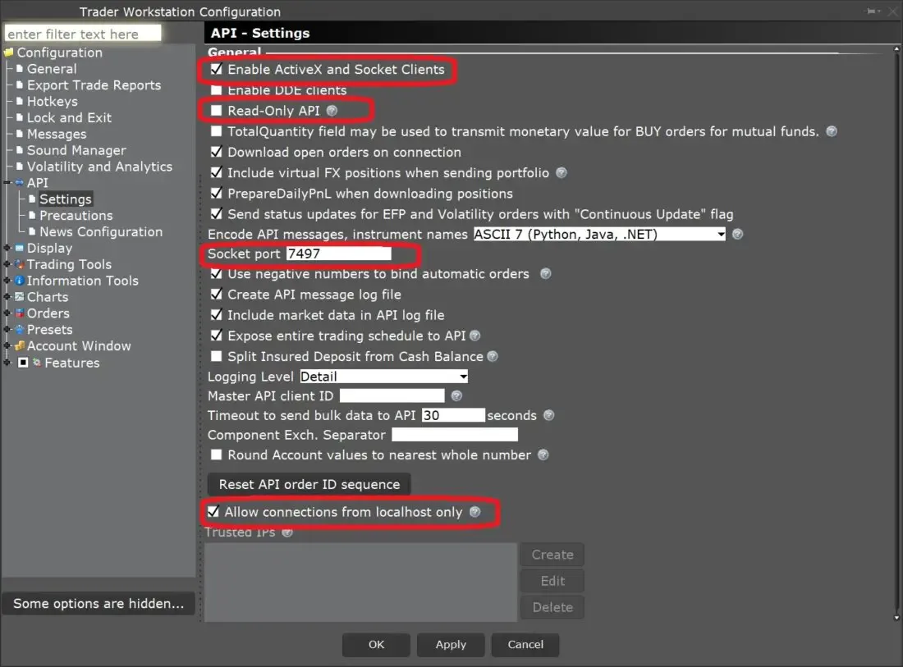

## Table of Contents

## What is the Interactive Brokers Python API?

The Interactive Brokers Python API, also known as IB API, is a tool that lets you connect to Interactive Brokers' trading platform using Python. This means you can write Python code to do things like buy and sell stocks, check your account balance, and get real-time market data, all without having to click around on the trading platform's website or app.

It's really useful for people who want to automate their trading strategies or do a lot of trading quickly. The API gives you the power to control your trading from your own computer, making it easier to manage many trades at once or to use special trading methods that you've programmed yourself.

## How do I install the Interactive Brokers Python API?

To install the Interactive Brokers Python API, you first need to download the TWS or IB Gateway software from the Interactive Brokers website. TWS stands for Trader Workstation, and it's the full trading platform. The IB Gateway is a lighter version that's meant just for API use. Once you have one of these installed, you can start the next step.

Next, you need to download the actual API software. Go to the [Interactive Brokers](/wiki/interactive-brokers-api) website again, find the API section, and download the latest version of the API. It comes as a zip file. After you unzip it, you'll see a folder with lots of files, including some Python files. To use the API in your Python projects, you need to add this folder to your Python path. You can do this by setting an environment variable or by adding it directly in your Python code.

Once you've set up everything, you can start writing Python code to connect to the TWS or IB Gateway. You'll use the classes and functions from the API folder to send commands and receive data. It might take some time to get used to, but once you do, you can automate your trading and do a lot more with your Interactive Brokers account.

## What are the basic steps to connect to Interactive Brokers using the Python API?

To connect to Interactive Brokers using the Python API, first make sure you have the TWS or IB Gateway software running on your computer. You can download these from the Interactive Brokers website. Once you have it running, you need to download the API software from the same website. After downloading, unzip the file and find the folder with the Python files. You'll need to add this folder to your Python path so your code can find the API.

Next, you'll write a Python script to connect to the TWS or IB Gateway. In your script, import the necessary classes from the API folder, like `IB` from `ibapi.client`. Create an instance of the `IB` class and call its `connect` method with the right arguments, like the IP address, port number, and client ID. The IP address is usually `127.0.0.1` if you're running everything on the same computer, the port number is `7497` for TWS or `4002` for IB Gateway, and the client ID can be any number as long as it's unique. Once you call `connect`, your script will be linked to the TWS or IB Gateway, and you can start sending commands and getting data.

## How can I retrieve real-time market data using the Interactive Brokers Python API?

To get real-time market data with the Interactive Brokers Python API, you first need to connect to the TWS or IB Gateway. Once connected, you can use the `reqMktData` method to ask for market data. You'll need to give it a ticker ID, which is just a number you pick to keep track of the data, and a contract object that tells the API which stock or other thing you want data for. The contract object has details like the symbol of the stock, the type of security, the exchange it's traded on, and the currency.

After you call `reqMktData`, the API will start sending you real-time data. This data comes in the form of messages that you can read using the `nextValidId` and `tickPrice` methods. The `tickPrice` method gives you the latest price of the stock, and other methods like `tickSize` can give you the [volume](/wiki/volume-trading-strategy) of trades. You'll need to set up your code to handle these messages and do something with the data, like saving it or using it to make trading decisions.

## What methods are available for placing orders through the Interactive Brokers Python API?

To place orders using the Interactive Brokers Python API, you use the `placeOrder` method. This method needs two things: an order ID that you pick to keep track of the order, and an order object that says what you want to do. The order object has details like what stock you want to buy or sell, how many shares, and what kind of order it is, like a market order or a limit order. Once you call `placeOrder` with these two things, the API sends your order to the market.

After you place an order, you can check on it using the `reqOpenOrders` and `reqAllOpenOrders` methods. These methods ask the API to send you information about orders that are still open. You can use this info to see if your order went through, if it's still waiting, or if it got filled. If you need to change or cancel an order, you can use the `cancelOrder` method. Just give it the order ID of the order you want to cancel, and the API will try to stop the order from going through.

## How do I manage and monitor my open orders using the API?

To manage and monitor your open orders using the Interactive Brokers Python API, you can use the `reqOpenOrders` and `reqAllOpenOrders` methods. The `reqOpenOrders` method asks the API to send you information about orders that you placed and are still open. The `reqAllOpenOrders` method does the same thing but also includes orders from other clients connected to the same account. Both methods help you keep track of what's happening with your orders, like if they are waiting to be filled or if they have been partially filled.

Once you get the information about your open orders, you can use it to decide what to do next. If you want to change an order, you can't do that directly with the API, but you can cancel it and place a new one. To cancel an order, you use the `cancelOrder` method and give it the order ID of the order you want to stop. After canceling, you can place a new order with different details if you need to. By using these methods, you can keep an eye on your orders and make changes as needed to manage your trading.

## What are the best practices for handling errors and exceptions in the Interactive Brokers Python API?

When using the Interactive Brokers Python API, it's really important to handle errors and exceptions well. The API can send you different kinds of error messages, like when something goes wrong with your connection or when you try to do something that's not allowed. To handle these errors, you should use try-except blocks in your Python code. This means you wrap the parts of your code that might cause problems in a try block, and then use except blocks to catch and deal with any errors that happen. For example, if the API can't connect to the TWS or IB Gateway, you can catch that error and maybe try to connect again or tell the user what went wrong.

Another good practice is to log all the errors and exceptions you catch. Logging means writing down what happened, when it happened, and what kind of error it was. This can help you figure out what's going wrong and fix it later. You can use Python's built-in logging module to do this. Also, make sure to check the error codes and messages that the API sends you. Each error has a code and a message that tells you more about what went wrong. By understanding these, you can handle different kinds of errors in different ways, making your trading program more reliable and easier to fix when problems come up.

## How can I use the API to implement advanced trading strategies?

To use the Interactive Brokers Python API for advanced trading strategies, you can start by automating simple tasks like placing orders based on certain conditions. For example, you can write code that checks the price of a stock and places a buy order if the price drops below a certain level. This is the start of what's called an [algorithmic trading](/wiki/algorithmic-trading) strategy. As you get more comfortable, you can make your strategies more complex by using real-time market data to make decisions. You might use the `reqMktData` method to get live prices and volumes, and then use that data to decide when to buy or sell based on moving averages, [momentum](/wiki/momentum), or other technical indicators.

Once you have the basics down, you can start building more advanced strategies. One way to do this is by using multiple orders at the same time. You could set up a strategy where you place a buy order and a sell order at the same time, with different conditions for each. This is called a bracket order, and it lets you manage risk by setting a stop loss and a take profit at the same time. Another advanced strategy is to use the API to trade multiple stocks or other assets at once, based on how they move together. You can write code to check the correlation between different stocks and make trades that take advantage of those relationships. By using the API to automate these kinds of strategies, you can trade more effectively and manage a larger portfolio with less work.

## What tools does the Interactive Brokers Python API provide for risk management?

The Interactive Brokers Python API gives you tools to manage risk by letting you set up stop-loss orders and take-profit orders. A stop-loss order is like a safety net that automatically sells a stock if its price drops too much, helping you limit how much money you could lose. A take-profit order does the opposite; it sells the stock when it reaches a price you're happy with, so you can lock in your profits. You can use the `placeOrder` method to set these orders up, and the API will keep an eye on the market for you, making sure your orders are placed when the time is right.

Another way the API helps with risk management is by letting you check your account's status and open orders in real time. You can use the `reqAccountUpdates` method to get information about your account balance, how much money you have available to trade, and how much you're using as margin. This helps you keep an eye on your overall risk. Also, with the `reqOpenOrders` and `reqAllOpenOrders` methods, you can see all your open orders and make sure they're doing what you want them to do. By keeping track of your orders and account, you can make smart decisions to manage your risk better.

## How can I optimize the performance of my scripts using the Interactive Brokers Python API?

To make your scripts run faster when using the Interactive Brokers Python API, you should think about how you handle data and how often you ask for it. The API can send you a lot of information, like real-time market data, and if you're not careful, your script might get bogged down trying to process it all. One way to speed things up is to only ask for the data you really need, and not more often than you have to. For example, if you only need to check prices every few minutes, don't ask for them every second. Also, try to do as much data processing as you can in one go, instead of making lots of small requests to the API.

Another way to make your scripts work better is by using the right tools and coding practices. Python has some libraries that can help you manage data more efficiently, like `pandas` for handling big datasets. You can also use multithreading or multiprocessing to do different parts of your script at the same time, which can make things run faster. It's important to keep your code organized and clean, too. If your code is easy to read and understand, it's easier to find and fix any parts that might be slowing things down. By being smart about how you use the API and how you write your code, you can make your trading scripts run smoother and faster.

## What are some common pitfalls and how can I avoid them when using the Interactive Brokers Python API?

One common pitfall when using the Interactive Brokers Python API is not handling errors and exceptions properly. If something goes wrong, like a connection issue or a bad order, your script might crash if you don't have the right code to catch and deal with these problems. To avoid this, always use try-except blocks in your code. This way, if an error happens, your script can keep running and maybe even try to fix the problem or tell you what went wrong. Also, make sure to log any errors you catch so you can look at them later and figure out how to stop them from happening again.

Another pitfall is asking for too much data too often, which can slow down your script and even cause the API to stop working. The API can give you a lot of real-time data, but if you're not careful, your script might get overwhelmed trying to handle it all. To avoid this, only ask for the data you really need and not more often than you have to. For example, if you only need to check prices every few minutes, don't ask for them every second. Also, try to process the data you get in big chunks instead of making lots of small requests to the API. By being smart about how you use the API, you can keep your scripts running smoothly and avoid common problems.

## How can I integrate the Interactive Brokers Python API with other Python libraries and frameworks for enhanced functionality?

To make your trading scripts even better with the Interactive Brokers Python API, you can use other Python libraries and frameworks. For example, you can use `pandas` to handle and analyze big sets of data easily. With `pandas`, you can take the market data you get from the API and turn it into a DataFrame, which makes it a lot easier to do things like find trends or calculate averages. Another useful library is `numpy`, which is great for doing math and working with numbers quickly. You can use `numpy` to do things like figure out how much risk you're taking or how well your trading strategy is doing.

You can also use frameworks like `asyncio` to make your scripts run faster. With `asyncio`, you can do different parts of your script at the same time, like checking prices and placing orders. This can make your trading happen more quickly and smoothly. If you want to make a website or app to show your trading data, you can use a web framework like `Flask` or `Django`. These frameworks let you build a website where you can see your trades and market data in real time, making it easier to keep track of everything. By combining the Interactive Brokers Python API with these other tools, you can make your trading scripts more powerful and useful.

## References & Further Reading

[1]: ["Interactive Brokers API Guide"](https://www.interactivebrokers.com/campus/ibkr-api-page/ibkr-api-home/) - Official documentation for the Interactive Brokers API.

[2]: Aronson, D. R. (2006). ["Evidence-Based Technical Analysis: Applying the Scientific Method and Statistical Inference to Trading Signals"](https://www.amazon.com/Evidence-Based-Technical-Analysis-Scientific-Statistical/dp/0470008741). Wiley.

[3]: de Prado, M. L. (2018). ["Advances in Financial Machine Learning"](https://www.amazon.com/Advances-Financial-Machine-Learning-Marcos/dp/1119482089). Wiley.

[4]: Jansen, S. (2020). ["Machine Learning for Algorithmic Trading"](https://github.com/stefan-jansen/machine-learning-for-trading). Packt Publishing.

[5]: Chan, E. P. (2009). ["Quantitative Trading: How to Build Your Own Algorithmic Trading Business"](https://github.com/ftvision/quant_trading_echan_book). Wiley.

[6]: ["IBKR Quant Blog"](https://www.interactivebrokers.com/campus/ibkr-quant-news/highlights-from-the-ibkr-quant-blog-may-2024/) - Offers insights and use cases related to the Interactive Brokers API and algorithmic trading strategies.

[7]: ["ib_insync Documentation"](https://ib-insync.readthedocs.io/api.html) - Guide and reference for the ib_insync Python library, which simplifies interaction with the Interactive Brokers API.