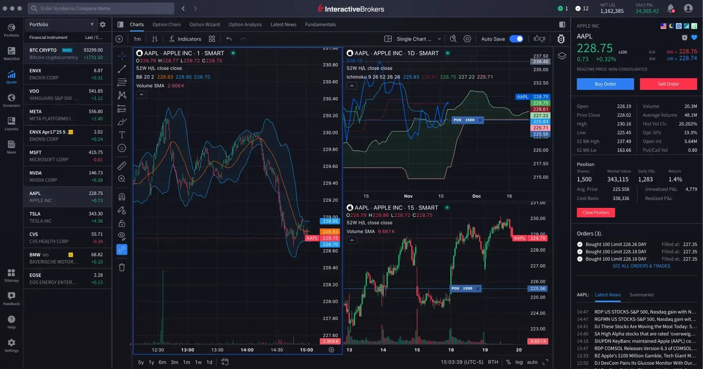

## Table of Contents

## What is Interactive Brokers and what services do they offer?

Interactive Brokers is a company that helps people and businesses buy and sell things like stocks, bonds, and other investments. They have been around since 1978 and are known for their low costs and advanced technology. People from all over the world use their services because they can trade many different types of investments in many countries.

Interactive Brokers offers a lot of services to help people manage their money. They have tools that let you see how your investments are doing and make smart choices. They also have different ways to trade, like using a computer or a phone. They help businesses and big investors too, by giving them special tools and lower prices for trading a lot.

## How can someone open an account with Interactive Brokers?

To open an account with Interactive Brokers, you need to go to their website and click on the "Open an Account" button. You will need to fill out some forms with your personal information like your name, address, and phone number. You will also need to provide some documents to prove who you are, like a driver's license or passport. This helps Interactive Brokers make sure you are who you say you are.

After you fill out the forms and send in your documents, [Interactive Brokers](/wiki/interactive-brokers-api) will check everything to make sure it's all correct. This might take a few days. Once they approve your account, you will get an email telling you that your account is ready. You can then log in, add money to your account, and start trading. If you have any questions, you can call their customer service for help.

## What are the minimum account requirements for Interactive Brokers?

To open an account with Interactive Brokers, you need to meet some minimum requirements. For individuals, the minimum amount of money you need to start trading is $0. This means you can open an account without putting any money in it right away. However, if you want to start trading, you will need to deposit enough money to cover the cost of the trades you want to make.

For businesses or organizations, the minimum account balance is higher. They need to have at least $10,000 in their account to start trading. This higher requirement is because businesses often trade larger amounts and need more money to manage their investments. Both individuals and businesses also need to meet certain rules about where they live and their financial situation, which Interactive Brokers will check when you apply.

## What types of investment products can be traded on Interactive Brokers?

Interactive Brokers lets you trade many different kinds of investments. You can buy and sell stocks, which are pieces of a company. They also offer bonds, which are like loans you give to a company or government. If you're interested in trading money from different countries, you can use their services to trade currencies. They also have options, which are agreements to buy or sell something at a certain price in the future.

In addition to these, Interactive Brokers offers futures, which are contracts to buy or sell something at a future date. You can also trade mutual funds, which are collections of stocks and bonds managed by professionals. If you like investing in real things, they have commodities like gold and oil. They even offer cryptocurrencies like Bitcoin, so you can trade digital money too. With all these choices, you can build a diverse investment plan.

## How does Interactive Brokers' fee structure work?

Interactive Brokers charges fees based on how much you trade and what you trade. They have a tiered pricing system, which means the more you trade, the less you pay per trade. For stocks and ETFs, they charge a minimum of $0.005 per share with a $1 minimum per trade. If you trade a lot, you can get a lower rate. For options, they charge $0.65 per contract, but this can also go down if you trade more. They also have fees for other things like withdrawing money, using their platform, and trading different products like futures and [forex](/wiki/forex-system).

Interactive Brokers also has a monthly activity fee. If your account balance is less than $100,000 and you don't trade enough, you might have to pay a small fee each month. But if you trade a lot or keep a lot of money in your account, you won't have to pay this fee. They also have different fees for different countries and for using different services. It's a good idea to check their website or talk to their customer service to understand all the fees you might have to pay.

## What tools and platforms does Interactive Brokers provide for trading?

Interactive Brokers has a main platform called Trader Workstation (TWS). It is a powerful tool that lets you trade many different things like stocks, options, and futures. TWS has lots of charts and tools to help you make smart choices about when to buy and sell. You can also set up the platform the way you like it, so it's easy to use. If you want to trade on your phone or tablet, they have an app called IBKR Mobile that works a lot like TWS but is easier to use on a small screen.

They also have a simpler platform called Client Portal. This is good for people who don't need all the fancy tools of TWS. Client Portal is easy to use and lets you do basic things like check your account and make trades. For people who like to write their own trading programs, Interactive Brokers has an API that lets you connect your own software to their platform. This way, you can make your own tools to help you trade.

## How does Interactive Brokers support margin trading and what are the risks involved?

Interactive Brokers lets you do something called margin trading. This means you can borrow money from them to buy more investments than you could with just your own money. To do this, you need to have a margin account with them. They will give you a certain amount of money you can borrow, and you have to pay interest on what you borrow. This can help you make more money if the price of what you buy goes up, but it can also make you lose more if the price goes down.

Margin trading can be risky. If the value of your investments goes down a lot, you might have to pay back the money you borrowed right away. This is called a margin call. If you can't pay, Interactive Brokers might sell your investments to get their money back, and you could lose a lot. It's important to understand these risks and only use margin trading if you know what you're doing and can handle the possible losses.

## Can you explain the tax implications of trading through Interactive Brokers?

When you trade through Interactive Brokers, you need to think about taxes. In the United States, if you make money from trading stocks, options, or other investments, you have to pay taxes on those profits. The tax rate can be different depending on how long you hold the investment. If you hold it for less than a year, it's called a short-term capital gain, and you pay your regular income tax rate on it. If you hold it for more than a year, it's a long-term capital gain, and the tax rate is usually lower. Interactive Brokers will send you a form called a 1099-B at the end of the year, which shows how much money you made or lost from your trades. You'll need this form to fill out your taxes.

If you live in another country, the tax rules might be different. You might have to pay taxes in your home country and maybe in the U.S. too, depending on where you live and what you're trading. Interactive Brokers can help you figure out what forms you need and how to report your trades, but they can't give you tax advice. It's a good idea to talk to a tax professional who knows about trading and the tax laws in your country to make sure you're doing everything right and not paying more taxes than you need to.

## What are some advanced trading strategies that can be implemented using Interactive Brokers?

One advanced trading strategy you can use with Interactive Brokers is called [algorithmic trading](/wiki/algorithmic-trading). This means you use a computer program to decide when to buy and sell things like stocks or options. With Interactive Brokers, you can write your own programs using their API, which lets your computer talk to their trading platform. This can help you trade faster and make decisions based on lots of data. For example, you might set up a program to buy a stock when its price goes below a certain level and sell it when the price goes up enough. This can be really helpful if you want to trade a lot or if you want to trade based on very specific rules.

Another strategy is called options trading. Options are agreements that let you buy or sell something at a certain price in the future. Interactive Brokers has a lot of tools to help you with this, like options chains and risk graphs. You can use these to do things like covered calls, where you own a stock and sell the right to buy it at a higher price, or protective puts, where you buy the right to sell a stock at a certain price to protect against losses. These strategies can help you make money or protect your investments, but they can also be risky if you don't know what you're doing. It's important to learn about options and practice before you start trading with real money.

## How does Interactive Brokers handle customer support and what resources are available for users?

Interactive Brokers has different ways to help customers when they have questions or problems. You can call them on the phone and talk to someone who can help you right away. They also have a live chat service on their website, so you can type your questions and get quick answers. If you want to learn more on your own, they have a lot of helpful information on their website, like guides and videos that explain how to use their platform and trade different things. You can also send them an email if you need help with something that's not urgent.

They also have a community where users can ask questions and share ideas. This can be really helpful if you want to learn from other people who use Interactive Brokers. They have a place called the Traders' Academy where you can take courses to learn more about trading. If you run into technical problems, they have a help center with lots of information on how to fix common issues. No matter what kind of help you need, Interactive Brokers tries to make sure you can get it in a way that works best for you.

## What are the security measures Interactive Brokers uses to protect client accounts?

Interactive Brokers takes security very seriously to keep your money and information safe. They use strong encryption to protect your data when you log in and trade. This means your information is turned into a secret code that only Interactive Brokers can read. They also have something called two-[factor](/wiki/factor-investing) authentication, which means you need two ways to prove it's really you when you log in. This could be a password and a code sent to your phone. They also watch your account all the time for anything strange, like if someone tries to log in from a new place or if there are a lot of trades happening at once.

They also keep your money safe by following strict rules from the government. They have to keep your money separate from their own money, so if something bad happens to Interactive Brokers, your money is still safe. They also have insurance that can help if something goes wrong. Plus, they use special technology to make sure their platform is always working and safe from hackers. All these things together help make sure your account and your money are as safe as possible when you use Interactive Brokers.

## How does Interactive Brokers compare to other brokerage firms in terms of features and performance?

Interactive Brokers stands out from other brokerage firms because of its low fees and wide range of investment options. It lets you trade things like stocks, options, futures, and even cryptocurrencies, all in one place. This is more than what many other brokers offer. The fees at Interactive Brokers are also lower than many competitors, especially if you trade a lot. Their main platform, Trader Workstation, has lots of tools and charts to help you make smart trading choices. This makes it a good choice for people who want to trade a lot and need advanced features.

Compared to other firms, Interactive Brokers also has strong customer support and security measures. They offer help through phone, live chat, and email, and they have a lot of guides and videos to help you learn. Their security is top-notch, with encryption, two-factor authentication, and insurance to keep your money safe. Other brokers might have simpler platforms that are easier to use for beginners, but they might not have as many tools or as low fees as Interactive Brokers. So, if you're an experienced trader who wants to save money and have lots of options, Interactive Brokers could be a great fit.

## References & Further Reading

[1]: Bergstra, J., Bardenet, R., Bengio, Y., & Kégl, B. (2011). ["Algorithms for Hyper-Parameter Optimization."](https://dl.acm.org/doi/10.5555/2986459.2986743) Advances in Neural Information Processing Systems 24.

[2]: ["Advances in Financial Machine Learning"](https://www.amazon.com/Advances-Financial-Machine-Learning-Marcos/dp/1119482089) by Marcos Lopez de Prado

[3]: ["Evidence-Based Technical Analysis: Applying the Scientific Method and Statistical Inference to Trading Signals"](https://www.amazon.com/Evidence-Based-Technical-Analysis-Scientific-Statistical/dp/0470008741) by David Aronson

[4]: ["Machine Learning for Algorithmic Trading"](https://github.com/stefan-jansen/machine-learning-for-trading) by Stefan Jansen

[5]: ["Quantitative Trading: How to Build Your Own Algorithmic Trading Business"](https://books.google.com/books/about/Quantitative_Trading.html?id=j70yEAAAQBAJ) by Ernest P. Chan