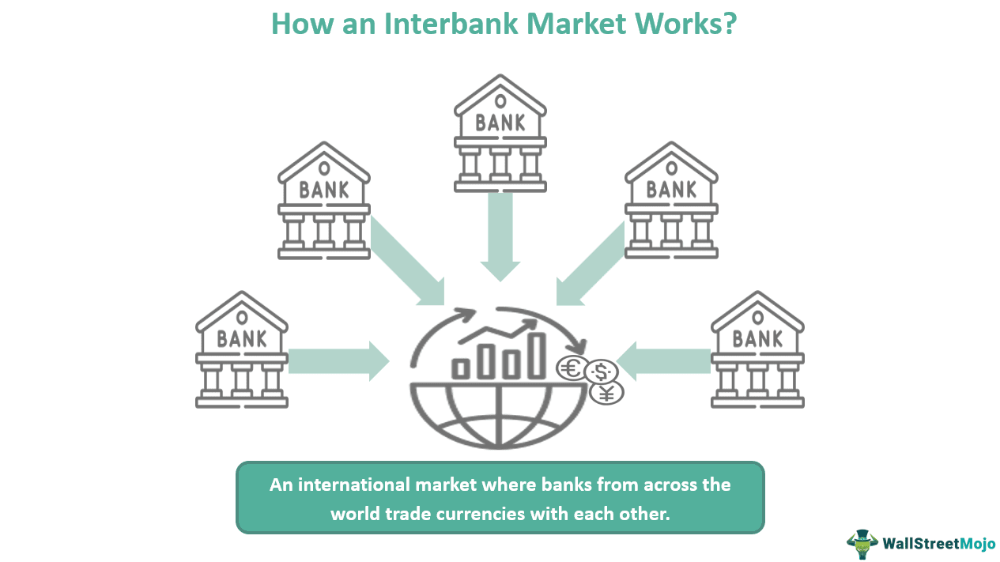

Banking is the business of receiving deposits, safeguarding funds, and providing loans and credit. It serves as a critical component of the financial system, which consists of institutions, markets, and instruments that facilitate the flow of funds and allocation of capital within an economy. Within this complex web, the interbank market occupies a uniquely strategic position.

The interbank market is a global network where banks lend to and borrow from one another. It plays an essential role in managing liquidity and risk by allowing banks to balance their reserves and implement monetary policy. Transactions commonly involve foreign exchange and interest rates, influencing global financial stability. A deep understanding of the interbank market is vital to recognizing its effects on the financial health of banking institutions - and by extension, the economy at large.

In recent years, algorithmic trading (or algo trading) has transformed financial markets. It involves using computer algorithms to execute trades at speeds and frequencies beyond human capability. These algorithms utilize complex mathematical models and big data analytics to determine the optimal timing, price, and execution route for trades. Algorithmic trading has become central to ensuring liquidity and efficiency across various asset classes, including stocks, options, and futures.

This article will explore the architecture of the financial system, focusing specifically on the interbank market and the integral role that algorithmic trading plays within it. We will discuss how banks employ interbank transactions to maintain liquidity and mitigate risks. Additionally, we will examine the rise of algorithmic trading, discussing how technological advancements and data-driven strategies have revolutionized its application in interbank markets.

The article will also address regulatory and ethical questions that arise as technology and financial markets converge. We will investigate how global regulators are adapting to manage emerging risks and ensure transparency and fairness. Finally, the article will consider the future implications and the evolving dynamics between these components within the financial industry. 

This discussion sets the groundwork for a detailed exploration of how interconnected forces shape the global financial landscape, highlighting the necessity for ongoing observation and adaptation to new trends.

## Table of Contents

## Understanding the Interbank Market

The interbank market is a crucial segment of the global financial system where banks lend to and borrow from each other, primarily on a short-term basis. This market is fundamental for maintaining [liquidity](/wiki/liquidity-risk-premium) and enabling banks to manage their day-to-day funding needs and risks associated with their financial activities. Transactions in the interbank market often include unsecured loans and deposits, as well as more complex financial instruments such as certificates of deposit, repurchase agreements, and swaps.

Banks participate in the interbank market to manage liquidity, which refers to the availability of liquid assets to fulfill short-term obligations. Effective liquidity management ensures that a financial institution can meet its obligations as they come due, thereby maintaining operational stability. By borrowing and lending in the interbank market, banks can adjust their cash balances efficiently, ensuring they have adequate liquidity to cover withdrawals and other operational expenses. Additionally, participation in the interbank market helps banks mitigate risks related to [interest rate](/wiki/interest-rate-trading-strategies) fluctuations and currency exchange rates. Through various transactions, such as foreign exchange swaps and interest rate swaps, banks can hedge against potential adverse movements in these areas, thereby stabilizing their financial position.

Foreign exchange ([forex](/wiki/forex-system)) and interest rate transactions are significant components of the interbank market. Forex transactions involve the buying and selling of currencies to facilitate international trade and investment, while interest rate transactions, such as swaps, help banks manage their interest rate exposure. The interbank market serves as a conduit for these transactions, influencing the determination of key benchmarks like the London Interbank Offered Rate (LIBOR) and the Euro Interbank Offered Rate (Euribor), which are used globally to set rates on an array of financial products.

The interbank market is vital for global financial stability. It serves as a barometer for the health of the financial system, influencing monetary policy and the transmission of economic signals across the banking sector. By providing a platform for banks to manage liquidity, hedge risks, and conduct necessary transactions, the interbank market helps prevent systemic crises that could arise from a misalignment in liquidity across institutions.

Recent trends and developments within the interbank market have been shaped by technological advancements and regulatory changes. The increased use of electronic platforms has enhanced the efficiency and transparency of interbank transactions, facilitating quicker and more precise execution. Concurrently, regulatory efforts initiated in response to past financial crises, such as the financial reforms following the 2008 crisis, have sought to improve the robustness and resilience of the interbank market. These reforms include heightened capital requirements and greater scrutiny on interbank lending practices to reduce systemic risk.

In summary, the interbank market plays a pivotal role in the financial ecosystem by enabling banks to manage liquidity and risk efficiently, influencing global interest rates, and contributing to financial stability. Understanding its functions, participants, and evolving trends is essential for appreciating the broader dynamics of the global financial system.

## The Financial System and Its Components

The financial system is a structured network that serves a pivotal role in the economy by facilitating the flow of funds between savers, investors, and borrowers. It achieves this by providing a platform for financial transactions and the efficient allocation of resources, thereby promoting economic stability and growth. The financial system is comprised of several key components: financial markets, financial institutions, and financial instruments.

**Financial Markets, Institutions, and Instruments**

Financial markets are venues where securities, commodities, derivatives, and other financial instruments are traded. They include stock markets, bond markets, foreign exchange markets, and derivatives markets. These markets provide the necessary liquidity and enable price discovery, essential for investors' decision-making processes.

Financial institutions are organizations that provide financial services to consumers and are integral to the financial system. These institutions include banks, insurance companies, pension funds, and investment firms. They facilitate the pooling of resources, risk management, and the transfer of funds, acting as intermediaries between savers and borrowers.

Financial instruments are contracts that represent a claim to future cash flows or assets. These include bonds, stocks, options, and futures. Instruments are used for investment, hedging risks, or transferring capital across different time periods or geographical locations.

**Interbank Market in the Financial System**

The interbank market is an essential segment of the broader financial system. This market enables banks to trade currencies, assets, and short-term loans among themselves to manage liquidity and risk effectively. It is primarily used by financial institutions to maintain the day-to-day balance of payments, ensuring that banks can meet their reserve requirements and transactional obligations. 

The significance of the interbank market lies in its contribution to the smooth functioning of global foreign exchange and interest rate transactions. This market helps in setting benchmark interest rates, such as the London Interbank Offered Rate (LIBOR), which affect various financial products and contracts worldwide.

**Regulatory Frameworks and Their Impact**

Regulatory frameworks are crucial in maintaining the stability and integrity of the financial system. They provide a structured approach to risk management, capital requirement standards, and the safeguarding of consumers’ interests. Regulations such as the Dodd-Frank Wall Street Reform, the Basel III framework, and the European Market Infrastructure Regulation (EMIR) aim to monitor, control, and mitigate systemic risks, thereby fostering trust in the financial system.

These regulations have shaped the financial landscape by imposing stricter capital requirements, enhancing transparency, and encouraging more robust risk management strategies among financial institutions. However, the increased regulatory burden has also led to challenges concerning compliance costs and the pace of financial innovation.

**Challenges and Opportunities**

The current financial architecture faces several challenges, including technological advancements, cyber-security threats, and maintaining market integrity amid high-frequency and [algorithmic trading](/wiki/algorithmic-trading). However, these challenges also present opportunities for improvement. The adoption of financial technology (FinTech) innovations can lead to more efficient financial services, improved user experiences, and broader financial inclusion.

The interplay between regulatory oversight and technological advancements continues to shape the landscape of the financial system, presenting both risks and opportunities for stakeholders globally. This dynamic environment demands continuous monitoring and adaptation to foster a resilient and inclusive financial ecosystem.

## The Rise of Algorithmic Trading

Algorithmic trading, often referred to as algo trading, is the use of computer programs to execute trading strategies with minimal human intervention. These programs are designed to make decisions regarding the timing, price, and quantity of trades based on predefined criteria. The concept emerged in the late 20th century with the advent of electronic trading platforms and has grown substantially due to technological advancements.

### Technological Advancements

The emergence of algo trading is closely tied to rapid strides in technology. High-speed internet, powerful computing capabilities, and sophisticated software development have been pivotal. The ability to process large volumes of data in real-time and execute trades within microseconds has transformed how financial markets operate. Trading systems now leverage [machine learning](/wiki/machine-learning) algorithms and [artificial intelligence](/wiki/ai-artificial-intelligence) to improve decision-making processes.

### Types of Algorithmic Strategies

1. **High-Frequency Trading (HFT):** This strategy involves executing a large number of orders at extremely high speeds, typically to take advantage of small price differentials. HFT relies heavily on latency-sensitive market data, where execution speed is crucial.

2. **Market-Making Algorithms:** These algorithms provide liquidity by continuously quoting both buy and sell prices for financial instruments. They profit from the bid-ask spread and are essential for maintaining efficient market function.

3. **Statistical Arbitrage:** This involves statistical methods to identify price inefficiencies between correlated financial instruments, executing trades to exploit these discrepancies.

4. **Trend Following:** This strategy uses algorithms to identify and capitalize on trends in market prices, facilitated by the capability to process historical and real-time data to predict future movements.

### Benefits of Algorithmic Trading

The primary advantage of algorithmic trading is speed. Algorithms can analyze market conditions and execute orders faster than human traders, significantly improving efficiency. Additionally, the use of algorithms mitigates emotional decision-making, leading to more consistent trading outcomes. Algo trading also democratizes access to complex trading strategies, enabling market participation for a broader range of investors.

### Potential Risks and Ethical Considerations

Despite its benefits, algorithmic trading presents several risks. The high speed of trades can exacerbate market [volatility](/wiki/volatility-trading-strategies) and lead to flash crashes, as evidenced by the May 6, 2010, Flash Crash in the U.S. stock market. Algorithms may also behave unexpectedly due to programming errors or unforeseen interactions with other algorithms.

Ethical concerns also arise, particularly regarding market fairness and transparency. High-frequency traders, for instance, may gain unfair advantages due to colocation near exchanges or faster data access. These issues highlight the necessity for regulatory frameworks to ensure equitable market conditions while fostering innovation.

In summary, algorithmic trading has reshaped the financial markets landscape, driven by technological innovations that enhance speed and efficiency. However, it also entails specific risks and ethical challenges that necessitate careful consideration and regulation.

## The Interplay Between Interbank Market and Algo Trading

Algorithmic trading, often abbreviated as algo trading, plays a significant role in the interbank market, influencing liquidity, price discovery, and the nature of transactions. Algo trading involves the use of computer algorithms to execute orders based on predefined criteria, such as timing, price, and [volume](/wiki/volume-trading-strategy). Within the interbank market—a key platform where financial institutions trade currencies and other financial instruments—algo trading has emerged as a transformative force.

**Impacts on Liquidity and Price Discovery**

Algorithmic trading enhances liquidity in the interbank market by enabling quicker transaction processing and reducing the bid-ask spread. It allows for continuous market participation by executing large orders with limited market impact through techniques such as iceberg orders and time slicing, thus maintaining liquidity levels. By analyzing market data and executing trades in milliseconds, algo trading contributes to more efficient price discovery. The rapid interpretation of information allows prices to adjust quickly to new events, creating an environment where prices reflect available information more accurately.

**Transformation Through Data-Driven Strategies**

Data-driven strategies in algo trading have revolutionized interbank transactions. Algorithms can analyze vast amounts of historical and real-time data to identify trading opportunities. Machine learning and artificial intelligence play crucial roles in refining these strategies by learning patterns and improving prediction capabilities. These strategies often involve processing signals from economic indicators, market sentiment, and transaction data to optimize trading decisions.

**Real-World Applications**

Several financial institutions have successfully integrated algo trading into the interbank market. For example, Deutsche Bank and JPMorgan Chase have developed sophisticated algorithms to facilitate foreign exchange and interest rate trading. These algorithms use advanced analytics and access multiple liquidity providers to ensure optimal execution strategies. Barclays' use of algorithms for forex trading has demonstrated enhanced execution speed and reduced manual errors, contributing to improved overall efficiency.

**Potential Future Developments**

Looking ahead, the integration of algo trading in the interbank market is likely to deepen with advances in technology. Blockchain could play a role in enhancing the transparency and security of transactions, while developments in quantum computing might further accelerate processing speeds. Moreover, regulatory advancements could shape the trajectory of algo trading by implementing frameworks for greater oversight, aiming to prevent systemic risks associated with automated trading.

The interplay between algorithmic trading and the interbank market illustrates a symbiotic relationship that continues to evolve. As technology advances, financial institutions will need to adapt to maintain competitive advantages while navigating regulatory landscapes and mitigating potential risks.

## Regulatory and Ethical Considerations

Regulatory challenges posed by the rise of algorithmic trading in the interbank market are multifaceted and significant. As technology rapidly transforms financial markets, regulators are tasked with ensuring that these developments do not compromise market stability. Algorithmic trading, which involves using computer algorithms to execute trades at high speed, has introduced concerns related to market volatility, systemic risk, and fairness.

Financial regulators play a crucial role in managing these risks. Their primary objective is to maintain a stable and secure financial system. They achieve this by setting guidelines and monitoring activities to prevent market abuse, such as insider trading and market manipulation, which can be exacerbated by algorithms' speed and complexity. Regulatory bodies like the U.S. Securities and Exchange Commission (SEC) and the European Securities and Markets Authority (ESMA) have implemented rules requiring algorithmic traders to ensure robust risk management practices, including real-time monitoring of trades and system performance.

Ethical concerns in algorithmic trading focus on transparency and fairness. There are apprehensions that algorithms, capable of executing thousands of transactions per second, could unfairly advantage certain market participants over others. This can result in information asymmetry, where certain actors have access to faster or more comprehensive data, potentially disadvantaging retail investors. Ensuring that algorithmic trading practices are transparent is vital to maintaining a level playing field in the market. Measures such as the "kill switch," which allows for the immediate cessation of trading in the event of undesirable or potentially harmful trading behaviours, are examples of steps taken to enhance fairness.

Regulations aim to balance innovation and protection within the financial system. While it is crucial to foster technological advancements that increase market efficiency, it is equally important to protect market integrity. Regulatory frameworks often focus on creating environments where technological progress can coexist with traditional financial systems' safety and reliability. Measures such as stress testing of algorithms and rigorous [backtesting](/wiki/backtesting) procedures help ensure that new trading strategies do not introduce unforeseen risks.

At a global level, discussions about regulating the intersection of technology and finance (often referred to as FinTech) are ongoing. Organizations like the Financial Stability Board (FSB) and the International Organization of Securities Commissions (IOSCO) contribute to these discussions, aiming to develop a cohesive and coordinated approach to regulation. These conversations focus on ensuring that technological innovations do not outpace the regulatory frameworks designed to safeguard financial markets, emphasizing international cooperation to address challenges that are inherently global in nature.

In conclusion, as algorithmic trading continues to evolve, robust regulatory measures and ethical considerations will remain vital to ensuring that these practices contribute positively to the interbank market and the broader financial system.

## Conclusion

In this article, we explored the interbank market, financial systems, and algorithmic trading. These components form the backbone of global finance, providing avenues for liquidity management, economic security, and innovation. The interbank market, crucial for financial stability, enables banks to address liquidity needs and manage risk efficiently. Meanwhile, the financial system, comprising various markets, institutions, and instruments, supports economic growth by facilitating resource allocation and capital formation.

Algorithmic trading, with its rise fueled by technological advancements, has transformed modern financial markets, enhancing speed and efficiency. However, it also poses potential risks and ethical concerns that necessitate careful consideration. The interplay between the interbank market and algo trading is increasingly significant, impacting liquidity and the price discovery process.

Looking ahead, the relationship between these elements will likely continue evolving, driven by ongoing technological advancements and market dynamics. As new trends emerge, the role of regulation becomes paramount in maintaining a balance between fostering innovation and ensuring stability and fairness in the financial ecosystem. Regulatory frameworks must adapt to mitigate risks while encouraging beneficial developments in technology and finance.

In conclusion, understanding the intricate connections between the interbank market, financial systems, and algorithmic trading is essential for navigating the future of global finance. Continuous observation, adaptability, and informed regulation will be crucial in steering these intersecting elements towards sustainable growth and stability.

## References & Further Reading

[1]: ["Basel III: International Regulatory Framework for Banks"](https://www.bis.org/bcbs/basel3.htm) by Bank for International Settlements.

[2]: ["High-Frequency Trading: A Practical Guide to Algorithmic Strategies and Trading Systems"](https://www.amazon.com/High-Frequency-Trading-Practical-Algorithmic-Strategies/dp/1118343506) by Irene Aldridge.

[3]: O'Hara, M. (2015). ["High Frequency Market Microstructure."](https://www.sciencedirect.com/science/article/pii/S0304405X15000045) The Review of Financial Studies, 28(3), 560-567.

[4]: Farrell, J. (2021). ["The Interbank Market: A Brief Overview."](https://www.researchgate.net/publication/358748986_Interbank_money_market_concerns_and_actors'_strategies-A_systematic_review_of_21st_century_literature) Investopedia.

[5]: Gomber, P., Arndt, B., Lutat, M., & Uhle, T. (2011). ["High-Frequency Trading."](https://papers.ssrn.com/sol3/papers.cfm?abstract_id=1858626) Journal of Information Technology, 26(4), 312-325.

[6]: Lewis, M. (2014). ["Flash Boys: A Wall Street Revolt"](https://en.wikipedia.org/wiki/Flash_Boys) by Michael Lewis. 

[7]: European Securities and Markets Authority (ESMA). ["MiFID II and Algorithmic Trading."](https://www.esma.europa.eu/publications-and-data/interactive-single-rulebook/mifid-ii) 

[8]: ["The Risks of Algorithmic Trading: Quantitative and Qualitative Aspects of Risk Management for Investment Firms"](https://www.investopedia.com/articles/markets/012716/four-big-risks-algorithmic-highfrequency-trading.asp) by IOSCO.