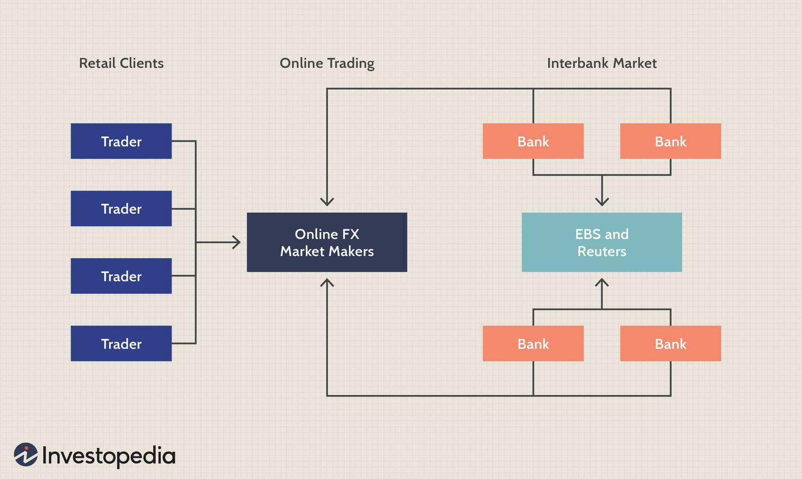

## Table of Contents

## What is the interbank market?

The interbank market is where banks trade currencies with each other. It's like a big network where banks from all over the world can buy and sell money. This market is very important because it helps banks manage their money and make sure they have enough of different currencies to meet their customers' needs.

In the interbank market, banks usually trade large amounts of money. They use electronic systems to make these trades quickly and easily. The rates at which they trade are called interbank rates, and these rates can change a lot during the day based on what's happening in the global economy. This market works all the time, even when banks are closed, because it never sleeps.

## Who are the main participants in the interbank market?

The main participants in the interbank market are big banks from all around the world. These banks trade currencies with each other to make sure they have enough money in different currencies to serve their customers. For example, if a bank in the United States needs more Euros, it can trade its US dollars with a bank in Europe that has Euros to spare.

Besides big banks, other participants include central banks, which are like the bosses of all the banks in a country. Central banks can step into the interbank market to control the amount of money in their country's economy. Also, some big financial companies, like investment firms and hedge funds, can join in the trading, but they usually need to go through a bank to do so.

## How does the interbank market function?

The interbank market is where big banks trade currencies with each other. It's like a big network that works all the time, even when banks are closed. Banks use electronic systems to make these trades quickly and easily. They trade large amounts of money, and the rates at which they trade are called interbank rates. These rates can change a lot during the day because of what's happening in the global economy.

Besides big banks, other participants include central banks, which manage the money in a country, and big financial companies like investment firms and hedge funds. These other participants usually need to go through a bank to trade. The main goal of the interbank market is to help banks manage their money and make sure they have enough of different currencies to meet their customers' needs. This market is very important for keeping the global economy running smoothly.

## What types of transactions occur in the interbank market?

In the interbank market, the main type of transaction is currency exchange. Big banks trade different currencies with each other to make sure they have enough money in various currencies to serve their customers. For example, if a bank in the United States needs more Euros, it can trade its US dollars with a bank in Europe that has Euros to spare. These trades happen all the time and involve large amounts of money.

Besides currency exchange, banks also use the interbank market for other financial transactions. They can borrow and lend money to each other, usually for short periods like overnight. This helps banks manage their cash flow and meet their daily financial needs. Sometimes, central banks step in to control the money supply in the economy by buying or selling currencies or by adjusting interest rates. These transactions keep the global financial system running smoothly.

## What is the role of central banks in the interbank market?

Central banks play a big role in the interbank market. They are like the bosses of all the banks in a country and help keep the economy stable. One way they do this is by buying and selling currencies in the interbank market. If they think there's too much of one currency in the economy, they can sell it to make it less valuable. If they think there's not enough, they can buy it to make it more valuable. This helps keep the value of their country's money steady.

Another thing central banks do is set interest rates. They can change these rates to control how much money banks lend to each other in the interbank market. If they want banks to lend more, they might lower the interest rates. If they want banks to lend less, they might raise the rates. By doing this, central banks can influence how much money is flowing in the economy and help prevent big problems like inflation or a financial crisis.

## How do interest rates in the interbank market affect the broader economy?

Interest rates in the interbank market are really important for the whole economy. When central banks change these rates, it affects how much money banks lend to each other. If the rates go down, banks can borrow money more cheaply, so they're more likely to lend more money to people and businesses. This can help the economy grow because people and businesses have more money to spend and invest. On the other hand, if the rates go up, borrowing money becomes more expensive, so banks might lend less. This can slow down the economy because people and businesses might not have as much money to spend.

These changes in lending can also affect things like inflation. If banks lend more money because of lower interest rates, there's more money in the economy, which can make prices go up. That's called inflation. Central banks try to control inflation by adjusting interest rates. If they see prices going up too fast, they might raise rates to slow down lending and cool down the economy. If they think the economy needs a boost, they might lower rates to encourage more lending and spending. This way, interest rates in the interbank market help keep the economy balanced and stable.

## What is the difference between the interbank market and the forex market?

The interbank market and the [forex](/wiki/forex-system) market are closely related but not exactly the same. The interbank market is where big banks trade currencies with each other. It's like a private network where only big banks and sometimes central banks and big financial firms can trade. They use this market to make sure they have enough of different currencies to serve their customers. The trades in the interbank market happen all the time and involve very large amounts of money.

The forex market, or foreign exchange market, is much bigger and includes the interbank market but also involves many other players. Besides banks, you have individuals, small businesses, and other financial institutions trading currencies. The forex market is where anyone can trade currencies, often through brokers or online platforms. While the interbank market focuses on big trades between banks, the forex market is more open and includes a wide range of transactions, from small to large.

## How is liquidity managed in the interbank market?

Liquidity in the interbank market is managed by making sure there's always enough money for banks to trade with each other. Banks need to have enough cash to meet their customers' needs, so they trade currencies and borrow or lend money to each other. This helps keep the market running smoothly. If a bank is short on a certain currency, it can quickly trade or borrow from another bank that has extra. This way, banks can keep their cash flowing and meet their daily financial needs.

Central banks also play a big role in managing [liquidity](/wiki/liquidity-risk-premium). They can add or take away money from the market to keep things balanced. If there's not enough money in the system, a central bank might lend more money to banks at a lower [interest rate](/wiki/interest-rate-trading-strategies). This encourages banks to borrow and trade more, which increases liquidity. On the other hand, if there's too much money, the central bank might take some out by selling securities or raising interest rates. This helps control the amount of money in the market and keeps the economy stable.

## What are the risks associated with participating in the interbank market?

Participating in the interbank market can be risky because it involves trading large amounts of money. One big risk is called credit risk. This happens when one bank lends money to another bank, but the borrowing bank might not be able to pay it back. If a bank fails to repay, the lending bank could lose a lot of money. Another risk is called market risk. This is when the value of currencies changes quickly, and banks can lose money if they're not careful. For example, if a bank buys a lot of Euros and the value of the Euro drops suddenly, the bank could lose money on that trade.

There's also something called liquidity risk. This is when a bank might not be able to trade or borrow money quickly enough to meet its needs. If a bank needs money fast but can't find anyone to trade with, it could be in trouble. Operational risk is another concern. This happens if there are problems with the electronic systems banks use to trade. If the systems go down or there's a mistake, it can cause big problems. Central banks try to help manage these risks by setting rules and keeping an eye on the market, but the risks are still there and banks need to be careful.

## How have technological advancements impacted the interbank market?

Technological advancements have made a big difference in the interbank market. They've made trading faster and easier. Now, banks use electronic systems to trade currencies and manage their money. These systems work all the time, so banks can trade whenever they need to, even when their offices are closed. This helps banks get the money they need quickly and makes the market more efficient. Plus, technology has made it easier for banks to see what's happening in the market and make better decisions.

Another way technology has changed the interbank market is by making it more secure and reliable. Banks use special computer programs to keep their trades safe and make sure everything is done correctly. These programs can spot mistakes or suspicious activities, which helps prevent fraud and other problems. Also, technology has made it easier for banks to keep track of their trades and report them to regulators. This helps keep the market fair and transparent. Overall, technology has made the interbank market a better place for banks to trade and manage their money.

## What regulatory measures are in place to oversee the interbank market?

The interbank market is watched over by different rules and organizations to make sure everything is fair and safe. In many countries, central banks are in charge of setting rules for the interbank market. They make sure that banks follow these rules and can step in if something goes wrong. For example, central banks might set limits on how much money banks can borrow from each other or make sure banks have enough money to cover their trades. They also keep an eye on the market to stop any bad behavior, like trying to cheat or manipulate prices.

On top of what central banks do, there are also other groups that help regulate the interbank market. In the United States, the Federal Reserve and the Commodity Futures Trading Commission (CFTC) play big roles. They work together to make sure banks are following the rules and to catch any problems early. Internationally, organizations like the Bank for International Settlements (BIS) help set global standards and guidelines for the interbank market. All these rules and oversight help keep the market running smoothly and protect the global economy.

## How does the interbank market influence global financial stability?

The interbank market is really important for keeping the world's money system stable. It's where big banks trade currencies with each other, making sure they have enough money in different currencies to serve their customers. When banks can trade easily and quickly, it helps keep the flow of money smooth across the world. If the interbank market is working well, it means banks can meet their financial needs and help their customers, which keeps the economy running smoothly. But if something goes wrong in the interbank market, like if banks can't trade because they don't trust each other, it can cause big problems for the whole world's economy.

Central banks also play a big role in keeping the interbank market stable. They can step in to add or take away money from the market to keep things balanced. If there's not enough money, central banks can lend more to banks at lower interest rates, which helps keep the market liquid. If there's too much money, they might take some out by selling securities or raising interest rates. This helps control the amount of money in the market and keeps the economy from getting too hot or too cold. By managing the interbank market, central banks help make sure that the global financial system stays strong and stable.

## References & Further Reading

[1]: ["Basel III: International Regulatory Framework for Banks"](https://www.bis.org/bcbs/basel3.htm) by Bank for International Settlements.

[2]: ["High-Frequency Trading: A Practical Guide to Algorithmic Strategies and Trading Systems"](https://www.amazon.com/High-Frequency-Trading-Practical-Algorithmic-Strategies/dp/1118343506) by Irene Aldridge.

[3]: O'Hara, M. (2015). ["High Frequency Market Microstructure."](https://www.sciencedirect.com/science/article/pii/S0304405X15000045) The Review of Financial Studies, 28(3), 560-567.

[4]: Farrell, J. (2021). ["The Interbank Market: A Brief Overview."](https://www.researchgate.net/publication/358748986_Interbank_money_market_concerns_and_actors'_strategies-A_systematic_review_of_21st_century_literature) Investopedia.

[5]: Gomber, P., Arndt, B., Lutat, M., & Uhle, T. (2011). ["High-Frequency Trading."](https://papers.ssrn.com/sol3/papers.cfm?abstract_id=1858626) Journal of Information Technology, 26(4), 312-325.

[6]: Lewis, M. (2014). ["Flash Boys: A Wall Street Revolt"](https://en.wikipedia.org/wiki/Flash_Boys) by Michael Lewis. 

[7]: European Securities and Markets Authority (ESMA). ["MiFID II and Algorithmic Trading."](https://www.esma.europa.eu/publications-and-data/interactive-single-rulebook/mifid-ii) 

[8]: ["The Risks of Algorithmic Trading: Quantitative and Qualitative Aspects of Risk Management for Investment Firms"](https://www.investopedia.com/articles/markets/012716/four-big-risks-algorithmic-highfrequency-trading.asp) by IOSCO.