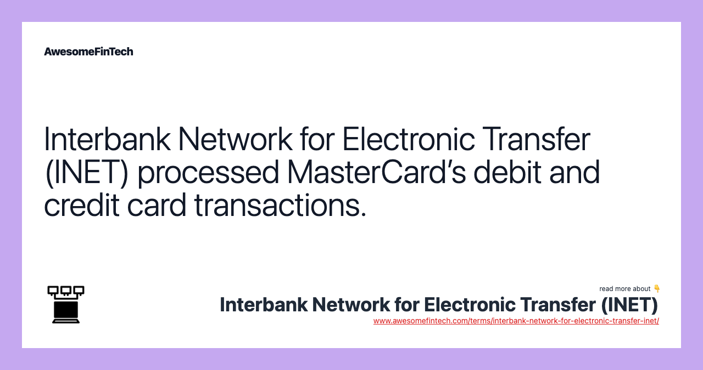

## Table of Contents

## What is an interbank network for electronic transfers?

An interbank network for electronic transfers is a system that lets banks and financial institutions send money to each other electronically. This system helps make sure that money can move quickly and safely between different banks. It's like a big highway for money, where banks can send and receive payments without using paper checks or cash.

These networks are important because they help make banking easier and faster for everyone. When you pay for something online or transfer money to a friend, your bank uses these networks to move the money. This makes it possible for you to send and receive money almost instantly, no matter where the other bank is located.

## How does an interbank network facilitate electronic transfers between banks?

An interbank network helps banks send money to each other electronically. It's like a special road just for banks to move money quickly and safely. When you want to send money to someone at a different bank, your bank uses this network to make the transfer. The network makes sure the money goes to the right place without any mistakes.

The network works by connecting all the banks together. When a bank wants to send money, it sends a message through the network to the other bank. This message tells the other bank how much money to move and where it should go. The network makes sure the message gets there fast and that the money moves correctly. This way, you can send money to anyone, anywhere, without waiting for days or worrying about losing it.

## What are the common types of transactions processed through an interbank network?

Interbank networks handle many types of transactions that people and businesses do every day. The most common ones are when people send money to each other, like paying a friend back for lunch or sending money to family. Another common transaction is when people pay bills, like their electricity or phone bill. Businesses also use these networks to pay their suppliers or receive payments from customers.

Another type of transaction that goes through interbank networks is when people get their salaries from their employers. When you get paid, your employer's bank sends the money to your bank through the network. Also, when people buy things online, the payment often goes through these networks. For example, if you buy something from a website, your bank sends the money to the seller's bank using the interbank network.

These networks also handle bigger transactions like when businesses move large amounts of money between accounts in different banks. This can happen when a company needs to pay for something big, like new equipment or when they are moving money to another country. All these transactions need to be fast and safe, and interbank networks make sure that happens.

## Can you explain the basic structure and components of an interbank network?

An interbank network is like a big system that helps banks talk to each other and move money around. The main part of this system is the central hub, which is like the brain of the network. It keeps track of all the messages and makes sure they go to the right place. Banks connect to this hub through special lines, which are like roads that let them send and receive messages quickly. Each bank has its own computer system that talks to the central hub, and these systems are called nodes. They are important because they help the bank send and receive money and keep everything working smoothly.

Another important part of an interbank network is the rules that everyone has to follow. These rules are called protocols, and they make sure that all the banks understand each other and that the money moves safely. The network also uses special codes, like SWIFT codes, to make sure the money goes to the right bank and the right account. There are also security measures in place to keep the money and the messages safe from people who might try to steal them. All these parts work together to make sure that when you send money, it gets to where it needs to go quickly and safely.

## What are the key benefits of using an interbank network for electronic transfers?

Using an interbank network for electronic transfers makes moving money between banks fast and easy. When you send money to someone at a different bank, it can get there in just a few seconds or minutes, instead of taking days like with paper checks. This speed is really helpful for things like paying bills on time or sending money to friends and family quickly. Plus, because the network connects all the banks, you can send money to anyone, anywhere, without worrying about where their bank is located.

Another big benefit is that interbank networks are safe and reliable. They use special codes and security measures to make sure that your money goes to the right place and that no one else can steal it. This means you can trust that your money is safe when you send it through the network. Also, because the network follows strict rules, there are fewer mistakes, so you don't have to worry about your money getting lost or going to the wrong account.

## How do security and fraud prevention work within an interbank network?

Security and fraud prevention in an interbank network are very important to keep your money safe. The network uses special codes, like SWIFT codes, to make sure that money goes to the right bank and the right account. These codes help prevent mistakes and make sure that only the right people can get the money. The network also has strict rules, called protocols, that everyone has to follow. These rules make sure that all the messages and transactions are clear and correct, so it's harder for someone to do something wrong.

Another way the network keeps things safe is by using strong security measures. These measures include things like encryption, which is like putting your message in a secret code that only the right bank can read. There are also systems that watch for anything strange or unusual, like if someone tries to send a lot of money at a weird time. If the system sees something that doesn't look right, it can stop the transaction and check to make sure everything is okay. This helps to stop fraud and keep your money safe when you're sending it through the network.

## What are the typical fees associated with transactions in an interbank network?

When you use an interbank network to send money, you might have to pay a fee. The fee can be different depending on things like how much money you're sending, where it's going, and which banks are involved. Usually, the bank that sends the money charges a fee for using the network. This fee helps cover the cost of keeping the network running and making sure your money gets to where it needs to go safely and quickly.

Sometimes, the bank that receives the money might also charge a fee. This can happen if the money is coming from a different country or if it's a big amount. The fees can add up, so it's a good idea to check with your bank before you send money to see how much it will cost. Even with the fees, using an interbank network is often faster and more convenient than other ways of sending money, like mailing a check.

## How does an interbank network handle international transfers and what challenges do they face?

An interbank network helps with international transfers by connecting banks all over the world. When you send money to another country, your bank uses the network to send a message to the bank where the money is going. The message tells the other bank how much money to move and where it should go. The network makes sure the message gets there fast and that the money moves correctly. This way, you can send money to anyone, anywhere, without waiting for days or worrying about losing it.

One big challenge with international transfers is dealing with different rules and currencies in different countries. Each country has its own banking rules that the network has to follow, which can make things more complicated. Also, when you send money to another country, it usually needs to be changed into the other country's money, which can take time and might cost extra money because of exchange rates. Another challenge is making sure the money is safe and that no one steals it. The network uses special codes and security measures to keep the money safe, but it's still a big job to protect it when it's moving between countries.

## What role do standards and protocols play in the operation of an interbank network?

Standards and protocols are like the rules that everyone has to follow when using an interbank network. They make sure that all the banks can understand each other and that the money moves smoothly and safely. For example, when a bank sends a message through the network, it has to use a certain format so that the other bank knows exactly what to do with the money. These rules also help make sure that everyone is doing things the same way, which reduces mistakes and makes the network more reliable.

Another important thing about standards and protocols is that they help keep the network secure. They include rules about how to keep messages and transactions safe from people who might try to steal money. For instance, there are protocols for using encryption, which is like putting the message in a secret code that only the right bank can read. By following these standards and protocols, the interbank network can make sure that your money gets to where it needs to go quickly and safely, no matter where in the world it's going.

## How can banks integrate their systems with an interbank network?

To integrate their systems with an interbank network, banks need to connect their computer systems to the network's central hub. This is like plugging into a big highway for money. They do this by setting up special lines that let them send and receive messages quickly. Each bank also needs to make sure their computer system, or node, can talk to the network using the right rules and codes. This means they have to follow the network's standards and protocols so that their messages can be understood by other banks.

Once the bank is connected, they can start sending and receiving money through the network. They need to make sure their systems are set up to handle the special codes, like SWIFT codes, that the network uses. Banks also have to use strong security measures to keep the money and messages safe. This includes things like encryption and systems that watch for anything unusual. By following these steps, banks can use the interbank network to send and receive money quickly and safely.

## What are the future trends and technological advancements expected in interbank networks?

In the future, interbank networks are expected to become even faster and more secure. One big trend is the use of blockchain technology, which is like a special way of keeping records that no one can change. This can make sending money between banks even safer and easier to track. Another trend is the use of [artificial intelligence](/wiki/ai-artificial-intelligence) (AI) to help spot and stop fraud. AI can look at lots of information quickly and find anything that looks strange, which helps keep your money safe. Also, more and more banks are using real-time payment systems, which means you can send and receive money almost instantly, no matter where in the world it's going.

Another important advancement is the growth of open banking, where banks share their information with other companies to make new and better services for customers. This can help make sending money easier and give you more choices for how to do it. Also, as more people use their phones and other devices to send money, interbank networks will need to work well with these new ways of banking. All these changes are making interbank networks better at moving money quickly, safely, and in ways that are easy for everyone to use.

## How do regulatory requirements impact the operations and development of interbank networks?

Regulatory requirements are like rules that banks and interbank networks have to follow. These rules are made by governments and other groups to make sure that banks are doing things safely and fairly. When an interbank network wants to send money between banks, it has to follow these rules. This can make things more complicated because the network has to make sure it's doing everything the right way. For example, when sending money to another country, the network has to follow the rules of both countries, which can be different and hard to manage.

These rules also affect how interbank networks grow and change. When new technology comes out, like blockchain or AI, the network has to make sure it can use these new tools without breaking any rules. This can slow down how fast the network can improve and add new features. But, these rules are important because they help keep your money safe and make sure that everyone is treated fairly. So, while they can make things harder for the network, they are there to protect you and make banking better for everyone.

## References & Further Reading

[1]: Duffie, D., & Gârleanu, N. (2001). ["Risk and Valuation of Collateralized Debt Obligations"](https://web.stanford.edu/~duffie/ddng.pdf), The Review of Financial Studies, Volume 24, Issue 3.

[2]: Hasbrouck, J., & Saar, G. (2013). ["Low-latency trading"](https://papers.ssrn.com/sol3/papers.cfm?abstract_id=1695460), The Review of Financial Studies, Volume 26, Issue 9.

[3]: ["Algorithmic and High-Frequency Trading"](https://www.cambridge.org/us/universitypress/subjects/mathematics/mathematical-finance/algorithmic-and-high-frequency-trading) by Álvaro Cartea, Sebastian Jaimungal, and José Penalva

[4]: Agarwal, R., & Meyer, R. J. (2009). ["A New Framework for Financial Cryptography"](https://journals.sagepub.com/doi/10.1177/1476127009346790), Financial Cryptography and Data Security, 13th International Conference.

[5]: Biais, B., Foucault, T. & Moinas, S. (2015). ["Equilibrium Fast Trading"](https://www.sciencedirect.com/science/article/pii/S0304405X15000288), Econometrica, 83(6), 2041-2071.