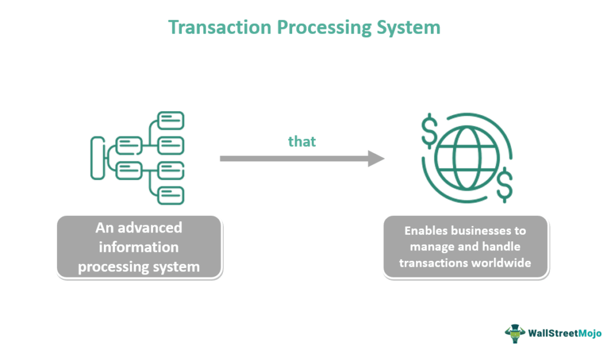

The integration of digital financial systems in today's global economy has been pivotal in transforming how businesses and individuals conduct transactions. Payment systems have undergone considerable advancements, moving away from traditional methods towards innovative technologies that have introduced efficiencies, accuracy, and enhanced security in transactions. Among these advancements, interchanges have emerged as crucial components in the processing and transfer of digital data, streamlining operations by replacing cumbersome paper-based processes with efficient electronic systems. This significant shift not only reduces transaction times but also minimizes errors, thus improving overall reliability.

Additionally, algorithmic trading has revolutionized the investment landscape by employing automated, pre-programmed trading strategies. Such systems leverage advanced technology to execute trades at a speed and frequency unattainable by human traders, substantially impacting market dynamics. This shift towards automation in trading processes signifies a leap towards a more efficient financial ecosystem.

Understanding these components is fundamental in comprehending the intricacies and operational efficiencies of the modern financial ecosystem. The adoption of these systems contributes immensely to an accelerated, reliable, and secure financial framework on a global scale. As digital financial systems continue to evolve, their role in the global economy will likely expand, further shaping the future of finance with increased inclusivity and efficiency.

## Table of Contents

## The Evolution of Financial Transaction Systems

Financial transaction systems have experienced remarkable growth and transformation over the years, moving from rudimentary manual methods to advanced digital platforms. Initially, transactions were processed manually, requiring substantial time and human resources. This often resulted in inefficiencies and elevated error rates. However, technological progress has driven significant improvements, evolving these systems into sophisticated, automated platforms.

The advent of Electronic Data Interchanges (EDIs) marked a significant milestone in the evolution of financial transaction systems. EDIs facilitated the seamless exchange of business documents in standardized digital formats between organizations. This innovation greatly improved transaction accuracy and speed by eliminating the need for paper-based processes. EDIs are instrumental in industries where efficiency in data exchange is crucial, helping businesses streamline operations and reduce costs associated with manual data handling.

Blockchain technology is currently at the forefront of the evolution of transaction systems, offering enhanced security and transparency. Blockchain's decentralized nature ensures that transactions are immutable and verifiable, significantly reducing the risk of fraud and unauthorized access. Financial institutions and businesses are increasingly exploring blockchain to facilitate secure and transparent transactions, potentially transforming how data is managed and shared across networks.

These technological advances in financial transaction systems contribute to reducing operational costs and minimizing errors linked with traditional methods. By automating and digitizing processes, businesses can achieve a higher degree of accuracy and efficiency, ultimately leading to improved customer experiences and streamlined operations.

Overall, the evolution of financial transaction systems reflects the broader trend of digitization in the financial sector, highlighting the critical role technology plays in enhancing the efficiency and security of financial operations. The continual advancement of these systems is vital to meet the growing demands of modern economies and to reduce friction in global financial transactions.

## Understanding Interchange in Payment Systems

Interchanges are integral to the digital architecture of modern payment systems, facilitating the seamless processing and transfer of electronic data between computer systems during financial transactions. By enabling digitally formatted business documents to replace conventional paper processes, interchanges significantly enhance both efficiency and security. The transition from paper to digital reduces transaction times and minimizes human error, thus optimizing operational workflows.

The functionality of interchanges is underpinned by their ability to standardize and automate communication between disparate systems. This is achieved through the use of standardized digital formats, such as XML (Extensible Markup Language), which permit diverse platforms and systems to interact with ease. XML offers a flexible approach to data representation, enabling structured data to be exchanged consistently and reliably. The use of such digital formats ensures connectivity across different platforms, promoting interoperability and scalability in financial systems.

Despite their advantages, interchanges present certain risks. One notable concern is the potential for data breaches. As sensitive data is transferred electronically, the risk of unauthorized access or interception increases, necessitating robust cybersecurity measures. Additionally, compatibility issues may arise, particularly when integrating systems built on different technological architectures or standards.

Looking forward, blockchain technology holds promise for enhancing interchange capabilities further. Blockchain’s decentralized and immutable nature can offer heightened levels of security and transparency. By recording transactions in a distributed ledger, blockchain can reduce the risk of fraud and improve data integrity. The adoption of blockchain in interchange systems could streamline verification processes and introduce new efficiencies across payment networks, providing a resilient infrastructure for future financial transactions.

## Algorithmic Trading: The New Frontier

Algorithmic trading is transforming financial markets by utilizing automated, pre-defined trading instructions. These systems operate at speeds and frequencies unattainable by human traders, revolutionizing the execution of trades. The primary advantage of [algorithmic trading](/wiki/algorithmic-trading) is its ability to process large volumes of data and execute trades with minimal latency, thus increasing efficiency and potential profitability.

Various strategies underpin algorithmic trading, each catering to different market objectives. Market making involves providing [liquidity](/wiki/liquidity-risk-premium) by continuously quoting buy and sell prices for financial instruments. By doing so, market makers earn the spread between these prices. Arbitrage strategies exploit price discrepancies of the same or related securities across different markets. For instance, if a stock is priced lower on one exchange compared to another, an algorithmic trader can buy the stock at the lower price and sell it at the higher price, profiting from the difference. Trend following involves buying securities that are trending upwards and selling those that are on a downward trajectory, utilizing statistical models to determine these trends.

High-frequency trading ([HFT](/wiki/high-frequency-trading-strategies)) is a subset of algorithmic trading characterized by extremely fast order execution, often completing trades within microseconds. Leveraging advanced technologies, HFT firms can capitalize on fleeting market opportunities, often holding positions for only brief moments. While HFT significantly enhances liquidity and efficiency, it can also lead to increased market [volatility](/wiki/volatility-trading-strategies). The rapid and large-scale execution of trades has been known to amplify market swings, posing risks to financial stability.

The potential for algorithmic trading to disrupt financial markets underscores the necessity for robust regulatory measures. Regulatory bodies worldwide are continuously adapting to mitigate risks associated with the speed and precision of these trades. Frameworks are being developed to ensure transparency, manage systemic risks, and establish fair trading practices. 

In conclusion, algorithmic trading represents a new frontier in financial market operations, offering unprecedented efficiency and scale. However, its rise necessitates careful regulation to harness its benefits while safeguarding market integrity.

## Impact on the Global Economy

Financial transactions, driven by advanced payment systems and algorithmic trading, significantly influence global economics. These innovations are pivotal in enhancing market liquidity and transparency, thereby making financial markets more accessible and efficient. By facilitating faster and more reliable exchanges, these technologies reduce the time and cost associated with traditional financial transactions, contributing to smoother market operations. This efficiency not only benefits institutional investors but also extends to individual investors, who now have better access to financial instruments previously out of reach.

The democratization of financial markets through innovations such as retail algorithmic trading tools has broadened the spectrum of market participation. Retail investors are now equipped with tools that leverage algorithmic trading, which automatically executes trades based on predetermined criteria, providing them with opportunities to compete alongside larger financial entities. This increased participation fosters a competitive environment that can lead to enhanced market efficiency. Nonetheless, the widespread use of these advanced technologies can present several challenges. 

One notable challenge is the inequality in access to financial technology. While some regions and demographics benefit from cutting-edge solutions, others may lag due to limited resources, reducing their ability to participate in or benefit from these technologies. Furthermore, regulatory hurdles often arise as authorities seek to balance the need for innovation with the requirement to maintain fair and stable markets. Ensuring regulatory compliance and managing cybersecurity risks are essential to sustain the integrity of financial systems and protect market participants.

As these payment and trading technologies continue to evolve, their influence on the global financial landscape will likely deepen. They will drive further integration and automation, resulting in more sophisticated and responsive financial systems. However, the potential for these systems to exacerbate existing disparities or introduce new challenges must be managed carefully. Stakeholders, including regulators, financial institutions, and technology developers, must collaborate to ensure that these technologies are harnessed effectively and equitably, ultimately creating a global financial ecosystem that benefits all participants.

## Challenges and Future Prospects

Integrating sophisticated payment systems and algorithmic trading into the financial landscape presents several challenges and opportunities for future development. A primary issue is ensuring interoperability between various systems. As financial institutions and businesses employ a vast array of platforms, achieving seamless communication among these systems is essential to maintain fluid transaction processes. This requirement calls for standardized protocols and possibly the adoption of emerging technologies, such as blockchain, to create uniformity and enhance cross-border financial activities.

Cybersecurity threats represent another significant challenge. As digital transactions grow, so does the potential for cyber-attacks, which can lead to data breaches and financial losses. Deploying strong cybersecurity measures, such as advanced encryption and multi-[factor](/wiki/factor-investing) authentication, is critical to safeguard sensitive financial data and protect user privacy. Financial institutions must remain vigilant and continuously adapt to evolving threats to ensure robust security.

Regulatory compliance remains a pressing concern for institutions involved in advanced payment systems and algorithmic trading. Financial institutions must navigate a complex web of regulations that vary by jurisdiction, addressing issues such as anti-money laundering (AML) and know-your-customer (KYC) requirements. Adhering to these evolving legal standards is essential for maintaining market integrity and consumer trust.

Looking to the future, the expansion of these technologies is expected to promote further automation and intelligence in financial systems. As [artificial intelligence](/wiki/ai-artificial-intelligence) and [machine learning](/wiki/machine-learning) technologies mature, they are anticipated to drive the development of predictive analytics and customized financial services. This evolution will enable financial systems and tools to become more responsive and tailored to individual and market demands. 

In summary, while integrating sophisticated payment systems and algorithmic trading presents clear benefits, challenges such as interoperability, cybersecurity, and regulatory compliance must be effectively managed. The continued development of these technologies promises to yield more intelligent financial services that meet user needs and adapt to market demands.

## Conclusion

Payment systems, interchange, and algorithmic trading have emerged as pivotal elements in the digital transformation of financial transactions. These technologies collectively enhance the speed, security, and efficiency of global financial systems. They reduce transaction times and errors while safeguarding operations through advanced security measures, contributing to a more robust financial infrastructure.

As these technologies evolve, their integration into mainstream finance necessitates a careful balance between innovation and the adherence to stringent security and regulatory frameworks. This requires ongoing dialogue between stakeholders, including government bodies, financial institutions, and technology providers, to ensure regulations are adaptive yet protective.

The trajectory of financial transactions suggests a future characterized by greater inclusivity and efficiency. The democratization of access to sophisticated tools like algorithmic trading allows a broader spectrum of participants, from institutional to retail investors, to engage with financial markets. However, realizing this potential is contingent upon effectively managing challenges related to technological access disparities and regulatory compliance.

Collaborative efforts among stakeholders are crucial to maximizing the benefits of these developments. Through partnerships and shared innovations, the global financial system can be transformed into a more equitable and efficient ecosystem, ultimately benefiting economies and individuals worldwide.

## References & Further Reading

[1]: Chopra, O., & Shrivastava, S. (2020). ["A Survey of Algorithmic Trading Strategies."](https://www.researchgate.net/publication/378548435_Algorithmic_Trading_and_AI_A_Review_of_Strategies_and_Market_Impact) Soft Computing, 24(5), 3507-3528.

[2]: Treleaven, P., Galas, M., & Lalchand, V. (2013). ["Algorithmic Trading Review."](https://www.researchgate.net/publication/262239006_Algorithmic_Trading_Review) Communications of the ACM, 56(11), 76-85.

[3]: Gomber, P., Arndt, B., Lutat, M., & Uhle, T. (2011). ["High-Frequency Trading."](https://papers.ssrn.com/sol3/papers.cfm?abstract_id=1858626) Available at SSRN: https://ssrn.com/abstract=1858626

[4]: Nakamoto, S. (2008). ["Bitcoin: A Peer-to-Peer Electronic Cash System."](https://nakamotoinstitute.org/library/bitcoin/)

[5]: KPMG. (2021). ["Blockchain and the Future of Financial Transactions."](https://kpmg.com/us/en/capabilities-services/financial-services-industry/cryptocurrency-digital-assets-blockchain-technology.html)