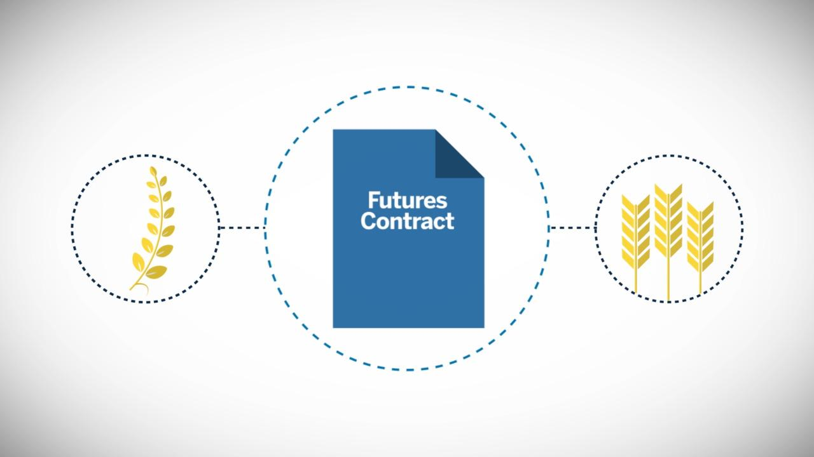

Commodities trading is a fundamental component of the financial markets, involving the large-scale buying and selling of raw materials such as oil, gold, and wheat. These markets are crucial as they provide resources that are essential for various industries and economies worldwide. Within this domain, intercommodity spread trading has emerged as a sophisticated strategy. This strategy is designed to profit from the price differentials between related commodities, such as the spread between crude oil and heating oil or between corn and wheat.

Intercommodity spread trading focuses on the relative price differences between two or more related commodity markets rather than the absolute price movements of individual commodities. By taking long and short positions across these related markets, traders can potentially capitalize on pricing inefficiencies and changes in the market’s perception of the value of each commodity relative to others. This approach offers opportunities for diversification and risk management, as it often involves hedging against market risks present in individual commodity positions.



Algorithmic trading, often referred to as algo trading, has revolutionized this strategy by enhancing its execution efficiency and decision-making process. The deployment of computer-driven algorithms allows traders to automate the buy and sell decisions in the market, enabling trades to be executed at extraordinary speeds and with greater precision than manual trading would allow. Algorithmic trading systems can analyze vast amounts of market data, identify pricing anomalies, and execute trades in milliseconds, thereby providing a significant edge in competitive commodities markets.

This article provides an overview of the intersection between intercommodity spread trading and algorithmic trading. We will examine how these strategies can be combined to provide traders with opportunities to exploit price differentials in commodities markets. The mechanics of spread trading, the role of algorithmic systems in enhancing these trades, and the benefits and challenges associated with them will be explored. Through a comprehensive understanding of these concepts, traders can better navigate the complexities of modern financial markets.

## Table of Contents

## Understanding Commodities and Intercommodity Spreads

Commodities are fundamental raw materials that are uniform and interchangeable with others of the same type, such as metals, energy resources, and agricultural produce. These materials form the basis of the commodities markets and are essential for the global economy. The standardization of commodities ensures their consistent quality and facilitates their trading on exchanges, as this interchangeability creates liquidity and price stability in these markets.

Intercommodity spread trading is a sophisticated trading strategy that involves taking a position based on the price differential between two or more related commodities. This strategy does not focus on the absolute price level of the commodities but rather on the relative price movement between them. Traders attempt to exploit these differentials, which can occur due to a variety of economic, political, or environmental factors that differently impact the supply and demand of each commodity. A classic example is the spread between crude oil and heating oil, known as the crack spread, where traders might go long on crude oil and short on heating oil if they anticipate an increase in the relative demand for crude oil compared to heating oil. Similarly, in the agricultural sector, traders might look at the spread between corn and wheat based on differing crop yield expectations or market demands.

The intention behind intercommodity spread trading is to profit from the fluctuations in the price relationship between the commodities. Traders can capitalize on potential gains by going long (buying) on one commodity and going short (selling) on another. This strategy typically relies on statistical analysis and market prediction to assess the probable direction of the spread's movement. By focusing on the price spread rather than the direction in which individual commodity prices move, traders may also benefit from reduced [volatility](/wiki/volatility-trading-strategies) and risk compared to outright futures positions. This hedged approach can mitigate some market risks, as opposing positions in related commodities might offset adverse price movements.

## The Mechanics of Intercommodity Spread Trading

Intercommodity spread trading relies on a nuanced understanding of the interrelationships between different commodities, focusing on capitalizing on the price disparity between two or more markets rather than individual commodity price movements. By comparing the supply and demand forces influencing these commodities, traders can predict and speculate on the expected price changes that will affect the spread. This involves a careful analysis of factors such as seasonal patterns, geopolitical events, and macroeconomic indicators that impact the supply chains of the commodities involved.

To engage in intercommodity spread trading, traders often take positions based on their expectations of spread fluctuations. For instance, if a trader anticipates that wheat prices will outperform corn due to a foreseeable shift in weather patterns affecting crop yields, they might go long on wheat and short on corn. The profitability hinges on the accuracy of these predictions and the corresponding adjustments in the spread between these two commodities.

Various types of intercommodity spreads exist, each with distinct characteristics and strategic approaches. A prime example in energy markets is the crack spread. This involves the price difference between [crude oil](/wiki/crude-oil) and its refined products, such as gasoline and heating oil. In practical terms, the crack spread is calculated as follows:

$$
\text{Crack Spread} = \text{(Price of Gasoline or Heating Oil)} - \text{(Price of Crude Oil)}
$$

Traders use this spread to gauge refinery profits and craft strategies based on anticipated changes in refining margins.

In agricultural markets, the crush spread serves as another popular form of intercommodity spread trading. It involves commodities like soybeans, soybean meal, and soybean oil. The commoditized nature of soybeans and their byproducts permits traders to speculate based on the prices of the processed products relative to the raw beans. The crush spread can be expressed as:

$$
\text{Crush Spread} = \text{(Price of Soybean Meal + Price of Soybean Oil)} - \text{(Price of Soybeans)}
$$

The crush spread concept allows traders to evaluate the profitability of processing soybeans into meal and oil, offering insights into the potential price movements between them.

Understanding these dynamics and the specifics of various market spreads is crucial for traders aiming to successfully navigate intercommodity spread trading. Their efficacy in predicting market conditions and executing trades based on these predictions can significantly influence their trading outcomes.

## Algo Trading: Revolutionizing Spread Trading

Algorithmic trading, often abbreviated as algo trading, transforms how spread trading is conducted by utilizing computer algorithms to automate trade decisions and execution processes. This approach significantly enhances the efficiency of spread strategies by facilitating rapid data analysis and decision-making, allowing traders to swiftly recognize and leverage market inefficiencies.

Algo trading's core strength lies in its ability to process vast amounts of data with speed and precision, making it an invaluable tool in modern trading. Unlike traditional methods, which can be time-consuming and susceptible to human error or emotional bias, algorithmic systems can analyze real-time market data across multiple sources, identify patterns, and execute trades within milliseconds. This edge is crucial in markets characterized by high volatility and rapid price movements, as it enables traders to optimize their timing and execution.

Python and R have emerged as popular programming languages for developing [algorithmic trading](/wiki/algorithmic-trading) strategies. Their extensive libraries and frameworks provide robust support for statistical analysis and mathematical modeling, which are essential for designing and implementing sophisticated trading algorithms. For instance, Python offers libraries such as Pandas for data manipulation, NumPy for numerical operations, and Scikit-learn for [machine learning](/wiki/machine-learning) applications. These tools help in constructing predictive models and [backtesting](/wiki/backtesting) strategies, enabling traders to refine their algorithms based on historical data.

In terms of implementation, algorithms can be designed to execute predefined rules, such as moving averages, [arbitrage](/wiki/arbitrage) opportunities, or spread changes between related commodities. A simple example might involve calculating a moving average crossover strategy using Python:

```python
import pandas as pd

# Sample function to calculate moving averages
def compute_moving_averages(data, short_window, long_window):
    data['short_mavg'] = data['price'].rolling(window=short_window).mean()
    data['long_mavg'] = data['price'].rolling(window=long_window).mean()
    return data

# Example usage
data = pd.DataFrame({'price': [100, 105, 102, 110, 107]})
result = compute_moving_averages(data, short_window=2, long_window=3)
print(result)
```

The above code exemplifies how traders can automate the detection of trading signals through quantitative criteria, ensuring quicker response times to emerging trends and market shifts. However, the success of algorithmic spread trading also depends on rigorous backtesting and continuous evaluation to adapt to evolving market conditions and ensure strategies remain profitable over time. By integrating algorithmic solutions into their trading arsenal, traders can achieve a competitive advantage, maximizing potential gains while minimizing risks.

## Benefits and Challenges of Intercommodity Spread Algo Trading

Intercommodity spread algorithmic trading offers several advantages, making it an attractive strategy for traders aiming to optimize their positions in commodities markets. A significant benefit is the reduction in margin requirements, which are typically lower for spread trading compared to outright positions on individual futures contracts. This characteristic allows traders to engage in market activities with less capital, potentially increasing market accessibility and diversification opportunities.

Additionally, the automation of trading decisions through algorithmic systems limits the influence of human emotions, which can often lead to irrational trading behaviors such as panic selling or over-leveraging positions in volatile markets. This automation enforces a more disciplined approach to trade executions by adhering strictly to predefined rules and strategies, thereby reducing the likelihood of spontaneous, emotion-driven decisions that can undermine trading performance.

However, challenges are inherent in this trading strategy. A primary concern is the complexity of understanding the multifaceted dynamics of commodities markets. These markets are influenced by numerous factors, including geopolitical events, weather conditions, and supply chain disruptions, which can affect the pricing relationships between different commodities. Algorithms must be designed to account for these variables, necessitating sophisticated data analysis and modeling capabilities.

Furthermore, traders must manage the risks associated with leverage and spread volatility. High leverage can amplify profits but also exacerbate losses, especially in fast-moving or unpredictable market conditions. Algorithmic strategies must incorporate robust risk management protocols, such as stop-loss orders and position-sizing rules, to mitigate these risks effectively. 

In conclusion, while intercommodity spread algo trading offers a structured approach to capitalizing on price differentials with potential benefits such as reduced margins and emotion-free trading, it demands a keen understanding of market complexities and vigilant risk management practices to navigate its challenges successfully.

## Implementing Intercommodity Spread Strategies

Implementing intercommodity spread strategies requires a meticulous approach to ensure their efficacy and adaptability in the ever-changing commodities markets. Rigorous backtesting, which involves testing trading strategies on historical data, is essential before live deployment. This process helps validate the effectiveness and robustness of the strategies under various market conditions. Key metrics such as Sharpe ratio and maximum drawdown are often analyzed to assess performance and risk.

Traders must carefully select platforms and tools that support their trading objectives. Platforms like QuantConnect and [Interactive Brokers](/wiki/interactive-brokers-api) provide comprehensive environments for algorithmic trading. QuantConnect offers an open-source algorithmic trading platform equipped with extensive market data feeds and a Lean Algorithm Framework, enabling traders to write, test, and automate their strategies in multiple programming languages, particularly Python. Similarly, Interactive Brokers offers a robust API allowing integration with algorithmic systems, facilitating real-time data acquisition and order execution.

For example, a basic Python snippet for setting up a backtesting environment on QuantConnect might look like this:

```python
class IntercommoditySpreadStrategy(QCAlgorithm):
    def Initialize(self):
        self.SetStartDate(2020, 1, 1)
        self.SetEndDate(2021, 1, 1)
        self.AddEquity("AAPL", Resolution.Daily)
        # Add more commodities or related assets

    def OnData(self, data):
        if not self.Portfolio.Invested:
            self.SetHoldings("AAPL", 0.5)
            # Define spread logic here
```

Continuous monitoring and adaptive adjustments are vital to maintaining the efficiency of intercommodity spread strategies. Market factors such as supply chain disruptions, geopolitical events, and seasonal variations can influence commodity prices, prompting the need for dynamic strategy recalibration. Real-time data analytics and machine learning models can be employed to detect shifts in market patterns and adapt strategies accordingly. 

Furthermore, traders should engage in regular performance reviews, utilizing dashboards and advanced visualizations to track key performance indicators and make data-driven decisions. This iterative approach ensures that the strategies remain resilient and aligned with market dynamics, maximizing potential profitability while managing associated risks effectively.

## Conclusion

Intercommodity spread trading, when augmented by algorithmic processes, provides substantial opportunities for traders aiming to exploit price differentials in commodities markets. By leveraging the power of computer algorithms, traders can efficiently manage the inherent complexities of spread trading, such as analyzing vast datasets, predicting market movements, and executing trades with precision and speed. 

The strategic combination of intercommodity spread trading and algorithmic systems can lead to profitable outcomes. This requires meticulous management and a solid grasp of the underlying market dynamics. Traders must understand the factors influencing commodities, such as supply chain disruptions, geopolitical events, and economic indicators. Successful spread trading hinges on the ability to anticipate these influences and adjust strategies accordingly.

Continual learning and adaptation are essential as financial markets and technology rapidly evolve. Traders should remain abreast of advances in algorithmic trading technologies, machine learning techniques, and data analysis methods. Additionally, as new financial instruments and regulatory changes emerge, it is crucial for traders to refine their strategies to maintain a competitive edge in an ever-changing landscape. Thus, the integration of intercommodity spread trading with algorithmic processes, coupled with a commitment to ongoing education, can significantly enhance a trader's ability to generate returns in the dynamic environment of commodities markets.

## References & Further Reading

Investopedia - Advanced Options Trading Concepts provides a detailed explanation of various options trading strategies and techniques. This resource is valuable for understanding the complexities associated with derivatives and how similar principles can apply to trading algorithms and commodity spreads.

Marcos Lopez de Prado's "Advances in Financial Machine Learning" is a comprehensive resource that covers the application of machine learning techniques in financial markets. This book is particularly useful for algorithmic traders looking to enhance their intercommodity spread strategies with advanced data analysis and pattern recognition techniques.

Ernest P. Chan's "Quantitative Trading: How to Build Your Own Algorithmic Trading Business" offers insights into algorithm development and implementation. It is especially relevant for those interested in automating spread trading strategies, as it includes practical advice on setting up and maintaining algorithmic trading systems, with an emphasis on statistical and machine learning approaches.

