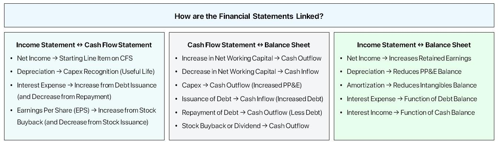

## Table of Contents

## What are the three major financial statements?

The three major financial statements are the income statement, the balance sheet, and the cash flow statement. Each of these statements provides important information about a company's financial health and performance. The income statement shows how much money a company made and spent over a period of time, usually a year or a quarter. It tells you if the company made a profit or a loss by subtracting expenses from revenues.

The balance sheet gives a snapshot of a company's financial position at a specific point in time. It lists what the company owns (assets), what it owes (liabilities), and the value of the business to its owners (equity). The balance sheet helps you understand if the company has enough assets to cover its liabilities.

The cash flow statement tracks the flow of cash in and out of the business over a period of time. It shows how the company is generating and using cash from its operating activities, investing activities, and financing activities. This statement is crucial for understanding the company's liquidity and its ability to pay its bills and fund its operations.

## How does the income statement relate to the balance sheet?

The income statement and the balance sheet are closely connected. The income statement shows how much money a company made and spent over a period of time, like a year or a quarter. It tells you if the company made a profit or a loss. This profit or loss then affects the balance sheet. If a company makes a profit, it increases the owner's equity on the balance sheet. If it has a loss, it decreases the owner's equity.

The balance sheet, on the other hand, gives a snapshot of what the company owns and owes at a specific moment. It lists assets, liabilities, and equity. The net income or loss from the income statement is added to or subtracted from the retained earnings, which is part of the equity section on the balance sheet. So, the income statement helps update the balance sheet by showing how the company's profits or losses change the value of the business to its owners.

## What is the role of the cash flow statement in financial reporting?

The cash flow statement plays a key role in financial reporting by showing how money moves in and out of a business over a certain time. It helps everyone, from business owners to investors, see if the company is making enough cash to keep running smoothly. The statement breaks down cash flow into three parts: operating activities, which show cash from the company's main business; investing activities, which show cash used for buying or selling assets; and financing activities, which show cash from loans or investments.

Understanding the cash flow statement is important because it tells you if a company can pay its bills on time. Even if a company looks profitable on the income statement, it might still have cash problems if it's not managing its cash well. The cash flow statement gives a clear picture of the company's liquidity, or how easily it can turn assets into cash. This helps people make better decisions about whether to invest in or lend money to the company.

## How do changes in the balance sheet accounts affect the income statement?

Changes in the balance sheet accounts can affect the income statement in a few ways. For example, if a company buys new equipment, it shows up on the balance sheet as an asset. But this purchase also affects the income statement because the cost of the equipment is spread out over time as depreciation expense. This expense is subtracted from the company's revenue on the income statement, reducing the profit for each period.

Another way balance sheet changes affect the income statement is through changes in liabilities. If a company takes out a loan, it shows up as a liability on the balance sheet. The interest on this loan becomes an expense on the income statement, which reduces the company's profit. Also, if a company pays off some of its debt, the interest expense on the income statement will go down, which could increase the profit.

These examples show how closely the balance sheet and income statement are linked. Changes in assets and liabilities on the balance sheet directly impact the expenses and revenues reported on the income statement, which in turn affects the company's reported profit or loss.

## Can you explain the concept of retained earnings and its connection across the financial statements?

Retained earnings are the part of a company's profit that is kept in the business instead of being paid out to shareholders as dividends. You can think of it as savings that the company holds onto to use for future growth or to cover unexpected costs. Retained earnings are shown on the balance sheet under the equity section. They represent the total amount of earnings the company has kept over time, minus any dividends paid out.

The connection between retained earnings and the financial statements is straightforward. On the income statement, you see the company's profit or loss for the period. If the company makes a profit, that profit is added to the retained earnings on the balance sheet. If there's a loss, it's subtracted from retained earnings. Also, if the company decides to pay dividends, that amount is taken out of retained earnings. So, the income statement shows how much the retained earnings should change, and the balance sheet shows the new total after those changes. This way, retained earnings link the income statement and the balance sheet, showing how the company's profits or losses affect its overall financial health.

## How does depreciation impact the three financial statements?

Depreciation is how a company spreads out the cost of a big item, like a machine or a building, over the time it uses it. This cost shows up on the income statement as an expense each year. When a company adds depreciation to its expenses, it reduces the profit for that year. So, if a company bought a machine for $10,000 and decides to depreciate it over 10 years, it would add $1,000 to its expenses each year, making the profit $1,000 less each year.

On the balance sheet, depreciation affects the value of the company's assets. The machine's value starts at $10,000, but each year, $1,000 is taken away from its value on the balance sheet. This means the asset's book value goes down over time. Also, the total depreciation expense added to the income statement each year is also added back to the cash flow statement in the operating activities section. This is because depreciation is a non-cash expense, so it doesn't actually take money out of the company's bank account. Adding it back helps show how much cash the company really made from its operations.

## What is the significance of working capital and how does it link the balance sheet and cash flow statement?

Working capital is the money a company has to run its day-to-day business. It's what's left when you take away the money the company owes in the short term (like bills and loans due soon) from the money it has coming in (like cash and things it can quickly sell). If a company has more money coming in than it owes, it has positive working capital, which is good because it means the company can pay its bills and keep running smoothly. If it has less money coming in than it owes, it has negative working capital, which can be a problem because it might not be able to pay its bills on time.

Working capital links the balance sheet and the cash flow statement because it shows up on both. On the balance sheet, you see the company's current assets (like cash and things it can sell quickly) and current liabilities (like bills and short-term loans). The difference between these two is the working capital. On the cash flow statement, you see how the company's cash changes over time. If the company is managing its working capital well, you'll see more cash coming in from its operations, which is a good sign. So, working capital helps you understand how the company's day-to-day money management affects its overall financial health.

## How do non-cash expenses like amortization appear in the three financial statements?

Amortization is like depreciation but for things that aren't physical, like patents or software. It's a way to spread out the cost of these things over time. On the income statement, amortization shows up as an expense each year. This expense reduces the company's profit for that year. So, if a company bought a patent for $5,000 and decides to amortize it over 5 years, it would add $1,000 to its expenses each year, making the profit $1,000 less each year.

On the balance sheet, amortization affects the value of the company's intangible assets. The patent's value starts at $5,000, but each year, $1,000 is taken away from its value on the balance sheet. This means the asset's book value goes down over time. On the cash flow statement, the total amortization expense added to the income statement each year is also added back to the cash flow from operating activities. This is because amortization is a non-cash expense, so it doesn't actually take money out of the company's bank account. Adding it back helps show how much cash the company really made from its operations.

## What is the effect of issuing new stock on the three financial statements?

When a company issues new stock, it means they are selling pieces of the company to new owners, which brings in money. This new money shows up on the balance sheet as cash, which is part of the company's assets. It also shows up as an increase in the equity section of the balance sheet, because the company now has more owners. This makes the company's total equity go up, because the money from the new stock is added to the shareholders' equity.

On the cash flow statement, issuing new stock shows up in the financing activities section. It's a positive number because the company is getting cash from selling the stock. This helps show where the company's cash is coming from. The income statement doesn't directly show the effect of issuing new stock, because it focuses on the company's profits and losses from its business activities, not from financing activities like issuing stock.

## How do dividends paid affect the interconnection of the financial statements?

When a company pays dividends, it's giving some of its profits back to the people who own the company. This shows up on the balance sheet as a decrease in the company's cash, because the money is going out to the shareholders. It also reduces the company's retained earnings, which is part of the equity section on the balance sheet. Retained earnings are what's left of the company's profits after paying dividends, so when dividends are paid, this number goes down.

On the cash flow statement, paying dividends shows up in the financing activities section as a negative number, because the company is using its cash to pay the dividends. This helps everyone see where the company's cash is going. The income statement doesn't show dividends directly, because it's all about the company's profits and losses from its business activities, not about giving money back to shareholders. But, the profit on the income statement affects how much money the company has to pay dividends, so there's still a connection.

## Can you describe how a company's operating, investing, and financing activities are reflected across the three statements?

A company's operating activities are all about the day-to-day business stuff, like selling products or services. On the income statement, you see the money the company makes from these activities as revenue, and the money it spends as expenses. This tells you if the company made a profit or a loss. On the balance sheet, the cash from these activities can show up as more cash in the bank or as accounts receivable if customers owe the company money. On the cash flow statement, operating activities show how much cash the company made or spent from its main business, helping you see if it's making enough money to keep going.

Investing activities are about the company spending money on things that will help it grow, like buying new equipment or investing in other businesses. On the balance sheet, these activities can show up as new assets, like machinery or buildings. On the income statement, the cost of these investments might not show up right away, but over time, things like depreciation or amortization will be expenses. On the cash flow statement, investing activities show how much cash the company spent or got back from these investments, helping you see if the company is growing or selling off its assets.

Financing activities are about how the company gets money from outside, like taking out loans or selling stock. On the balance sheet, these activities can show up as more cash and more debt or more equity if the company sold stock. The income statement doesn't directly show these activities, but the interest on loans will show up as an expense. On the cash flow statement, financing activities show how much cash the company got or spent from loans, stock sales, or paying dividends, helping you see how the company is funding its operations and growth.

## How do advanced accounting principles like LIFO/FIFO inventory methods influence the interconnection of the financial statements?

LIFO and FIFO are ways to keep track of how much it costs a company to buy things to sell. LIFO stands for "Last In, First Out," which means the company sells the newest items first. FIFO stands for "First In, First Out," which means the company sells the oldest items first. These methods can change how much profit the company shows on its income statement. If prices are going up, using LIFO means the company will show a lower profit because it's selling the more expensive, newer items first. Using FIFO would show a higher profit because it's selling the cheaper, older items first.

These differences in profit also affect the balance sheet and the cash flow statement. On the balance sheet, the choice between LIFO and FIFO changes the value of the inventory, which is part of the company's assets. If the company uses LIFO, the inventory value might be lower because it's showing the cost of the older, cheaper items. If it uses FIFO, the inventory value might be higher because it's showing the cost of the newer, more expensive items. On the cash flow statement, the profit from the income statement affects the cash flow from operating activities. A higher profit with FIFO means more cash from operations, while a lower profit with LIFO means less cash from operations. So, the choice of inventory method can make a big difference in how the company's financial health looks across all three statements.

## What is Understanding Financial Statements?

Financial statements are pivotal in providing insights into a company's financial performance and overall health, serving as the cornerstone of corporate accounting. These documents enable stakeholders such as investors, creditors, and management to make informed decisions based on the company’s financial data.

The income statement is one of the primary components of financial statements. It reflects a company’s revenue and expenses over a specified accounting period, thereby illustrating the company's ability to generate profit. This statement includes elements such as total revenue, cost of goods sold (COGS), gross profit, operating expenses, operating income, non-operating income and expenses, and finally, net income. By analyzing the income statement, users can assess the effectiveness of a company's operations and its capability to manage costs relative to income. Commonly used metrics derived from the income statement include the gross profit margin, operating margin, and net profit margin, which collectively help evaluate operational efficiency and profitability.

In contrast, the balance sheet provides a snapshot of a company's financial position at a specific point in time. It lists the company’s assets, liabilities, and shareholders' equity. Assets are resources owned by the company, which can be current or non-current based on their liquidity. Liabilities represent the company's obligations, also categorized as current or long-term. Shareholders' equity represents the residual interest in the assets of the entity after deducting liabilities. The fundamental accounting equation underlying the balance sheet is:

$$
\text{Assets} = \text{Liabilities} + \text{Shareholders’ Equity}
$$

This equation ensures that the statement balances, reflecting the integrity of financial reporting. Financial ratios gleaned from the balance sheet, such as the current ratio and debt-to-equity ratio, provide insights into the company’s [liquidity](/wiki/liquidity-risk-premium) and financial leverage, useful for assessing its financial stability and risk profile.

Together, the income statement and balance sheet form a comprehensive view of a company's financial status. While the income statement offers a view of performance efficiency over time, the balance sheet reveals cumulative financial health as of a specific date. This dual insight is crucial for strategic planning, valuation, and risk management, aligning the interests of various stakeholders and guiding their financial decisions.

## What is the Income Statement and how does it measure profitability?

The income statement is a fundamental financial document that provides an account of a company's financial performance over a specific period, typically a quarter or a fiscal year. It records revenues, expenses, and ultimately net income, thereby highlighting how effectively a company is generating profit and managing its operational costs. This statement can take various forms, such as a single-step or multi-step income statement, depending on the complexity of the business operations.

The income statement starts with total revenues, generated from primary business activities like sales of goods and services. Revenues are then subtracted by the cost of goods sold (COGS), yielding the gross profit. This gross profit acts as an indicator of productive efficiency, essentially showing income derived after covering the cost of production. 

$$
\text{Gross Profit} = \text{Revenue} - \text{COGS}
$$

Subsequent to calculating the gross profit, the income statement proceeds by accounting for operating expenses, which include items like salaries, rent, utilities, and other overhead costs. Subtracting these operating expenses from gross profit results in the operating income, also known as earnings before interest and taxes (EBIT). 

$$
\text{Operating Income (EBIT)} = \text{Gross Profit} - \text{Operating Expenses}
$$

Further, non-operating items such as interest expenses, taxes, and any unusual gains or losses are considered to arrive at the net income, which reflects the company's profitability. Net income is critical as it represents the residual earnings available to shareholders after all obligations have been met.

$$
\text{Net Income} = \text{Operating Income} - \text{Interest Expense} - \text{Taxes} + \text{Non-operating Income/Expenses}
$$

Among the common metrics analyzed from the income statement are the gross profit margin, operating margin, and net profit margin. These ratios provide deeper insights into different aspects of a company's financial health. For instance, the gross profit margin, calculated by dividing gross profit by total revenue, measures efficiency in production and sales processes.

$$
\text{Gross Profit Margin} = \left( \frac{\text{Gross Profit}}{\text{Revenue}} \right) \times 100
$$

Similarly, the operating margin, derived by dividing operating income by total revenue, provides a view of how much profit a company makes from its operations.

$$
\text{Operating Margin} = \left( \frac{\text{Operating Income}}{\text{Revenue}} \right) \times 100
$$

Lastly, the net profit margin, which divides net income by total revenue, indicates overall profitability after all expenses.

$$
\text{Net Margin} = \left( \frac{\text{Net Income}}{\text{Revenue}} \right) \times 100
$$

The income statement is crucial for investors as it reveals trends in earnings performance and potential for growth. By analyzing changes in revenues and various costs, stakeholders can assess a company's financial trajectory and make informed decisions regarding investments.

## References & Further Reading

[1]: ["Financial Statement Analysis and Security Valuation"](https://www.mheducation.com/highered/product/financial-statement-analysis-security-valuation-penman/M9780078025310.html) by Stephen H. Penman

[2]: ["Principles of Corporate Finance"](https://en.wikipedia.org/wiki/Principles_of_Corporate_Finance) by Richard A. Brealey, Stewart C. Myers, and Franklin Allen

[3]: ["Machine Learning for Asset Managers"](https://www.cambridge.org/core/books/machine-learning-for-asset-managers/6D9211305EA2E425D33A9F38D0AE3545) by Marcos Lopez de Prado

[4]: ["Valuation: Measuring and Managing the Value of Companies"](https://www.amazon.com/Valuation-Measuring-Managing-Companies-Finance/dp/1119610885) by McKinsey & Company Inc.

[5]: ["Fundamentals of Financial Management"](https://faculty.cengage.com/titles/9781337902571) by Eugene F. Brigham and Joel F. Houston