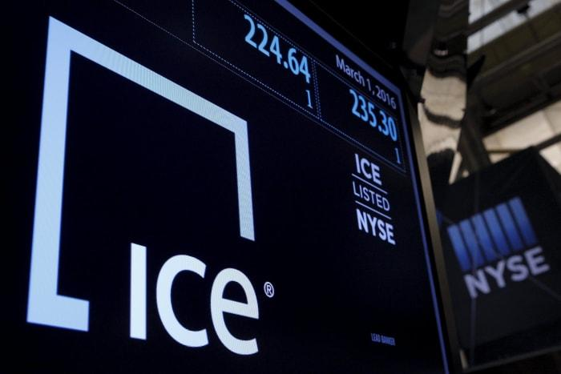

The Intercontinental Exchange Group Inc. (ICE) represents a pivotal entity in the realm of global finance, functioning as a leading operator of exchanges and clearing houses globally. Founded in 2000, ICE has expanded its influence through strategic acquisitions and enhancements in technological infrastructure, becoming an integral player in various financial markets including energy, commodities, and equities. ICE's network encompasses the New York Stock Exchange, multiple regulated exchanges, and clearing houses, contributing to its expansive role in facilitating the efficient allocation of capital and resources within these markets.

Stock exchanges function as vital components of financial markets, serving as organized venues where securities, commodities, derivatives, and other financial instruments are traded. They ensure liquidity, price transparency, and an efficient marketplace for investors and issuers, thereby empowering economic growth and stability. Within this context, exchanges bolster market confidence by providing a framework for the orderly trading of financial assets, maintaining investor protections, and adhering to rigorous regulatory standards.

Algorithmic trading has emerged as a revolutionary force in modern finance, driven by advancements in technology and data analytics. It involves the use of complex algorithms to automate trading strategies, enabling faster and more efficient transactions compared to traditional manual trading. This approach optimizes trade execution by taking advantage of microsecond-level market movements, thereby enhancing market liquidity and price discovery. Algorithmic trading encompasses various strategies, including but not limited to, market-making, arbitrage, and trend-following, each tailored to specific market conditions and asset classes.

The objective of this article is to elucidate the interconnectedness of ICE, stock exchanges, and the evolution of algorithmic trading. By exploring ICE's multifaceted role within the financial ecosystem, the discussion will highlight how algorithmic trading has reshaped market dynamics and the ways in which ICE's platforms facilitate and optimize these high-frequency strategies. Through this exploration, an understanding of the future trajectory of stock exchanges and trading technologies under ICE's stewardship is formed, underscoring the importance of continuous innovation and adaptation in maintaining market efficiency and integrity.

## Table of Contents

## Understanding Intercontinental Exchange Group Inc.

Intercontinental Exchange Group Inc. (ICE) was founded in 2000 by Jeffrey Sprecher, who identified a market need for a centralized platform to trade energy products, which had previously been negotiated bilaterally over-the-counter (OTC). The firm began by focusing on electronic trading of energy commodities, filling a gap in the market for efficient and transparent pricing in energy markets. Its successful model allowed for rapid expansion into other asset classes and markets.

Over time, ICE has expanded its operations significantly and now maintains a global presence with key offices in major financial hubs such as Atlanta, New York, London, and Singapore. This global footprint supports its extensive network of exchanges and clearinghouses, facilitating a wide array of trading and risk management services worldwide.

ICE is governed by an experienced team of executives, with Jeffrey Sprecher serving as Chairman and Chief Executive Officer. The company emphasizes strong corporate governance, with a governance structure that ensures accountability and effective decision-making. The board of directors includes financial experts and industry veterans who bring a wealth of knowledge and experience to the organization.

ICE offers a diverse range of products, spanning futures, options, securities, and OTC markets. Its futures and options offerings include a variety of commodities such as [crude oil](/wiki/crude-oil), natural gas, and agricultural products. Additionally, ICE facilitates securities trading through its ownership of major stock exchanges, including the New York Stock Exchange (NYSE). In the OTC space, ICE provides platforms for trading fixed income and credit derivatives, enabling market participants to manage complex risk exposures effectively.

A critical component of ICE's role in the financial ecosystem is its clearing and data services. ICE Clear, its clearinghouse arm, offers risk management and post-trade services that enhance the stability and security of global financial markets. ICE Data Services provides crucial market data and analytics, supporting traders and investors in making informed decisions. These capabilities underscore ICE's integral function as a key infrastructure provider, connecting buyers and sellers in diverse markets and ensuring the smooth operation of financial transactions.

In summary, Intercontinental Exchange Group Inc. stands as a pivotal player in modern financial markets. With a history rooted in innovation and expansion, it continues to influence the trading landscape through its wide-ranging product offerings and essential market services.

## ICE's Role in Global Finance and Stock Exchanges

Intercontinental Exchange Group Inc. (ICE) serves a pivotal role in global finance, with its most notable asset being its position as the parent company of the New York Stock Exchange (NYSE) and its various subsidiaries. ICE's acquisition of NYSE Euronext in 2013 consolidated its influence over one of the world's most recognized stock exchanges, providing a significant platform for trading equity and equity-related products. This acquisition marked ICE's expansion beyond its original focus on energy and commodity exchanges, positioning it as a diversified global financial markets company with an extensive range of assets and services.

ICE operates numerous regulated futures and over-the-counter (OTC) exchanges. These platforms facilitate the trading of a wide array of contracts, including commodities, interest rates, equity indexes, and currencies. These exchanges are integral to providing [liquidity](/wiki/liquidity-risk-premium) and price discovery, essential functions of any financial market. Futures exchanges under ICE's banner include ICE Futures U.S., ICE Futures Europe, and ICE Futures Canada, each offering various standardized future contracts available for trading. OTC exchanges further complement ICE's offerings by providing bespoke contracts that cater to the specific risk management needs of sophisticated market participants.

In addition to commodity and financial futures, ICE's robust credit markets and energy trading platforms are crucial components of its business model. The company provides an extensive range of services in the credit markets through its acquisition of Creditex, a leader in interdealer credit derivative execution, and the creation of ICE Clear Credit, a central counterparty for credit default swap (CDS) clearing. Energy trading is another vital area where ICE has made significant strides, offering futures and OTC products that cover oil, natural gas, power, and emissions, supporting a comprehensive infrastructure for energy market transactions.

ICE's securities trading and clearing activities provide additional layers of versatility to its financial offerings. The New York Stock Exchange alone facilitates billions of dollars in global stock trades daily, establishing it as a cornerstone of global equity markets. Furthermore, ICE's clearing services, including ICE Clear Europe and ICE Clear U.S., offer secure transaction settlement, mitigating counterparty risk and enhancing market integrity. These clearinghouses provide crucial support for the exchange's various products, acting as an intermediary that helps ensure the completion of trades even if one party defaults.

Globally, ICE's influence on market capitalization is substantial. By owning and operating multiple exchanges and trading platforms that support a wide range of financial products, ICE contributes significantly to global market liquidity and stability. The exchange's infrastructure supports a large diversity of market participants, from individual traders to institutional investors, enabling them to execute trades, hedge risks, and discover prices efficiently. This extensive participation elevates ICE's exchanges to central positions in global financial markets, reflecting substantial influence on market capitalization through liquidity provision and transaction [volume](/wiki/volume-trading-strategy) facilitation.

In summary, ICE's expansive role in global finance through its management of stock exchanges, regulated futures and OTC markets, credit and energy trading platforms, and comprehensive securities trading and clearing services underlines its importance. The company's diverse array of offerings and infrastructures continues to shape the landscape of global market capitalization, marking it as an influential entity in the constantly evolving financial ecosystem.

## Algorithmic Trading and Its Impact on Stock Exchanges

Algorithmic trading refers to the use of computer algorithms to automate the process of trading securities. These algorithms utilize complex mathematical models and high-speed data processing to make trading decisions and execute trades at speeds and frequencies beyond human capability. The primary benefits of [algorithmic trading](/wiki/algorithmic-trading) include increased market efficiency, heightened liquidity, reduced transaction costs, and the ability to execute trades based on pre-determined criteria without human intervention.

Intercontinental Exchange (ICE) supports algorithmic trading through its robust trading platforms, including the ICE Trading Platform and WebICE. These platforms provide market participants with the technological infrastructure necessary to deploy algorithmic strategies effectively. The high-speed data feeds, advanced order types, and comprehensive risk management tools offered by ICE facilitate the use of algorithmic trading strategies, catering to a wide range of market participants such as hedge funds, trading firms, and institutional investors.

The impact of algorithmic trading on market efficiency and liquidity is significant. By providing continuous market presence, algorithms contribute to narrower bid-ask spreads and increased trading volumes, which enhance overall liquidity. Moreover, algorithmic trading can improve price discovery by assimilating vast amounts of information and swiftly reflecting it in market prices. However, the proliferation of algorithmic trading also poses several challenges. One major concern is the potential for systemic risk, as errant algorithms can lead to market disruptions, such as the infamous Flash Crash of 2010. Additionally, algorithmic trading can exacerbate market [volatility](/wiki/volatility-trading-strategies) and create an uneven playing field for traditional human traders.

Regulation of algorithmic trading varies across jurisdictions but generally focuses on ensuring market stability, fairness, and transparency. Regulatory bodies, including the U.S. Securities and Exchange Commission (SEC) and the Commodity Futures Trading Commission (CFTC), have implemented measures such as circuit breakers, pre-trade risk controls, and order-to-trade ratios to mitigate risks associated with algorithmic trading. They also require firms to maintain adequate systems and controls to prevent disruptive trading practices.

Overall, algorithmic trading is an integral component of modern financial markets. With technological advancements led by platforms like those provided by ICE, algorithmic trading continues to evolve, offering both opportunities and challenges to market participants and regulators alike.

## Technological Advancements at ICE: Trading and Data Services

Intercontinental Exchange Group Inc. (ICE) has been at the forefront of technological innovation in trading and data services, crucial components contributing to the efficiency and accessibility of financial markets.

### Overview of ICE's Trading Technology: ICE Trading Platform and WebICE

ICE's trading technology is centered around two major platforms: the ICE Trading Platform and WebICE. The ICE Trading Platform forms the backbone of its electronic trading capabilities, offering high-speed, reliable trade execution across its diverse markets. It supports a wide range of asset classes, including commodities, currencies, and derivatives. This platform is designed to handle large volumes of transactions with low latency, a critical [factor](/wiki/factor-investing) for efficient market operations.

WebICE, an internet-based trading interface, enables market participants to access ICE's electronic market offerings from anywhere in the world. It provides users with comprehensive trading tools, real-time analytics, and customizable interfaces, catering to both institutional and retail traders. The platform's user-friendly design helps in bridging the gap between technology and traders, ensuring efficient participation in global markets.

### Role of ICE Data Services in Supporting Market Participants

ICE Data Services plays a pivotal role in empowering market participants by providing them with vital market data and analytics. It delivers a wide range of information products, including pricing, indices, and analytics across the financial spectrum. Such data is crucial for traders employing algorithmic strategies, as it supports decision-making processes by offering insights into market trends, volatility, and pricing dynamics.

ICE's data services are further enhanced by state-of-the-art technology infrastructures that ensure data accuracy, speed, and reliability. With latency-sensitive algorithms relying on real-time data, the services offered play an essential role in the success of algorithmic trading strategies.

### Recent Technological Innovations and Acquisitions

ICE has consistently advanced its technological prowess through strategic innovations and acquisitions. The acquisition of companies like IDC (Interactive Data Corporation) and Ellie Mae has expanded its footprint in financial data and mortgage technology, respectively. These acquisitions are integral to ICE's strategy to broaden its technological offerings, providing comprehensive solutions for data management and trading.

Innovations such as real-time data feeds, risk management tools, and the expansion of cloud-based services enhance the robustness of ICE's platforms. These advancements cater to the evolving needs of algorithmic traders, who demand high-performance computing and agile data management systems.

### ICE's Footprint in Digital Assets through Bakkt

ICE's foray into digital assets is marked by the establishment of Bakkt, a subsidiary that provides trading platforms for digital currencies. Bakkt's infrastructure supports the secure and efficient trading of digital assets, appealing to institutional and retail investors interested in cryptocurrencies like Bitcoin.

The introduction of regulated, exchange-traded futures contracts for digital assets on Bakkt has brought transparency and security to [cryptocurrency](/wiki/cryptocurrency) markets. This development aligns with ICE's commitment to diversifying its trading offerings and capitalizing on new market opportunities.

### Implications of ICE Technology for Algorithmic Trading

The technological infrastructure that ICE provides is instrumental for algorithmic trading. Low-latency execution, comprehensive data services, and innovative trading platforms enable algorithmic traders to design and implement strategies effectively. The ICE Trading Platform and WebICE offer the computational power and rapid access to global markets necessary for executing high-frequency trading algorithms.

Furthermore, ICE's advanced data analytics tools assist in [backtesting](/wiki/backtesting) algorithmic models, assessing risk, and optimizing strategies. As the trading landscape continues to evolve, ICE's technological advancements ensure that it remains a vital enabler for market participants leveraging algorithmic trading techniques.

## Case Studies: ICE and Algorithmic Trading Successes

Intercontinental Exchange Group Inc. (ICE) plays a significant role in promoting algorithmic trading, which has transformed the landscape of financial markets by enhancing speed, efficiency, and liquidity. Several case studies demonstrate ICE's achievements in fostering algorithmic trading, showcasing the successful implementation of algorithmic strategies, the creation of innovative products, and the promising prospects for future developments.

One notable achievement of ICE in promoting algorithmic trading stems from the advanced infrastructure provided by its trading platforms. The ICE Trading Platform, known for its high-performance computing capabilities and low-latency connectivity, has enabled traders to efficiently deploy complex algorithmic strategies. These capabilities have attracted a diverse range of market participants, from institutional investors to hedge funds, who utilize algorithms to capitalize on financial opportunities rapidly.

A prime example of successful algorithmic trading on ICE's platforms is the adoption of algorithms in energy markets. Traders employ various strategies, such as statistical [arbitrage](/wiki/arbitrage) and [trend following](/wiki/trend-following), to navigate the dynamic landscape of energy derivatives. By employing [machine learning](/wiki/machine-learning) algorithms, traders analyze vast datasets, including historical price movements, to identify profitable patterns and make informed decisions. The success of these strategies is evident in the increased trading volumes and liquidity observed in ICE's energy markets.

ICE has also introduced innovative products and marketplaces that cater specifically to algorithmic traders. The introduction of the WebICE platform, a versatile trading interface, allows users to access a wide array of markets, including futures and options, from a single interface. This facilitates seamless integration with algorithmic trading systems and API connectivity, enabling traders to execute orders rapidly and efficiently.

Moreover, ICE's establishment of specialized data services further supports algorithmic trading. By providing comprehensive market data and advanced analytics, ICE Data Services empower traders to develop sophisticated algorithms based on real-time information and historical trends. Access to high-quality data enhances the accuracy of algorithmic models and enables traders to optimize their strategies across different asset classes.

Looking to the future, the prospects for algorithmic trading at ICE remain promising. As technology continues to evolve, ICE is poised to enhance its platforms with cutting-edge tools, such as [artificial intelligence](/wiki/ai-artificial-intelligence) and machine learning, further improving the adaptability and precision of algorithms. Additionally, ICE's commitment to expanding its product offerings and exploring emerging asset classes, such as digital assets, positions the company to remain at the forefront of algorithmic trading innovations.

In conclusion, ICE's significant achievements in fostering algorithmic trading demonstrate its dedication to enhancing market efficiency and liquidity. Through advanced technology, innovative products, and robust data services, ICE provides a conducive environment for algorithmic traders to thrive. As algorithmic trading continues to evolve, ICE is well-positioned to pave the way for future successes in the financial markets.

## Sustainability and ICE's Corporate Responsibility

Intercontinental Exchange Group, Inc. (ICE) demonstrates a notable commitment to sustainability and corporate responsibility within the financial sector. This commitment is reflected in its various initiatives and policies supporting sustainable finance, which not only benefit the environment but also its extensive network of stakeholders, including investors, clients, and employees.

### ICE's Commitment to Sustainable and Responsible Trading

ICE integrates sustainable finance principles into its operations, aiming to promote transparency, efficiency, and risk management. One of its key initiatives includes the development of environmental markets that facilitate the trading of environmental financial products. These markets support emissions reductions and the transition to low-carbon economies by providing a platform for carbon credits and renewable energy certificates. Such platforms are integral in allowing companies to meet regulatory and voluntary environmental commitments.

Further, ICE actively participates in many industry-led sustainability frameworks and collaborates with other financial institutions to address climate-related risks. By aligning its operations with frameworks such as the Task Force on Climate-Related Financial Disclosures (TCFD), ICE reinforces its role in sustainable finance and promotes responsible trading practices.

### Impact of ICE's Sustainability Actions on its Stakeholder Community

The sustainable trading platforms operated by ICE have a profound impact on its stakeholders. Investors seeking environmentally responsible investment opportunities can access a variety of green financial products. This access further encourages corporations to adopt greener practices, creating a favorable cycle of sustainability. Clients benefit from transparent and efficient marketplaces that assure compliance with rising environmental standards, thereby reducing risks associated with non-compliance.

Employees are also positively affected, as ICE's commitment to sustainability fosters a culture of responsibility and ethical business practices. This commitment enhances the company's reputation, subsequently attracting talent and promoting employee engagement and retention.

### Discussion on ICE's Future Sustainability Goals and Challenges

Looking forward, ICE has set ambitious goals to advance its sustainability agenda. These include expanding its environmental markets, enhancing data services to support green finance, and investing in technological advancements that reduce the carbon footprint of its operations.

Nevertheless, ICE faces several challenges in achieving these goals. The rapid pace of regulatory changes demands constant adaptation and innovation. Furthermore, balancing the interests of diverse stakeholders while maintaining profitability can be complex. ICE must navigate these challenges by continuing to invest in technology and fostering partnerships that align with its sustainability objectives.

By strategically addressing these challenges, ICE aims to bolster its role as a leader in sustainable finance, benefitting not only its own operations but also contributing to broader environmental goals.

## Conclusion

Intercontinental Exchange Group Inc. (ICE) plays a pivotal role in shaping the finance and stock exchange landscape. With its wide array of platforms and services, ICE has established itself as a key player in global financial markets, particularly through its ownership of the New York Stock Exchange (NYSE) and various futures, options, and over-the-counter (OTC) markets. By providing crucial infrastructure for the trading and clearing of securities, derivatives, and commodities, ICE enhances market efficiency and liquidity across diverse asset classes.

Algorithmic trading has significantly enhanced ICE's market operations, offering increased speed, precision, and reduced transaction costs. The integration of advanced algorithms into trading strategies has transformed traditional market operations, with algorithmic trading accounting for a substantial proportion of trading volumes on ICE platforms. The automation and data-centric nature of algorithmic trading contribute to tighter spreads and greater market efficiency. However, this also comes with challenges, such as the potential for flash crashes and increased systemic risks, underscoring the importance of robust regulatory frameworks.

Looking ahead, the future for ICE, stock exchanges, and algorithmic trading appears promising. Rapid technological advancements and the proliferation of digital assets are likely to drive further innovations within ICE's trading platforms and data services. As financial markets evolve, ICE's continued investment in cutting-edge technology and its expansion into digital currencies through platforms like Bakkt position the company to benefit from new growth avenues.

The ever-changing nature of financial markets emphasizes the importance of continuous innovation and adaptation. ICE's commitment to enhancing its technological capabilities and its proactive approach to integrating new market trends ensure that it remains at the forefront of the financial sector. As algorithmic trading strategies become more sophisticated and globally pervasive, ICE must continue to uphold high standards of market integrity, transparency, and sustainability to foster trust and ensure its enduring influence in global finance.

## References & Further Reading

[1]: Domowitz, I., & Steil, B. (1999). ["Automation, Trading Costs, and the Structure of the Trading Services Industry."](https://www.nomurafoundation.or.jp/en/wordpress/wp-content/uploads/2014/09/19971011_Ian_Domowitz_-_Benn_Steil.pdf) Brookings-Wharton Papers on Financial Services.

[2]: Hasbrouck, J., & Saar, G. (2013). ["Low-Latency Trading."](https://www.sciencedirect.com/science/article/abs/pii/S1386418113000165) The Review of Financial Studies, 26(9), 2379-2439.

[3]: Haynes, R., & Roberts, J. (2015). ["Automated Trading in Futures Markets."](https://www.cftc.gov/sites/default/files/idc/groups/public/@economicanalysis/documents/file/oce_automatedtrading.pdf) Commodity Futures Trading Commission.

[4]: Aldridge, I. (2013). ["High-Frequency Trading: A Practical Guide to Algorithmic Strategies and Trading Systems."](https://www.amazon.com/High-Frequency-Trading-Practical-Algorithmic-Strategies/dp/1118343506) John Wiley & Sons.

[5]: Patterson, S. (2012). ["Dark Pools: High-Speed Traders, A.I. Bandits, and the Threat to the Global Financial System."](https://dl.acm.org/doi/10.5555/2385786) Crown Business.

[6]: Hendershott, T., Jones, C. M., & Menkveld, A. J. (2011). ["Does Algorithmic Trading Improve Liquidity?"](https://onlinelibrary.wiley.com/doi/full/10.1111/j.1540-6261.2010.01624.x) The Journal of Finance, 66(1), 1-33.