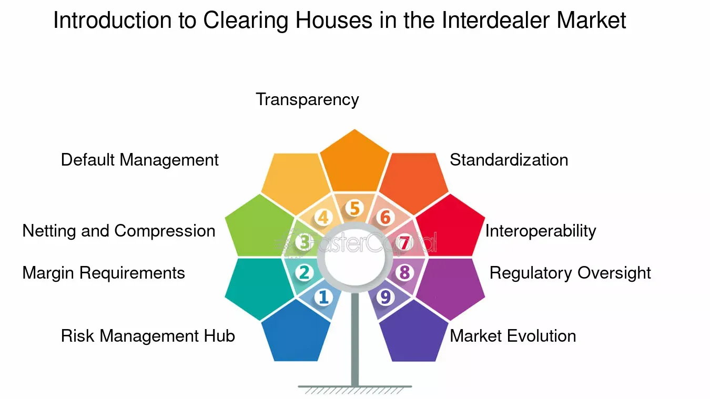

## Table of Contents

## What is an interdealer market?

An interdealer market is a place where big financial companies trade with each other. They buy and sell things like bonds, currencies, and other financial products. These companies are called dealers, and they use the interdealer market to manage their own risks and to make money by trading.

The interdealer market is very important because it helps keep the financial world running smoothly. It's like a big network that connects dealers all over the world. This market is usually very fast and uses special technology to make trades happen quickly and safely. Regular people don't use this market; it's just for the big financial companies.

## Who are the main participants in the interdealer market?

The main participants in the interdealer market are big financial institutions, often called dealers or broker-dealers. These include big banks, investment firms, and other financial companies that are involved in trading large amounts of financial products. They use the interdealer market to buy and sell things like government bonds, corporate bonds, currencies, and other securities. These participants are usually well-known and trusted in the financial world, which helps keep the market stable and reliable.

Another group of participants in the interdealer market are the interdealer brokers. These are special companies that help dealers trade with each other. They act like matchmakers, connecting buyers and sellers and making sure the trades go smoothly. Interdealer brokers don't buy or sell the financial products themselves; they just help the dealers do it. This makes the market more efficient and helps dealers find the best prices for their trades.

## What types of financial instruments are traded in the interdealer market?

In the interdealer market, dealers trade many different types of financial instruments. The most common ones are bonds, which can be government bonds or corporate bonds. Government bonds are loans to the government, and corporate bonds are loans to companies. Dealers also trade currencies, which means they buy and sell different types of money from around the world. This helps them manage risks and make profits from changes in currency values.

Another important type of financial instrument traded in the interdealer market is [interest rate](/wiki/interest-rate-trading-strategies) swaps. These are agreements between dealers to exchange interest payments over time. They help dealers manage the risk of interest rate changes. Additionally, dealers trade other securities like mortgage-backed securities, which are investments based on home loans, and credit default swaps, which are like insurance against someone not paying back a loan. All these instruments help dealers manage their money and make the financial world work smoothly.

## How does the interdealer market differ from the interbank market?

The interdealer market and the interbank market are both important parts of the financial world, but they are a bit different. The interdealer market is where big financial companies, called dealers, trade with each other. They buy and sell things like bonds, currencies, and other financial products. This market helps dealers manage their risks and make money. It's like a big network that connects dealers all over the world, and it uses special technology to make trades happen quickly and safely.

The interbank market, on the other hand, is where banks trade with each other. They mostly trade currencies and loans. When a bank needs more money, it can borrow from another bank in the interbank market. This market helps keep the banking system stable and makes sure banks have enough money to lend to people and businesses. While the interdealer market is about dealers trading many types of financial products, the interbank market is mainly about banks managing their money and lending to each other.

## What are the key functions of the interdealer market?

The interdealer market helps big financial companies, called dealers, trade with each other. They buy and sell things like bonds, currencies, and other financial products. This market is important because it helps dealers manage their risks. For example, if a dealer has too many bonds and thinks the price will go down, they can sell them in the interdealer market to avoid losing money. It also helps dealers make money by trading. If a dealer thinks the price of a currency will go up, they can buy it in the interdealer market and sell it later for a profit.

Another key function of the interdealer market is to keep the financial world running smoothly. It connects dealers all over the world, making it easier for them to find someone to trade with. This market uses special technology to make trades happen quickly and safely. This helps dealers get the best prices and avoid big losses. Without the interdealer market, it would be harder for dealers to manage their money and make profits, which could cause problems in the financial world.

## How do dealers interact within the interdealer market?

In the interdealer market, dealers interact with each other by buying and selling financial products like bonds and currencies. They use special technology to make these trades happen quickly and safely. When a dealer wants to trade, they can use an electronic platform or work with an interdealer broker. An interdealer broker acts like a matchmaker, helping dealers find someone to trade with. This makes it easier for dealers to find the best prices and avoid big losses.

The interaction between dealers is all about managing risks and making money. If a dealer thinks the price of a bond will go down, they can sell it in the interdealer market to avoid losing money. If they think the price of a currency will go up, they can buy it and sell it later for a profit. This constant buying and selling helps keep the financial world running smoothly. It's like a big network that connects dealers all over the world, making it easier for them to trade with each other and manage their money.

## What are the common trading mechanisms used in the interdealer market?

In the interdealer market, dealers use different ways to trade with each other. One common way is through electronic trading platforms. These are special computer systems that dealers use to buy and sell financial products like bonds and currencies. The platforms are fast and safe, helping dealers make trades quickly and find the best prices. Another way dealers trade is with the help of interdealer brokers. These brokers act like matchmakers, connecting dealers who want to buy and sell. They don't buy or sell the products themselves; they just help dealers find each other and make sure the trades go smoothly.

Another trading mechanism used in the interdealer market is voice trading. This is when dealers talk to each other or to brokers over the phone or through special voice systems to make trades. Voice trading can be useful for big or complicated trades where dealers need to discuss details before agreeing. It's slower than electronic trading but can be more flexible. All these mechanisms help dealers manage their risks and make money by trading in the interdealer market.

## How is liquidity managed in the interdealer market?

Liquidity in the interdealer market is managed by making sure there are always enough buyers and sellers ready to trade. This helps dealers buy or sell financial products quickly and at good prices. Dealers and interdealer brokers play a big role in this. Dealers keep trading with each other, which means there's always someone ready to buy or sell. Interdealer brokers help by connecting dealers who want to trade, making it easier for them to find someone to trade with.

Another way [liquidity](/wiki/liquidity-risk-premium) is managed is through electronic trading platforms. These platforms are always open and show the current prices and how many people want to buy or sell. This helps dealers see if there's enough interest in a product, so they know they can trade it easily. If there's not enough interest, dealers might wait or look for other products to trade. This balance helps keep the market running smoothly and makes sure dealers can always find someone to trade with.

## What role do electronic trading platforms play in the interdealer market?

Electronic trading platforms are super important in the interdealer market. They let dealers buy and sell things like bonds and currencies really fast and safely. These platforms are like big computer systems that show dealers the current prices and how many people want to buy or sell. This helps dealers find the best prices and trade quickly. Without these platforms, it would be harder for dealers to find someone to trade with, and it might take longer to make a deal.

These platforms also help keep the market running smoothly. They make sure there are always enough buyers and sellers, which is called liquidity. If there's not enough interest in a product, dealers can see that on the platform and might choose to wait or trade something else. This balance helps dealers manage their risks and make money. Plus, electronic trading platforms connect dealers all over the world, making it easier for them to trade with each other no matter where they are.

## How does the interdealer market impact the broader financial markets?

The interdealer market is like a big engine that helps keep the whole financial world running smoothly. When dealers trade things like bonds and currencies with each other, it helps set the prices for these products. This is important because other parts of the financial world, like banks and investment firms, use these prices to make their own decisions. If dealers think the price of a bond will go down, they might sell it, which can affect the price in the broader market. This means the interdealer market can influence how much people pay for loans, how much they earn from investments, and even the value of money in different countries.

The interdealer market also helps manage risk in the broader financial markets. When dealers trade, they're often trying to protect themselves from losing money if prices change. This helps keep the financial world stable because dealers are always working to balance their risks. If something big happens, like a change in interest rates or a big economic event, dealers can use the interdealer market to adjust quickly. This quick reaction helps prevent big problems from spreading and affecting regular people who use banks and invest their money. So, the interdealer market is a key part of keeping the financial world safe and reliable.

## What are the regulatory considerations specific to the interdealer market?

The interdealer market has special rules to make sure it works fairly and safely. These rules are made by government agencies like the Securities and Exchange Commission (SEC) in the U.S. and the Financial Conduct Authority (FCA) in the U.K. They watch over dealers to make sure they follow the rules. One big rule is about transparency, which means dealers have to show what they're trading and at what prices. This helps keep the market honest and stops dealers from doing secret deals that could hurt other people.

Another important rule is about managing risks. Dealers have to keep enough money and resources to cover any losses they might have. This is to make sure they don't go broke and cause problems for the whole financial world. There are also rules about how dealers can trade with each other, like using electronic platforms or interdealer brokers. These rules help make sure trades happen quickly and safely. Overall, these regulations help keep the interdealer market stable and protect everyone who uses it.

## What are the current trends and future outlook for the interdealer market?

The interdealer market is changing a lot because of new technology and rules. More dealers are using electronic trading platforms to buy and sell things like bonds and currencies. These platforms are fast and help dealers find the best prices. Also, there are new rules that make dealers show more about their trades, which makes the market more honest and safe. Another trend is that more people from different countries are trading with each other, making the market bigger and more connected.

Looking into the future, the interdealer market will probably keep growing and using more technology. Electronic trading will become even more important, and dealers might use [artificial intelligence](/wiki/ai-artificial-intelligence) to make better trading decisions. The rules will keep changing to make sure the market stays fair and safe. But, there might be new challenges too, like making sure the market can handle big changes in the world economy. Overall, the interdealer market will keep playing a big role in the financial world, helping dealers manage their money and keep things running smoothly.

## References & Further Reading

[1]: Bannister, J. E., & Worthington, A. C. (2014). ["Algorithmic Trading and Information Efficiency in Financial Markets."](https://journal.reforestationchallenges.org/index.php/REFOR/article/view/225) European Journal of Finance, 20(7-9), 695-711.

[2]: Harris, L. (2003). ["Trading and Exchanges: Market Microstructure for Practitioners."](https://www.amazon.com/Trading-Exchanges-Market-Microstructure-Practitioners/dp/0195144708) Oxford University Press.

[3]: Treleaven, P., Galas, M., & Lalchand, V. (2013). ["Algorithmic Trading Review."](https://www.researchgate.net/publication/262239006_Algorithmic_Trading_Review) Communications of the ACM, 56(11), 76-85.

[4]: Aldridge, I. (2013). ["High-Frequency Trading: A Practical Guide to Algorithmic Strategies and Trading Systems."](https://www.amazon.com/High-Frequency-Trading-Practical-Algorithmic-Strategies/dp/1118343506) Wiley.

[5]: Domowitz, I., & Liu, L. (2006). ["Determining the Benefits of Trade Netting in the Dealing Industry."](https://www.academia.edu/126280236/Industry_margins_and_the_business_cycle) Journal of Financial Markets, 9(4), 407-437.