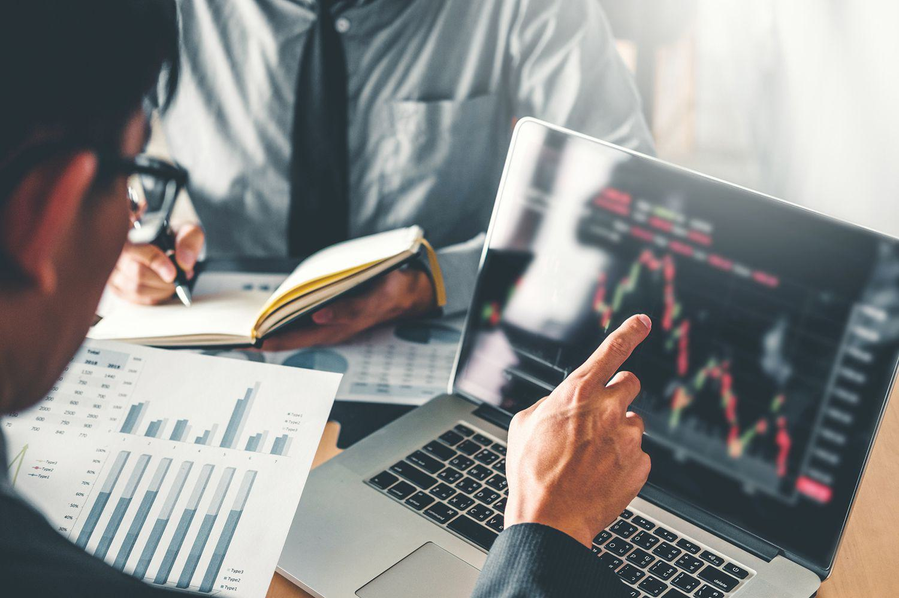

In the fast-paced world of financial markets, understanding trading mechanisms is essential for participants seeking to navigate the complexities of modern finance. This article examines the intricate operations of the interdealer market, a fundamental component of financial markets that serves as a hub for institutional trading. The interdealer market is where financial institutions, including banks and hedge funds, conduct large-scale trades outside the traditional exchanges.

Algorithmic trading, or algo trading, plays a crucial role in enhancing the efficiency of these markets by automating trading processes. With the application of advanced algorithms, trading becomes faster, more precise, and capable of handling large volumes of transactions. This automation helps minimize the potential for human error and allows market participants to execute trades based on predefined criteria, thereby capitalizing on fleeting market opportunities.

We will explore the essential aspects of interdealer markets, which include operational dynamics, participant roles, and the influence they exert on the broader financial ecosystem. These markets are characterized by high transaction volumes and tight bid-ask spreads, facilitated by interdealer brokers who ensure market liquidity and reduce the impact of large trades on market prices. The significance of interdealer markets lies in their ability to provide anonymity and minimize market impact, making them a preferred venue for institutional trades.

Furthermore, this discussion will address the impact of algorithmic trading on the operations of interdealer markets. The integration of algo trading has transformed these markets by enabling faster decision-making and improving trading efficiency. By understanding these mechanisms and their influence on modern finance, stakeholders can better navigate and adapt to the evolving financial landscape.

## Table of Contents

## Understanding the Interdealer Market

The interdealer market is an essential component of the financial landscape, serving as the arena where large financial institutions engage in wholesale trading of securities, currencies, and other financial instruments. These transactions occur in an over-the-counter (OTC) environment, which distinguishes them from exchanges that require centralized operations. In the interdealer market, buyers and sellers negotiate directly, leading to significant transaction volumes and tight bid-ask spreads. Such a structure allows the market to maintain high liquidity, fostering an optimal trading environment for its participants.

Participants in the interdealer market include a diverse range of financial institutions such as banks, hedge funds, and investment firms. These entities engage in trading activities to manage their portfolios, hedge risks, or seek profit opportunities. Interdealer brokers play a pivotal role by acting as intermediaries between buyers and sellers. They facilitate transactions by matching orders and providing relevant market information to participants. Brokers help maintain liquidity by ensuring that there is always a counterparty available for a trade, thus smoothing market operations.

A notable aspect of the interdealer market is its inherent advantages. One of the primary benefits is the increased level of anonymity it provides to participants. Large institutions often prefer to conduct trades anonymously to prevent large market moves that could arise from revealing their trading intentions. This anonymity helps reduce the market impact of sizable trades, promoting more efficient execution and better pricing.

Additionally, the interdealer market offers flexibility in terms of trading hours and the variety of instruments that can be traded. Unlike traditional exchanges with fixed trading hours, OTC markets operate around the clock, providing continuous access to market opportunities. The market's adaptable nature allows it to accommodate a broader range of financial products, including derivatives and complex structured products, thus catering to the specific needs of institutional traders.

Furthermore, the tight bid-ask spreads in the interdealer market are indicative of its efficiency. The bid-ask spread, defined as the difference between the highest price a buyer is willing to pay and the lowest price a seller is willing to accept, is a critical measure of market [liquidity](/wiki/liquidity-risk-premium). Narrow spreads suggest a highly liquid market where transactions can be executed swiftly and with minimal cost.

In summation, the interdealer market is a foundational element of modern finance, offering a platform for large-scale trading among institutional participants. Its OTC nature, participant diversity, reliance on interdealer brokers, and inherent advantages like increased anonymity and reduced market impact make it indispensable for wholesale trading operations. These characteristics not only enhance the liquidity and efficiency of financial markets but also ensure that they operate smoothly to meet the demands of today's fast-paced financial environment.

## Algorithmic Trading in Financial Markets

Algorithmic trading, often referred to as algo trading, utilizes sophisticated computer programs to execute trades based on predefined criteria, significantly enhancing the efficiency of trading operations. This technology has profoundly impacted financial markets, especially within interdealer markets where large institutional trades are prevalent. 

In essence, [algorithmic trading](/wiki/algorithmic-trading) automates the trading process, minimizing human intervention and capitalizing on technology's ability to process vast datasets at high speeds. This is particularly advantageous in the interdealer market, characterized by high-frequency trading and large transaction volumes. Algorithms can swiftly analyze market conditions, execute orders, and optimize trading strategies, thus reducing latency and enhancing execution quality.

Several types of algorithms are commonly employed in trading. Market-making algorithms are pivotal in providing liquidity to the markets. They continuously post buy and sell orders, profiting from the spread between them. These algorithms ensure that the markets are vibrant and functioning efficiently even when there are temporary disparities in supply and demand. 

Statistical [arbitrage](/wiki/arbitrage) algorithms exploit pricing inefficiencies between correlated instruments. They utilize statistical methods to identify and capitalize on these temporary mispricings. For example, a [statistical arbitrage](/wiki/statistical-arbitrage) strategy might involve a pairs trade, where an algorithm goes long on one security and short on another, predicting that their price relationship will revert to the mean.

The impact of algo trading on market dynamics is multifaceted. Its primary benefits include speed, accuracy, and the ability to detect and act on market opportunities that would be imperceptible to human traders. Algorithms operate at speeds that allow for rapid order placement and execution, often within milliseconds, leading to enhanced trading efficiency.

Moreover, algorithmic trading enhances accuracy by executing trades based on predetermined criteria without emotional bias, thus eliminating human error and ensuring consistency in trade execution. This precision is crucial for high-frequency trading where even slight deviations can lead to significant financial implications.

The capability to capitalize on fleeting market opportunities is another advantage of algorithmic trading. By analyzing vast amounts of market data in real-time, these algorithms can identify profitable trading opportunities and execute trades faster than the blink of an eye, optimizing profit margins.

In conclusion, algorithmic trading has revolutionized the functioning of financial markets, particularly within the interdealer space, by leveraging technology to increase trading efficiency and market dynamics. Its strategic use of computational intelligence models ensures optimal trade execution, maintaining the robustness and fluidity necessary for modern financial ecosystems.

## Key Players in the Interdealer Market

The interdealer market is characterized by the interaction of several key players, each playing a crucial role in its functioning and efficiency. These participants include broker-dealers, market makers, clearinghouses, and regulatory bodies, each contributing uniquely to the market's liquidity and stability.

Broker-dealers are pivotal in the interdealer market. They act as intermediaries, buying and selling financial securities on behalf of clients or for their own accounts. Their role is essential in providing liquidity, as they facilitate large transactions that are typical in the interdealer market. This market is usually over-the-counter (OTC), meaning that trades are executed directly between parties rather than through a centralized exchange. Broker-dealers help in bridging the gap between buyers and sellers, especially for large-[volume](/wiki/volume-trading-strategy) orders that demand confidentiality and minimal market impact.

Market makers are another vital component of the interdealer market. They continuously provide buy and sell prices for financial instruments, enhancing market liquidity. By doing so, market makers reduce the bid-ask spread, making it cost-effective for institutions to execute trades. Their presence ensures that there is always a counterparty available to trade, thus stabilizing the market and contributing to efficient price discovery.

Clearinghouses serve a critical function in managing post-trade processes. They ensure the integrity of transactions by assuming the role of the counterparty to both sides of a trade. This process, known as novation, mitigates counterparty risk by providing a guarantee that trades will be settled even if one party defaults. Clearinghouses also manage the collateral and margin requirements, which are essential for maintaining confidence and stability in the market.

The interaction between broker-dealers, market makers, and clearinghouses works in tandem to maintain market stability. Broker-dealers communicate with market makers to obtain the best prices for their trades, while clearinghouses ensure the smooth settlement of these trades. This synergy is vital for liquidity provision and efficient trade execution, which are hallmarks of the interdealer market.

Regulatory bodies oversee these market activities to ensure transparency and fairness. They impose rules and guidelines that govern trading practices, intending to prevent manipulative behaviors and ensure market integrity. Regulations such as the Dodd-Frank Act and the Markets in Financial Instruments Directive (MiFID) have been instrumental in shaping the operational landscape of the interdealer market. They require reporting of OTC trades and enhance the transparency of financial transactions. Compliance with these regulations is mandatory for market participants, ensuring that the trading environment remains fair and competitive.

In summary, the interdealer market depends on the collaborative efforts of broker-dealers, market makers, and clearinghouses, overseen by regulatory bodies. This collaboration ensures liquidity, efficient trade execution, and market stability, making the interdealer market a critical component of global financial systems.

## Technology and Tools in Interdealer Trading

Technological advancements have significantly reshaped the landscape of interdealer trading, offering innovative tools that enhance both accessibility and efficiency. Among the most transformative developments are electronic trading platforms, blockchain technology, and sophisticated data analytics, each playing a critical role in modernizing trading practices.

Electronic trading platforms have become essential in interdealer trading by automating the execution of trades and providing real-time access to a vast array of market data. These platforms facilitate rapid transaction processing, reduce manual intervention, and offer enhanced transparency. By streamlining trade execution and improving price discovery, electronic platforms have increased market efficiency and accessibility. The integration of algorithmic trading strategies within these platforms further optimizes trade execution speed and precision.

Blockchain technology promises to revolutionize the interdealer market by ensuring security, transparency, and efficiency in trade settlements. By leveraging distributed ledger technology, decentralized record-keeping becomes feasible, thus enhancing trust and reducing the likelihood of data tampering. Blockchain can streamline post-trade processes, such as settlement and clearing, by ensuring all parties have access to an immutable record of transactions. This capability reduces settlement times and lowers the risk of counterparty defaults.

Sophisticated data analytics tools offer traders insights into market behavior and trends, fostering informed decision-making. By employing advanced analytical models, traders can uncover patterns and correlations within vast datasets, enabling the deployment of predictive analytics and [machine learning](/wiki/machine-learning) algorithms. These tools help traders anticipate market movements, optimize portfolio performance, and develop robust risk management strategies.

In addition to these technological advancements, cybersecurity measures are paramount in safeguarding sensitive trading information and maintaining the integrity of trading operations. With the increasing reliance on electronic trading platforms, robust cybersecurity protocols are necessary to protect against data breaches and cyber threats. Encryption methods, secure authentication processes, and regular security audits are integral to ensuring a secure trading environment.

Overall, the integration of electronic trading platforms, blockchain technology, and data analytics into interdealer trading not only enhances operational efficiency and market accessibility but also fortifies the security and reliability of trading infrastructures. As technology continues to evolve, its impact will likely deepen, further transforming the dynamics of interdealer markets.

## Risk Management in the Interdealer Market

Risk management is a fundamental aspect of trading in the interdealer market due to the inherent high stakes and [volatility](/wiki/volatility-trading-strategies). Effective strategies are essential for mitigating various types of risks, including counterparty, liquidity, and operational risks.

Counterparty risk involves the possibility that a trading partner may default on their obligations. To manage this, market participants implement strategies such as netting agreements, which allow for the consolidation of all trades with a counterparty into a single net payment obligation. Additionally, collateral management practices, including the use of margin calls, help protect against credit exposure. A practical example of this is the use of credit default swaps (CDS), which act as insurance against counterparty defaults by transferring risk to the seller of the CDS.

Liquidity risk arises from the inability to execute trades without causing significant market impact. Managing liquidity risk involves maintaining an ample supply of tradeable assets and access to capital. Participants utilize liquidity risk models that employ statistical methods to forecast potential liquidity shortfalls and ensure sufficient buffer stocks. An example is the application of stress testing procedures, where hypothetical scenarios are used to evaluate liquidity under various adverse conditions.

Operational risk, associated with failures in internal processes, systems, or external events, is managed through comprehensive risk assessment models. These models often involve mapping out business processes and identifying potential points of failure. To ensure resilience against operational disruptions, trading firms adopt robust cybersecurity measures to protect sensitive data and systems. Additionally, business continuity planning and regular audits support operational reliability.

Regulatory standards also play a vital role in risk management by enforcing compliance and transparency. Adhering to regulations like the Basel III framework, which sets forth guidelines for capital adequacy, stress testing, and market liquidity risk, helps institutions maintain financial stability. Furthermore, the use of Value at Risk (VaR) models provides a quantitative measure of potential loss over a specified period and confidence level, incorporating market volatility and historical data.

Incorporating these strategies and tools, the interdealer market can navigate its complexities, ensuring a balanced and controlled trading environment. As regulatory landscapes evolve and technological advancements continue, maintaining effective risk management practices will remain a pivotal concern for market participants.

## The Future of Interdealer Trading

The interdealer market stands on the cusp of considerable evolution, propelled by technological advancements and shifting regulatory frameworks. As trading systems become increasingly sophisticated, the role of [artificial intelligence](/wiki/ai-artificial-intelligence) (AI) and machine learning (ML) is anticipated to expand significantly. These technologies offer enhanced capabilities for analyzing vast datasets, optimizing trading strategies, and predicting market trends, thereby augmenting decision-making processes for market participants.

AI algorithms, equipped with machine learning capabilities, are already being utilized to detect patterns and anomalies within market data, enabling traders to execute strategies with greater precision and speed. As these technologies progress, their application in interdealer trading is expected to become more prevalent and complex. This shift promises to not only enhance the efficiency and accuracy of trade executions but also to introduce novel strategies that leverage predictive analytics and real-time data processing.

Market fragmentation presents both challenges and opportunities in the future landscape of interdealer trading. The proliferation of electronic trading platforms has contributed to a more segmented market structure, with numerous venues offering varied levels of liquidity. While this fragmentation can complicate trade execution and liquidity access, it also drives innovation by fostering competition among platforms to offer superior services and tools.

The shift towards electronic trading platforms is another significant trend shaping the future of interdealer trading. These platforms are streamlining trading processes, reducing transaction costs, and increasing market accessibility for a broader range of participants. Their adoption is further encouraged by regulatory changes aimed at enhancing transparency and reducing systemic risks. However, the migration to such platforms necessitates investments in technology infrastructure and the continual upgrading of systems to keep pace with evolving market demands.

Market participants looking to thrive in this dynamic environment face several challenges. They must adapt to rapid technological changes, address cybersecurity threats, and comply with an increasingly complex regulatory landscape. However, these challenges come with opportunities for growth and innovation. By leveraging cutting-edge technologies and adopting agile strategies, firms can capitalize on new market opportunities and improve their competitive positioning.

In conclusion, the interdealer market is gearing up for a future characterized by advanced technologies and an evolving regulatory scene. Participants who successfully navigate these changes by embracing innovation and maintaining robust risk management practices are likely to secure a prominent position in the future landscape of interdealer trading.

## References & Further Reading

[1]: Bannister, J. E., & Worthington, A. C. (2014). ["Algorithmic Trading and Information Efficiency in Financial Markets."](https://journal.reforestationchallenges.org/index.php/REFOR/article/view/225) European Journal of Finance, 20(7-9), 695-711.

[2]: Harris, L. (2003). ["Trading and Exchanges: Market Microstructure for Practitioners."](https://www.amazon.com/Trading-Exchanges-Market-Microstructure-Practitioners/dp/0195144708) Oxford University Press.

[3]: Treleaven, P., Galas, M., & Lalchand, V. (2013). ["Algorithmic Trading Review."](https://www.researchgate.net/publication/262239006_Algorithmic_Trading_Review) Communications of the ACM, 56(11), 76-85.

[4]: Aldridge, I. (2013). ["High-Frequency Trading: A Practical Guide to Algorithmic Strategies and Trading Systems."](https://www.amazon.com/High-Frequency-Trading-Practical-Algorithmic-Strategies/dp/1118343506) Wiley.

[5]: Domowitz, I., & Liu, L. (2006). ["Determining the Benefits of Trade Netting in the Dealing Industry."](https://www.academia.edu/126280236/Industry_margins_and_the_business_cycle) Journal of Financial Markets, 9(4), 407-437.