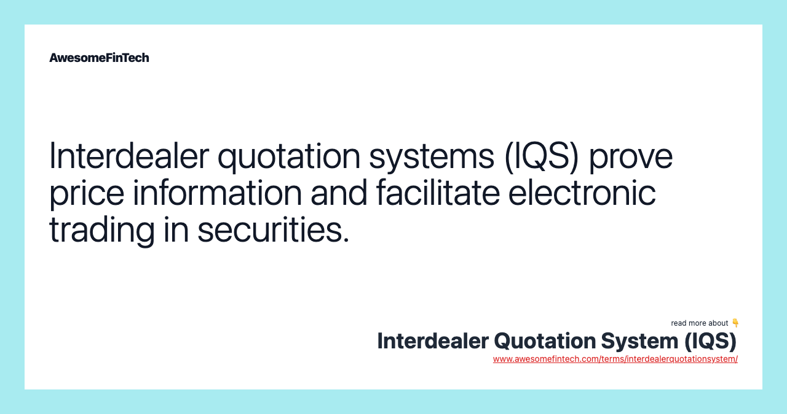

## Table of Contents

## What is an Interdealer Quotation System (IDQS)?

An Interdealer Quotation System (IDQS) is a platform used by financial institutions to buy and sell securities, like stocks and bonds, among themselves. It helps dealers, who are the people or firms that trade these securities, to find the best prices and make trades quickly. Think of it as a special marketplace where only dealers can enter and trade with each other.

IDQS makes trading easier and faster because it shows real-time prices from different dealers. This means dealers can see what others are willing to buy or sell at any moment. By using IDQS, dealers can get better deals and trade more efficiently. It's like having a big board where everyone can see the current prices and make their decisions based on that information.

## How does an IDQS facilitate trading between dealers?

An IDQS helps dealers trade with each other by showing them real-time prices for securities. When a dealer wants to buy or sell something, they can look at the IDQS to see what other dealers are offering. This way, they can find the best price without having to call around or wait for quotes. It's like a big online board where everyone can see the current prices and make quick decisions.

The system makes trading faster and easier because it connects dealers directly. Instead of going through a middleman, dealers can trade directly with each other. This not only speeds up the process but also cuts down on costs. By using IDQS, dealers can get better deals and trade more efficiently, which is good for their business.

## What are the main components of an IDQS?

An Interdealer Quotation System (IDQS) has several key parts that make it work well. The first part is the quotation board, which shows all the current prices for securities that dealers want to buy or sell. This board updates in real-time, so dealers can always see the latest prices and make quick decisions. The second part is the trading platform, where dealers can actually make their trades. It connects dealers directly so they can buy and sell securities without needing a middleman.

Another important part is the communication system, which lets dealers talk to each other and negotiate deals. This can be through messages, calls, or even video chats, making it easier to agree on trades. Finally, there's the data and analytics part, which keeps track of all the trades and helps dealers see trends and patterns. This information can help them make better trading decisions in the future. Together, these components make the IDQS a powerful tool for dealers to trade efficiently.

## Can you explain the difference between an IDQS and other trading platforms?

An Interdealer Quotation System (IDQS) is a special kind of trading platform that is used only by dealers to trade securities like stocks and bonds with each other. It's different from other trading platforms because it focuses on connecting dealers directly, without any middlemen. This means dealers can see real-time prices from other dealers and make trades quickly and efficiently. The main goal of an IDQS is to help dealers find the best prices and trade with each other in a fast and secure way.

Other trading platforms, like stock exchanges or electronic communication networks (ECNs), are usually open to a wider range of users, including individual investors and institutions. These platforms might not provide the same level of direct dealer-to-dealer interaction as an IDQS. Instead, they often involve more intermediaries and can be slower because of the extra steps needed to complete a trade. While these other platforms are great for connecting a broader audience, they don't offer the specialized, streamlined trading experience that an IDQS provides for dealers.

## What types of financial instruments are typically traded on an IDQS?

An Interdealer Quotation System (IDQS) is mainly used for trading securities like government bonds, corporate bonds, and other fixed-income instruments. These are types of investments where you lend money to a government or a company, and they pay you back with interest over time. Dealers use IDQS to buy and sell these bonds quickly and at the best prices because they can see what other dealers are offering in real-time.

Besides bonds, dealers also trade other financial instruments on an IDQS, like stocks, currencies, and derivatives. Stocks are shares in a company, currencies are different types of money, and derivatives are contracts that get their value from something else, like the price of a stock or commodity. By using an IDQS, dealers can trade these instruments directly with each other, making the process faster and more efficient.

## How does an IDQS ensure the security and confidentiality of transactions?

An Interdealer Quotation System (IDQS) keeps transactions safe and private by using strong security measures. It uses encryption to protect the information that dealers send and receive. Encryption is like putting a secret code on the data so that only the right people can read it. The system also has strict rules about who can use it, so only authorized dealers can access the platform. This helps make sure that the trades stay confidential and only the dealers involved know about them.

IDQS also keeps track of all the activities on the platform. It logs who is trading and what they are trading, so if there is ever a problem, it can be checked and fixed quickly. This helps to stop any bad behavior and keeps the system fair for everyone. By using these security steps, IDQS makes sure that dealers can trade without worrying about their information getting into the wrong hands.

## What are the benefits of using an IDQS for financial institutions?

Using an Interdealer Quotation System (IDQS) helps financial institutions trade more efficiently. It connects dealers directly, so they can buy and sell securities like bonds and stocks without needing a middleman. This makes the trading process faster and can save money because there are fewer people involved. Dealers can also see real-time prices from other dealers, which helps them find the best deals quickly. This is important because it means they can make better decisions and get better prices for their trades.

Another big benefit is that IDQS keeps transactions safe and private. The system uses strong security measures like encryption to protect the information that dealers share. This means that only the dealers involved in a trade can see the details, keeping everything confidential. Plus, the system keeps track of all the activities, so if anything goes wrong, it can be checked and fixed. This helps financial institutions trust the platform and trade with peace of mind.

## How has technology evolved the functionality of IDQS?

Technology has made Interdealer Quotation Systems (IDQS) much better over time. In the past, dealers had to call each other or use slow methods to trade. Now, with new technology, IDQS can show real-time prices from all over the world. This means dealers can see what others are offering and make quick trades. The system also uses computers to match buyers and sellers automatically, making everything faster and easier.

Another big change is how IDQS keeps trades safe and private. New technology uses strong security like encryption to protect the information dealers share. This keeps everything secret between the people trading. Also, IDQS now uses data and analytics to help dealers see patterns and trends. This helps them make smarter decisions and trade better. Overall, technology has made IDQS a powerful tool for dealers to use in their trading.

## What are the regulatory considerations for operating an IDQS?

When operating an Interdealer Quotation System (IDQS), financial institutions have to follow many rules to make sure everything is fair and safe. These rules come from government agencies that watch over the financial markets. The rules are there to stop any bad behavior and make sure that everyone follows the same guidelines. For example, IDQS operators need to keep good records of all trades and make sure only authorized people can use the system. They also have to report any strange activities to the regulators.

Another important part of the regulations is making sure the IDQS is secure. This means using strong security measures like encryption to protect the information dealers share. It's also important to have systems in place to check for and stop any attempts to cheat or break the rules. By following these regulations, IDQS operators can help keep the trading environment honest and trustworthy for everyone involved.

## How do liquidity and market depth impact the effectiveness of an IDQS?

Liquidity and market depth are very important for how well an Interdealer Quotation System (IDQS) works. Liquidity means how easy it is to buy or sell something without the price changing a lot. If an IDQS has high [liquidity](/wiki/liquidity-risk-premium), dealers can quickly find someone to trade with, which makes trading faster and easier. Market depth is about how many buy and sell orders there are at different prices. When there are lots of orders, dealers can see many options and find the best price for their trade. This helps them make better decisions and get better deals.

If an IDQS has low liquidity or market depth, it can be harder for dealers to trade. They might have to wait longer to find someone to trade with, and the prices might not be as good. This can make the system less useful for dealers because they can't trade as quickly or get the best prices. So, having good liquidity and market depth is really important for making an IDQS effective and helpful for dealers.

## Can you discuss a case study where an IDQS significantly impacted market dynamics?

One good example of how an IDQS changed market dynamics is when the U.S. Treasury market started using electronic trading platforms like IDQS. Before, dealers would call each other to trade government bonds, which could take a lot of time and make it hard to find the best prices. When IDQS came along, dealers could see real-time prices from all over the market. This made trading much faster and easier. They could find the best deals quickly and trade without waiting. As a result, the U.S. Treasury market became more liquid, meaning it was easier to buy and sell bonds.

This change had a big impact on the market. With more dealers using IDQS, there were more buy and sell orders, which made the market deeper. This meant that dealers could see many options at different prices, helping them make better trading decisions. The increased liquidity and market depth also made the market more stable. Prices didn't change as much because there were always people ready to trade. Overall, the use of IDQS in the U.S. Treasury market made trading more efficient and helped dealers get better prices for their trades.

## What future trends are expected to influence the development of IDQS?

In the future, technology will keep changing how Interdealer Quotation Systems (IDQS) work. One big trend is the use of [artificial intelligence](/wiki/ai-artificial-intelligence) (AI) and [machine learning](/wiki/machine-learning). These technologies can help IDQS predict what dealers might want to trade and suggest the best prices. This can make trading even faster and help dealers make better choices. Another trend is blockchain technology. It can make trading more secure and transparent because it keeps a record of every trade that can't be changed. This could help dealers trust the system more and make trading safer.

Also, more people might start using mobile devices to trade on IDQS. This means the systems will need to work well on phones and tablets, making it easier for dealers to trade from anywhere. Another important trend is regulation. Governments might make new rules to make sure IDQS stays fair and safe. These rules could change how IDQS works and what dealers can do on the platform. Overall, these trends will help IDQS keep up with the changing needs of dealers and make trading better and more secure.

## References & Further Reading

[1]: Lopez de Prado, M. (2018). ["Advances in Financial Machine Learning"](https://www.amazon.com/Advances-Financial-Machine-Learning-Marcos/dp/1119482089). Wiley.

[2]: Aronson, D. R. (2006). ["Evidence-Based Technical Analysis: Applying the Scientific Method and Statistical Inference to Trading Signals"](https://www.amazon.com/Evidence-Based-Technical-Analysis-Scientific-Statistical/dp/0470008741). Wiley.

[3]: Jansen, S. (2020). ["Machine Learning for Algorithmic Trading: Predictive models to extract signals from market and alternative data for systematic trading strategies with Python"](https://github.com/stefan-jansen/machine-learning-for-trading). Packt Publishing.

[4]: Chan, E. P. (2008). ["Quantitative Trading: How to Build Your Own Algorithmic Trading Business"](https://github.com/egorpe/EPChan-QuantitativeTrading/blob/master/example7_6.m). John Wiley & Sons.

[5]: Avellaneda, M. (1998). ["Quantitative Analysis in Financial Markets: Collected Papers of the New York University Mathematical Finance Seminar"](https://books.google.com/books/about/Quantitative_Analysis_in_Financial_Marke.html?id=CeXoVzPGae4C). World Scientific Publishing Company.