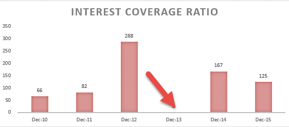

In today's rapidly evolving financial markets, understanding key financial metrics is crucial for traders and investors. Among these metrics, the Interest Coverage Ratio (ICR) plays a vital role in evaluating a company's capacity to fulfill its debt obligations. ICR is calculated by dividing a company's earnings before interest and taxes (EBIT) by its interest expense:

$$
\text{ICR} = \frac{\text{EBIT}}{\text{Interest Expense}}
$$



A higher ICR denotes a greater ability of a company to cover its interest expenses, securing its financial stability in volatile market conditions. This metric delivers critical insights into a company's liquidity and risk levels, aiding investors in making informed decisions.

Incorporating financial analysis, such as the evaluation of ICR, into algorithmic trading strategies provides traders a competitive advantage. Algorithmic trading automates decision-making processes, capitalizing on high-speed data analysis and predefined financial criteria. By embedding ICR into these algorithms, investors can systematically assess financial robustness, leading to more strategic trading decisions.

The forthcoming sections will explain the importance of the Interest Coverage Ratio, examining its contribution to financial analysis and its application in algorithmic trading. Integrating ICR effectively helps investors to assess a company's financial health accurately, fostering a well-informed, adaptable, and successful trading approach in today's complex financial landscape.

## Table of Contents

## Understanding Interest Coverage Ratio (ICR)

The Interest Coverage Ratio (ICR) is a crucial financial measure that assesses a company's ability to meet its interest obligations on outstanding debt. It serves as an important indicator of financial health, playing a significant role in investment decisions. The ICR is calculated using the formula:

$$
ICR = \frac{\text{EBIT}}{\text{Interest Expense}}
$$

where EBIT stands for earnings before interest and taxes. This ratio demonstrates the margin by which earnings can cover interest expenses, providing insights into a company's solvency. A higher Interest Coverage Ratio implies that a company has ample earnings to comfortably cover its interest payments. Consequently, this suggests greater financial stability and a lower risk of default. In contrast, a lower ICR may indicate potential financial difficulties, as it suggests that a company's earnings might be insufficient to meet its interest obligations, increasing the likelihood of financial distress.

Investors frequently utilize the Interest Coverage Ratio to evaluate risk levels when considering investment opportunities. By focusing on this metric, they can gauge a company's creditworthiness and its ability to sustain operations without financial strain. Understanding ICR is valuable for traders as well, as it aids in assessing the financial sustainability of companies within their portfolios.

A robust ICR signals to investors and traders that a company is well-positioned to manage its existing debt load, which can result in more favorable borrowing terms or investment conditions. Conversely, a low ICR may require closer scrutiny and possibly deter investment due to the implied risk of financial instability. Therefore, the Interest Coverage Ratio is an essential tool for evaluating the financial health and sustainability of a company, providing critical insights to make informed decisions in trading and investing.

## The Role of Financial Analysis in Trading

Financial analysis is a cornerstone of successful trading as it sheds light on a company's operational performance and financial health. For traders, understanding and interpreting financial metrics is indispensable in assessing the viability and sustainability of investments. Among these metrics, the Interest Coverage Ratio (ICR) stands out, offering critical insights into a company's ability to manage its debt obligations.

Traders rely on financial measures such as the ICR to evaluate the soundness of potential investments. A robust ICR suggests a company can comfortably meet its interest payments, reducing the risk associated with the investment. Conversely, a low ICR may signal financial distress, informing traders to exercise caution. Employing such metrics enables traders to gauge the risk-reward ratio of investing in specific securities, thereby facilitating informed decision-making.

Moreover, financial analysis empowers traders to identify potentially profitable trading opportunities by leveraging quantitative data. By examining various financial metrics, traders can detect undervalued stocks or companies with promising growth prospects. This quantitative approach underpins the development of trading strategies that are resilient to market fluctuations.

Incorporating financial analytics into trading strategies also involves constructing models that adapt to market variability. A comprehensive analysis of historical and current financial data helps traders design strategies that account for the nuanced dynamics of financial markets. This proactive approach not only anticipates market trends but also positions traders to exploit them effectively.

Staying current with financial reports and metrics is crucial for making timely trading decisions. Markets are inherently dynamic, with conditions that can shift rapidly. Traders must therefore remain vigilant, continuously monitoring financial updates to adjust their strategies accordingly. This attentiveness ensures that investment decisions are aligned with the latest financial realities and market conditions.

In summary, financial analysis plays an indispensable role in trading by providing critical insights into company performance and market conditions. By leveraging metrics like the Interest Coverage Ratio, traders can craft strategies that are both resilient and adaptive, ultimately enhancing their ability to navigate and succeed in the financial markets.

## Incorporating ICR into Algorithmic Trading Strategies

Algorithmic trading employs computer algorithms to execute trades rapidly, based on pre-set criteria. By integrating the Interest Coverage Ratio (ICR) into these algorithms, traders can enhance decision-making processes, as ICR serves as a critical indicator of a company's financial robustness. The incorporation of ICR provides an objective measure, helping traders assess the capability of a firm to meet its debt obligations, thus informing buy or sell decisions.

The inclusion of ICR allows algorithms to analyze a company's earnings before interest and taxes (EBIT) relative to its interest expenses. This measure, defined mathematically as:

$$
\text{ICR} = \frac{\text{EBIT}}{\text{Interest Expense}}
$$

offers insights into the stability and creditworthiness of a company. A higher ICR typically suggests a stronger financial position, indicating the company can comfortably cover its interest payments, thereby reducing the risk associated with investment. Conversely, a lower ICR may signal potential difficulties, warning traders to approach with caution.

To implement ICR in [algorithmic trading](/wiki/algorithmic-trading), algorithms can be programmed to continuously monitor ICR in real-time, alongside other pertinent financial metrics such as Price-to-Earnings (P/E) ratio, Earnings Per Share (EPS), and debt-to-equity ratio. This multifaceted approach ensures that algorithms provide a comprehensive assessment of a company's financial health, enhancing the precision of trading decisions.

For instance, a Python-based algorithm could employ libraries such as pandas for data manipulation and analysis, combined with APIs for real-time financial data retrieval. A conceptual outline in Python might resemble:

```python
import pandas as pd

# Fetch financial data using an API
def fetch_financial_data(company):
    # hypothetical function to fetch data
    pass

# Calculate ICR
def calculate_icr(ebit, interest_expense):
    return ebit / interest_expense

# Decision-making based on ICR
def trading_decision(company):
    data = fetch_financial_data(company)
    icr = calculate_icr(data['EBIT'], data['InterestExpense'])

    # Trigger buy/sell decision based on ICR threshold
    if icr > 3:  # Example threshold
        return "Buy"
    elif icr < 1.5:
        return "Sell"
    else:
        return "Hold"

```

Moreover, algorithms can be crafted to prioritize companies exhibiting robust ICRs, thereby potentially mitigating investment risk while optimizing returns. This systematic approach minimizes emotional biases, fostering more disciplined trading behavior. Although effective, this strategy should ideally be complemented with other financial indicators and market conditions to craft a holistic trading strategy that adapts to dynamic market environments.

## Benefits and Challenges of Using ICR in Algo Trading

Incorporating the Interest Coverage Ratio (ICR) within algorithmic trading strategies provides a robust mechanism to use financial health as a vital trading signal. The use of automated systems can significantly enhance response times, enabling traders to efficiently seize market opportunities as they arise. These systems can process vast amounts of financial data quickly, allowing for immediate adjustments to trading strategies based on real-time information.

The principal advantage of integrating ICR into algorithmic trading is the ability to systematically evaluate a company’s financial stability, thus informing trade decisions. By prioritizing companies with a higher ICR, traders are positioning themselves to capitalize on firms that are ostensibly more capable of managing debt, potentially leading to better investment outcomes.

However, the development and maintenance of such systems require a high level of technical expertise as well as a comprehensive understanding of financial indicators. Effective algorithmic trading programs must be meticulously designed to accurately assess ICR alongside other financial metrics to ensure reliable performance in varied market conditions. This poses a challenge as financial markets are inherently dynamic; conditions can shift rapidly, rendering a singular reliance on ICR potentially limiting. To address this, traders should blend ICR analysis with additional financial and market indicators to create a balanced, diversified trading strategy that can adapt to a broad range of market environments.

Including a diversified array of metrics and signals could involve using supplementary indicators such as the Current Ratio, Debt-to-Equity Ratio, or Price-to-Earnings Ratio to provide a comprehensive picture of a company's financial health and market position. Moreover, incorporating [machine learning](/wiki/machine-learning) techniques could improve the adaptability of trading algorithms by allowing them to learn from historical data and refine their predictive capabilities.

In conclusion, while the incorporation of the Interest Coverage Ratio offers significant benefits for algorithmic trading strategies by foregrounding a company’s ability to manage its debt, these systems require careful construction and ongoing adaptation to ensure competitive advantage. By integrating multiple indicators and leveraging advanced technologies, traders can create a more resilient and adaptable trading strategy that better navigates the complexities of financial markets.

## Conclusion

The Interest Coverage Ratio (ICR) is a crucial financial metric essential for assessing a company's ability to meet its debt obligations, serving as a fundamental indicator of financial stability. In the context of algorithmic trading, effectively integrating ICR into trading strategies can provide actionable insights that are vital for enhancing trading outcomes. By incorporating this metric, traders can identify companies with robust financial health, thereby making more informed decisions.

In today's competitive markets, balancing financial analysis with cutting-edge technology is vital for traders aiming to maintain a competitive edge. The dynamic nature of financial markets requires traders and investors to continuously explore innovative ways to integrate metrics like ICR into their strategies. Such integration ensures that trading algorithms are not only reactive to market conditions but are also rooted in sound financial analysis.

By embedding the Interest Coverage Ratio into trading strategies, investors can foster a more informed, adaptable, and successful trading approach. This balance between solid financial metrics and advanced technological tools prepares traders to navigate the complexities of modern financial landscapes, ultimately contributing to more sustainable investment decisions and improved risk management.

## References & Further Reading

[1]: Benjamin Graham and David Dodd. ["Security Analysis"](https://www.amazon.com/Security-Analysis-Seventh-Principles-Techniques/dp/1264932405), McGraw Hill Education, 1934.

[2]: ["Financial Intelligence, Revised Edition: A Manager's Guide to Knowing What the Numbers Really Mean"](https://www.amazon.com/Financial-Intelligence-Revised-Managers-Knowing/dp/1422144119) by Karen Berman, Joe Knight, and John Case

[3]: ["The Intelligent Investor"](https://www.amazon.com/Intelligent-Investor-Definitive-Investing-Essentials/dp/0060555661) by Benjamin Graham

[4]: ["Algorithmic Trading and DMA: An Introduction to Direct Access Trading Strategies"](https://www.amazon.com/Algorithmic-Trading-DMA-introduction-strategies/dp/0956399207) by Barry Johnson

[5]: Piotroski, J. D. (2000). ["Value Investing: The Use of Historical Financial Statement Information to Separate Winners from Losers"](https://www.ivey.uwo.ca/media/3775523/value_investing_the_use_of_historical_financial_statement_information.pdf) in the Journal of Accounting Research

[6]: ["Investment Valuation: Tools and Techniques for Determining the Value of Any Asset"](https://books.google.com/books/about/Investment_Valuation.html?id=5SRHAAAAQBAJ) by Aswath Damodaran