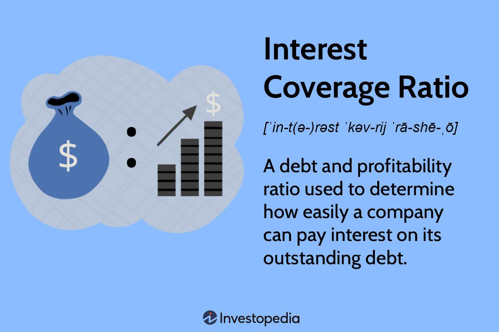

## Table of Contents

## What is the Interest Coverage Ratio?

The Interest Coverage Ratio is a financial measure that shows how easily a company can pay its interest expenses on outstanding debt. It is calculated by dividing a company's earnings before interest and taxes (EBIT) by its interest expenses. A higher ratio means the company is more capable of meeting its interest obligations from its operating earnings, which indicates financial stability.

This ratio is important for investors and creditors because it helps them understand the risk of lending money to the company. If the ratio is low, it might mean the company is struggling to make interest payments, which could be a warning sign of financial trouble. A high ratio, on the other hand, suggests that the company is in a good position to handle its debt, making it a safer investment or loan.

## Why is the Interest Coverage Ratio important for businesses?

The Interest Coverage Ratio is important for businesses because it shows how well they can pay the interest on their loans. This ratio helps business owners and managers see if their company is making enough money to cover the cost of borrowing. If the ratio is high, it means the business is doing well and can easily pay its interest. This makes lenders and investors feel more confident about giving money to the business.

On the other hand, if the Interest Coverage Ratio is low, it can be a warning sign. It tells the business that it might be hard to pay the interest on its loans. This could make it difficult for the business to get more loans in the future, and it might scare away investors. By keeping an eye on this ratio, businesses can make better decisions about borrowing money and managing their finances.

## How is the Interest Coverage Ratio calculated?

The Interest Coverage Ratio is calculated by dividing a company's earnings before interest and taxes (EBIT) by its interest expenses. EBIT is the money the company makes before it pays interest on its loans and before it pays taxes. Interest expenses are the costs the company has to pay for borrowing money.

This calculation helps show if a company can easily pay the interest on its loans. If the ratio is high, it means the company is making enough money to cover its interest payments comfortably. If the ratio is low, it might mean the company is struggling to pay its interest, which could be a problem.

## What does a high Interest Coverage Ratio indicate?

A high Interest Coverage Ratio means that a company is doing well at paying the interest on its loans. It shows that the company is making enough money from its regular business to cover its interest payments easily. This makes the company look strong and stable to people who might want to lend it money or invest in it.

When a company has a high Interest Coverage Ratio, it is less risky for banks and investors. They feel more confident that the company can handle its debts without problems. This can help the company get better loan terms and attract more investors, which can be good for its future growth and success.

## What does a low Interest Coverage Ratio indicate?

A low Interest Coverage Ratio means that a company might have trouble paying the interest on its loans. It shows that the company is not making enough money from its regular business to cover its interest payments easily. This can be a warning sign that the company is struggling financially.

When a company has a low Interest Coverage Ratio, it can be risky for banks and investors. They might worry that the company won't be able to pay back its loans. This can make it harder for the company to get new loans or attract investors, which can affect its ability to grow and stay stable.

## How does the Interest Coverage Ratio differ from other financial ratios?

The Interest Coverage Ratio is different from other financial ratios because it focuses specifically on a company's ability to pay the interest on its loans. Other ratios, like the Debt-to-Equity Ratio, look at how much debt a company has compared to its equity. The Current Ratio, another common financial ratio, measures if a company can pay its short-term debts with its short-term assets. Unlike these, the Interest Coverage Ratio tells us if the money a company makes from its regular business is enough to cover its interest payments.

While ratios like the Return on Equity (ROE) show how well a company is using its equity to make profits, the Interest Coverage Ratio doesn't care about profits. It just wants to know if the company can handle its interest expenses. This makes it a very important ratio for lenders and investors who are worried about the company's debt. By comparing the Interest Coverage Ratio to other ratios, you get a fuller picture of the company's financial health and its ability to manage its debts.

## What are the industry standards for Interest Coverage Ratios?

Industry standards for Interest Coverage Ratios can vary a lot depending on the type of business. For example, industries like utilities or telecoms, which often have a lot of debt, might have lower standards for what is considered a good Interest Coverage Ratio. On the other hand, industries like technology or consumer goods, which usually have less debt, might have higher standards. A general rule of thumb is that an Interest Coverage Ratio of 1.5 or lower is seen as risky, while a ratio of 2 or higher is usually considered safe.

These standards are not set in stone and can change based on the economy and the specific situation of a company. For instance, during tough economic times, even a ratio of 2 might not be enough to reassure investors and lenders. It's also important to compare a company's Interest Coverage Ratio to others in the same industry to get a better idea of how it's doing. By looking at these standards, businesses can see if they are in a good position to handle their debt or if they need to make changes.

## Can the Interest Coverage Ratio be used to compare companies in different industries?

The Interest Coverage Ratio can be used to compare companies, but it's not always the best way to compare companies in different industries. Each industry has its own normal levels for this ratio. For example, industries like utilities or telecoms often have a lot of debt, so their Interest Coverage Ratios might be lower than what's normal in other industries. If you compare a utility company to a tech company just by looking at their Interest Coverage Ratios, you might think the utility company is in worse shape than it really is.

It's better to compare companies within the same industry when using the Interest Coverage Ratio. This way, you can see how a company is doing compared to its direct competitors. But if you still want to compare companies across different industries, you should look at other financial ratios and information too. This will give you a fuller picture of each company's financial health and help you make a fairer comparison.

## What are the limitations of using the Interest Coverage Ratio?

The Interest Coverage Ratio can be helpful, but it has some limits. One big limit is that it only looks at interest payments and not other important costs like paying back the loan itself. If a company has a lot of debt to pay back soon, the Interest Coverage Ratio won't show that problem. It also doesn't tell you if the company's earnings are steady or if they go up and down a lot. If a company's earnings change a lot, the Interest Coverage Ratio might look good one year but bad the next.

Another limit is that the Interest Coverage Ratio can be different in different industries. What's a good ratio in one industry might not be good in another. So, using this ratio to compare companies in different industries can be tricky and might not give you the right idea. Also, this ratio doesn't take into account other things like how much cash the company has or how well it's doing in other parts of its business. So, while the Interest Coverage Ratio is useful, it's best to use it along with other financial measures to get a full picture of a company's health.

## How can a company improve its Interest Coverage Ratio?

A company can improve its Interest Coverage Ratio by making more money or by reducing how much interest it has to pay. To make more money, the company can try to sell more of its products or services, find new ways to earn money, or cut down on its costs. If the company can increase its earnings before interest and taxes (EBIT), its Interest Coverage Ratio will go up because it will have more money to cover its interest payments.

Another way to improve the Interest Coverage Ratio is to reduce the interest the company has to pay. This can be done by paying off some of its loans or by refinancing its debt to get a lower [interest rate](/wiki/interest-rate-trading-strategies). When a company has less interest to pay, it becomes easier for it to cover those costs with its earnings, which makes the Interest Coverage Ratio higher. By focusing on these two areas, a company can make its financial situation stronger and more stable.

## What impact do economic cycles have on the Interest Coverage Ratio?

Economic cycles can have a big impact on a company's Interest Coverage Ratio. During good times, when the economy is growing, companies usually make more money. This means their earnings before interest and taxes (EBIT) go up, making it easier for them to pay their interest on loans. So, their Interest Coverage Ratio gets better. But, during bad times, when the economy is not doing well, companies might make less money. Their earnings drop, and it becomes harder for them to pay their interest. This makes their Interest Coverage Ratio worse.

It's important for companies to keep an eye on their Interest Coverage Ratio during different economic cycles. When they see the economy starting to slow down, they might want to cut costs or pay down some of their debt to keep their ratio strong. On the other hand, during good economic times, companies might feel more comfortable taking on more debt because they know their earnings can cover the interest. By understanding how economic cycles affect their Interest Coverage Ratio, companies can make smarter decisions about managing their finances.

## How do analysts use the Interest Coverage Ratio in financial modeling and forecasting?

Analysts use the Interest Coverage Ratio in financial modeling and forecasting to see if a company can pay its interest on loans in the future. They look at the company's past earnings and interest payments to guess what might happen next. If they think the company's earnings will go up, they might predict a higher Interest Coverage Ratio. But if they think the company will have less money coming in, they might predict a lower ratio. This helps them understand if the company is likely to have money troubles or if it will be able to handle its debt well.

In their models, analysts also think about things like the economy, the company's plans for the future, and any changes in interest rates. They might use different scenarios to see how the Interest Coverage Ratio could change under different conditions. For example, they might look at what would happen if the economy got worse or if the company took on more debt. By doing this, analysts can give better advice to investors and lenders about whether it's safe to put money into the company or if there are risks they should be worried about.

## What is Interest Coverage Ratio?

The interest coverage ratio is a key metric in assessing a company's ability to meet its interest payment obligations. This solvency ratio is calculated by dividing a company's earnings before interest and taxes (EBIT) by its interest expense over a specified period. Mathematically, the formula is expressed as:

$$
\text{Interest Coverage Ratio} = \frac{\text{EBIT}}{\text{Interest Expense}}
$$

Often referred to as the times interest earned (TIE) ratio, this figure provides insight into how comfortably a company can cover its interest obligations with its pre-tax earnings. A higher interest coverage ratio signifies a greater capacity to meet these obligations, thereby indicating a company's financial stability.

This ratio is integral in the analysis of a firm's financial health, as it reflects the firm’s ability to pay its debt interest without dipping into its core business operations. For instance, a company with an interest coverage ratio of three can cover its interest expenses three times over with its operational earnings. A robust interest coverage ratio is essential for long-term solvency and provides confidence to investors and creditors regarding the company's financial health and operational efficiency. 

High ratios may suggest strong financial health, while low ratios might indicate potential financial difficulties, as the company may struggle to service its debt. However, interpretation should be contextual, considering industry norms and specific business models.

## What is the Formula and how is the Calculation done?

The interest coverage ratio is a straightforward yet powerful metric used in assessing a company's financial solvency. To calculate this ratio, the formula used is: 

$$
\text{Interest Coverage Ratio} = \frac{\text{EBIT}}{\text{Interest Expense}}
$$

Where EBIT stands for Earnings Before Interest and Taxes, reflecting a company's operating earnings before the deductions tied to interest and taxes. EBIT is a crucial figure as it represents the profitability of a company derived purely from its operations and is unaffected by tax policies or capital structure financing costs. Meanwhile, interest expense indicates the cost incurred by the company to service its debt.

The calculated interest coverage ratio provides valuable insight into how many times a company's earnings can cover its interest obligations. A higher ratio suggests that a company can easily meet its interest payments, indicating robust financial health with respect to its debt obligations. Conversely, a low interest coverage ratio could signal potential [liquidity](/wiki/liquidity-risk-premium) problems or an excessive debt burden, prompting closer scrutiny from investors and analysts.

For example, using Python, the calculation can be illustrated as follows:

```python
def calculate_interest_coverage_ratio(ebit, interest_expense):
    try:
        ratio = ebit / interest_expense
        return ratio
    except ZeroDivisionError:
        return 'Interest Expense cannot be zero.'

# Example calculation
ebit = 500000  # EBIT in dollars
interest_expense = 100000  # Interest expense in dollars
interest_coverage_ratio = calculate_interest_coverage_ratio(ebit, interest_expense)
print(f"The Interest Coverage Ratio is: {interest_coverage_ratio}")
```

In this code snippet, the function `calculate_interest_coverage_ratio` takes EBIT and interest expense as inputs and computes the interest coverage ratio. This simple exercise is a practical demonstration of how companies and analysts might approach the initial assessment of financial solvency with regard to interest obligations.

## What are examples in real-world scenarios?

In understanding the practical application of the interest coverage ratio, consider a hypothetical scenario where a company reports earnings before interest and taxes (EBIT) of $500,000 and incurs interest expenses of $100,000 over the same period. The interest coverage ratio, calculated as EBIT divided by interest expense, is:

$$
\text{Interest Coverage Ratio} = \frac{\text{EBIT}}{\text{Interest Expense}} = \frac{500,000}{100,000} = 5
$$

This ratio of 5 indicates that the company can cover its interest expenses five times with its current earnings, suggesting strong financial health and no immediate liquidity issues regarding interest payments.

The interest coverage ratio varies across different industries due to their unique financial structures. For instance, technology companies often exhibit higher ratios. This is primarily because they tend to rely less on debt financing, thus having lower interest obligations relative to their earnings. Their revenue models, often centered around high-margin software and services, contribute to larger EBIT figures, further elevating the ratio.

In contrast, utility companies may display lower interest coverage ratios despite having stable earnings. This discrepancy often results from higher debt levels since these companies typically finance large infrastructure projects. While their revenue streams are predictable due to long-term customer contracts and regulatory frameworks, the capital-intensive nature of their operations necessitates substantial borrowing, leading to higher interest expenses in relation to their EBIT.

These examples underscore the importance of context when evaluating the interest coverage ratio. Recognizing the industry-specific financial dynamics is crucial for accurately assessing a company's ability to meet its interest commitments and its overall financial stability.

## References & Further Reading

[1]: ["Financial Ratios for Executives: How to Assess Company Strength, Fix Problems, and Make Better Decisions"](https://link.springer.com/book/10.1007/978-1-4842-0731-4) by Michael Rist

[2]: ["Analysis for Financial Management"](https://www.mheducation.com/highered/product/analysis-financial-management-higgins-koski/M9781260772364.html) by Robert C. Higgins

[3]: Penman, S. H. (2013). ["Financial Statement Analysis and Security Valuation"](https://www.mheducation.com/highered/product/financial-statement-analysis-security-valuation-penman/M9780078025310.html). McGraw-Hill Education.

[4]: Damodaran, A. (2012). ["Investment Valuation: Tools and Techniques for Determining the Value of Any Asset."](https://books.google.com/books/about/Investment_Valuation.html?id=5SRHAAAAQBAJ) Wiley Finance. 

[5]: ["Principles of Corporate Finance"](https://www.mheducation.com/highered/product/principles-corporate-finance-brealey-myers/M9781264080946.html) by Richard A. Brealey, Stewart C. Myers, and Franklin Allen