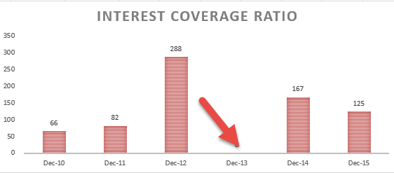

Understanding key financial ratios is essential for evaluating a company's financial health in business finance. One such critical metric is the interest coverage ratio. It is widely used in business finance and trading to assess a company’s ability to meet its interest payment obligations. This article highlights the significance of the interest coverage ratio, explaining how it is calculated and exploring its application in algorithmic trading, where financial models and algorithms guide trading decisions. Leveraging this ratio can improve assessments of a company's financial stability and inform more strategic financial decisions.

## Table of Contents



## What is Interest Coverage Ratio?

The interest coverage ratio is a key metric in assessing a company's ability to meet its interest payment obligations. This solvency ratio is calculated by dividing a company's earnings before interest and taxes (EBIT) by its interest expense over a specified period. Mathematically, the formula is expressed as:

$$
\text{Interest Coverage Ratio} = \frac{\text{EBIT}}{\text{Interest Expense}}
$$

Often referred to as the times interest earned (TIE) ratio, this figure provides insight into how comfortably a company can cover its interest obligations with its pre-tax earnings. A higher interest coverage ratio signifies a greater capacity to meet these obligations, thereby indicating a company's financial stability.

This ratio is integral in the analysis of a firm's financial health, as it reflects the firm’s ability to pay its debt interest without dipping into its core business operations. For instance, a company with an interest coverage ratio of three can cover its interest expenses three times over with its operational earnings. A robust interest coverage ratio is essential for long-term solvency and provides confidence to investors and creditors regarding the company's financial health and operational efficiency. 

High ratios may suggest strong financial health, while low ratios might indicate potential financial difficulties, as the company may struggle to service its debt. However, interpretation should be contextual, considering industry norms and specific business models.

## Formula and Calculation

The interest coverage ratio is a straightforward yet powerful metric used in assessing a company's financial solvency. To calculate this ratio, the formula used is: 

$$
\text{Interest Coverage Ratio} = \frac{\text{EBIT}}{\text{Interest Expense}}
$$

Where EBIT stands for Earnings Before Interest and Taxes, reflecting a company's operating earnings before the deductions tied to interest and taxes. EBIT is a crucial figure as it represents the profitability of a company derived purely from its operations and is unaffected by tax policies or capital structure financing costs. Meanwhile, interest expense indicates the cost incurred by the company to service its debt.

The calculated interest coverage ratio provides valuable insight into how many times a company's earnings can cover its interest obligations. A higher ratio suggests that a company can easily meet its interest payments, indicating robust financial health with respect to its debt obligations. Conversely, a low interest coverage ratio could signal potential [liquidity](/wiki/liquidity-risk-premium) problems or an excessive debt burden, prompting closer scrutiny from investors and analysts.

For example, using Python, the calculation can be illustrated as follows:

```python
def calculate_interest_coverage_ratio(ebit, interest_expense):
    try:
        ratio = ebit / interest_expense
        return ratio
    except ZeroDivisionError:
        return 'Interest Expense cannot be zero.'

# Example calculation
ebit = 500000  # EBIT in dollars
interest_expense = 100000  # Interest expense in dollars
interest_coverage_ratio = calculate_interest_coverage_ratio(ebit, interest_expense)
print(f"The Interest Coverage Ratio is: {interest_coverage_ratio}")
```

In this code snippet, the function `calculate_interest_coverage_ratio` takes EBIT and interest expense as inputs and computes the interest coverage ratio. This simple exercise is a practical demonstration of how companies and analysts might approach the initial assessment of financial solvency with regard to interest obligations.

## Significance for Business Finance

Understanding the interest coverage ratio is critical for investors, creditors, and business managers, as it serves as a barometer of a company's financial health and riskiness concerning future borrowing. The interest coverage ratio, calculated as $\text{Interest Coverage Ratio} = \frac{\text{EBIT}}{\text{Interest Expense}}$, provides insight into how comfortably a company can meet its interest obligations with its earnings before interest and taxes (EBIT). A higher ratio indicates a firm is more capable of meeting its interest payments, portraying financial stability and resilience.

For investors, a solid interest coverage ratio suggests a lower default risk, making the company a more attractive investment option. It reflects the company’s operational efficiency and ability to generate earnings, which is paramount when making decisions on equity investments. Creditors also rely heavily on this metric to determine a company's creditworthiness. A high interest coverage ratio suggests that the company is less risky for loan issuance, potentially resulting in more favorable loan terms or interest rates.

From a business management perspective, maintaining an adequate interest coverage ratio is vital for strategic planning and financial management. Companies with robust ratios are better positioned to withstand economic downturns and industry fluctuations. High ratios allow businesses to have greater financial flexibility, enabling them to pursue growth opportunities, even if these require additional borrowing.

Therefore, in business finance, the interest coverage ratio is indispensable for gauging a company’s ability to meet its debt obligations, impacting investment, lending, and management decisions across the board. Understanding this metric facilitates sound financial decision-making, promoting long-term financial health and operational excellence.

## Implications in Algorithmic Trading

Algorithmic trading is a sophisticated approach to executing trades using advanced financial models and algorithms. These systems allow traders to capitalize on opportunities within milliseconds, outperforming manual trading in speed and efficiency. An integral component of these models is the interest coverage ratio, which serves as a vital [factor](/wiki/factor-investing) in screening financially robust stocks for trade operations.

The interest coverage ratio, calculated as earnings before interest and taxes (EBIT) divided by interest expenses, provides valuable insights into a company's financial health. For [algorithmic trading](/wiki/algorithmic-trading) systems, this ratio is used to filter stocks based on financial stability and risk profile. A company with a high interest coverage ratio is generally considered less risky, as it demonstrates a strong ability to meet its interest obligations. Therefore, stocks of such companies may be prioritized in trading strategies aiming for stable returns.

In more technical terms, algorithmic trading models might incorporate the interest coverage ratio as part of a larger set of financial indicators, which could include metrics like price-to-earnings (P/E) ratio, debt-to-equity ratio, and others. These indicators collectively help in evaluating the financial strength and future potential of the stocks, thereby aiding in the construction of risk-balanced portfolios. 

For example, a Python-based algorithmic trading system might be programmed to screen stocks through the following steps:

```python
import pandas as pd

# Sample data for company financials
data = {'Company': ['Company A', 'Company B', 'Company C'],
        'EBIT': [500000, 300000, 450000],  # Earnings Before Interest and Taxes
        'Interest_Expense': [100000, 150000, 90000]}  # Interest expenses

# Create a DataFrame
df = pd.DataFrame(data)

# Calculate the Interest Coverage Ratio
df['Interest_Coverage_Ratio'] = df['EBIT'] / df['Interest_Expense']

# Filter stocks with a ratio greater than a specified threshold, e.g., 3
filtered_stocks = df[df['Interest_Coverage_Ratio'] > 3]

print(filtered_stocks)
```

In this scenario, the algorithm calculates the interest coverage ratio for each company and filters out those with a ratio greater than a specified threshold, suggesting financial robustness. By doing so, the algorithm efficiently narrows down potential investment targets to companies with fewer credit risk concerns, aligning with the risk management strategies of investors.

Overall, by incorporating the interest coverage ratio into algorithmic trading strategies, traders can enhance the selection process of stocks, ensuring that the chosen securities exhibit a healthy balance of growth potential and financial stability. This approach ultimately contributes to developing more resilient portfolios that can withstand market [volatility](/wiki/volatility-trading-strategies) while achieving desired financial outcomes.

## Examples in Real-World Scenarios

In understanding the practical application of the interest coverage ratio, consider a hypothetical scenario where a company reports earnings before interest and taxes (EBIT) of $500,000 and incurs interest expenses of $100,000 over the same period. The interest coverage ratio, calculated as EBIT divided by interest expense, is:

$$
\text{Interest Coverage Ratio} = \frac{\text{EBIT}}{\text{Interest Expense}} = \frac{500,000}{100,000} = 5
$$

This ratio of 5 indicates that the company can cover its interest expenses five times with its current earnings, suggesting strong financial health and no immediate liquidity issues regarding interest payments.

The interest coverage ratio varies across different industries due to their unique financial structures. For instance, technology companies often exhibit higher ratios. This is primarily because they tend to rely less on debt financing, thus having lower interest obligations relative to their earnings. Their revenue models, often centered around high-margin software and services, contribute to larger EBIT figures, further elevating the ratio.

In contrast, utility companies may display lower interest coverage ratios despite having stable earnings. This discrepancy often results from higher debt levels since these companies typically finance large infrastructure projects. While their revenue streams are predictable due to long-term customer contracts and regulatory frameworks, the capital-intensive nature of their operations necessitates substantial borrowing, leading to higher interest expenses in relation to their EBIT.

These examples underscore the importance of context when evaluating the interest coverage ratio. Recognizing the industry-specific financial dynamics is crucial for accurately assessing a company's ability to meet its interest commitments and its overall financial stability.

## Limitations and Considerations

The interest coverage ratio is a valuable tool for assessing a company's ability to meet its interest obligations; however, its interpretation requires careful consideration of several key factors. One of the primary limitations is that comparisons must be made within similar industries. Different industries have varying capital structures and operational dynamics, which can significantly impact the interest coverage ratio. For instance, capital-intensive industries such as utilities or telecommunications may have lower ratios due to their substantial debt levels, while technology companies might exhibit higher ratios due to lower leverage.

Another important consideration is ensuring that the interest coverage ratio calculation includes all interest obligations. Companies may sometimes exclude particular interest expenses, which can present an inaccurate picture of financial health. Analysts must scrutinize financial statements to ensure comprehensive inclusion of interest obligations, thereby ensuring the accuracy of the ratio.

Additionally, external factors can affect the interpretation of the interest coverage ratio. Cyclical revenue dips, often seen in industries that are sensitive to economic cycles, can lead to fluctuations in earnings. This, in turn, affects the interest coverage ratio. Analysts need to consider such cyclical patterns and other external economic conditions that might impact a company's earnings consistency over time. By comprehending these factors, a more accurate evaluation can be made regarding a company's financial stability and its ability to sustain interest payments in different economic conditions.

Understanding these limitations and considerations is crucial for making informed financial decisions based on the interest coverage ratio.

## Conclusion

The interest coverage ratio remains a crucial metric for assessing a company's financial health and operational efficiency. It provides valuable insights into a company’s ability to meet its interest obligations and, by extension, its overall financial stability. Whether employed for traditional financial analysis or as part of sophisticated algorithmic trading strategies, the interest coverage ratio offers a quantitative measure that can assist in evaluating corporate risk.

In the domain of business finance, a deep understanding of this ratio can offer investors and creditors the assurance needed to make informed decisions regarding lending and investment. Companies boasting higher ratios are typically seen as less risky, impacting perceptions of creditworthiness positively. For algorithmic trading, the ratio serves as an essential tool within financial models, aiding in the construction of risk-averse and balanced investment portfolios. By offering a quantifiable measure of financial robustness, it allows algorithms to screen for financially sound stocks, thereby enabling quicker and more informed trade executions.

Overall, effective analysis and application of the interest coverage ratio can help individuals and businesses navigate complex financial landscapes. By consistently monitoring this ratio, stakeholders can maintain a clear perspective on financial obligations and operating efficiency, leading to better decision-making in both investment and lending contexts.

## References & Further Reading

[1]: ["Financial Ratios for Executives: How to Assess Company Strength, Fix Problems, and Make Better Decisions"](https://link.springer.com/book/10.1007/978-1-4842-0731-4) by Michael Rist

[2]: ["Analysis for Financial Management"](https://www.mheducation.com/highered/product/analysis-financial-management-higgins-koski/M9781260772364.html) by Robert C. Higgins

[3]: Penman, S. H. (2013). ["Financial Statement Analysis and Security Valuation"](https://www.mheducation.com/highered/product/financial-statement-analysis-security-valuation-penman/M9780078025310.html). McGraw-Hill Education.

[4]: Damodaran, A. (2012). ["Investment Valuation: Tools and Techniques for Determining the Value of Any Asset."](https://books.google.com/books/about/Investment_Valuation.html?id=5SRHAAAAQBAJ) Wiley Finance. 

[5]: ["Principles of Corporate Finance"](https://www.mheducation.com/highered/product/principles-corporate-finance-brealey-myers/M9781264080946.html) by Richard A. Brealey, Stewart C. Myers, and Franklin Allen