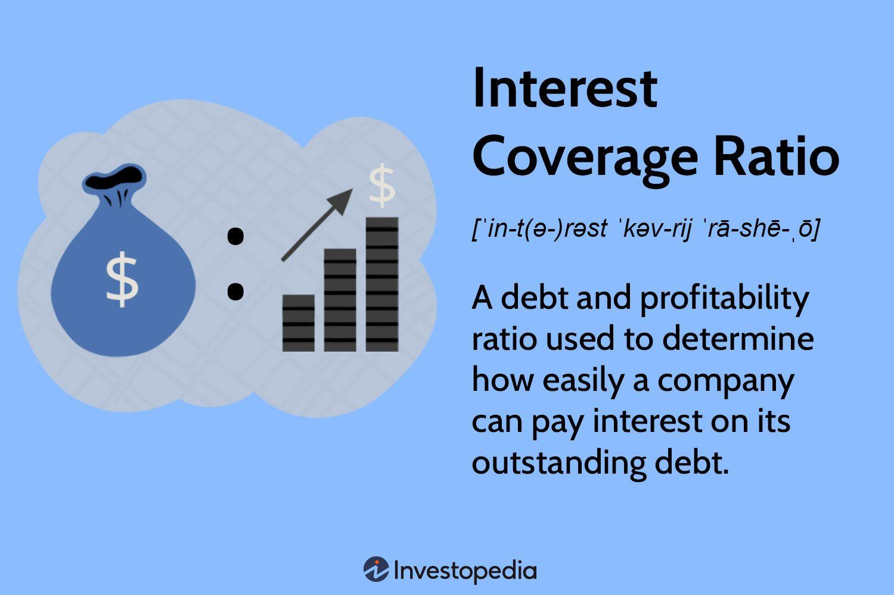

## Table of Contents

## What are interest expenses?

Interest expenses are the costs that a person or a business has to pay for borrowing money. When you take out a loan or use a credit card, the lender charges you interest as a fee for letting you use their money. This interest is what you have to pay back on top of the amount you borrowed. For example, if you borrow $1,000 at an interest rate of 5% per year, you will have to pay $50 in interest expenses at the end of the year.

These expenses can be found on a company's income statement, which is a financial document that shows how much money the company made and spent during a certain period. For businesses, interest expenses are important because they affect the company's profits. If a company has a lot of debt, it will have high interest expenses, which can reduce the amount of money it makes. It's important for businesses to manage their interest expenses carefully to stay financially healthy.

## How are interest expenses calculated?

Interest expenses are calculated based on the amount of money you borrow and the interest rate you have to pay. The interest rate is usually given as a percentage, like 5% or 10%. To find out how much interest you owe, you multiply the amount you borrowed by the interest rate. For example, if you borrow $1,000 at a 5% interest rate, you multiply $1,000 by 0.05 to get $50. This $50 is your interest expense for that period.

Sometimes, interest is calculated over different time periods, like monthly or annually. If the [interest rate](/wiki/interest-rate-trading-strategies) is annual, you pay the full interest amount once a year. But if it's monthly, you divide the annual rate by 12 and pay a smaller amount each month. For example, with a $1,000 loan at a 5% annual rate, the monthly interest rate would be 0.05 divided by 12, which is about 0.00417. So, each month, you would pay $1,000 times 0.00417, which comes out to about $4.17. This way, over the year, you still end up paying the full $50 in interest.

## Why are interest expenses important for businesses?

Interest expenses are important for businesses because they affect how much money the company has left after paying its bills. When a business borrows money, it has to pay back not just the amount it borrowed but also the interest on that loan. This interest is an expense that comes out of the company's profits. If a business has a lot of debt, it will have high interest expenses, which can make it harder for the company to make money. Managing these expenses well is key to keeping the business financially healthy.

Also, interest expenses can tell us a lot about a company's financial health. If a business is spending a lot on interest, it might mean that it's relying too much on borrowed money. This can be risky because if the business can't pay back its loans, it could get into big trouble. By keeping an eye on interest expenses, business owners and investors can see if the company is using its money wisely and if it's in a good position to grow and succeed in the future.

## What is the interest coverage ratio?

The interest coverage ratio is a number that tells you how easily a company can pay the interest on its loans. It's calculated by dividing a company's earnings before interest and taxes (EBIT) by its interest expenses. If the ratio is high, it means the company is making enough money to pay its interest easily. If it's low, the company might have trouble paying its interest, which could be a sign of financial trouble.

This ratio is important because it helps investors and business owners see if a company is using its money wisely. A good interest coverage ratio shows that a company isn't relying too much on borrowed money. It's a way to check if the business is strong enough to handle its debts and keep growing. If the ratio is too low, it might mean the company needs to borrow less or find ways to make more money to stay healthy.

## How do you calculate the interest coverage ratio?

The interest coverage ratio is a way to see if a company can easily pay the interest on its loans. You find this ratio by dividing the company's earnings before interest and taxes (EBIT) by its interest expenses. For example, if a company makes $100,000 before paying interest and taxes and has to pay $20,000 in interest, you divide $100,000 by $20,000. This gives you an interest coverage ratio of 5, which means the company's earnings are five times its interest expenses.

This ratio is important because it helps people understand if a company is using its money wisely. A high ratio means the company is making enough money to pay its interest easily, which is a good sign. A low ratio could mean the company might have trouble paying its interest, which could be a sign of financial trouble. By looking at this ratio, investors and business owners can see if the company is strong enough to handle its debts and keep growing.

## What does the interest coverage ratio indicate about a company's financial health?

The interest coverage ratio tells us how well a company can pay the interest on its loans. It's like checking if a person can easily pay their monthly credit card bill. If the ratio is high, it means the company is making enough money to cover its interest payments without any trouble. This is a good sign because it shows the company isn't relying too much on borrowed money and is financially strong.

If the interest coverage ratio is low, it might mean the company is struggling to pay its interest. This can be a warning sign that the company might be in financial trouble. A low ratio could mean the company needs to borrow less or find ways to make more money to stay healthy. By looking at this ratio, investors and business owners can see if the company is managing its debts well and has a good chance of growing and succeeding in the future.

## What is considered a good interest coverage ratio?

A good interest coverage ratio is usually above 1.5 or 2. This means the company's earnings are at least one and a half or two times its interest expenses. When a company has a ratio this high, it shows it can easily pay the interest on its loans without any trouble. This is important because it means the company isn't relying too much on borrowed money and is financially strong.

If the interest coverage ratio is below 1.5, it might be a warning sign. A ratio lower than 1 means the company isn't making enough money to cover its interest payments, which can be a big problem. A low ratio could mean the company needs to borrow less or find ways to make more money to stay healthy. By looking at this ratio, investors and business owners can see if the company is managing its debts well and has a good chance of growing and succeeding in the future.

## How can a low interest coverage ratio affect a company's operations?

A low interest coverage ratio can make it hard for a company to run smoothly. When the ratio is low, it means the company is not making enough money to pay the interest on its loans easily. This can lead to cash flow problems, where the company struggles to have enough money to pay its bills and keep things running. If the company can't pay its interest on time, it might have to borrow even more money, which can make the problem worse.

If a company keeps having a low interest coverage ratio, it might have to make big changes to its operations. It might need to cut back on spending, which could mean laying off workers or stopping some projects. This can slow down the company's growth and make it harder to compete with other businesses. In the worst case, if the company can't fix its financial problems, it might even go bankrupt.

## What are the differences between interest expenses and principal payments?

Interest expenses and principal payments are two different parts of paying back a loan. Interest expenses are the extra money you have to pay for borrowing. When you take out a loan, the lender charges you interest as a fee for letting you use their money. This interest is what you have to pay on top of the amount you borrowed. For example, if you borrow $1,000 at a 5% interest rate, you will have to pay $50 in interest at the end of the year.

Principal payments, on the other hand, are the payments you make to pay back the actual amount of money you borrowed. If you borrowed $1,000, the principal is that $1,000. When you make principal payments, you're slowly paying back the original loan amount. Over time, as you pay down the principal, the total amount you owe goes down. Both interest expenses and principal payments are important, but they serve different purposes in managing your debt.

## How do changes in interest rates impact interest expenses and the coverage ratio?

When interest rates go up, the cost of borrowing money also goes up. This means that a company's interest expenses will be higher because it has to pay more interest on its loans. For example, if a company has a loan with a variable interest rate, and the rate goes from 5% to 6%, the interest expense on that loan will increase. This can make it harder for the company to pay its bills and might eat into its profits.

A change in interest rates can also affect the interest coverage ratio. If interest rates go up, the company's interest expenses will increase, which can make the interest coverage ratio go down. This is because the ratio is calculated by dividing the company's earnings before interest and taxes by its interest expenses. If the interest expenses get bigger but the earnings stay the same, the ratio will be smaller. A lower interest coverage ratio can make investors and business owners worry about the company's ability to handle its debts.

## What strategies can a company use to manage high interest expenses?

When a company has high interest expenses, it can start by trying to pay off its loans faster. By paying down the principal amount of the loans, the company will have less debt to pay interest on. This can help lower the interest expenses over time. Another way is to look for loans with lower interest rates. Sometimes, a company can refinance its debt, which means it takes out a new loan with a lower rate to pay off the old one. This can save money on interest and make the company's financial situation better.

Another strategy is to increase the company's earnings. If the company can make more money, it will have more cash to pay its interest expenses. This can be done by growing the business, finding new customers, or cutting costs in other areas. By making more money, the company can improve its interest coverage ratio, which shows that it can handle its debts better. Keeping a close eye on the company's finances and making smart decisions about borrowing and spending can help manage high interest expenses and keep the business healthy.

## How do different industries typically compare in terms of interest coverage ratios?

Different industries have different interest coverage ratios because they have different ways of making money and borrowing. For example, industries like utilities and telecoms usually have high interest coverage ratios. These businesses need a lot of money to build things like power plants or cell towers, so they often borrow a lot. But they also make steady money over time, which helps them pay their interest easily. So, their interest coverage ratios are usually high, which means they can handle their debts well.

On the other hand, industries like retail or restaurants might have lower interest coverage ratios. These businesses can have ups and downs in how much money they make, which can make it harder to pay their interest. They might not have as much steady income to rely on, so if they have a lot of debt, their interest coverage ratios can be lower. This means they might have a harder time managing their debts compared to industries with more stable earnings.

## What is the importance of understanding financial metrics and coverage ratios?

Financial metrics are essential tools used to evaluate a company's financial condition and its capacity to meet financial obligations. These metrics provide crucial insights into various aspects of a business, such as profitability, efficiency, [liquidity](/wiki/liquidity-risk-premium), and solvency. Among the different categories of financial metrics, coverage ratios hold a significant position, particularly in credit analysis, as they indicate a company’s ability to meet its debt commitments.

Coverage ratios are pivotal for assessing a company's financial health, particularly its ability to cover interest obligations and other fixed costs using its earnings or cash flows. The Interest Coverage Ratio (ICR) is one of the most prominent metrics in this category. It measures the ease with which a company can pay interest on its outstanding debt. The formula for calculating ICR is as follows:

$$
\text{Interest Coverage Ratio (ICR)} = \frac{\text{Earnings Before Interest and Taxes (EBIT)}}{\text{Interest Expenses}}
$$

The numerator, Earnings Before Interest and Taxes (EBIT), represents a company's profit that can be used to meet interest obligations. A higher ICR suggests a greater ability to fulfill interest obligations from the company's earnings, indicating lower risk for creditors and a more financially stable company in terms of debt servicing.

Coverage ratios, including ICR, are particularly useful in assessing a company’s creditworthiness and determining risk levels. A deeper understanding of these metrics allows investors and analysts to evaluate the financial strength of a company, making them essential for informed investment decisions. The analysis of coverage ratios provides insights not only into the current financial health of a company but also into its resilience in facing future financial challenges.

Investors often look for a balance between risk and return, and coverage ratios help in identifying this balance by providing a clear picture of the company's ability to sustain its financial operations without stressing its cash flows. Companies with high coverage ratios are generally viewed as safer investment bets since they have a robust capacity to meet their short-term and long-term debt obligations.

In conclusion, understanding and applying financial metrics like the Interest Coverage Ratio is crucial for investors aiming to determine the creditworthiness and risk profile of a company. These metrics serve as a foundation for making more strategic and informed financial decisions, crucial for credit analysis and investment strategy formulation.

## What is the role of interest expenses in financial analysis?

Interest expenses arise when a company borrows funds and are pivotal in assessing its profitability. As a fundamental component of financial statements, they influence both operational and financial outcomes by highlighting the cost burden associated with debt. The Income Statement typically lists interest expenses, which directly subtract from operating earnings before interest and taxes (EBIT), impacting the net income.

To understand the financial implications of interest expenses, investors evaluate the company's ability to manage debt costs and its impact on earnings. A high interest expense relative to earnings suggests significant debt, potentially hindering a company’s ability to generate profit and invest in growth opportunities. On the contrary, a manageable interest expense indicates more efficient debt management and operational performance, enabling companies to leverage debt for strategic growth without compromising financial stability.

Quantitatively, the Interest Coverage Ratio (ICR) is often employed to gauge how comfortably a company can meet its interest obligations. It is calculated as:

$$
\text{Interest Coverage Ratio (ICR)} = \frac{\text{EBIT}}{\text{Interest Expenses}}
$$

A higher ICR denotes a greater ability to cover interest obligations from operating earnings, signaling stronger financial health. Conversely, a lower ICR raises concerns about potential financial distress and risk of default, as the company may struggle to pay interest expenses with its current earnings.

Evaluating interest expenses further helps investors understand the cost-effectiveness of a company's borrowing strategy. The cost of debt is crucial for determining whether a company’s leverage is enhancing or eroding shareholder value. Companies with high-interest rates relative to industry standards may need to renegotiate terms or refinance to reduce their debt load and minimize financial strain.

In summary, analyzing interest expenses is essential for understanding the comprehensive financial health of a company. By assessing these expenses, investors can infer a company’s potential for sustainable growth, identify risks associated with its capital structure, and make informed decisions about its creditworthiness and investment prospects.

## How can coverage ratios be incorporated into algorithmic trading?

Algorithmic trading has revolutionized the investment landscape by automating trade execution based on predefined criteria, thereby increasing both efficiency and accuracy. The integration of financial metrics like the Interest Coverage Ratio (ICR) into these algorithms represents a significant advancement in systematically assessing companies' financial health. This incorporation allows algorithms to evaluate and select stocks that demonstrate the capability to cover their interest obligations, which is a key determinant of financial robustness.

The Interest Coverage Ratio, calculated as:

$$
\text{Interest Coverage Ratio (ICR)} = \frac{\text{Earnings Before Interest and Taxes (EBIT)}}{\text{Interest Expenses}}
$$

provides insight into how comfortably a company can meet its interest payments from operational earnings. By inserting this metric into trading algorithms, investors can design models that favor companies with higher ratios, indicating greater financial stability and a lower likelihood of distress. This systematic selection aligns investments with sound financial health, reducing risk exposure.

Incorporating ICR into trading algorithms can be facilitated using programming languages like Python, which is widely used in finance for its powerful libraries. For example, Python's pandas and numpy libraries can be employed to calculate financial ratios, while libraries like [backtrader](/wiki/backtrader) or zipline can be used for [backtesting](/wiki/backtesting) trading strategies.

```python
import pandas as pd
import numpy as np

# Assume `data` is a DataFrame containing financial data
# with columns 'ebit' and 'interest_expense'

data['ICR'] = data['ebit'] / data['interest_expense']

# Define a strategy that selects stocks with ICR > 3
selected_stocks = data[data['ICR'] > 3]

# Assuming `trade` is a function that executes trades 
for stock in selected_stocks:
    trade(stock)
```

In the trading strategy example above, the algorithm prioritizes stocks with an ICR greater than three, suggesting these companies are well-positioned to cover interest with their earnings threefold. This scrutiny not only targets financially robust companies but also aligns with strategic investments that are more likely to withstand economic fluctuations.

Embedding coverage ratios like ICR in algorithmic models provides traders with a quantifiable method to gauge financial soundness, making the decision-making process more robust. However, market dynamics can change rapidly, and algorithms must adapt to reflect these changes. Continuous updates and recalibrations ensure that the coverage-based strategies remain relevant and effective.

In conclusion, integrating coverage ratios into [algorithmic trading](/wiki/algorithmic-trading) frameworks facilitates a deeper understanding of a company's financial health. This practice not only enhances strategic decision-making but also fortifies financial risk management, positioning traders and investors advantageously in ever-evolving markets.

## What are the benefits and challenges of using ICR in algo trading?

Utilizing the Interest Coverage Ratio (ICR) in algorithmic trading presents several benefits and challenges. A primary advantage is the ability to objectively evaluate a company's financial stability. The ICR, calculated as:

$$
\text{ICR} = \frac{\text{Earnings Before Interest and Taxes (EBIT)}}{\text{Interest Expenses}}
$$

provides quantifiable insight into a company's capacity to meet its debt obligations. A higher ICR indicates better financial health, which is crucial for algorithmic traders who prioritize investments based on a company’s ability to sustain its debt payments. By focusing on companies with a robust ICR, trading algorithms can enhance decision-making processes, potentially leading to better selection of financially sound investments.

Despite these advantages, incorporating ICR into trading algorithms is not without challenges. Market conditions are inherently dynamic; interest rates fluctuate, and economic events can alter a company's earnings, impacting the ICR. Algorithms must be adaptable to changing environments, thus requiring continual updates and refinements. Furthermore, accurate data handling and real-time analysis are essential to ensure that ICR calculations remain relevant to the immediate trading context.

To overcome these challenges, traders can implement several strategies. Adaptive algorithms that incorporate [machine learning](/wiki/machine-learning) techniques can be developed to adjust to new data patterns and economic conditions, ensuring the continued relevancy of ICR evaluations. For example, Python's libraries such as scikit-learn can be used to build predictive models that dynamically recalibrate ICR thresholds in response to market shifts. Additionally, integrating real-time data feeds can help keep the algorithms informed and minimize latency in decision making.

By leveraging cutting-edge technology alongside traditional financial metrics, traders can refine their algorithmic strategies to not only prioritize financially stable companies but also to remain agile and responsive to the evolving market landscape. This approach enhances the overall effectiveness of algorithmic trading systems, providing a significant competitive edge in capital markets.

## What is the conclusion?

The integration of financial metrics like the Interest Coverage Ratio (ICR) into trading strategies offers a significant competitive advantage in contemporary financial markets. Utilizing these metrics facilitates more informed investment decisions, as they provide crucial insights into a company's ability to manage its debt obligations. This analytic approach assists traders and investors in assessing financial stability, thus enabling effective risk management.

Leveraging reliable financial analysis tools is essential for enhancing trading strategies, particularly in navigating complex financial landscapes. By incorporating comprehensive financial metrics, traders can systematically evaluate the investment worthiness of different companies. For example, the ICR is calculated as follows:

$$
\text{Interest Coverage Ratio} = \frac{\text{Earnings Before Interest and Taxes (EBIT)}}{\text{Interest Expenses}}
$$

This ratio provides a straightforward measure of a company’s financial health, indicating how easily it can cover its interest obligations. Higher ratios suggest better financial stability, making companies more attractive for investments.

In conclusion, balancing financial metrics with technology is vital for fostering adaptable and successful trading strategies. The integration of analytical tools and algorithms enables traders to respond dynamically to market changes, enhancing their ability to make strategic trading decisions. Adapting to market conditions with such informed approaches amplifies the potential for successful investments, reinforcing the importance of combining sound financial analysis with technological advancements in trading.

## References & Further Reading

[1]: ["Financial Statement Analysis and Security Valuation"](https://www.mheducation.com/highered/product/Financial-Statement-Analysis-and-Security-Valuation-Penman.html) by Stephen H. Penman

[2]: ["Investment Valuation: Tools and Techniques for Determining the Value of Any Asset"](https://www.amazon.com/Investment-Valuation-Tools-Techniques-Determining/dp/111801152X) by Aswath Damodaran

[3]: ["Algorithmic Trading and DMA: An introduction to direct access trading strategies"](https://archive.org/details/algorithmictradi0000john) by Barry Johnson

[4]: ["Risk Management and Financial Institutions"](https://www.simonfoucher.com/MBA/FINA%20695%20-%20Risk%20Management/riskmanagementandfinancialinstitutions4theditionjohnhull-150518225205-lva1-app6892.pdf) by John C. Hull

[5]: ["Python for Finance: Analyze Big Financial Data"](https://books.google.com/books/about/Python_for_Finance.html?id=E93SBQAAQBAJ) by Yves Hilpisch