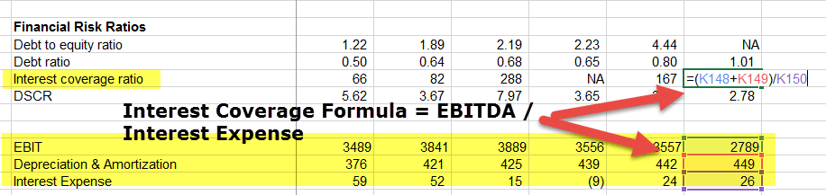

In today's complex financial markets, the ability to interpret key financial metrics is essential for investors and traders seeking to make informed decisions. Financial metrics such as coverage ratios and interest expenses are fundamental tools for evaluating a company's fiscal health and its capacity to meet debt obligations. This article examines these critical concepts, emphasizing their relevance in algorithmic trading strategies.

Understanding financial metrics is pivotal for assessing a company's creditworthiness, helping investors determine the level of risk associated with their investments. Coverage ratios, in particular, serve as indicators of a company's financial stability, signaling its ability to manage debt commitments efficiently. The Interest Coverage Ratio (ICR) stands out as a vital metric, providing insights into how comfortably a company can pay interest on outstanding debt. This ratio is calculated using the formula:



$$
\text{Interest Coverage Ratio (ICR)} = \frac{\text{Earnings Before Interest and Taxes (EBIT)}}{\text{Interest Expense}}
$$

where EBIT represents the company's operating profit before interest and tax obligations are deducted.

Interest expenses, reflecting the costs incurred from borrowing, substantially influence a company's profit margins. These expenses are a fundamental component of financial statements, impacting both operational and financial performance. A clear understanding of interest expenses allows investors to gauge the financial burden a company faces due to its debt levels.

Furthermore, the integration of these metrics into algorithmic trading—where trading decisions are executed by computer algorithms based on quantitative models—opens new avenues for systematic investment analysis. By incorporating metrics such as the Interest Coverage Ratio into trading algorithms, investors can more effectively assess financial health and target investments in financially robust companies. This approach not only facilitates enhanced trading strategies but also augments risk management capabilities.

In conclusion, mastering financial metrics like coverage ratios and interest expenses equips investors with essential insights for analyzing financial stability. The thoughtful integration of these concepts into trading strategies fosters informed investment decisions, offering a competitive advantage in navigating today's intricate financial environments.

## Table of Contents

## Understanding Financial Metrics and Coverage Ratios

Financial metrics are essential tools used to evaluate a company's financial condition and its capacity to meet financial obligations. These metrics provide crucial insights into various aspects of a business, such as profitability, efficiency, [liquidity](/wiki/liquidity-risk-premium), and solvency. Among the different categories of financial metrics, coverage ratios hold a significant position, particularly in credit analysis, as they indicate a company’s ability to meet its debt commitments.

Coverage ratios are pivotal for assessing a company's financial health, particularly its ability to cover interest obligations and other fixed costs using its earnings or cash flows. The Interest Coverage Ratio (ICR) is one of the most prominent metrics in this category. It measures the ease with which a company can pay interest on its outstanding debt. The formula for calculating ICR is as follows:

$$
\text{Interest Coverage Ratio (ICR)} = \frac{\text{Earnings Before Interest and Taxes (EBIT)}}{\text{Interest Expenses}}
$$

The numerator, Earnings Before Interest and Taxes (EBIT), represents a company's profit that can be used to meet interest obligations. A higher ICR suggests a greater ability to fulfill interest obligations from the company's earnings, indicating lower risk for creditors and a more financially stable company in terms of debt servicing.

Coverage ratios, including ICR, are particularly useful in assessing a company’s creditworthiness and determining risk levels. A deeper understanding of these metrics allows investors and analysts to evaluate the financial strength of a company, making them essential for informed investment decisions. The analysis of coverage ratios provides insights not only into the current financial health of a company but also into its resilience in facing future financial challenges.

Investors often look for a balance between risk and return, and coverage ratios help in identifying this balance by providing a clear picture of the company's ability to sustain its financial operations without stressing its cash flows. Companies with high coverage ratios are generally viewed as safer investment bets since they have a robust capacity to meet their short-term and long-term debt obligations.

In conclusion, understanding and applying financial metrics like the Interest Coverage Ratio is crucial for investors aiming to determine the creditworthiness and risk profile of a company. These metrics serve as a foundation for making more strategic and informed financial decisions, crucial for credit analysis and investment strategy formulation.

## The Role of Interest Expenses in Financial Analysis

Interest expenses arise when a company borrows funds and are pivotal in assessing its profitability. As a fundamental component of financial statements, they influence both operational and financial outcomes by highlighting the cost burden associated with debt. The Income Statement typically lists interest expenses, which directly subtract from operating earnings before interest and taxes (EBIT), impacting the net income.

To understand the financial implications of interest expenses, investors evaluate the company's ability to manage debt costs and its impact on earnings. A high interest expense relative to earnings suggests significant debt, potentially hindering a company’s ability to generate profit and invest in growth opportunities. On the contrary, a manageable interest expense indicates more efficient debt management and operational performance, enabling companies to leverage debt for strategic growth without compromising financial stability.

Quantitatively, the Interest Coverage Ratio (ICR) is often employed to gauge how comfortably a company can meet its interest obligations. It is calculated as:

$$
\text{Interest Coverage Ratio (ICR)} = \frac{\text{EBIT}}{\text{Interest Expenses}}
$$

A higher ICR denotes a greater ability to cover interest obligations from operating earnings, signaling stronger financial health. Conversely, a lower ICR raises concerns about potential financial distress and risk of default, as the company may struggle to pay interest expenses with its current earnings.

Evaluating interest expenses further helps investors understand the cost-effectiveness of a company's borrowing strategy. The cost of debt is crucial for determining whether a company’s leverage is enhancing or eroding shareholder value. Companies with high-interest rates relative to industry standards may need to renegotiate terms or refinance to reduce their debt load and minimize financial strain.

In summary, analyzing interest expenses is essential for understanding the comprehensive financial health of a company. By assessing these expenses, investors can infer a company’s potential for sustainable growth, identify risks associated with its capital structure, and make informed decisions about its creditworthiness and investment prospects.

## Incorporating Coverage Ratios in Algorithmic Trading

Algorithmic trading has revolutionized the investment landscape by automating trade execution based on predefined criteria, thereby increasing both efficiency and accuracy. The integration of financial metrics like the Interest Coverage Ratio (ICR) into these algorithms represents a significant advancement in systematically assessing companies' financial health. This incorporation allows algorithms to evaluate and select stocks that demonstrate the capability to cover their interest obligations, which is a key determinant of financial robustness.

The Interest Coverage Ratio, calculated as:

$$
\text{Interest Coverage Ratio (ICR)} = \frac{\text{Earnings Before Interest and Taxes (EBIT)}}{\text{Interest Expenses}}
$$

provides insight into how comfortably a company can meet its interest payments from operational earnings. By inserting this metric into trading algorithms, investors can design models that favor companies with higher ratios, indicating greater financial stability and a lower likelihood of distress. This systematic selection aligns investments with sound financial health, reducing risk exposure.

Incorporating ICR into trading algorithms can be facilitated using programming languages like Python, which is widely used in finance for its powerful libraries. For example, Python's pandas and numpy libraries can be employed to calculate financial ratios, while libraries like [backtrader](/wiki/backtrader) or zipline can be used for [backtesting](/wiki/backtesting) trading strategies.

```python
import pandas as pd
import numpy as np

# Assume `data` is a DataFrame containing financial data
# with columns 'ebit' and 'interest_expense'

data['ICR'] = data['ebit'] / data['interest_expense']

# Define a strategy that selects stocks with ICR > 3
selected_stocks = data[data['ICR'] > 3]

# Assuming `trade` is a function that executes trades 
for stock in selected_stocks:
    trade(stock)
```

In the trading strategy example above, the algorithm prioritizes stocks with an ICR greater than three, suggesting these companies are well-positioned to cover interest with their earnings threefold. This scrutiny not only targets financially robust companies but also aligns with strategic investments that are more likely to withstand economic fluctuations.

Embedding coverage ratios like ICR in algorithmic models provides traders with a quantifiable method to gauge financial soundness, making the decision-making process more robust. However, market dynamics can change rapidly, and algorithms must adapt to reflect these changes. Continuous updates and recalibrations ensure that the coverage-based strategies remain relevant and effective.

In conclusion, integrating coverage ratios into [algorithmic trading](/wiki/algorithmic-trading) frameworks facilitates a deeper understanding of a company's financial health. This practice not only enhances strategic decision-making but also fortifies financial risk management, positioning traders and investors advantageously in ever-evolving markets.

## Benefits and Challenges of Using ICR in Algo Trading

Utilizing the Interest Coverage Ratio (ICR) in algorithmic trading presents several benefits and challenges. A primary advantage is the ability to objectively evaluate a company's financial stability. The ICR, calculated as:

$$
\text{ICR} = \frac{\text{Earnings Before Interest and Taxes (EBIT)}}{\text{Interest Expenses}}
$$

provides quantifiable insight into a company's capacity to meet its debt obligations. A higher ICR indicates better financial health, which is crucial for algorithmic traders who prioritize investments based on a company’s ability to sustain its debt payments. By focusing on companies with a robust ICR, trading algorithms can enhance decision-making processes, potentially leading to better selection of financially sound investments.

Despite these advantages, incorporating ICR into trading algorithms is not without challenges. Market conditions are inherently dynamic; interest rates fluctuate, and economic events can alter a company's earnings, impacting the ICR. Algorithms must be adaptable to changing environments, thus requiring continual updates and refinements. Furthermore, accurate data handling and real-time analysis are essential to ensure that ICR calculations remain relevant to the immediate trading context.

To overcome these challenges, traders can implement several strategies. Adaptive algorithms that incorporate [machine learning](/wiki/machine-learning) techniques can be developed to adjust to new data patterns and economic conditions, ensuring the continued relevancy of ICR evaluations. For example, Python's libraries such as scikit-learn can be used to build predictive models that dynamically recalibrate ICR thresholds in response to market shifts. Additionally, integrating real-time data feeds can help keep the algorithms informed and minimize latency in decision making.

By leveraging cutting-edge technology alongside traditional financial metrics, traders can refine their algorithmic strategies to not only prioritize financially stable companies but also to remain agile and responsive to the evolving market landscape. This approach enhances the overall effectiveness of algorithmic trading systems, providing a significant competitive edge in capital markets.

## Conclusion

The integration of financial metrics like the Interest Coverage Ratio (ICR) into trading strategies offers a significant competitive advantage in contemporary financial markets. Utilizing these metrics facilitates more informed investment decisions, as they provide crucial insights into a company's ability to manage its debt obligations. This analytic approach assists traders and investors in assessing financial stability, thus enabling effective risk management.

Leveraging reliable financial analysis tools is essential for enhancing trading strategies, particularly in navigating complex financial landscapes. By incorporating comprehensive financial metrics, traders can systematically evaluate the investment worthiness of different companies. For example, the ICR is calculated as follows:

$$
\text{Interest Coverage Ratio} = \frac{\text{Earnings Before Interest and Taxes (EBIT)}}{\text{Interest Expenses}}
$$

This ratio provides a straightforward measure of a company’s financial health, indicating how easily it can cover its interest obligations. Higher ratios suggest better financial stability, making companies more attractive for investments.

In conclusion, balancing financial metrics with technology is vital for fostering adaptable and successful trading strategies. The integration of analytical tools and algorithms enables traders to respond dynamically to market changes, enhancing their ability to make strategic trading decisions. Adapting to market conditions with such informed approaches amplifies the potential for successful investments, reinforcing the importance of combining sound financial analysis with technological advancements in trading.

## References & Further Reading

[1]: ["Financial Statement Analysis and Security Valuation"](https://www.mheducation.com/highered/product/Financial-Statement-Analysis-and-Security-Valuation-Penman.html) by Stephen H. Penman

[2]: ["Investment Valuation: Tools and Techniques for Determining the Value of Any Asset"](https://www.amazon.com/Investment-Valuation-Tools-Techniques-Determining/dp/111801152X) by Aswath Damodaran

[3]: ["Algorithmic Trading and DMA: An introduction to direct access trading strategies"](https://archive.org/details/algorithmictradi0000john) by Barry Johnson

[4]: ["Risk Management and Financial Institutions"](https://www.simonfoucher.com/MBA/FINA%20695%20-%20Risk%20Management/riskmanagementandfinancialinstitutions4theditionjohnhull-150518225205-lva1-app6892.pdf) by John C. Hull

[5]: ["Python for Finance: Analyze Big Financial Data"](https://books.google.com/books/about/Python_for_Finance.html?id=E93SBQAAQBAJ) by Yves Hilpisch