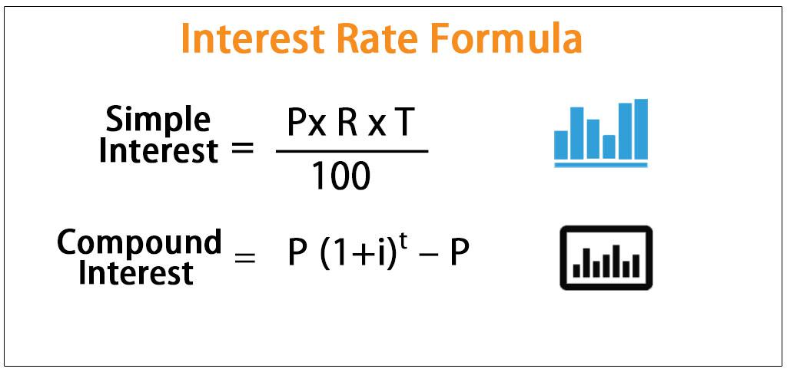

Understanding financial calculations is pivotal for managing personal finances and devising effective investment strategies. One of the core financial concepts that individuals and investors should thoroughly grasp is compound interest. Unlike simple interest, compound interest accumulates on both the initial principal and the interest accrued from previous periods, leading to exponential growth over time. This principle is fundamentally transformative in how investments can grow when left to compound over extended durations.

Compound interest is not only a tool for savings accounts and long-term investment growth but also plays a crucial role in algorithmic trading, commonly referred to as algo trading. Algo trading utilizes complex algorithms and mathematical models to execute trades at speeds and frequencies impractical for human traders. By integrating compound interest calculations, these algorithms can optimize reinvestment strategies to maximize potential returns in a controlled manner.



The intersection of compound interest and algo trading presents significant opportunities for enhancing investment portfolios. When combined, these concepts can amplify the growth of investments, efficiently manage risks, and adapt to market changes swiftly. While compound interest can exponentially increase an asset's value over time, algo trading can leverage such growth in real-time financial markets.

Understanding how to apply compound interest within algo trading frameworks is vital for traders aiming to optimize their strategies. Moreover, comprehending both concepts empowers investors—from individuals managing personal portfolios to institutional traders—to achieve more substantial financial growth and sustainability. As we explore these topics, the potential for enriching one's financial acumen and investment tactics becomes apparent, empowering both novice and seasoned investors alike.

## Table of Contents

## What is Compound Interest?

Compound interest is a financial concept where interest is calculated on the initial principal and also on the accumulated interest from previous periods. This contrasts with simple interest, which is computed solely on the principal amount. The result of compounding is exponential growth over time, which can significantly enhance the value of an investment or increase the cost of a debt.

To illustrate, if you deposit an initial principal amount in a savings account or a financial instrument that offers compound interest, the interest earned in the initial period is added to the principal. Then, in the succeeding periods, interest is earned on the new total, which includes both the original principal and the accumulated interest. This process of [earning](/wiki/earning-announcement) "interest on interest" accelerates the growth of the initial investment.

The mathematical expression for compound interest is given by:

$$

FV = PV \times \left(1 + \frac{i}{n}\right)^{nt} 
$$

where:
- $FV$ is the future value of the investment,
- $PV$ is the present value or initial principal,
- $i$ is the annual interest rate (expressed as a decimal),
- $n$ is the number of compounding periods per year,
- $t$ is the time in years.

A higher number of compounding periods ($n$) results in more frequent application of interest on the accumulated amount, leading to a greater future value. This is why, for instance, quarterly compounding results in higher returns than annual compounding, assuming other factors remain constant.

Compound interest plays a crucial role in personal finance, as it can significantly increase savings or investment returns over time. Understanding this concept is essential for making informed financial decisions, whether saving for retirement, paying off loans, or investing in various assets.

## Examples of Compound Interest

Consider a $1,000 investment at an annual [interest rate](/wiki/interest-rate-trading-strategies) of 5%, compounded annually. Over time, the effects of compounding become evident. For instance, after 5 years, this investment would grow to approximately $1,276.28. This calculation is derived using the formula for compound interest:

$$
\text{FV} = \text{PV} \times (1 + i)^t
$$

where:
- $\text{FV}$ is the future value of the investment,
- $\text{PV}$ is the principal amount, which is $1,000,
- $i$ is the annual interest rate, 0.05 in this case,
- $t$ is the number of years the money is invested, which is 5.

In contrast, using simple interest, the calculation is straightforward. The formula for simple interest is:

$$
\text{Simple Interest} = \text{PV} \times i \times t
$$

The future value with simple interest would be the original principal plus the interest earned:

$$
\text{FV} = \text{PV} + \text{Simple Interest} \]  
$$
\text{FV} = \$1,000 + (\$1,000 \times 0.05 \times 5) = \$1,250
$$

This comparison highlights the advantage of compound interest, which accounts for the interest-on-interest effect, leading to a higher accumulated amount after the same period.

Continuous compounding further amplifies the growth potential. It uses the formula:

$$
\text{FV} = \text{PV} \times e^{(i \times t)}
$$

Here, $e$ is the base of the natural logarithm, approximately equal to 2.71828. Applying continuous compounding to the $1,000 investment yields:

$$
\text{FV} = \$1,000 \times e^{(0.05 \times 5)} \approx \$1,283.68
$$

This shows that more frequent compounding, as achieved in continuous compounding, results in a slightly higher future value. The difference demonstrates the power of frequent compounding periods to maximize investment growth.

## Calculating Compound Interest

Calculating compound interest involves understanding how the interest accrues on both the initial principal and the interest that has been added to it over time. The general formula for compound interest is given by:

$$
FV = PV \times \left(1 + \frac{i}{n}\right)^{nt}
$$

where $FV$ is the future value of the investment, $PV$ is the present value or initial principal, $i$ is the annual interest rate, $n$ is the number of compounding periods per year, and $t$ is the time the money is invested for, in years. This formula demonstrates how the principal grows exponentially as the interest is compounded at regular intervals.

For situations involving continuous compounding, where the interest is compounded an infinite number of times per year, the formula changes slightly:

$$
FV = PV \times e^{(i \times t)}
$$

Here, $e$ is the base of the natural logarithm, approximately equal to 2.71828. Continuous compounding results in a slightly higher future value compared to periodic compounding due to the constant application of interest.

To illustrate these concepts programmatically, Python can be effectively used. Below is an example of how to calculate the future value using both fixed and continuous compounding:

```python
import math

def compound_interest(principal, annual_rate, compounding_periods, years):
    # Fixed compounding calculation
    future_value_fixed = principal * (1 + annual_rate / compounding_periods) ** (compounding_periods * years)

    # Continuous compounding calculation
    future_value_continuous = principal * math.exp(annual_rate * years)

    return future_value_fixed, future_value_continuous

# Example parameters
principal = 1000  # Principal amount in dollars
annual_rate = 0.05  # Annual interest rate in decimal
compounding_periods = 12  # Compounding monthly
years = 5  # Investment period in years

fixed, continuous = compound_interest(principal, annual_rate, compounding_periods, years)
print(f"Future Value with Fixed Compounding: ${fixed:.2f}")
print(f"Future Value with Continuous Compounding: ${continuous:.2f}")
```

This code defines a function to calculate both periodic and continuous compound interest, making it easier to compare the effects of different compounding methods on investment growth. Understanding these calculations is essential for applying the power of compounding to real-world financial scenarios, such as savings plans and investment strategies.

## Leveraging Compound Interest in Algo Trading

Algo trading, or [algorithmic trading](/wiki/algorithmic-trading), leverages advanced computational techniques to execute trade orders at optimal speeds and prices. One of the critical elements that can enhance the effectiveness of these strategies is the application of compound interest principles. By reinvesting profits, algo trading strategies can achieve significant growth over time, maximizing returns through the power of compounding.

The integration of compound interest in trading algorithms involves reinvesting earned profits to increase the trade's principal amount. This reinvestment strategy enables the exponential growth of the portfolio since future returns are generated not only on the initial investment but also on the accumulated profits. 

**Optimizing Reinvestment with Algorithms**

Algorithms can play a crucial role in defining the optimal times for reinvestment. By analyzing market trends and historical performance data, algorithms can predict future price movements with greater accuracy. This predictive capability allows traders to time their reinvestments effectively, maximizing returns while minimizing risks. Machine learning models, such as regression analysis or neural networks, can be particularly useful in identifying patterns in financial data that signal opportune moments for reinvestment.

For instance, a simple Python script using historical data could identify the most favorable points for reinvesting based on past successes and prevailing market conditions. Here’s an example of how Python might be used for this purpose:

```python
import numpy as np
from scipy.optimize import minimize

def compound_growth(principal, rate, periods):
    return principal * (1 + rate) ** periods

def objective_function(x, principal, rate):
    # x represents the trading intervals or reinvestment points
    final_amount = compound_growth(principal, rate, x.sum()) 
    return -final_amount

# Dummy data for demonstration
initial_investment = 1000
annual_rate = 0.05  # 5% annual return
time_horizon = 5  # 5 years in periods

# Optimize reinvestment schedule
result = minimize(objective_function, np.ones(time_horizon), args=(initial_investment, annual_rate), method='SLSQP', bounds=[(0, 1)]*time_horizon)
optimal_reinvestment_periods = result.x

print(f"Optimal reinvestment periods: {optimal_reinvestment_periods}")
```

**Leveraged Trading and Compounding**

Leveraged trading involves using borrowed funds to increase the potential return on investment. In algo trading, leveraging the principle of compounding can amplify returns. However, it also increases the risk. The compounding effect magnifies both gains and losses, necessitating sophisticated risk management strategies. Leveraged positions not only multiply potential profits but also can lead to greater exposure to market [volatility](/wiki/volatility-trading-strategies). Therefore, integrating risk assessment models is vital to balance the pursuit of returns with the managing of risks.

Tools such as Value at Risk (VaR) or Conditional Value at Risk (CVaR) can be incorporated into algorithmic models to quantify and manage risk levels during trading activities. These tools can forecast potential losses and the probability of those losses occurring, enabling traders to maintain leverage appropriately.

In summary, the combination of compound interest dynamics with the strategic timing of reinvestments and robust risk management can significantly enhance algo trading strategies. These financial techniques offer a powerful means to achieve substantial portfolio growth through systematic and data-driven methods.

## Practical Tools for Calculating Interest and Algo Trading

Excel and Python are two prominent tools that offer robust capabilities for calculating compound interest and simulating trading strategies.

Excel, a widely used spreadsheet application, provides built-in functions to perform compound interest calculations efficiently. For instance, the formula `=FV(rate, nper, pmt, pv)` can be used to compute the future value (FV) of an investment. Here, `rate` represents the interest rate per period, `nper` is the number of periods, `pmt` is the payment made each period, and `pv` is the present value or principal amount. By configuring these parameters according to specific financial scenarios, users can determine the growth of investments over time, considering various compounding frequencies.

Python, with its robust scientific libraries such as NumPy and pandas, facilitates more advanced and flexible financial computations and simulations. This is particularly useful for developing and [backtesting](/wiki/backtesting) algorithmic trading strategies. Python’s capabilities allow for precise modeling of complex trading environments, accommodating dynamic factors such as fluctuating interest rates and diverse asset portfolios.

A basic Python script to calculate compound interest using the `math` library is illustrated below:

```python
import math

def compound_interest(principal, rate, times_compounded, years):
    # Calculate compound interest
    return principal * (1 + rate/times_compounded)**(times_compounded*years)

# Example calculation
principal = 1000
rate = 0.05
times_compounded = 1
years = 5

future_value = compound_interest(principal, rate, times_compounded, years)
print(f"The future value of the investment is: ${future_value:.2f}")
```

For algorithmic trading, platforms like MetaTrader offer enhanced functionalities for automating trading strategies that utilize compounding. MetaTrader, equipped with its scripting language MQL4/MQL5, allows traders to develop customized trading bots capable of maximizing returns through systematic reinvestment of profits. These tools can analyze data, execute trades, and adjust investment strategies without manual intervention, leveraging the power of compound interest to optimize portfolio growth over time.

By utilizing these tools, investors can gain substantial advantages in calculating interest accruals and executing sophisticated trading strategies, making them invaluable for both financial planning and investment management.

## Conclusion

Understanding compound interest is essential for effective financial management and is a powerful tool in both personal finance and algo trading strategies. The ability of compound interest to facilitate exponential growth enhances its significance across various financial applications. For instance, when individuals reinvest their earnings, compound interest allows their wealth to grow more rapidly than simple interest. This principle applies not only to saving but also to strategic investments.

In algo trading, the role of compound interest is equally significant. By reinvesting profits using algorithmic strategies, traders can maximize returns and amplify portfolio value over time. The automation and precision of algorithms can identify optimal reinvestment points and executing these trades consistently can serve as a backbone for successful trading strategies. However, while the power of compounding can generate substantial returns, it is essential to implement robust risk management practices to mitigate potential losses, as the compounding effect can amplify both gains and losses.

Overall, whether you are a novice investor embarking on your financial journey or an experienced trader, leveraging the principles of compound interest can open pathways to achieving your financial goals. Its ability to escalate returns over time makes it a potent tool for investors aiming to grow their net worth efficiently and effectively. Engaging with compound interest concepts empowers individuals to harness their financial potential, optimize their portfolios, and ensure sustained economic growth.

## References & Further Reading

[1]: ["The Mathematics of Financial Derivatives: A Student Introduction"](https://www.amazon.com/Mathematics-Financial-Derivatives-Paul-Wilmott/dp/0521497892) by Paul Wilmott, Sam Howison, and Jeff Dewynne

[2]: ["Advances in Financial Machine Learning"](https://www.amazon.com/Advances-Financial-Machine-Learning-Marcos/dp/1119482089) by Marcos Lopez de Prado

[3]: ["Algorithmic Trading: Winning Strategies and Their Rationale"](https://www.amazon.com/Algorithmic-Trading-Winning-Strategies-Rationale-ebook/dp/B00CY5HC0U) by Ernest P. Chan

[4]: ["Machine Learning for Algorithmic Trading"](https://github.com/stefan-jansen/machine-learning-for-trading) by Stefan Jansen

[5]: ["Quantitative Trading: How to Build Your Own Algorithmic Trading Business"](https://www.amazon.com/Quantitative-Trading-Build-Algorithmic-Business/dp/1119800064) by Ernest P. Chan