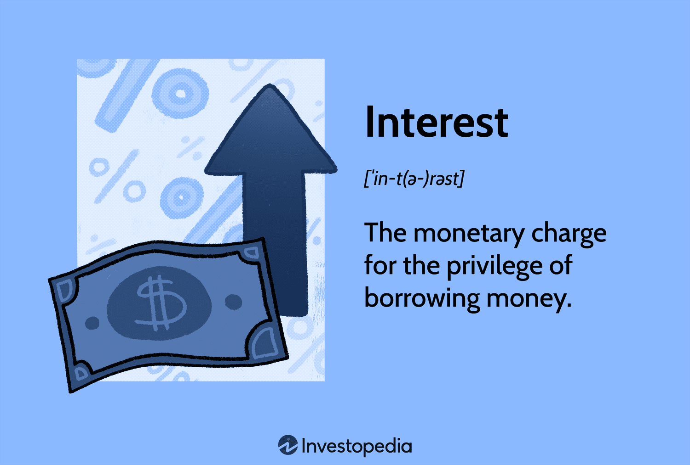

## Table of Contents

## What is interest on interest?

Interest on interest is when you earn interest on the money you've already earned as interest. Imagine you put money in a savings account. Over time, you earn interest on that money. If you leave the interest in the account, you start earning interest on both your original money and the interest you've earned. This is called compound interest.

This concept is powerful because it makes your money grow faster over time. The longer you leave your money to grow, the more interest you earn on the interest. It's like a snowball rolling down a hill, getting bigger and bigger. This is why starting to save early can make a big difference in how much money you have in the future.

## How does interest on interest differ from simple interest?

Interest on interest, also known as compound interest, is when you earn interest on both your original money and the interest you've already earned. It's like your money grows on top of itself. If you put money in a savings account and leave the interest there, you'll earn more interest on the total amount, not just the money you started with. This makes your savings grow faster over time.

Simple interest is different because you only earn interest on the money you originally put in, not on the interest you earn later. For example, if you put $100 in a bank and it earns 5% simple interest each year, you'll get $5 every year, no matter how long you leave it there. With simple interest, your money grows at a steady rate, but it doesn't get the boost from earning interest on interest like with compound interest.

## Can you explain the concept of compound interest?

Compound interest is like a magic trick that makes your money grow faster. It happens when you earn interest not just on the money you put in, but also on the interest you've already earned. Imagine you put $100 in a savings account that gives you 5% interest every year. After the first year, you get $5 in interest, so now you have $105. The next year, you don't just earn interest on the original $100, but on the whole $105. That's how compound interest works – it's interest on interest.

This magic trick can make a big difference over time. The longer you leave your money to grow, the more powerful compound interest becomes. It's like a snowball rolling down a hill, getting bigger and bigger. If you start saving early, even small amounts can turn into a lot of money because of compound interest. That's why it's a good idea to start saving as soon as you can.

## What is the formula for calculating interest on interest?

The formula for calculating interest on interest, or compound interest, is A = P(1 + r/n)^(nt). In this formula, A is the amount of money you'll have after time t, P is the money you start with, r is the interest rate (as a decimal), n is the number of times the interest is compounded per time period, and t is the time the money is invested or borrowed for.

Let's break it down with an example. If you put $1000 in a bank account with an annual interest rate of 5% compounded yearly, after 2 years, you'll have A = 1000(1 + 0.05/1)^(1*2). This simplifies to A = 1000(1.05)^2, which equals $1102.50. So, with compound interest, your money grows not just on the original amount but also on the interest you've earned along the way.

## How often can interest be compounded?

Interest can be compounded at different times, like daily, monthly, quarterly, or yearly. How often it's compounded can make a big difference in how fast your money grows. If interest is compounded more often, like daily instead of yearly, your money can grow faster because you're earning interest on interest more often.

For example, if you have $1000 in a bank account with a 5% interest rate, the amount you'll have after a year can be different depending on how often the interest is compounded. If it's compounded yearly, you'll have $1050 at the end of the year. But if it's compounded daily, you'll have a bit more, around $1051.27, because you're earning interest on the interest every day. So, the more often interest is compounded, the more your money can grow.

## What is the effect of different compounding frequencies on the total interest earned?

The frequency of compounding can make a big difference in how much interest you earn. When interest is compounded more often, like daily instead of yearly, you earn interest on the interest more times throughout the year. This means your money grows faster. For example, if you have $1000 in a bank account with a 5% interest rate, at the end of a year, you'll have more money if the interest is compounded daily than if it's compounded yearly. With daily compounding, you'll have around $1051.27, but with yearly compounding, you'll have $1050. That extra bit comes from earning interest on the interest more often.

The effect of different compounding frequencies becomes even more noticeable over longer periods. If you leave your money in the account for several years, the difference between daily, monthly, quarterly, and yearly compounding can add up to a lot more money. For instance, over 10 years, the same $1000 at a 5% interest rate compounded daily would grow to about $1647.01, while compounded yearly it would be $1628.89. This shows how powerful compounding can be, especially when it happens more frequently.

## How does the time period affect the amount of interest on interest?

The time period you leave your money to grow makes a big difference in how much interest on interest you earn. The longer you leave your money, the more time it has to grow, and the more powerful compound interest becomes. It's like a snowball rolling down a hill - the longer it rolls, the bigger it gets. If you put $1000 in a bank account with a 5% interest rate compounded yearly, after 10 years, you'll have about $1628.89. But if you leave it for 20 years, it grows to around $2653.30. That's a lot more money just because you waited longer.

The effect of time is even more important when you start saving early. If you start saving when you're young, even small amounts can turn into a lot of money over time because of compound interest. For example, if you save $100 a year starting at age 25 with a 5% interest rate compounded yearly, by the time you're 65, you'll have about $8,685. But if you start at age 35, you'll only have around $5,104 by age 65. That's a big difference just because you started 10 years earlier. So, the longer you let your money grow, the more you benefit from interest on interest.

## What are some real-life examples where interest on interest is commonly applied?

Interest on interest, or compound interest, is something you see a lot in savings accounts. When you put your money in a bank, it grows over time because the bank pays you interest. If you leave the interest in the account, you start earning interest on that interest too. This makes your savings grow faster. For example, if you save money for your future, like for a big trip or a new car, the money in your savings account can grow a lot more if you start early and let it sit there for a long time.

Another place where you see compound interest is in retirement accounts, like a 401(k) or an IRA. When you put money into these accounts, it grows over the years because of the interest it earns. The longer you leave the money in there, the more it grows because you're earning interest on the interest. This is why it's a good idea to start saving for retirement as early as you can. Even if you can only save a little bit at first, it can turn into a lot of money by the time you retire because of compound interest.

## How can one maximize the benefits of interest on interest?

To maximize the benefits of interest on interest, start saving as early as you can. The longer your money sits and grows, the more interest it can earn on the interest. Imagine you start saving when you're young, even if it's just a little bit each month. Over many years, that money can turn into a lot more because of compound interest. It's like planting a seed that grows into a big tree over time.

Another way to make the most of interest on interest is to choose savings accounts or investments that offer higher interest rates and compound more often. If you can find a bank that gives you a higher interest rate, your money will grow faster. Also, if the interest is compounded daily instead of yearly, you'll earn more because you're getting interest on the interest more often. It's like watering your plant more often to help it grow bigger and stronger.

## What are the risks associated with relying on interest on interest for long-term financial planning?

One risk of relying on interest on interest for long-term financial planning is that interest rates can change. If you're planning to save money based on a certain interest rate, and that rate goes down, your money won't grow as fast as you expected. This can be a problem if you're counting on that money for something important, like retirement. Banks and other places where you save money can change their interest rates, and sometimes those changes can be big.

Another risk is inflation. Inflation means that the cost of things goes up over time. If the interest rate on your savings is lower than the rate of inflation, your money won't be worth as much in the future. For example, if you save $1000 and it grows to $1100 over 10 years, but prices have gone up by more than 10% in that time, your $1100 won't buy as much as it used to. So, it's important to think about inflation when you're planning for the long term with interest on interest.

## How do tax implications affect the net gain from interest on interest?

When you earn interest on your savings, you might have to pay taxes on that interest. This means that the money you see growing in your account isn't all yours to keep. The government takes a part of it as tax, which can lower the total amount you end up with. For example, if you earn $100 in interest but have to pay $20 in taxes, your real gain is only $80. So, taxes can make the benefits of interest on interest smaller than they look at first.

It's important to know about taxes when you're planning to save money for the long term. Different types of savings accounts and investments can have different tax rules. Some accounts, like certain retirement accounts, might let your money grow without being taxed until you take it out. Others might tax the interest every year. Understanding these rules can help you choose the best places to save your money and figure out how much you'll really have in the end after taxes.

## What advanced strategies can be used to optimize the compounding effect of interest on interest?

One advanced strategy to optimize the compounding effect of interest on interest is to reinvest the interest you earn. Instead of taking the interest out of your account, you leave it in there to keep growing. This means you're always earning interest on a bigger and bigger amount. Another way is to use a strategy called "laddering." This means you spread your money across different investments or savings accounts that mature at different times. By doing this, you can take advantage of higher interest rates when they come up and keep your money growing without locking it all up for too long.

Another strategy is to look for accounts or investments that compound interest more often, like daily or monthly instead of yearly. The more often interest is compounded, the faster your money can grow. You can also consider using tax-advantaged accounts like IRAs or 401(k)s for long-term savings. These accounts let your money grow without being taxed until you take it out, which can make a big difference over time. By combining these strategies, you can make the most of the power of compound interest and see your savings grow even faster.

## What is Compound Interest?

Compound interest is a financial concept where interest is calculated on the initial principal and also on the accumulated interest from previous periods. This contrasts with simple interest, which is computed solely on the principal amount. The result of compounding is exponential growth over time, which can significantly enhance the value of an investment or increase the cost of a debt.

To illustrate, if you deposit an initial principal amount in a savings account or a financial instrument that offers compound interest, the interest earned in the initial period is added to the principal. Then, in the succeeding periods, interest is earned on the new total, which includes both the original principal and the accumulated interest. This process of [earning](/wiki/earning-announcement) "interest on interest" accelerates the growth of the initial investment.

The mathematical expression for compound interest is given by:

$$

FV = PV \times \left(1 + \frac{i}{n}\right)^{nt} 
$$

where:
- $FV$ is the future value of the investment,
- $PV$ is the present value or initial principal,
- $i$ is the annual interest rate (expressed as a decimal),
- $n$ is the number of compounding periods per year,
- $t$ is the time in years.

A higher number of compounding periods ($n$) results in more frequent application of interest on the accumulated amount, leading to a greater future value. This is why, for instance, quarterly compounding results in higher returns than annual compounding, assuming other factors remain constant.

Compound interest plays a crucial role in personal finance, as it can significantly increase savings or investment returns over time. Understanding this concept is essential for making informed financial decisions, whether saving for retirement, paying off loans, or investing in various assets.

## What are examples of compound interest?

Consider a $1,000 investment at an annual [interest rate](/wiki/interest-rate-trading-strategies) of 5%, compounded annually. Over time, the effects of compounding become evident. For instance, after 5 years, this investment would grow to approximately $1,276.28. This calculation is derived using the formula for compound interest:

$$
\text{FV} = \text{PV} \times (1 + i)^t
$$

where:
- $\text{FV}$ is the future value of the investment,
- $\text{PV}$ is the principal amount, which is $1,000,
- $i$ is the annual interest rate, 0.05 in this case,
- $t$ is the number of years the money is invested, which is 5.

In contrast, using simple interest, the calculation is straightforward. The formula for simple interest is:

$$
\text{Simple Interest} = \text{PV} \times i \times t
$$

The future value with simple interest would be the original principal plus the interest earned:

$$
\text{FV} = \text{PV} + \text{Simple Interest} \]  
$$
\text{FV} = \$1,000 + (\$1,000 \times 0.05 \times 5) = \$1,250
$$

This comparison highlights the advantage of compound interest, which accounts for the interest-on-interest effect, leading to a higher accumulated amount after the same period.

Continuous compounding further amplifies the growth potential. It uses the formula:

$$
\text{FV} = \text{PV} \times e^{(i \times t)}
$$

Here, $e$ is the base of the natural logarithm, approximately equal to 2.71828. Applying continuous compounding to the $1,000 investment yields:

$$
\text{FV} = \$1,000 \times e^{(0.05 \times 5)} \approx \$1,283.68
$$

This shows that more frequent compounding, as achieved in continuous compounding, results in a slightly higher future value. The difference demonstrates the power of frequent compounding periods to maximize investment growth.

## How do you calculate compound interest?

Calculating compound interest involves understanding how the interest accrues on both the initial principal and the interest that has been added to it over time. The general formula for compound interest is given by:

$$
FV = PV \times \left(1 + \frac{i}{n}\right)^{nt}
$$

where $FV$ is the future value of the investment, $PV$ is the present value or initial principal, $i$ is the annual interest rate, $n$ is the number of compounding periods per year, and $t$ is the time the money is invested for, in years. This formula demonstrates how the principal grows exponentially as the interest is compounded at regular intervals.

For situations involving continuous compounding, where the interest is compounded an infinite number of times per year, the formula changes slightly:

$$
FV = PV \times e^{(i \times t)}
$$

Here, $e$ is the base of the natural logarithm, approximately equal to 2.71828. Continuous compounding results in a slightly higher future value compared to periodic compounding due to the constant application of interest.

To illustrate these concepts programmatically, Python can be effectively used. Below is an example of how to calculate the future value using both fixed and continuous compounding:

```python
import math

def compound_interest(principal, annual_rate, compounding_periods, years):
    # Fixed compounding calculation
    future_value_fixed = principal * (1 + annual_rate / compounding_periods) ** (compounding_periods * years)

    # Continuous compounding calculation
    future_value_continuous = principal * math.exp(annual_rate * years)

    return future_value_fixed, future_value_continuous

# Example parameters
principal = 1000  # Principal amount in dollars
annual_rate = 0.05  # Annual interest rate in decimal
compounding_periods = 12  # Compounding monthly
years = 5  # Investment period in years

fixed, continuous = compound_interest(principal, annual_rate, compounding_periods, years)
print(f"Future Value with Fixed Compounding: ${fixed:.2f}")
print(f"Future Value with Continuous Compounding: ${continuous:.2f}")
```

This code defines a function to calculate both periodic and continuous compound interest, making it easier to compare the effects of different compounding methods on investment growth. Understanding these calculations is essential for applying the power of compounding to real-world financial scenarios, such as savings plans and investment strategies.

## References & Further Reading

[1]: ["The Mathematics of Financial Derivatives: A Student Introduction"](https://www.amazon.com/Mathematics-Financial-Derivatives-Paul-Wilmott/dp/0521497892) by Paul Wilmott, Sam Howison, and Jeff Dewynne

[2]: ["Advances in Financial Machine Learning"](https://www.amazon.com/Advances-Financial-Machine-Learning-Marcos/dp/1119482089) by Marcos Lopez de Prado

[3]: ["Algorithmic Trading: Winning Strategies and Their Rationale"](https://www.amazon.com/Algorithmic-Trading-Winning-Strategies-Rationale-ebook/dp/B00CY5HC0U) by Ernest P. Chan

[4]: ["Machine Learning for Algorithmic Trading"](https://github.com/stefan-jansen/machine-learning-for-trading) by Stefan Jansen

[5]: ["Quantitative Trading: How to Build Your Own Algorithmic Trading Business"](https://www.amazon.com/Quantitative-Trading-Build-Algorithmic-Business/dp/1119800064) by Ernest P. Chan