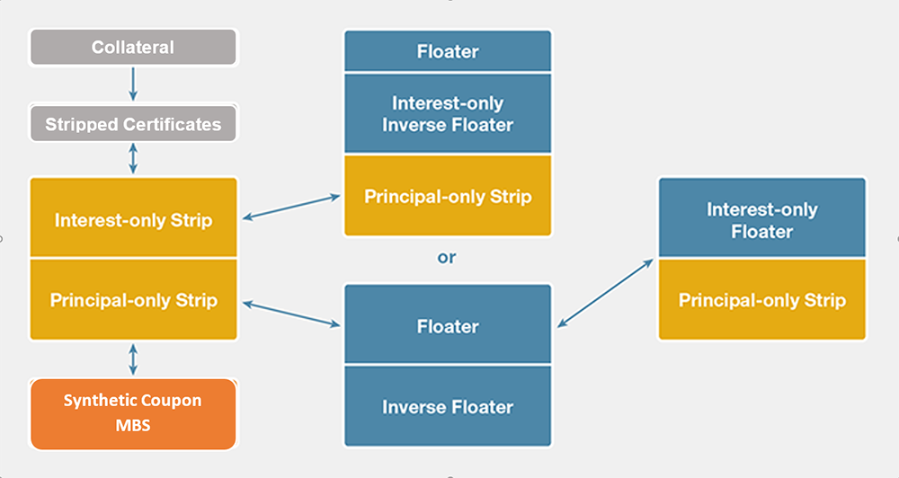

## Table of Contents

## What are Interest-Only Strips?

Interest-Only Strips are a type of investment where you only get the interest payments from a loan or a bond, not the principal. Imagine you lend money to someone and they pay you back in two parts: the interest and the actual money you lent them. With an Interest-Only Strip, you only get the interest part. These strips are often created from mortgage-backed securities or other types of bonds.

People might buy Interest-Only Strips because they want to earn money from the interest without worrying about getting the principal back. This can be attractive if interest rates are high, as it means more money coming in regularly. However, these investments can be riskier because if the borrowers stop paying their interest, the value of the Interest-Only Strip can drop a lot. So, it's important to understand the risks before investing in them.

## How do Interest-Only Strips work?

Interest-Only Strips work by separating the interest payments from the principal payments of a loan or bond. When you buy an Interest-Only Strip, you are buying the right to receive all the interest payments that come from the original loan or bond. For example, if a bank has a bunch of mortgages, they can split the interest and principal payments into different parts. They can then sell the interest part as an Interest-Only Strip to investors.

These strips are often used with mortgage-backed securities, where a bunch of home loans are bundled together. The interest payments from these loans are collected and then paid out to the people who own the Interest-Only Strips. This can be a good deal for investors if interest rates are high because they get more money regularly. But, it can also be risky. If people with the mortgages stop paying their interest, the value of the Interest-Only Strip can go down a lot. So, it's important to think about the risks before deciding to invest in them.

## What is the purpose of Interest-Only Strips in financial markets?

Interest-Only Strips serve a specific role in financial markets by allowing investors to focus on [earning](/wiki/earning-announcement) income from interest payments without worrying about the principal. When banks or financial institutions have a pool of loans, like mortgages, they can split the interest and principal payments. They can then sell these interest payments as Interest-Only Strips to investors who are looking for regular income. This can be especially appealing in times when interest rates are high, as it means more money coming in regularly for the investors.

However, Interest-Only Strips also play a role in managing risk and providing flexibility in investment strategies. By separating the interest from the principal, these strips allow investors to tailor their portfolios to their specific needs, whether they want steady income or are willing to take on more risk for potentially higher returns. But, there is a risk involved. If the borrowers stop paying their interest, the value of the Interest-Only Strip can drop significantly. So, they are a tool that can help investors but also require a good understanding of the risks involved.

## Who typically invests in Interest-Only Strips?

Interest-Only Strips are usually bought by people who want to earn money from the interest without worrying about getting the principal back. These investors might be looking for a regular income, especially when interest rates are high. They might be retired people who want a steady flow of cash to live on, or they could be financial institutions that want to balance their investment portfolios with income-generating assets.

However, these strips can also attract more adventurous investors. They might see Interest-Only Strips as a way to take on more risk for potentially bigger rewards. These investors understand that if the borrowers stop paying their interest, the value of the strip can drop a lot. So, they are willing to take that chance in hopes of earning more money from the interest payments.

## What are the risks associated with investing in Interest-Only Strips?

Investing in Interest-Only Strips can be risky because you're only getting the interest payments, not the principal. If the people who borrowed the money stop paying their interest, the value of your Interest-Only Strip can go down a lot. This is a big risk because if lots of borrowers stop paying, your investment could lose a lot of value. Also, if interest rates go down, the amount of money you get from the strips might not be as much as you expected, which can hurt your investment.

Another risk is that Interest-Only Strips can be hard to sell if you need your money back quickly. They are not as popular as other types of investments, so finding someone to buy them can be tough. This means your money might be tied up in the strips for a long time. So, before you decide to invest in Interest-Only Strips, think about whether you can handle these risks and if you're okay with the possibility of losing money.

## How are Interest-Only Strips created?

Interest-Only Strips are created when a bank or a financial institution has a bunch of loans, like mortgages. They can split the payments from these loans into two parts: the interest and the principal. The interest part is then sold as an Interest-Only Strip to investors who want to earn money from the interest without worrying about getting the principal back.

This process often happens with mortgage-backed securities, where many home loans are put together into one big package. The bank collects the interest payments from all these loans and then pays out that interest to the people who own the Interest-Only Strips. By doing this, the bank can sell the interest part to investors who want regular income, while keeping or selling the principal part to others.

## What is the difference between Interest-Only Strips and Principal-Only Strips?

Interest-Only Strips and Principal-Only Strips are both created from loans like mortgages, but they focus on different parts of the loan payments. An Interest-Only Strip gives you the right to receive all the interest payments from the loans. This means you get a regular income from the interest, but you don't get any of the money that the borrowers pay back as the principal. Investors who want steady income, especially when interest rates are high, might like Interest-Only Strips.

On the other hand, a Principal-Only Strip gives you the right to receive all the principal payments from the loans. This means you get the money that the borrowers pay back as the principal, but you don't get any of the interest. Investors who buy Principal-Only Strips are betting that the loans will be paid back early, which can happen if interest rates drop and people refinance their loans. Both types of strips come with risks, so it's important to understand them before investing.

## How do Interest-Only Strips affect the yield of a mortgage-backed security?

Interest-Only Strips can change the yield of a mortgage-backed security by splitting the interest payments from the principal payments. When you buy an Interest-Only Strip, you are only getting the interest part of the loan payments. This means you might get a higher yield if interest rates are high because you are getting all the interest. But, if the people who borrowed the money stop paying their interest, the value of your strip can go down a lot, which can make the yield lower or even negative.

On the other hand, when the interest payments are taken out as Interest-Only Strips, the remaining part of the mortgage-backed security, which includes the principal payments, might have a different yield. Without the interest payments, the yield on the principal part might be lower because it's not getting any of the interest income. So, splitting the payments into Interest-Only Strips can change how much money you earn from the whole mortgage-backed security.

## What are the tax implications of investing in Interest-Only Strips?

When you invest in Interest-Only Strips, you need to think about taxes. The interest you get from these strips is usually taxed as regular income. This means you have to pay taxes on it every year, just like you would with money you earn from a job. The tax rate can be high, especially if you're in a higher tax bracket, so it's important to think about how much you'll have to pay in taxes when you're figuring out if Interest-Only Strips are a good investment for you.

Also, if you sell your Interest-Only Strips for more than you paid for them, you might have to pay capital gains tax. This is a tax on the profit you make from selling something. The tax rate for capital gains can be different depending on how long you held the strips before selling them. If you held them for less than a year, you might pay a higher rate than if you held them for more than a year. So, it's a good idea to talk to a tax advisor to understand all the tax rules and how they might affect your investment in Interest-Only Strips.

## How do changes in interest rates impact the value of Interest-Only Strips?

Changes in interest rates can have a big effect on the value of Interest-Only Strips. When interest rates go up, the value of these strips usually goes down. This is because the new loans or bonds that come out will have higher interest rates, so the old Interest-Only Strips don't look as good anymore. People might want to sell their strips to buy the new ones with higher interest, which makes the value of the old strips drop.

On the other hand, when interest rates go down, the value of Interest-Only Strips usually goes up. This is because the interest payments from the strips are now worth more compared to new loans or bonds with lower interest rates. People might want to keep their strips because they are getting a better deal than they would with new investments. So, if you're thinking about investing in Interest-Only Strips, it's important to keep an eye on what's happening with interest rates.

## What are some strategies for trading Interest-Only Strips?

One strategy for trading Interest-Only Strips is to buy them when interest rates are high. When rates are high, the interest payments you get from the strips will be bigger, which can mean more money for you. You can then sell the strips later if interest rates go down, because their value might go up. This way, you can make money from both the interest payments and selling the strips at a higher price.

Another strategy is to use Interest-Only Strips to balance your investment portfolio. If you have a lot of investments that don't give you regular income, buying Interest-Only Strips can help because they give you steady interest payments. This can be good if you need money coming in regularly, like if you're retired. But remember, if interest rates change or if people stop paying their loans, the value of the strips can go down, so you need to be ready for that risk.

A third strategy is to trade Interest-Only Strips based on how well the loans are doing. If you think the people who borrowed the money will keep paying their interest, the strips can be a good investment. But if you think a lot of people might stop paying, you might want to sell your strips before their value drops. Keeping an eye on how the loans are doing can help you decide when to buy or sell the strips.

## How do Interest-Only Strips fit into a broader investment portfolio?

Interest-Only Strips can be a useful part of a bigger investment plan because they give you regular money from the interest payments. If you need money coming in every month, like if you're retired, these strips can help you have a steady income. They can also be good when interest rates are high because you get more money from the interest. But, you need to be careful because if the people who borrowed the money stop paying their interest, the value of your strips can go down a lot.

Adding Interest-Only Strips to your investment mix can also help you balance out other investments that don't give you regular income. For example, if you have a lot of money in stocks or other things that might go up and down a lot, the steady interest from the strips can make your overall plan more stable. Just remember, these strips can be risky, so you need to think about how much risk you're okay with and how interest rates might change before you decide to put them in your portfolio.

## What are Financial Derivatives and IO Strips and how can they be understood?

Financial derivatives are sophisticated financial instruments that serve a critical role in modern investment strategies. They are contracts whose value is reliant on the price movements of underlying assets such as stocks, bonds, commodities, or interest rates. Derivatives derive their value from these underlying assets and are used for hedging risk, speculating, and improving returns in financial portfolios. Some common forms of financial derivatives include futures, options, swaps, and credit derivatives. These instruments allow investors to gain exposure to the performance of an asset without necessarily owning it outright, offering both flexibility and complexity.

Interest-only (IO) strips represent a specific category of financial derivatives, primarily associated with mortgage-backed securities (MBS). Unlike typical derivatives, IO strips focus entirely on the interest component rather than the entirety of the cash flow associated with a debt instrument. In a mortgage-backed security, investors can purchase rights to the interest payments, but not the principal repayments. This separation creates an IO strip, which is sensitive to fluctuations in interest rates. 

Investors who allocate funds to IO strips stand to benefit when interest rates increase. A rise in interest rates generally leads to a decrease in mortgage prepayments, as borrowers are less likely to refinance existing loans at higher rates. This dynamic secures a more predictable stream of interest income for the investors holding IO strips. Conversely, a decline in interest rates can result in increased prepayments, undermining the expected cash flow and potentially diminishing returns.

The cash flows from IO strips can be expressed mathematically, whereby $CF_{IO}$ (cash flow from IO strips) is a function of the interest payments $I_t$ expected over the periods $t$:

$$
CF_{IO} = \sum_{t=1}^{n} I_t \times (1 - PPR_t)
$$

Where $PPR_t$ represents the prepayment rate at time $t$. The above formula highlights the dependency on mortgage prepayments, and as such, investors must carefully consider [interest rate](/wiki/interest-rate-trading-strategies) trends and prepayment patterns when investing in IO strips.

While IO strips enable targeted exposure to interest rate movements and can enhance portfolio diversification, they require a sophisticated understanding of interest rate mechanics and mortgage market dynamics to be effectively utilized. As derivatives, they extend the toolkit for managing interest rate risks, allowing investors to craft strategies aligned with broader financial objectives.

## References & Further Reading

[1]: Gorton, G. B., & Metrick, A. (2012). ["Securitized Banking and the Run on Repo."](https://www.sciencedirect.com/science/article/pii/S0304405X1100081X) Journal of Financial Economics, 104(3), 425-451.

[2]: Hayre, L. S., & Saraf, M. (2008). ["Understanding Prepayment Modeling."](https://www.semanticscholar.org/paper/Modeling-of-Mortgage-Defaults-Hayre-Saraf/4aecfb5d93fb3d167b88dcb422afba919e80eb79) The CFA Institute.

[3]: Fabozzi, F. J. (2001). ["Handbook of Mortgage-Backed Securities."](https://academic.oup.com/book/7943) McGraw-Hill.

[4]: Lopez de Prado, M. (2018). ["Advances in Financial Machine Learning."](https://www.amazon.com/Advances-Financial-Machine-Learning-Marcos/dp/1119482089) Wiley.

[5]: Hull, J. C. (2018). ["Options, Futures, and Other Derivatives."](https://www.semanticscholar.org/paper/Options%2C-Futures%2C-and-Other-Derivatives-Hull/89bdee500c8623864fc9eb7a471546aa713acc44) Pearson.