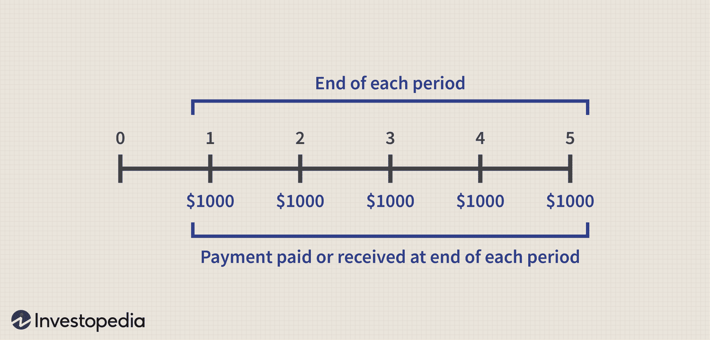

## Table of Contents

## What are mutual funds?

Mutual funds are a type of investment where many people pool their money together to buy a variety of stocks, bonds, or other assets. This is managed by a professional who decides where to invest the money. When you buy into a mutual fund, you're actually buying a small piece of each of the investments in the fund. This makes it easier for people to invest in a diverse range of assets without having to pick each one themselves.

The value of a mutual fund goes up or down based on how well the investments in the fund are doing. If the stocks or bonds in the fund do well, the value of the fund goes up, and so does the value of your investment. If they do poorly, the value goes down. Mutual funds can be a good way to grow your money over time, but they also come with risks, just like any other investment. It's important to understand these risks and choose a fund that matches your investment goals and how much risk you're comfortable with.

## What are interest payments in the context of mutual funds?

Interest payments in mutual funds come from the bonds or other fixed-income securities that the fund holds. When a mutual fund invests in bonds, these bonds pay interest at regular intervals, usually every six months or once a year. This interest is then collected by the mutual fund and can be distributed to the investors who own shares in the fund. This distribution of interest is known as an interest payment.

These interest payments can provide a steady income stream for investors, especially those who are looking for regular income from their investments. The amount of interest you receive depends on how many shares of the mutual fund you own and the performance of the bonds in the fund's portfolio. It's important to note that not all mutual funds pay interest; some focus on stocks and other assets that do not generate interest in the same way.

## How do mutual funds generate interest?

Mutual funds generate interest mainly through the bonds they hold in their portfolio. When a mutual fund buys bonds, these bonds pay interest to the fund at certain times, like every six months or once a year. The mutual fund collects this interest and can then give it to the people who own shares in the fund. This is how investors get interest payments from their mutual fund.

Not all mutual funds generate interest in the same way. Some mutual funds focus on stocks, which don't pay interest like bonds do. Instead, stocks might pay dividends, which are different from interest. But for mutual funds that do hold bonds, the interest from those bonds is a key way they make money for their investors. The amount of interest a mutual fund can generate depends on the types of bonds it holds and how well those bonds are doing.

## What types of mutual funds typically pay interest?

Mutual funds that typically pay interest are called bond funds or fixed-income funds. These funds invest mostly in bonds, which are loans that companies or governments take out. When these bonds pay interest, the mutual fund collects it and can then pass it on to the people who own shares in the fund. This makes bond funds a good choice for people who want a steady income from their investments.

Some other types of mutual funds might also pay interest, like money market funds. These funds invest in very safe, short-term loans, and they also collect interest from these loans. Money market funds usually pay out this interest to their investors regularly. Both bond funds and money market funds focus on [earning](/wiki/earning-announcement) interest, but they do it in slightly different ways, depending on the types of bonds or loans they invest in.

## How are interest payments distributed to investors?

Interest payments from mutual funds are given to investors in a few different ways. When a mutual fund gets interest from the bonds it owns, it can choose to pay this interest directly to the people who own shares in the fund. This usually happens at set times, like every month, every three months, or once a year. The amount of interest each investor gets depends on how many shares they own. If you own more shares, you get more of the interest payment.

Sometimes, instead of paying out the interest right away, a mutual fund might choose to reinvest it. This means the interest is used to buy more shares of the fund for the investors. This can help the value of the investment grow over time. Investors can usually choose if they want to get the interest as cash or have it reinvested, depending on what the fund allows. Either way, the interest payments are a way for investors to earn money from the bonds in the mutual fund.

## What is the tax treatment of interest payments from mutual funds?

Interest payments from mutual funds are usually taxed as ordinary income. This means that the money you get from the interest is added to your other income, like your salary, and you pay taxes on it at your regular income tax rate. The exact amount of tax you pay depends on how much money you make in total and the tax laws where you live.

If you choose to reinvest the interest payments instead of taking them as cash, you still have to pay taxes on them. The IRS sees the reinvested interest as if you received it in cash, so you need to report it on your taxes and pay the tax on it. It's important to keep good records of these reinvestments because they can affect your taxes and how much you owe each year.

## How can investors track interest payments from their mutual fund investments?

Investors can track interest payments from their mutual fund investments by looking at the statements they get from the mutual fund company. These statements usually come every month or every three months and show how much interest the fund has earned and how much of that interest is being paid out to the investor. If the investor has chosen to reinvest the interest, the statement will also show how many new shares were bought with the interest.

Another way to keep track is by using an online account with the mutual fund company. Most companies have websites where investors can log in and see their account details anytime. This includes seeing the interest payments, whether they are paid out as cash or reinvested. Keeping an eye on these online accounts can help investors stay up to date on their interest earnings and make sure everything is correct.

## What factors influence the amount of interest paid by mutual funds?

The amount of interest paid by mutual funds depends on the types of bonds they hold. If a mutual fund has a lot of bonds that pay high interest rates, it can pay more interest to its investors. But if the bonds in the fund pay low interest rates, the fund will pay less interest. The quality of the bonds also matters. High-quality bonds usually pay less interest because they are safer, while lower-quality bonds might pay more interest because they are riskier.

Another [factor](/wiki/factor-investing) is how the economy is doing. When the economy is doing well, interest rates might go up, and the mutual fund can earn more interest from its bonds. But if the economy is not doing well, interest rates might go down, and the fund will earn less interest. The decisions made by the people who manage the mutual fund also play a role. If they choose to buy bonds that pay higher interest, the fund can pay more to its investors.

## How do interest rates affect mutual fund interest payments?

Interest rates have a big impact on the interest payments that mutual funds can make to their investors. When interest rates go up, the bonds in a mutual fund's portfolio start paying more interest. This means the mutual fund can collect more money from its bonds and then pay more interest to the people who own shares in the fund. So, if you're an investor in a mutual fund that holds bonds, you might get bigger interest payments when interest rates rise.

On the other hand, when interest rates go down, the bonds in the mutual fund's portfolio pay less interest. This means the mutual fund collects less money from its bonds, and as a result, it can pay less interest to its investors. So, if interest rates fall, the interest payments you get from your mutual fund might be smaller. The overall economy and the decisions made by the people managing the mutual fund also play a role in how much interest the fund can pay, but interest rates are a key factor.

## What are the differences between interest payments and dividend payments in mutual funds?

Interest payments and dividend payments in mutual funds come from different places. Interest payments come from the bonds that a mutual fund owns. Bonds are like loans that companies or governments take out, and they pay interest to the people who lend them money. When a mutual fund buys these bonds, it collects the interest and can then give it to the people who own shares in the fund. On the other hand, dividend payments come from the stocks that a mutual fund owns. Stocks are pieces of a company, and sometimes these companies share their profits with their shareholders by paying dividends. When a mutual fund gets these dividends, it can pass them on to its investors.

The way these payments are taxed is also different. Interest payments from mutual funds are usually taxed as ordinary income. This means you pay taxes on the interest at the same rate you pay on your regular income, like your salary. Dividend payments, however, can be taxed in two ways. Some dividends are qualified dividends, which are taxed at a lower rate than ordinary income. Other dividends are non-qualified and are taxed at the same rate as ordinary income. It's important for investors to know these differences because they can affect how much money they get to keep after taxes.

## How do reinvestment options for interest payments work in mutual funds?

When you invest in a mutual fund that pays interest, you often have a choice about what to do with that interest. One option is to take the interest as cash, which means you get the money directly. The other option is to reinvest the interest. This means instead of getting the money, the mutual fund uses it to buy more shares of the fund for you. Over time, this can help your investment grow because you're using the interest to buy more of the fund.

Reinvestment can be a good way to make your money grow without having to do anything extra. When the interest is reinvested, you end up owning more shares of the fund. If the value of the fund goes up, those extra shares can be worth more money. But remember, even if you choose to reinvest the interest, you still have to pay taxes on it. The IRS treats the reinvested interest as if you received it in cash, so you need to report it on your taxes and pay the tax on it.

## What strategies can investors use to maximize interest payments from mutual funds?

Investors can maximize interest payments from mutual funds by choosing funds that invest in bonds with higher interest rates. This means looking for bond funds that focus on bonds that pay more interest. These might be bonds from companies that are riskier, so they have to pay more to attract investors. Another way is to keep an eye on interest rates in the economy. When interest rates go up, bond funds can start earning more interest, which means they can pay more to their investors. So, if you think interest rates are going to rise, it might be a good time to invest more in bond funds.

Another strategy is to look at the duration of the bonds in the mutual fund. Bonds that have longer times until they pay back the money they borrowed can pay higher interest rates. But these bonds can also be riskier because their value can go up or down more when interest rates change. So, if you're okay with taking a bit more risk, you might want to choose funds with longer-term bonds to get more interest. Also, reinvesting the interest payments instead of taking them as cash can help your investment grow over time. By using the interest to buy more shares of the fund, you can earn even more interest in the future.

## How can one integrate strategies by combining mutual funds and algo trading?

The integration of mutual funds and [algorithmic trading](/wiki/algorithmic-trading) seeks to enhance investment performance by combining the inherent stability of mutual funds with the operational efficiency of algorithmic trading technologies. This strategy allows for optimizing asset allocation and risk management by leveraging advanced computational methods.

Mutual funds benefit from algorithmic strategies through improved asset allocation. Algorithms analyze large sets of data to identify optimal investment opportunities and rebalance fund portfolios dynamically. This process is outlined using modern portfolio theory, where the objective is to achieve maximum return for a given level of risk, often represented as:

$$
\max \left( \mu \cdot w - \frac{\lambda}{2} w^T \Sigma w \right) 
$$

where $\mu$ is the expected return vector, $w$ is the weight vector of the assets in the portfolio, $\lambda$ represents the risk tolerance, and $\Sigma$ is the covariance matrix of asset returns.

Automated systems enable mutual funds to react swiftly to market conditions, capturing opportunities and reducing risks. Algorithmic trading strategies, such as market-making and [arbitrage](/wiki/arbitrage), use high-frequency trading to take advantage of small price discrepancies, thus enhancing portfolio returns without significant increase in risk. As market [volatility](/wiki/volatility-trading-strategies) presents both risks and opportunities, algorithms can adjust fund positions automatically based on real-time data, facilitating more informed risk management.

The integration of mutual funds with algorithmic trading fosters portfolios with diversified income streams. This comprehensive strategy can lead to more consistent returns by combining regular income from mutual fund distributions, such as dividends and interest, with gains from algorithmically-driven trading.

Successful integrations can be illustrated through specific case studies. For instance, quantitative hedge funds have effectively implemented algorithmic trading technologies to manage large pools of diverse assets, achieving superior performance. These funds deploy [machine learning](/wiki/machine-learning) models to predict price movements and utilize automated trading infrastructure to execute trades swiftly and accurately.

In conclusion, the symbiotic use of mutual funds and algorithmic trading cultivates a robust investment strategy that not only seeks enhanced returns but also maintains prudent risk management. The ongoing advancement in financial technology promises to further refine these strategies, enabling investors to benefit from more sophisticated investment approaches.

## References & Further Reading

[1]: Bergstra, J., Bardenet, R., Bengio, Y., & Kégl, B. (2011). ["Algorithms for Hyper-Parameter Optimization."](https://dl.acm.org/doi/10.5555/2986459.2986743) Advances in Neural Information Processing Systems 24.

[2]: ["Advances in Financial Machine Learning"](https://www.amazon.com/Advances-Financial-Machine-Learning-Marcos/dp/1119482089) by Marcos Lopez de Prado

[3]: ["Evidence-Based Technical Analysis: Applying the Scientific Method and Statistical Inference to Trading Signals"](https://www.amazon.com/Evidence-Based-Technical-Analysis-Scientific-Statistical/dp/0470008741) by David Aronson

[4]: ["Machine Learning for Algorithmic Trading"](https://github.com/stefan-jansen/machine-learning-for-trading) by Stefan Jansen

[5]: ["Quantitative Trading: How to Build Your Own Algorithmic Trading Business"](https://www.amazon.com/Quantitative-Trading-Build-Algorithmic-Business/dp/1119800064) by Ernest P. Chan