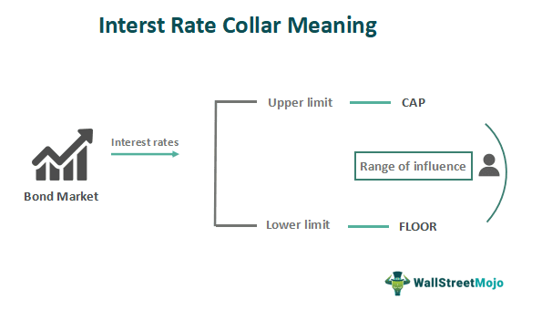

In the modern financial landscape, effective risk management has become indispensable, especially when dealing with fluctuating interest rates. Financial derivatives, such as interest rate collars, have emerged as powerful tools to mitigate interest rate risk. These instruments offer a method to shield both borrowers and lenders from the negative consequences of interest rate volatility, which poses a significant challenge in financial management and planning.

Interest rate collars are designed to establish a protective buffer against undesirable interest rate movements by defining a range within which rates are acceptable. By setting an upper limit (cap) and a lower limit (floor), collars help organizations manage their exposure, ensuring that interest costs remain predictable and within budgetary constraints. This mechanism becomes essential in times of economic uncertainty when interest rates are prone to dramatic changes.



The strategic use of interest rate collars aligns seamlessly with advancements in algorithmic trading, which optimizes risk management strategies by automating complex processes. Algorithmic trading enables the swift and precise execution of trades based on predefined criteria, thus enhancing the effectiveness of financial derivatives in risk mitigation. By harnessing large datasets and sophisticated algorithms, traders can make data-driven decisions that support robust interest rate management strategies.

This article examines the critical role financial derivatives, particularly interest rate collars, play in managing interest rate risk. It explores their functionality and the transformative impact of algorithmic trading, which together provide comprehensive solutions to navigate the complexities of modern financial markets.

## Table of Contents

## Understanding Financial Derivatives

Derivatives are pivotal instruments in the financial markets, serving as contracts whose value is derived from the performance of an underlying asset, index, or rate. Examples of such underlying elements include equities, bonds, commodities, currencies, interest rates, or market indices. Derivative contracts are primarily classified into options, futures, swaps, and collars. These diverse instruments cater to a wide array of financial strategies, fulfilling roles from hedging and speculation to arbitrage.

Options provide the holder the right, but not the obligation, to buy or sell an asset at a predetermined price, known as the strike price, before or at a specified expiration date. This flexibility allows investors to capitalize on price movements while limiting potential losses to the premium paid for the option. For instance, call options benefit from upward price trends, while put options are advantageous in declining markets.

Futures contracts, in contrast, obligate participants to buy or sell an asset at a predetermined date and price, eliminating counterparty risk through centralized clearing houses. This characteristic renders futures suitable for both hedging against price fluctuations and speculative endeavors, given their leverage potential.

Swaps are derivative contracts wherein two parties exchange cash flows or financial instruments for mutual benefit. One common example is an [interest rate](/wiki/interest-rate-trading-strategies) swap, where fixed and floating interest payments are exchanged to achieve desired cash flow structures or manage interest rate exposure.

Interest rate collars, unique among derivatives, set both upper and lower boundaries on interest rates, providing protection against rate [volatility](/wiki/volatility-trading-strategies). They are composed of a combination of purchasing an interest rate cap and selling a floor, or vice versa. This enables the user to hedge against unfavorable rate movements within a defined range.

The primary utility of derivatives lies in risk management. By properly employing these instruments, investors can hedge against potential losses due to market fluctuations, thereby preserving and potentially enhancing their investment returns. Derivatives offer the advantage of leverage, allowing significant exposure to underlying assets with a relatively small initial investment compared to direct asset ownership.

In volatile markets, derivatives offer a strategic edge through their ability to improve returns and facilitate efficient risk management. Their inherent flexibility enables investors to tailor financial strategies to specific needs, protecting against adverse movements while allowing participation in favorable trends. This dual capability of risk mitigation and opportunity maximization makes derivatives indispensable tools in modern finance.

## What Is an Interest Rate Collar?

An interest rate collar is a complex financial instrument designed to manage the risk associated with fluctuating interest rates. It operates by setting a ceiling (cap) and a floor on the interest rate of a loan or other financial instrument. This derivative tool is particularly useful for both borrowers and lenders as it ensures that the interest rate remains within a pre-defined range, thereby providing predictability and risk mitigation against adverse interest rate movements.

In practical terms, an interest rate collar involves the use of two options contracts, each serving a specific purpose within the collar structure. The interest rate cap, essentially a call option, reassures borrowers that their interest payments will not exceed a certain rate, protecting them from rising rates. Conversely, the interest rate floor acts as a put option, ensuring that lenders receive a minimum interest payment, protecting them from rates falling too low.

The mechanism of an interest rate collar involves intricate financial engineering. When establishing a collar, a party may purchase an interest rate cap and simultaneously sell an interest rate floor. The premium income from selling the floor can be used to offset the cost of purchasing the cap, potentially leading to a zero-cost collar, which is a significant advantage for parties looking to manage interest expenses without initial outlay.

Mathematically, if $r(t)$ represents the interest rate at time $t$, and assuming $C$ and $F$ are the cap and floor rates respectively, the payoff from the cap can be represented as:

$$
\max(0, r(t) - C)
$$

Similarly, the payoff from the floor is:

$$
\max(0, F - r(t))
$$

The combined effectiveness of the collar comes from balancing these two elements to keep $r(t)$ within the desired range $[F, C]$.

Interest rate collars are strategic tools in financial management, delivering dual-layered protection against interest rate volatility. This makes them indispensable in financial planning for organizations and individuals who seek to stabilize cash flows and manage costs associated with interest rate fluctuations effectively.

## Mechanics of Interest Rate Collars

Interest rate collars operate by combining two distinct financial derivatives: an interest rate cap and an interest rate floor. This dual approach provides both an upper and lower boundary for interest rate fluctuations. By purchasing an interest rate cap, the buyer incurs a premium cost which serves to restrict the maximum interest expenses that could be encountered. Conversely, by selling an interest rate floor, the investor gains income, thereby constraining the minimum return from alterations in interest rates. This strategic pairing enables investors to maintain anticipated interest costs within a specified range.

The mechanism of an interest rate collar can be detailed through the simultaneous execution of these derivative transactions. In this arrangement, the interest rate cap acts as a protective ceiling, ensuring that the interest paid does not exceed a certain percentage, even if market rates rise significantly. The formula for the payoff from a cap is given by:

$$
\text{Payoff from Cap} = \max(0, \text{Market Rate} - \text{Cap Rate})
$$

In handling the floor, selling it provides an upfront premium, which compensates for capping the minimal earnings from interest rates. The formula for the payoff from a floor is:

$$
\text{Payoff from Floor} = \max(0, \text{Floor Rate} - \text{Market Rate})
$$

By integrating these mechanisms, the interest cost to an investor is maintained between the cap and floor rates, thus moderating exposure to volatile interest rate movements. This predictability in interest expenses facilitates better financial planning and budgeting by mitigating the risk of extreme upward or downward shifts in rates that could destabilize financial strategies.

The effectiveness of an interest rate collar lies in this ability to control potential interest rate swings, creating a financial safeguard that enhances certainty and offers a degree of revenue predictability. With this setup, while the investor accepts some limitations on potential gains, the secure boundaries protect against adverse rate changes.

## Risk Management with Interest Rate Collars

Interest rate collars are utilized primarily as a hedging mechanism to manage the inherent volatility in interest rates, a [factor](/wiki/factor-investing) that can significantly impact both loan affordability and investment returns. This financial derivative strategy allows borrowers and investors to establish a range within which interest rates can fluctuate, offering a stable framework for financial planning.

One of the most significant advantages of using interest rate collars is the potential for low or negligible upfront cost. This cost-effectiveness is achieved by strategically using options contracts. Specifically, the premium received from selling the floor option can offset, or even entirely cover, the cost of purchasing the cap option. This effectively allows users to secure a protective range for interest rate movements with minimal initial financial outlay, providing a cost-efficient method of risk management.

However, it's important to note that while interest rate collars offer a practical balance between risk protection and cost-effectiveness, they also impose a limitation on potential benefits. The dual boundaries set by the cap and floor mean that if interest rates move favorably beyond these limits, the potential gains are constrained. These constraints need to be carefully weighed against the predictable cost control benefits provided by collars.

Overall, interest rate collars serve as a valuable tool in the toolkit of financial risk management, enabling businesses and investors to maintain a degree of certainty in their financial planning.

## Algorithmic Trading in Interest Rate Risk Management

Algorithmic trading has significantly enhanced the efficiency of financial markets by automating trading processes and minimizing human-related errors. In interest rate risk management, such technological advancements are particularly beneficial, allowing for the effective execution of strategies tailored to manage rate fluctuations. Algorithms, or algos, are capable of handling extensive datasets to identify emerging patterns and execute timely trades that align with predefined risk management goals.

The ability of algorithms to process vast amounts of information quickly is crucial in managing the complexities associated with interest rate derivatives, such as interest rate collars. These derivatives require precise timing and execution to maximize their protective benefits while maintaining the flexibility to react to market conditions. Algorithmic trading systems utilize quantitative models that can execute trades automatically once specific criteria are met, ensuring optimal use of products like interest rate collars to manage cost exposures effectively.

For example, let's consider an algorithm for interest rate risk management that monitors interest rate movements and evaluates derivative pricing conditions in real-time. The algorithm could be structured to buy an interest rate cap and sell a floor when the predicted volatility exceeds a certain threshold, thus forming an interest rate collar. Such actions can be orchestrated via a simple Python script employing libraries dedicated to financial data analysis and trading, such as `pandas`, `numpy`, and `scipy`.

```python
import pandas as pd
import numpy as np
from scipy.stats import norm

# Dummy function to simulate real-time interest rate fetching and calculating option prices
def get_interest_rate_data():
    # Simulation of real-time data fetching
    # This would typically involve querying financial data sources
    return np.random.normal(loc=0.05, scale=0.01, size=1000)  # Simulated interest rates

# Hypothetical algorithmic strategy
def execute_trading_strategy(rate_data):
    threshold = 0.08  # Example threshold for deciding to execute a collar strategy
    for rate in rate_data:
        if rate > threshold:
            # Purchase an interest rate cap and sell a floor
            print('Executing collar: Buying cap, Selling floor')
        else:
            # Strategic hold or other strategy
            print('Holding current position')

# Execute the strategy
interest_rates = get_interest_rate_data()
execute_trading_strategy(interest_rates)
```

By employing such algorithmic strategies, investors ensure their derivatives, including interest rate collars, are leveraged effectively and expediently, mitigating exposure to adverse rate changes. These programs reduce the time lag associated with human-driven analyses, therefore enhancing strategic decision-making and risk management effectiveness in dynamic financial markets. When implemented correctly, [algorithmic trading](/wiki/algorithmic-trading) represents a powerful tool in protecting portfolio values against interest rate volatility.

## Advantages and Challenges of Using Interest Rate Collars

Interest rate collars are a valuable financial derivative for managing interest rate volatility. By providing a predefined range within which interest rates can fluctuate, they offer cost-effective protection that is particularly appealing to borrowers and investors who wish to shield their financial interests from adverse rate movements.

One key advantage of interest rate collars is their ability to facilitate budget planning and financial certainty. This is especially beneficial for businesses requiring stable financial planning over the long term. By establishing both an upper (cap) and a lower (floor) limit on interest rates, companies can predict their financial exposure with greater accuracy. This predictability is crucial for businesses planning capital expenditures, managing debt portfolios, or strategizing financial operations over several years.

However, the dual-boundary feature of interest rate collars presents certain challenges. While they provide protection from unfavorable interest rate shifts, they also limit the benefits when rates move favorably beyond the established boundaries. For instance, if interest rates fall below the floor level, a borrower with an interest rate collar will not be able to benefit from lower interest costs. Similarly, if rates exceed the cap, lenders cannot take advantage of potential higher earnings.

Furthermore, implementing interest rate collars necessitates a specific expertise. Financial professionals must understand the intricacies of derivatives and assess the potential impacts on their financial strategies. Additionally, constructing an effective collar strategy requires an in-depth analysis of market conditions, interest rate forecasts, and the specific financial needs of their organization. This complexity underscores the importance of having skilled personnel or consulting with experts in derivative instruments to optimize the use of collars.

In conclusion, while interest rate collars are a powerful tool for managing interest rate risk, the benefits and limitations must be carefully balanced. Proper implementation is key to maximizing their protective features while minimizing potential downsides.

## Conclusion

Interest rate collars are an integral part of financial derivatives, offering critical benefits for managing interest rate risk. These instruments enable both borrowers and investors to establish boundaries on interest rate fluctuations, ensuring stability and predictability in financial costs and returns. By setting an upper and lower limit, interest rate collars protect against the uncertainties introduced by volatile market conditions.

The effectiveness of interest rate collars is significantly augmented when combined with algorithmic trading. Algorithms aid in the swift analysis of market trends and the execution of trades, thereby elevating risk management strategies. This integration allows for timely adjustments and optimizations that align with the dynamic nature of financial markets. Consequently, professionals can harness these synergies to address the intricate challenges posed by fluctuating interest rates.

For financial professionals, mastering the deployment of interest rate collars, particularly in conjunction with algorithmic solutions, is essential. Such proficiency ensures an adaptable and resilient approach to risk mitigation, facilitating better financial decision-making despite the ever-changing economic landscape. Through the strategic use of these derivatives, professionals can effectively navigate complexities and bolster their risk management frameworks.

## References & Further Reading

[1]: ["Options, Futures, and Other Derivatives"](https://www.amazon.com/Options-Futures-Other-Derivatives-10th/dp/013447208X) by John C. Hull

[2]: ["Risk Management and Financial Institutions"](https://books.google.com/books/about/Risk_Management_and_Financial_Institutio.html?id=1J1QDwAAQBAJ) by John C. Hull

[3]: Chance, D. M., & Brooks, R. (2015). ["An Introduction to Derivatives and Risk Management"](https://books.google.com/books/about/Introduction_to_Derivatives_and_Risk_Man.html?id=b8PgBQAAQBAJ) (10th ed.). Cengage Learning.

[4]: ["Interest Rate Risk Modeling: The Fixed Income Valuation Course"](https://www.amazon.com/Interest-Rate-Risk-Modeling-Valuation/dp/0471427241) by Sanjay K. Nawalkha

[5]: Treleaven, P., Galas, M., & Lalchand, V. (2013). ["Algorithmic Trading Review."](https://dl.acm.org/doi/10.1145/2500117) Journal of Trading.