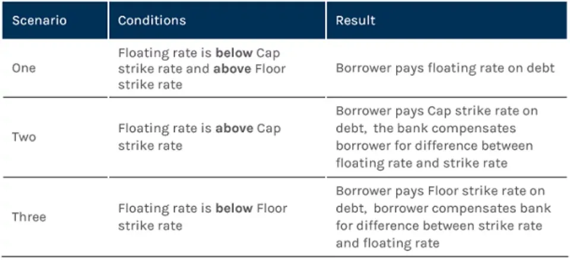

## Table of Contents

## What is an interest rate collar?

An interest rate collar is a financial strategy used to manage the risk of interest rate fluctuations. It involves buying an interest rate cap and selling an interest rate floor. This combination helps to limit the interest rate on a loan or investment within a specific range. By doing this, the borrower or investor can protect themselves from rising interest rates while also accepting a minimum interest rate.

For example, imagine you have a loan with a floating interest rate. You might buy a cap at 5% to ensure that your interest rate never goes above that level. At the same time, you sell a floor at 3%, meaning you agree to pay at least 3% interest. This way, your interest rate will stay between 3% and 5%. The cost of the cap is offset by the income from selling the floor, making the collar a cost-effective way to manage interest rate risk.

## How does an interest rate collar work?

An interest rate collar is a way to control the ups and downs of interest rates on loans or investments. It works by using two tools: an interest rate cap and an interest rate floor. The cap sets a maximum interest rate you'll pay, while the floor sets a minimum interest rate. By buying a cap, you make sure your interest rate won't go above a certain level. By selling a floor, you agree to pay at least a certain rate, and you get money for doing this.

Let's say you have a loan with a floating [interest rate](/wiki/interest-rate-trading-strategies). You might buy a cap at 5% to make sure your interest rate never goes over that. At the same time, you sell a floor at 3%, which means you agree to pay at least 3% interest. This keeps your interest rate between 3% and 5%. The money you get from selling the floor helps pay for the cap, so it's a smart way to manage the risk of changing interest rates without spending too much.

## What are the components of an interest rate collar?

An interest rate collar has two main parts: an interest rate cap and an interest rate floor. The cap is like a safety net that stops your interest rate from going too high. If you have a loan with a floating interest rate, you can buy a cap to make sure you never pay more than a certain amount, like 5%. This protects you if interest rates go up a lot.

The other part is the interest rate floor. When you sell a floor, you agree to pay at least a certain interest rate, like 3%. In return, you get some money. This money can help pay for the cap. So, with a collar, your interest rate stays between the cap and the floor, like between 3% and 5%. This way, you manage the risk of interest rates changing without spending too much.

## Why would someone use an interest rate collar?

Someone would use an interest rate collar to protect themselves from big changes in interest rates. If you have a loan with a floating interest rate, you might worry about the rate going up a lot. By using a collar, you can set a maximum interest rate you'll pay, which gives you peace of mind. This is helpful if you want to keep your loan payments predictable and manageable.

At the same time, using a collar can also help you save money. When you set up a collar, you buy a cap to limit how high your interest rate can go, but you also sell a floor, which means you agree to pay at least a certain rate. The money you get from selling the floor can help pay for the cap. This makes the collar a smart way to manage interest rate risk without spending too much.

## What are the benefits of using an interest rate collar?

Using an interest rate collar can help you manage the ups and downs of interest rates on your loans or investments. It sets a limit on how high your interest rate can go, which means you won't have to worry about your payments getting too expensive if rates go up a lot. This can give you peace of mind and make your financial planning easier because you know the highest rate you'll have to pay.

Another benefit is that it can save you money. When you use a collar, you buy a cap to stop your interest rate from going too high, but you also sell a floor, which means you agree to pay at least a certain rate. The money you get from selling the floor can help pay for the cap. This makes the collar a smart way to control interest rate risk without spending too much.

## What are the potential risks associated with an interest rate collar?

One risk of using an interest rate collar is that you might miss out on lower interest rates. If you have a loan with a floating rate, and interest rates drop below the floor you set, you'll still have to pay the higher rate you agreed to when you sold the floor. This means you could end up paying more than you would have if you hadn't used a collar.

Another risk is that the cost of setting up the collar might not be worth it. Even though selling the floor can help pay for the cap, there's still a cost involved. If interest rates don't change much or if they move in a way that doesn't affect your loan much, you might feel like you spent money on the collar for nothing. It's important to think about these risks before deciding to use an interest rate collar.

## How is an interest rate collar different from a cap or a floor?

An interest rate collar is different from just using a cap or a floor because it combines both. A cap by itself stops your interest rate from going too high. If you have a loan with a floating rate, you can buy a cap to make sure you never pay more than a certain amount, like 5%. On the other hand, a floor by itself means you agree to pay at least a certain rate, like 3%, and you get money for doing this.

An interest rate collar uses both a cap and a floor together. When you buy a cap and sell a floor, you create a range for your interest rate, like between 3% and 5%. This helps you manage the risk of interest rates going up a lot, but it also means you won't benefit if rates go down below the floor. Using a collar can be a smart way to control interest rate risk without spending too much, but it's different from using just a cap or a floor because it sets both a top and bottom limit.

## How do you set up an interest rate collar?

Setting up an interest rate collar involves working with a financial institution, like a bank or a broker. You start by deciding on the interest rate range you want to set for your loan or investment. This means choosing a cap, which is the highest interest rate you're willing to pay, and a floor, which is the lowest interest rate you're willing to accept. Once you have these numbers, you buy the cap from the financial institution to make sure your interest rate won't go above the cap. At the same time, you sell the floor to the same institution, which means you agree to pay at least the floor rate and you get some money for doing this.

The money you get from selling the floor helps pay for the cost of the cap, making the collar a cost-effective way to manage interest rate risk. You'll need to sign an agreement with the financial institution that outlines all the terms of the cap and the floor, including the rates and the duration of the collar. Once everything is set up, your interest rate will stay within the range you've chosen, giving you peace of mind about your future loan payments or investment returns.

## What are the costs involved in setting up an interest rate collar?

Setting up an interest rate collar involves two main costs: the cost of buying the cap and the income you get from selling the floor. The cap is like an insurance policy that stops your interest rate from going too high, and you have to pay for this protection. The price of the cap depends on things like how high you set the cap, how long you want the protection for, and what the current interest rates are.

The floor is the opposite of the cap. When you sell a floor, you agree to pay at least a certain interest rate, and in return, you get some money. This money helps pay for the cap, making the collar cheaper overall. But if interest rates fall below the floor, you'll still have to pay the higher rate you agreed to, which could mean you end up paying more than you would have without the collar.

## Can you provide an example of when an interest rate collar would be beneficial?

Imagine you have a business loan with a floating interest rate. You're worried that if interest rates go up a lot, your loan payments could become too expensive. So, you decide to use an interest rate collar. You buy a cap at 5% to make sure your interest rate never goes above that. At the same time, you sell a floor at 3%, which means you agree to pay at least 3% interest. This keeps your interest rate between 3% and 5%. Now, even if interest rates go up a lot, you know your loan payments won't go over a certain amount, which helps you plan your business finances better.

In this example, the interest rate collar is beneficial because it protects your business from high interest rates. If rates go above 5%, you're safe because of the cap. The money you get from selling the floor at 3% helps pay for the cap, so it's a smart way to manage risk without spending too much. But if interest rates drop below 3%, you'll still pay 3%, which might be higher than the market rate. Still, the peace of mind and financial stability the collar provides can be worth it for your business.

## How does the effectiveness of an interest rate collar vary with market conditions?

The effectiveness of an interest rate collar depends a lot on what's happening in the market. If interest rates are going up a lot, a collar can be really helpful. It stops your loan payments from getting too high because of the cap you bought. The money you got from selling the floor helps pay for the cap, so it doesn't cost too much. But if interest rates stay low or go down, the collar might not be as useful. You'll still have to pay the higher rate you agreed to when you sold the floor, even if the market rate is lower.

In times when interest rates are very unpredictable, a collar can give you peace of mind. It sets a range for your interest rate, so you know what to expect. This can be good for planning your finances. But if the market is stable and interest rates are not changing much, the cost of setting up the collar might not be worth it. You could end up spending money on something that doesn't help you much. So, it's important to think about the market conditions before deciding to use an interest rate collar.

## What advanced strategies can be used in conjunction with an interest rate collar?

One advanced strategy you can use with an interest rate collar is called a "knock-out" feature. This means your collar stops working if interest rates hit a certain level. For example, if you have a collar with a cap at 5% and a floor at 3%, you could add a knock-out at 4%. If interest rates go above 4%, the collar would end, and you'd be back to the floating rate of your loan. This can save you money on the cost of the collar if you think interest rates won't go too high, but it also means you lose the protection if rates do go up a lot.

Another strategy is to use multiple collars at different times. Instead of setting up one collar for the whole loan period, you could set up several collars that start and end at different times. This way, you can adjust the cap and floor as interest rates change. For example, you might start with a collar that lasts for one year, and then set up another collar for the next year with different rates. This gives you more flexibility and can help you save money by only paying for the protection you need at the time.

## What is an interest rate collar?

An interest rate collar is a complex financial instrument designed to manage the risk associated with fluctuating interest rates. It operates by setting a ceiling (cap) and a floor on the interest rate of a loan or other financial instrument. This derivative tool is particularly useful for both borrowers and lenders as it ensures that the interest rate remains within a pre-defined range, thereby providing predictability and risk mitigation against adverse interest rate movements.

In practical terms, an interest rate collar involves the use of two options contracts, each serving a specific purpose within the collar structure. The interest rate cap, essentially a call option, reassures borrowers that their interest payments will not exceed a certain rate, protecting them from rising rates. Conversely, the interest rate floor acts as a put option, ensuring that lenders receive a minimum interest payment, protecting them from rates falling too low.

The mechanism of an interest rate collar involves intricate financial engineering. When establishing a collar, a party may purchase an interest rate cap and simultaneously sell an interest rate floor. The premium income from selling the floor can be used to offset the cost of purchasing the cap, potentially leading to a zero-cost collar, which is a significant advantage for parties looking to manage interest expenses without initial outlay.

Mathematically, if $r(t)$ represents the interest rate at time $t$, and assuming $C$ and $F$ are the cap and floor rates respectively, the payoff from the cap can be represented as:

$$
\max(0, r(t) - C)
$$

Similarly, the payoff from the floor is:

$$
\max(0, F - r(t))
$$

The combined effectiveness of the collar comes from balancing these two elements to keep $r(t)$ within the desired range $[F, C]$.

Interest rate collars are strategic tools in financial management, delivering dual-layered protection against interest rate [volatility](/wiki/volatility-trading-strategies). This makes them indispensable in financial planning for organizations and individuals who seek to stabilize cash flows and manage costs associated with interest rate fluctuations effectively.

## What are the Mechanics of Interest Rate Collars?

Interest rate collars operate by combining two distinct financial derivatives: an interest rate cap and an interest rate floor. This dual approach provides both an upper and lower boundary for interest rate fluctuations. By purchasing an interest rate cap, the buyer incurs a premium cost which serves to restrict the maximum interest expenses that could be encountered. Conversely, by selling an interest rate floor, the investor gains income, thereby constraining the minimum return from alterations in interest rates. This strategic pairing enables investors to maintain anticipated interest costs within a specified range.

The mechanism of an interest rate collar can be detailed through the simultaneous execution of these derivative transactions. In this arrangement, the interest rate cap acts as a protective ceiling, ensuring that the interest paid does not exceed a certain percentage, even if market rates rise significantly. The formula for the payoff from a cap is given by:

$$
\text{Payoff from Cap} = \max(0, \text{Market Rate} - \text{Cap Rate})
$$

In handling the floor, selling it provides an upfront premium, which compensates for capping the minimal earnings from interest rates. The formula for the payoff from a floor is:

$$
\text{Payoff from Floor} = \max(0, \text{Floor Rate} - \text{Market Rate})
$$

By integrating these mechanisms, the interest cost to an investor is maintained between the cap and floor rates, thus moderating exposure to volatile interest rate movements. This predictability in interest expenses facilitates better financial planning and budgeting by mitigating the risk of extreme upward or downward shifts in rates that could destabilize financial strategies.

The effectiveness of an interest rate collar lies in this ability to control potential interest rate swings, creating a financial safeguard that enhances certainty and offers a degree of revenue predictability. With this setup, while the investor accepts some limitations on potential gains, the secure boundaries protect against adverse rate changes.

## References & Further Reading

[1]: ["Options, Futures, and Other Derivatives"](https://www.amazon.com/Options-Futures-Other-Derivatives-10th/dp/013447208X) by John C. Hull

[2]: ["Risk Management and Financial Institutions"](https://books.google.com/books/about/Risk_Management_and_Financial_Institutio.html?id=1J1QDwAAQBAJ) by John C. Hull

[3]: Chance, D. M., & Brooks, R. (2015). ["An Introduction to Derivatives and Risk Management"](https://books.google.com/books/about/Introduction_to_Derivatives_and_Risk_Man.html?id=b8PgBQAAQBAJ) (10th ed.). Cengage Learning.

[4]: ["Interest Rate Risk Modeling: The Fixed Income Valuation Course"](https://www.amazon.com/Interest-Rate-Risk-Modeling-Valuation/dp/0471427241) by Sanjay K. Nawalkha

[5]: Treleaven, P., Galas, M., & Lalchand, V. (2013). ["Algorithmic Trading Review."](https://dl.acm.org/doi/10.1145/2500117) Journal of Trading.