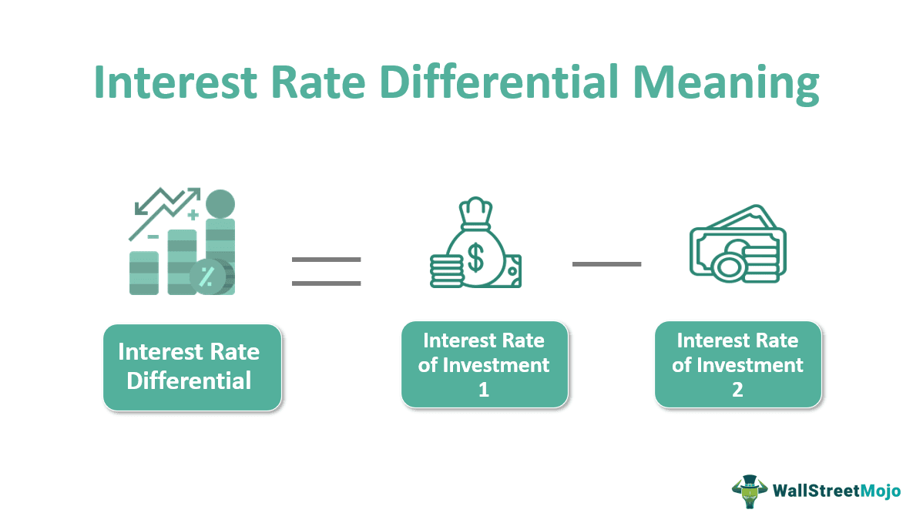

## Table of Contents

## What is an interest rate differential?

An interest rate differential is the difference between the interest rates of two different financial instruments or countries. For example, if one country has an interest rate of 3% and another has an interest rate of 1%, the interest rate differential between them is 2%. This difference can affect how people and businesses move money around the world, as they might want to invest in places where they can earn more interest.

Interest rate differentials are important in the world of finance because they can influence exchange rates and investment decisions. If a country raises its interest rates, its currency might become more valuable because investors want to take advantage of the higher returns. On the other hand, if interest rates are low, people might move their money to countries with higher rates. This movement of money can have big effects on economies and how much things cost in different countries.

## How is interest rate differential calculated?

Interest rate differential is calculated by simply subtracting the interest rate of one financial instrument or country from the interest rate of another. For example, if the interest rate in Country A is 5% and the interest rate in Country B is 2%, the interest rate differential is 5% minus 2%, which equals 3%.

This calculation is important because it helps people understand where they might get a better return on their money. If you're thinking about where to invest or borrow money, knowing the interest rate differential can guide you to make smarter choices. It's like comparing the price of apples in two different stores to see where you can get a better deal.

## Why is interest rate differential important in finance?

Interest rate differential is really important in finance because it helps people decide where to put their money. If one country has higher interest rates than another, people might move their money to that country to get a better return on their savings or investments. This is like choosing to shop at a store where things are on sale. When a lot of people do this, it can make the currency of the country with higher interest rates become more valuable.

This difference in interest rates also affects how much it costs to borrow money. If you're borrowing from a place with low interest rates, it's cheaper than borrowing from a place with high interest rates. This can influence big decisions like where businesses choose to get loans or even where they set up their operations. So, understanding interest rate differential helps everyone from individual savers to big companies make better financial choices.

## What role does interest rate differential play in forex trading?

Interest rate differential is super important in forex trading because it can affect how much one country's money is worth compared to another's. When a country raises its interest rates, its currency often becomes more valuable. This is because people want to invest in that country to get a better return on their money. So, if you're trading currencies, knowing which country has higher interest rates can help you guess which currency might go up in value.

In forex trading, traders often use something called the "carry trade" strategy, which is all about interest rate differentials. In a carry trade, a trader borrows money from a country with low interest rates and then uses that money to invest in a country with high interest rates. The goal is to make money from the difference in interest rates. But, it's not always easy because if the currency of the country with high interest rates goes down in value, the trader could lose money. So, interest rate differentials are a big deal in deciding what to do in forex trading.

## How does interest rate differential affect currency values?

Interest rate differential is a big deal when it comes to how much one country's money is worth compared to another's. If a country raises its interest rates, it often makes its own currency more valuable. This happens because when interest rates go up, people want to invest in that country to get a better return on their money. So, more people buy that country's currency, which makes it stronger compared to other currencies.

On the other hand, if a country lowers its interest rates, its currency might become less valuable. When interest rates are low, people might take their money out of that country and invest it somewhere else where they can earn more interest. This means fewer people want that country's currency, so it becomes weaker. Understanding these changes can help people and businesses make smarter choices about where to put their money or when to trade currencies.

## Can you explain the carry trade strategy related to interest rate differential?

The carry trade strategy is a way that people in the world of money try to make a profit by using interest rate differences. They borrow money from a country where interest rates are low and then use that money to invest in a country where interest rates are high. The idea is to make money from the difference between what they pay to borrow and what they earn from their investment. It's like borrowing money at a cheap rate and then lending it out at a higher rate to make a profit.

But, the carry trade isn't always easy. If the currency of the country with high interest rates goes down in value, the trader could lose money. For example, if you borrow in a currency that stays strong and invest in a currency that gets weaker, you might end up losing more than you gain from the interest rate difference. So, people who do carry trades need to keep an eye on how currencies are doing and be ready to change their plans if things don't go as expected.

## What are the risks associated with strategies based on interest rate differential?

Using strategies like the carry trade, which rely on interest rate differences, can be risky. One big risk is that currencies can change in value. If you borrow money in a country with low interest rates and invest it in a country with high interest rates, you're hoping to make money from the difference. But if the currency of the country you invested in goes down in value compared to the one you borrowed in, you could lose money. This is because you need to pay back the loan in the original currency, which might now be worth more than the money you made from your investment.

Another risk is that interest rates can change unexpectedly. If the country with high interest rates suddenly lowers them, or if the country with low interest rates raises them, the whole plan can fall apart. This can happen because of things like changes in the economy or decisions made by the people who control interest rates. So, even if everything looks good at the start, a sudden change can make a carry trade go wrong.

Lastly, there's also the risk of big events happening that nobody can predict, like financial crises or political changes. These events can cause currencies to move a lot and in ways that are hard to guess. If something like this happens, it can mess up the whole strategy and lead to big losses. So, while trying to make money from interest rate differences can be tempting, it comes with a lot of risks that need to be carefully watched.

## How do central bank policies influence interest rate differentials?

Central banks are like the bosses of a country's money. They decide what the interest rates should be, and these decisions can make a big difference in interest rate differentials between countries. If a central bank raises its interest rates, it can make its country's money more valuable because people want to invest there to get a better return. On the other hand, if a central bank lowers its interest rates, it might make its country's money less valuable because people might take their money elsewhere to find higher interest rates. So, when central banks change their interest rates, it can change how much one country's money is worth compared to another's.

These changes in central bank policies can have a big impact on things like forex trading and carry trades. For example, if a trader is using a carry trade strategy, they need to pay close attention to what central banks are doing. If a central bank in the country they're investing in suddenly lowers its interest rates, the trader's plan might not work out as expected. Also, if central banks in different countries are moving their interest rates in opposite directions, it can create bigger interest rate differentials, which can lead to more people trying to take advantage of these differences. This can make currencies move a lot and affect the global economy in big ways.

## What impact does inflation have on interest rate differentials?

Inflation is like when things start to cost more money over time. It can change how central banks decide on interest rates, which then affects interest rate differentials. If a country has high inflation, its central bank might raise interest rates to try to slow down the rising prices. When they do this, it can make the interest rate in that country higher compared to other countries with lower inflation. This difference in interest rates can make more people want to invest in the country with higher rates, which can make its money more valuable.

On the other hand, if a country has low inflation or even prices going down, its central bank might lower interest rates to encourage people to spend more money. This can make the interest rate in that country lower than in countries with higher inflation. When interest rates are lower, people might move their money to other places where they can earn more interest. So, inflation can really shake things up and change how much one country's money is worth compared to another's, all because of the way it influences interest rates and the differences between them.

## How do interest rate differentials between countries affect global investment flows?

Interest rate differentials between countries are like a big sign that tells people where to put their money. When one country has higher interest rates than another, it's like a magnet pulling money in. Investors want to put their money where they can earn more interest, so they move it to the country with the higher rates. This can make the country with higher interest rates more attractive for all kinds of investments, from savings accounts to big business projects. It's like choosing a store where things are on sale; more people go there because they can get a better deal.

But it's not just about the interest rates. When lots of money moves into a country because of high interest rates, it can make that country's money more valuable. This can help the country's economy grow because a stronger currency can make it cheaper to buy things from other countries. On the flip side, if a country has low interest rates, money might flow out to places with higher rates, making its currency weaker. This can make things more expensive for people in that country and affect how businesses operate. So, interest rate differentials are a big deal in deciding where money goes around the world.

## What are some historical examples where interest rate differentials significantly influenced markets?

One big example happened in the 1980s and 1990s with Japan. Japan had really low interest rates, while the U.S. had higher ones. People saw this difference and started doing something called the carry trade. They borrowed money in Japan at low rates and invested it in the U.S. where they could earn more. This moved a lot of money around and helped make the U.S. dollar stronger compared to the Japanese yen. But then, in the late 1990s, things changed. Japan raised its interest rates a bit, and the U.S. lowered theirs. This made the carry trade less profitable, and it caused a lot of changes in the forex market.

Another example is from the early 2000s, when the U.S. had low interest rates after the dot-com bubble burst. Countries like Australia and New Zealand had higher interest rates. Investors saw this and started moving their money to these countries to get better returns. This made the Australian and New Zealand dollars stronger. But when the U.S. started raising its interest rates again in the mid-2000s, the flow of money changed. People started moving their money back to the U.S., which made the U.S. dollar stronger again and affected the value of other currencies. These shifts in money flow showed how interest rate differences can shake up the global economy.

## How can advanced statistical models be used to predict changes in interest rate differentials?

Advanced statistical models can help predict changes in interest rate differentials by looking at a lot of data from the past and finding patterns. These models use things like time series analysis, which means they study how interest rates have changed over time. They also use other economic indicators, like inflation rates and employment numbers, to make their predictions. By putting all this information together, the models can guess how interest rates might change in the future and what the differences between countries might be. It's like using a weather forecast to predict if it will rain; the models look at past weather patterns and current conditions to make their best guess.

These models can also use [machine learning](/wiki/machine-learning), which is a way for computers to learn from data and get better at making predictions over time. Machine learning can find small details in the data that might be hard for people to see. For example, it might notice that certain events, like elections or changes in oil prices, often lead to changes in interest rates. By understanding these patterns, the models can make more accurate guesses about what might happen next. This can be really helpful for people who need to make decisions about where to invest their money or how to manage their finances, because knowing what might happen with interest rate differentials can help them plan better.

## What is Understanding Interest Rate Differential (IRD)?

Interest Rate Differential (IRD) is an essential concept in both forex and fixed-income markets, representing the difference between the interest rates of two distinct financial instruments. This difference can be a pivotal [factor](/wiki/factor-investing) in determining the potential profitability of various trading strategies.

In the context of forex markets, IRD commonly involves comparing interest rates between two countries' currencies. For example, if currency A offers a 3% interest rate and currency B offers a 1% interest rate, the IRD is 2%. Traders capitalize on this difference through strategies like the carry trade, where they borrow money in a currency with a low-interest rate and invest it in a currency with a higher interest rate. This strategy aims to profit from the interest rate spread while maintaining stable exchange rates. The nominal profit from such a trade is determined by the IRD, making it a key indicator for traders.

The formula for calculating the interest rate differential in forex can be expressed as follows:

$$
\text{IRD} = i_{\text{currency A}} - i_{\text{currency B}}
$$

Where $i_{\text{currency A}}$ and $i_{\text{currency B}}$ are the interest rates of currency A and currency B, respectively.

Beyond [forex](/wiki/forex-system), IRD has significant applications in fixed-income markets, such as bonds. It allows traders to identify potential [arbitrage](/wiki/arbitrage) opportunities by measuring the discrepancy in interest rates between similar fixed-income instruments across different countries or issuers. For instance, if a government bond in one country offers a 5% [interest rate](/wiki/interest-rate-trading-strategies) while a comparable bond in another country offers a 4% rate, the 1% IRD might tempt traders to engage in cross-border investments, assuming stable currency exchange rates.

IRD also informs risk assessments and portfolio adjustments, helping traders decide when to enter or [exit](/wiki/exit-strategy) trades based on projected interest rate movements. By analyzing IRD, traders can forecast potential gains or losses and strategize accordingly to exploit interest rate variances effectively.

Understanding the nuances of IRD is crucial for accurately predicting its impact on trading strategies, especially in a dynamic economic landscape where interest rates are subject to change. This understanding enables traders to optimize their portfolios, pursue informed investment decisions, and enhance overall trade performance.

## What is the role of IRD in Forex Markets?

Interest Rate Differential (IRD) plays a pivotal role in forex trading by influencing the profitability of [carry](/wiki/carry-trading) trades. A carry trade involves borrowing capital in a currency with a lower interest rate and investing it in a currency offering a higher interest rate. The IRD represents the difference between these rates, and it becomes a key determinant of the potential profit margin for traders engaging in this strategy. 

For example, consider two currencies: Currency A with an interest rate of 1% and Currency B with an interest rate of 5%. The IRD is calculated as follows:

$$
\text{IRD} = \text{Interest Rate of Currency B} - \text{Interest Rate of Currency A} = 5\% - 1\% = 4\%
$$

In this scenario, a trader borrowing in Currency A and investing in Currency B could potentially earn a 4% profit margin, assuming stable exchange rates.

However, the success of carry trades is not solely dependent on the IRD. Stability in exchange rates is crucial, as fluctuations can significantly impact profitability. If the value of the higher-yielding currency depreciates relative to the borrowed currency, the trader's returns could diminish or turn negative. For example, even a minor exchange rate shift could offset gains from the interest rate differential, especially when leveraging large positions.

Moreover, carry trades are exposed to several risks. Political instability, economic upheavals, or unexpected monetary policy changes can lead to volatile currency movements. Traders must therefore employ risk management strategies, such as stop-loss orders, to protect their positions. Utilizing hedging techniques can also mitigate potential losses arising from adverse currency fluctuations.

Despite the risks, carry trades remain popular due to their potential for high returns, particularly in low [volatility](/wiki/volatility-trading-strategies) environments. Experienced traders often analyze economic indicators and employ algorithmic models to optimize their entry and exit points, ensuring that they capitalize on favorable IRD conditions while minimizing exposure to currency risk.

In conclusion, while the IRD is a crucial component in determining the potential profitability of carry trades in forex markets, traders must remain vigilant to exchange rate risks and employ rigorous strategies to safeguard their investments.

## What are Differential Interest Rates in Mortgage Lending?

Interest rate differentials play a significant role in mortgage lending by affecting the cost-effectiveness of refinancing and new loan options. Borrowers often evaluate these differentials by comparing their current loan rates with prevailing market rates. This comparison helps in determining whether refinancing would be beneficial, potentially leading to reduced monthly payments or decreased overall interest expenses over the life of the loan.

### Calculating Interest Rate Differential in Mortgages

To calculate the Interest Rate Differential (IRD) in the context of mortgages, borrowers typically look at the difference between the interest rate they currently pay and the rate available for new loans in the market. If the current market rates are lower than the existing mortgage rate, refinancing could offer significant savings.

The IRD can be mathematically represented as:

$$
\text{IRD} = R_{\text{current}} - R_{\text{market}}
$$

where $R_{\text{current}}$ is the interest rate on the current mortgage and $R_{\text{market}}$ is the current market interest rate for a similar mortgage product.

### Implications for Borrowers

Understanding the IRD is crucial for borrowers as it directly impacts the decision to refinance. A substantial positive IRD, meaning the market rate is significantly lower than the current rate, suggests that refinancing could be a wise financial move. However, borrowers must also consider other factors such as closing costs, prepayment penalties (if any), and the length of time they plan to stay in the home after refinancing.

Calculating the breakeven point—where the costs of refinancing are offset by the savings achieved from the lower interest rate—is also important. This helps determine how long it will take for the savings from the lower interest rate to cover the initial costs of refinancing.

Here's a simple example to illustrate the concept:

```python
def calculate_breakeven_point(closing_costs, monthly_savings):
    return closing_costs / monthly_savings

# Example values
closing_costs = 3000  # in dollars
monthly_savings = 150  # in dollars

breakeven_months = calculate_breakeven_point(closing_costs, monthly_savings)
print(f"Breakeven point: {breakeven_months} months")
```

In this example, if the closing costs for refinancing are $3,000 and the monthly savings is $150 due to a decreased interest rate, the breakeven point would occur in 20 months. If the homeowner plans to stay in the house for longer than 20 months, refinancing may be a smart financial decision.

By understanding and calculating the IRD in mortgages, borrowers can make informed decisions, thereby optimizing their financial outcomes in the long run.

## References & Further Reading

[1]: Gagnon, J. E., & Ihrig, J. E. (2004). ["Monetary Policy and Exchange Rate Pass-Through."](https://www.federalreserve.gov/pubs/ifdp/2001/704/ifdp704r.pdf) International Finance Discussion Papers, Federal Reserve Board.

[2]: Bhansali, V. (2007). ["Carry Trades and Currency Crashes."](http://www.princeton.edu/~markus/research/papers/carry_trades_currency_crashes.pdf) Financial Analysts Journal, 63(5), 55-68.

[3]: ["Interest Rate Differential Approach and Foreign Exchange Market Equilibrium."](https://open.lib.umn.edu/principleseconomics/chapter/25-2-demand-supply-and-equilibrium-in-the-money-market/) Available on ResearchGate.

[4]: Hull, J. C. (2018). ["Options, Futures, and Other Derivatives (9th Edition)."](https://www.semanticscholar.org/paper/Options%2C-Futures%2C-and-Other-Derivatives-Hull/89bdee500c8623864fc9eb7a471546aa713acc44) Pearson Education.

[5]: Fisher, L. (2023). ["How Interest Rates Affect Bond Prices."](https://personalfinancelab.com/bonds/how-interest-rates-affect-bond-prices/) Investopedia.