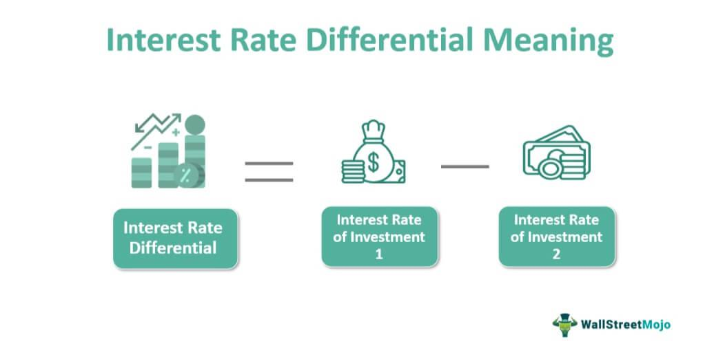

Algorithmic trading, commonly referred to as algo trading, has significantly transformed the financial markets by automating trading processes which were traditionally handled manually. Through the use of sophisticated algorithms, traders can execute buy and sell orders at optimal times and prices, enhancing the overall efficiency of trades and reducing the risk of human error. This technological advance allows for rapid execution that is difficult to achieve by human traders, often operating within milliseconds.

A deep understanding of key financial terms is essential for the success of algo trading, as financial markets are influenced by a multitude of factors such as economic indicators, interest rates, and geopolitical events. Among these, the concept of differential interest rates is paramount. Interest rate differentials can dictate the strategy employed by algorithmic trading systems, particularly in how they are programmed to respond to changes in these rates that can affect pricing and market trends. 



This article focuses on exploring how differential interest rates intersect with financial terminologies within the sphere of algorithmic trading. We aim to simplify these often complex concepts to better highlight their significance for both novice and seasoned traders. By offering clarity on these subjects, traders can develop informed strategies that leverage the power of algorithmic trading to maximize profits and mitigate risks effectively.

## Table of Contents

## Understanding Interest Rate Differential (IRD)

Interest Rate Differential (IRD) is an essential concept in both forex and fixed-income markets, representing the difference between the interest rates of two distinct financial instruments. This difference can be a pivotal factor in determining the potential profitability of various trading strategies.

In the context of forex markets, IRD commonly involves comparing interest rates between two countries' currencies. For example, if currency A offers a 3% interest rate and currency B offers a 1% interest rate, the IRD is 2%. Traders capitalize on this difference through strategies like the carry trade, where they borrow money in a currency with a low-interest rate and invest it in a currency with a higher interest rate. This strategy aims to profit from the interest rate spread while maintaining stable exchange rates. The nominal profit from such a trade is determined by the IRD, making it a key indicator for traders.

The formula for calculating the interest rate differential in forex can be expressed as follows:

$$
\text{IRD} = i_{\text{currency A}} - i_{\text{currency B}}
$$

Where $i_{\text{currency A}}$ and $i_{\text{currency B}}$ are the interest rates of currency A and currency B, respectively.

Beyond [forex](/wiki/forex-system), IRD has significant applications in fixed-income markets, such as bonds. It allows traders to identify potential [arbitrage](/wiki/arbitrage) opportunities by measuring the discrepancy in interest rates between similar fixed-income instruments across different countries or issuers. For instance, if a government bond in one country offers a 5% [interest rate](/wiki/interest-rate-trading-strategies) while a comparable bond in another country offers a 4% rate, the 1% IRD might tempt traders to engage in cross-border investments, assuming stable currency exchange rates.

IRD also informs risk assessments and portfolio adjustments, helping traders decide when to enter or [exit](/wiki/exit-strategy) trades based on projected interest rate movements. By analyzing IRD, traders can forecast potential gains or losses and strategize accordingly to exploit interest rate variances effectively.

Understanding the nuances of IRD is crucial for accurately predicting its impact on trading strategies, especially in a dynamic economic landscape where interest rates are subject to change. This understanding enables traders to optimize their portfolios, pursue informed investment decisions, and enhance overall trade performance.

## Role of IRD in Forex Markets

Interest Rate Differential (IRD) plays a pivotal role in forex trading by influencing the profitability of [carry](/wiki/carry-trading) trades. A carry trade involves borrowing capital in a currency with a lower interest rate and investing it in a currency offering a higher interest rate. The IRD represents the difference between these rates, and it becomes a key determinant of the potential profit margin for traders engaging in this strategy. 

For example, consider two currencies: Currency A with an interest rate of 1% and Currency B with an interest rate of 5%. The IRD is calculated as follows:

$$
\text{IRD} = \text{Interest Rate of Currency B} - \text{Interest Rate of Currency A} = 5\% - 1\% = 4\%
$$

In this scenario, a trader borrowing in Currency A and investing in Currency B could potentially earn a 4% profit margin, assuming stable exchange rates.

However, the success of carry trades is not solely dependent on the IRD. Stability in exchange rates is crucial, as fluctuations can significantly impact profitability. If the value of the higher-yielding currency depreciates relative to the borrowed currency, the trader's returns could diminish or turn negative. For example, even a minor exchange rate shift could offset gains from the interest rate differential, especially when leveraging large positions.

Moreover, carry trades are exposed to several risks. Political instability, economic upheavals, or unexpected monetary policy changes can lead to volatile currency movements. Traders must therefore employ risk management strategies, such as stop-loss orders, to protect their positions. Utilizing hedging techniques can also mitigate potential losses arising from adverse currency fluctuations.

Despite the risks, carry trades remain popular due to their potential for high returns, particularly in low [volatility](/wiki/volatility-trading-strategies) environments. Experienced traders often analyze economic indicators and employ algorithmic models to optimize their entry and exit points, ensuring that they capitalize on favorable IRD conditions while minimizing exposure to currency risk.

In conclusion, while the IRD is a crucial component in determining the potential profitability of carry trades in forex markets, traders must remain vigilant to exchange rate risks and employ rigorous strategies to safeguard their investments.

## IRD in Bond Markets

Interest Rate Differential (IRD) in bond markets represents the difference in interest rates between two similar securities, and it plays a significant role in the decision-making processes of fixed-income traders. This differential is pivotal in identifying opportunities for profit, given that interest rate discrepancies can create potential arbitrage situations. However, this is contingent upon stable currency exchange rates; fluctuations in exchange rates can dramatically affect the returns that a trader anticipates from leveraging IRD.

Currency fluctuations introduce risks that can undermine the benefits derived from interest rate differentials. For example, if a trader invests in a bond denominated in a foreign currency, any adverse movements in the exchange rate can erode the profits obtained from the interest rate advantage. This necessitates a thorough risk assessment and possibly the use of hedging strategies to mitigate potential losses from currency movements.

Leverage, a common tool in bond trading, can magnify both profits and losses when dealing with IRD. When leverage is applied, a trader borrows funds to increase their investment position, betting on the interest rate differential to provide a higher return on investment (ROI). For instance, a bond trader may use leverage to capitalize on small differences in interest rates between two bonds. However, the amplified risk means that an adverse movement in rates or currency values could result in substantial losses.

Practical examples illustrate the application of IRD in bond markets. Consider a scenario where a trader notices a discrepancy between the interest rates of U.S. Treasury bonds and equivalent German Bunds. By borrowing funds in the currency with the lower interest rate (e.g., euros if euro rates are lower), the trader can invest in the bond offering a higher yield (e.g., U.S. Treasuries), seeking to profit from the interest rate spread. The observation of historical interest rate spreads and currency stability between these instruments could guide such trades, highlighting the importance of comprehensive market analysis.

To implement a strategy based on IRD in bond markets, traders might utilize computational algorithms. Here's a simple Python example that calculates the potential profit from an IRD strategy:

```python
def calculate_ird_profit(investment, rate_a, rate_b, duration_years, leverage=1):
    """
    Calculate the potential profit from an IRD strategy.
    :param investment: Initial investment amount
    :param rate_a: Interest rate of bond A
    :param rate_b: Interest rate of bond B
    :param duration_years: Duration of investment in years
    :param leverage: Leverage factor
    :return: Total profit from the investment
    """
    effective_investment = investment * leverage
    profit_a = effective_investment * (rate_a / 100) * duration_years
    profit_b = effective_investment * (rate_b / 100) * duration_years
    return profit_a - profit_b

# Example usage
investment_amount = 100000  # $100,000
interest_rate_a = 5  # 5% on bond A
interest_rate_b = 2  # 2% on bond B
investment_duration = 2  # 2 years
leverage_factor = 2  # 2x leverage

profit = calculate_ird_profit(investment_amount, interest_rate_a, interest_rate_b, investment_duration, leverage_factor)
print(f"Potential Profit from IRD Strategy: ${profit}")
```

This code calculates the potential profit by taking into account the investment amount, interest rates of the two bonds, duration, and leverage. By understanding the mechanics of IRD in bond markets and accompanying risks, traders can effectively exploit these opportunities, enhancing their trading strategies.

## Differential Interest Rates in Mortgage Lending

Interest rate differentials play a significant role in mortgage lending by affecting the cost-effectiveness of refinancing and new loan options. Borrowers often evaluate these differentials by comparing their current loan rates with prevailing market rates. This comparison helps in determining whether refinancing would be beneficial, potentially leading to reduced monthly payments or decreased overall interest expenses over the life of the loan.

### Calculating Interest Rate Differential in Mortgages

To calculate the Interest Rate Differential (IRD) in the context of mortgages, borrowers typically look at the difference between the interest rate they currently pay and the rate available for new loans in the market. If the current market rates are lower than the existing mortgage rate, refinancing could offer significant savings.

The IRD can be mathematically represented as:

$$
\text{IRD} = R_{\text{current}} - R_{\text{market}}
$$

where $R_{\text{current}}$ is the interest rate on the current mortgage and $R_{\text{market}}$ is the current market interest rate for a similar mortgage product.

### Implications for Borrowers

Understanding the IRD is crucial for borrowers as it directly impacts the decision to refinance. A substantial positive IRD, meaning the market rate is significantly lower than the current rate, suggests that refinancing could be a wise financial move. However, borrowers must also consider other factors such as closing costs, prepayment penalties (if any), and the length of time they plan to stay in the home after refinancing.

Calculating the breakeven point—where the costs of refinancing are offset by the savings achieved from the lower interest rate—is also important. This helps determine how long it will take for the savings from the lower interest rate to cover the initial costs of refinancing.

Here's a simple example to illustrate the concept:

```python
def calculate_breakeven_point(closing_costs, monthly_savings):
    return closing_costs / monthly_savings

# Example values
closing_costs = 3000  # in dollars
monthly_savings = 150  # in dollars

breakeven_months = calculate_breakeven_point(closing_costs, monthly_savings)
print(f"Breakeven point: {breakeven_months} months")
```

In this example, if the closing costs for refinancing are $3,000 and the monthly savings is $150 due to a decreased interest rate, the breakeven point would occur in 20 months. If the homeowner plans to stay in the house for longer than 20 months, refinancing may be a smart financial decision.

By understanding and calculating the IRD in mortgages, borrowers can make informed decisions, thereby optimizing their financial outcomes in the long run.

## Integrating Financial Terms in Algo Trading

Algorithmic trading systems rely significantly on an intricate understanding of financial terms such as Interest Rate Differential (IRD) to devise strategies that effectively navigate the complexities of financial markets. By comprehending these terms and their implications, traders can design algorithms that are fine-tuned to specific market conditions, thereby optimizing trading performance.

### Key Financial Terms for Algorithmic Trading

Interest Rate Differential (IRD) plays a crucial role in developing trading strategies. In forex trading, IRD helps identify arbitrage opportunities by leveraging differential interest rates between currencies. For instance, in a carry trade, buying a currency with a higher interest rate while selling one with a lower rate can yield profits, provided exchange rates remain stable. Incorporating IRD into algorithms enables traders to automate the identification of such opportunities, enhancing decision-making precision.

Other fundamental financial terms integral to [algorithmic trading](/wiki/algorithmic-trading) include [liquidity](/wiki/liquidity-risk-premium), volatility, and bid-ask spread. Liquidity, which pertains to how quickly an asset can be bought or sold in the market without affecting its price, directly influences strategy formulation. Algorithms can be programmed to execute trades in highly liquid markets to minimize the impact on prices. Volatility, which measures price fluctuations, is another critical [factor](/wiki/factor-investing) used to adjust risk management parameters within trading algorithms. The bid-ask spread, representing the difference between the highest price a buyer is willing to pay for an asset and the lowest price a seller is willing to accept, serves as a transaction cost that traders must account for when developing strategies.

### Enhancing Trading Performance through Financial Terms

Incorporating financial terms into algorithmic trading systems can substantially enhance trading performance. By quantitatively analyzing these terms, traders can model and predict market behaviors with greater accuracy. For example, using Python, traders can implement algorithms that continuously analyze market data, applying IRD and other financial metrics to identify profitable trades. A simple Python code snippet demonstrating how to calculate and monitor IRD could be structured as follows:

```python
def calculate_ird(base_currency_rate, quote_currency_rate):
    return base_currency_rate - quote_currency_rate

# Example usage
base_rate = 0.05  # 5% interest rate for the base currency
quote_rate = 0.02  # 2% interest rate for the quote currency

ird = calculate_ird(base_rate, quote_rate)
print(f"Interest Rate Differential: {ird * 100}%")
```

This example highlights how such computations form the backbone of automated trading systems, allowing for rapid analysis and execution far beyond human capabilities.

Furthermore, understanding these financial concepts empowers traders to optimize their algorithmic models based on market conditions, such as adjusting leverage levels in response to varying volatility. This adaptability is essential for maintaining competitive edge and mitigating risks in fast-paced financial environments.

In conclusion, mastering financial terms and their application within algorithms is vital for traders leveraging algorithmic systems. Such understanding not only facilitates the creation of robust strategies tailored to current market dynamics but also significantly amplifies trading efficiency, potentially leading to increased profitability.

## The Importance of a Glossary for Algo Trading

A comprehensive glossary is an indispensable tool for those engaging in algorithmic trading. It serves as a crucial resource for decoding the complex technical jargon that often characterizes this fast-paced domain. As traders encounter an array of sophisticated financial terms and concepts, a well-structured glossary assists in swiftly grasping these notions, thereby enhancing understanding and execution efficiency.

An effective glossary should encompass both fundamental and advanced trading terminology. Basic terms might include definitions of bid-ask spread, leverage, and slippage, which are essential for beginners to understand market dynamics. Meanwhile, advanced terms such as stochastic differential equations, [backtesting](/wiki/backtesting), and latency arbitrage cater to experienced traders seeking to refine their strategies further.

In considering essential terms for an algorithmic trading glossary, the inclusion of definitions related to financial instruments, market mechanics, and quantitative strategies is vital. For instance, understanding "liquidity" is crucial as it directly influences the execution price of trades. Moreover, terms such as volatility measures (e.g., standard deviation, beta) provide insights into market risks, essential for formulating robust trading algorithms.

Additionally, algorithmic trading frequently employs mathematical models and statistical methods. Terms like Brownian motion, Monte Carlo simulations, and [machine learning](/wiki/machine-learning) classifiers are pivotal for traders developing or refining algorithmic models. Incorporating coding terminologies and syntax, particularly in languages like Python, C++, or R, would further enhance the glossary. This enables traders to apply computational techniques proficiently, as code snippets often form the backbone of algorithmic strategies.

```python
# Example Python code snippet for calculating moving average
import numpy as np

def moving_average(prices, window_size):
    return np.convolve(prices, np.ones(window_size), 'valid') / window_size

# Calculate a simple moving average on a list of prices
prices = [30.0, 31.5, 33.0, 32.5, 31.0, 30.5]
window_size = 3
ma = moving_average(prices, window_size)
print(ma)  # Output: [31.5, 32.33333333, 32.16666667, 31.33333333]
```

Ultimately, the creation and continual updating of a glossary ensure that traders can maintain a keen edge over market complexities. It allows for a deeper comprehension of algorithmic trading strategies, laying the foundation for successful market navigation and decision-making.

## Conclusion

Differential interest rates and the financial concepts associated with them play a pivotal role in the landscape of trading strategies. By bridging the gap between varying interest rates across different financial instruments, traders can exploit opportunities that may significantly enhance the effectiveness of algorithmic trading systems. Mastering the interaction between interest rate differentials, such as in forex and bond markets, allows traders to anticipate potential profit margins and manage risks more effectively. 

Algorithmic trading, which thrives on precise calculations and strategic decision-making, benefits immensely from integrating these interest rate differentials. By programming algorithms to automatically adjust positions based on these differences, traders can optimize their strategies to capitalize on market inefficiencies.

Staying informed about the latest developments in differential interest rates and related financial concepts is essential for maintaining a competitive edge in trading. As financial markets continuously evolve, so too must the strategies employed within them. Therefore, traders are encouraged to deepen their understanding of these topics, regularly refining and updating their trading strategies to align with current and anticipated market conditions.

By fostering a robust comprehension of differential interest rates, and continuously honing trading algorithms to reflect this understanding, traders can enhance the performance and profitability of their algorithmic systems. The ongoing education and adaptation in this domain are essential components for achieving sustained trading success.

## References & Further Reading

[1]: Gagnon, J. E., & Ihrig, J. E. (2004). ["Monetary Policy and Exchange Rate Pass-Through."](https://www.federalreserve.gov/pubs/ifdp/2001/704/ifdp704r.pdf) International Finance Discussion Papers, Federal Reserve Board.

[2]: Bhansali, V. (2007). ["Carry Trades and Currency Crashes."](http://www.princeton.edu/~markus/research/papers/carry_trades_currency_crashes.pdf) Financial Analysts Journal, 63(5), 55-68.

[3]: ["Interest Rate Differential Approach and Foreign Exchange Market Equilibrium."](https://open.lib.umn.edu/principleseconomics/chapter/25-2-demand-supply-and-equilibrium-in-the-money-market/) Available on ResearchGate.

[4]: Hull, J. C. (2018). ["Options, Futures, and Other Derivatives (9th Edition)."](https://www.semanticscholar.org/paper/Options%2C-Futures%2C-and-Other-Derivatives-Hull/89bdee500c8623864fc9eb7a471546aa713acc44) Pearson Education.

[5]: Fisher, L. (2023). ["How Interest Rates Affect Bond Prices."](https://personalfinancelab.com/bonds/how-interest-rates-affect-bond-prices/) Investopedia.