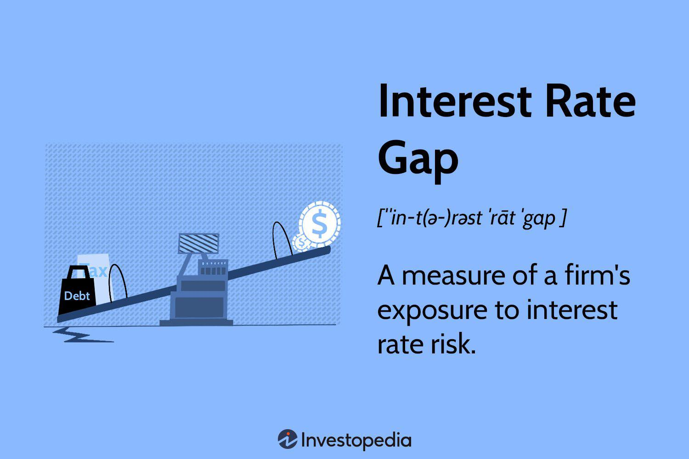

## Table of Contents

## What is an interest rate gap?

An interest rate gap is the difference between the amount of interest-sensitive assets and interest-sensitive liabilities of a financial institution. Interest-sensitive assets are things like loans and securities that earn interest, while interest-sensitive liabilities are things like deposits and borrowings that the institution has to pay interest on. When interest rates change, this gap can affect the institution's income and overall financial health.

If the interest rates go up, a bank with more interest-sensitive assets than liabilities can make more money because they earn more on their assets. But if they have more interest-sensitive liabilities, they might lose money because they have to pay more interest to their customers. Managing the interest rate gap is important for banks to keep their profits stable and avoid big financial risks.

## Why is the interest rate gap important for financial institutions?

The interest rate gap is important for financial institutions because it shows how changes in interest rates can affect their profits. If a bank has more assets that earn interest than liabilities that cost interest, it can make more money when interest rates go up. But if it has more liabilities that cost interest, it might lose money because it has to pay more to its customers. This difference, or gap, helps banks predict how their income will change with interest rate movements.

Managing the interest rate gap is crucial for banks to keep their finances stable. If the gap is too big, even small changes in interest rates can cause big swings in profits. Banks use different strategies to manage this gap, like adjusting the types of loans they give out or the interest rates they offer on deposits. By keeping the gap balanced, banks can protect themselves from financial risks and ensure they remain profitable over time.

## How does the interest rate gap affect a bank's profitability?

The interest rate gap affects a bank's profitability by showing how much its earnings could change when interest rates go up or down. If a bank has more assets that earn interest, like loans, than liabilities that cost interest, like deposits, it can make more money when interest rates rise. This is because the bank earns more from its loans but doesn't have to pay as much on its deposits. On the other hand, if a bank has more liabilities that cost interest than assets that earn interest, it might lose money when interest rates go up because it has to pay more to its customers.

Managing the interest rate gap is important for a bank to keep its profits steady. If the gap is too big, even small changes in interest rates can cause big changes in the bank's earnings. Banks try to keep the gap balanced by changing the types of loans they offer or the interest rates they give on deposits. By doing this, banks can protect themselves from big financial risks and make sure they stay profitable over time.

## What are the basic components needed to measure the interest rate gap?

To measure the interest rate gap, you need to look at two main things: interest-sensitive assets and interest-sensitive liabilities. Interest-sensitive assets are things like loans and bonds that the bank earns interest on. Interest-sensitive liabilities are things like customer deposits and borrowings that the bank has to pay interest on. The gap is the difference between these two amounts.

You figure out the interest rate gap by subtracting the total amount of interest-sensitive liabilities from the total amount of interest-sensitive assets. If the result is positive, the bank has more assets that earn interest than liabilities that cost interest. If it's negative, the bank has more liabilities that cost interest than assets that earn interest. This gap helps the bank see how changes in interest rates might affect its profits.

## Can you explain the difference between repricing and maturity gaps?

Repricing gap and maturity gap are two ways banks look at how changes in interest rates might affect their profits. A repricing gap looks at when the interest rates on a bank's assets and liabilities can change. For example, if a bank has a loan where the interest rate can go up or down every six months, that loan has a repricing period of six months. The repricing gap is the difference between the total amount of assets and liabilities that can change their interest rates at the same time. This helps banks see how their profits might change if interest rates go up or down.

A maturity gap, on the other hand, focuses on when the bank's assets and liabilities are due to be paid back. It's the difference between the total amount of assets and liabilities that will mature, or come due, at the same time. For example, if a bank has a loan that needs to be paid back in one year, that loan has a maturity of one year. By looking at the maturity gap, banks can see how changes in interest rates might affect them when they need to renew or replace those assets and liabilities. Both gaps help banks manage their risk, but they look at different aspects of how interest rates can affect the bank's money.

## How do you calculate the interest rate gap?

To calculate the interest rate gap, you need to know about two things: interest-sensitive assets and interest-sensitive liabilities. Interest-sensitive assets are things like loans and bonds that the bank earns interest on. Interest-sensitive liabilities are things like customer deposits and borrowings that the bank has to pay interest on. The interest rate gap is the difference between the total amount of these assets and liabilities. You find it by subtracting the total amount of interest-sensitive liabilities from the total amount of interest-sensitive assets.

If the interest rate gap is positive, it means the bank has more assets that earn interest than liabilities that cost interest. This can be good for the bank if interest rates go up because they will earn more money. But if the gap is negative, the bank has more liabilities that cost interest than assets that earn interest. This can be bad for the bank if interest rates go up because they will have to pay more money. By calculating the interest rate gap, banks can see how changes in interest rates might affect their profits and plan accordingly.

## What tools or models are commonly used to measure the interest rate gap?

Banks often use a tool called the repricing gap model to measure the interest rate gap. This model looks at when the interest rates on a bank's assets and liabilities can change. For example, if a bank has a loan where the interest rate can go up or down every six months, that loan has a repricing period of six months. The repricing gap model helps banks see the difference between the total amount of assets and liabilities that can change their interest rates at the same time. By using this model, banks can predict how their profits might change if interest rates go up or down.

Another tool banks use is the maturity gap model. This model focuses on when the bank's assets and liabilities are due to be paid back. For example, if a bank has a loan that needs to be paid back in one year, that loan has a maturity of one year. The maturity gap model shows the difference between the total amount of assets and liabilities that will come due at the same time. By looking at the maturity gap, banks can see how changes in interest rates might affect them when they need to renew or replace those assets and liabilities. Both models help banks manage their risk by giving them a clearer picture of how interest rates can affect their money.

## What are the limitations of traditional interest rate gap analysis?

Traditional interest rate gap analysis has some problems. One big problem is that it only looks at how interest rates change at certain times, not how they might change over time. This means it doesn't see the full picture of how interest rates can affect a bank's money. Also, it assumes that when loans or deposits come due, they will be replaced with new ones at the same interest rate. But in real life, interest rates can change a lot, so this assumption can be wrong and cause big mistakes in planning.

Another limitation is that traditional gap analysis doesn't take into account how much risk a bank is willing to take. It looks at the numbers but not at how those numbers fit into the bank's overall plan for managing risk. This can make it hard for a bank to use gap analysis to make good decisions about how to protect itself from big financial swings. Because of these problems, banks often use other tools and methods along with gap analysis to get a better understanding of how interest rates might affect their profits.

## How can interest rate risk be managed using gap analysis?

Banks can use gap analysis to manage interest rate risk by looking at the difference between their interest-sensitive assets and liabilities. If a bank finds out it has more assets that earn interest than liabilities that cost interest, it might make more money when interest rates go up. But if it has more liabilities that cost interest, it might lose money. By knowing this gap, banks can make plans to keep their profits steady. They might change the types of loans they give out or the interest rates they offer on deposits to make sure the gap stays small. This way, even if interest rates change, the bank's earnings won't go up and down too much.

But gap analysis isn't perfect. It only looks at when interest rates can change, not how they might change over time. This means it might miss some important things about how interest rates can affect the bank's money. Also, gap analysis assumes that when loans or deposits come due, they will be replaced with new ones at the same interest rate. But in real life, interest rates can change a lot, so this can be a wrong guess. Because of these problems, banks often use other tools and methods along with gap analysis to get a better understanding of how to manage interest rate risk and keep their profits safe.

## What advanced techniques exist for more precise measurement of the interest rate gap?

One advanced technique for measuring the interest rate gap more precisely is called duration gap analysis. This method looks at how sensitive a bank's assets and liabilities are to changes in interest rates over time. Instead of just looking at when interest rates can change, like in traditional gap analysis, duration gap analysis considers the whole life of a loan or deposit. This helps banks see how changes in interest rates might affect their money not just today, but also in the future. By using duration gap analysis, banks can make better plans to keep their profits steady even when interest rates go up or down a lot.

Another advanced technique is called simulation modeling. This method uses computers to create different scenarios of how interest rates might change. It then looks at how those changes would affect a bank's profits. Simulation modeling is good because it can show banks many different possibilities, not just one or two like traditional gap analysis. This helps banks be ready for many different situations and make smart choices about how to manage their interest rate risk. By using simulation modeling, banks can get a clearer picture of what might happen to their money and plan better for the future.

## How do regulatory requirements influence the measurement and management of interest rate gaps?

Regulatory requirements play a big role in how banks measure and manage their interest rate gaps. Banks have to follow rules set by government agencies to make sure they are safe and not taking too many risks. These rules often tell banks how much risk they can take with interest rates. For example, banks might have to keep their interest rate gaps within certain limits to avoid big financial problems. This means banks need to be careful about the difference between their interest-sensitive assets and liabilities, and they might need to use special tools and methods to measure this gap accurately.

Regulators also require banks to do stress tests to see how they would handle big changes in interest rates. These tests help banks prepare for tough situations and make sure they have enough money to cover any losses. By following these regulatory requirements, banks can better manage their interest rate gaps and keep their profits steady. This not only helps the banks stay safe but also protects the people who have money in the bank.

## Can you discuss a case study where interest rate gap management significantly impacted a financial institution?

In 2008, during the global financial crisis, many banks faced big problems because of their interest rate gaps. One well-known example is Washington Mutual, which was one of the biggest banks in the United States at the time. Washington Mutual had a lot of loans that paid them interest, like home loans. But they also had a lot of deposits from customers that they had to pay interest on. When interest rates went down, the bank didn't earn as much from their loans, but they still had to pay a lot on their deposits. This made their interest rate gap bigger and caused them to lose a lot of money. In the end, Washington Mutual couldn't handle the losses and had to be taken over by the government.

This case shows how important it is for banks to manage their interest rate gaps carefully. If Washington Mutual had used better tools and methods to measure their gap, they might have seen the problem coming and made changes to protect themselves. For example, they could have offered different types of loans or changed the interest rates on their deposits. By doing this, they might have kept their profits steady even when interest rates changed. This case also shows why banks need to follow regulatory rules, which can help them avoid big financial risks and stay safe.

## What are Interest Rate Gaps and How Can We Understand Them?

Interest rate gap is a crucial concept in financial risk management, particularly within the banking sector. It is defined as the difference between the interest income generated from a bank's assets and the interest expenses incurred on its liabilities over a particular period. This gap measures a firm's exposure to interest rate risk, which is the potential for changes in interest rates to negatively impact profitability.

The key elements in calculating the interest rate gap are assets and liabilities. Interest-bearing assets might include loans, mortgages, and bonds, which provide income through interest payments. Conversely, interest-bearing liabilities are obligations such as customer deposits and borrowed funds on which the firm must pay interest. The formula for the interest rate gap is:

$$
\text{Interest Rate Gap} = \text{Interest Bearing Assets} - \text{Interest Bearing Liabilities}
$$

An accurate assessment of [interest rate](/wiki/interest-rate-trading-strategies) gaps involves identifying rate-sensitive assets and liabilities. These are financial instruments whose income or expense components are likely to change with movements in the interest rate environment. Understanding the composition and maturity of these instruments is vital to measuring the gap accurately.

In the banking industry, the significance of interest rate gaps is paramount. Banks primarily operate by [earning](/wiki/earning-announcement) a margin on their interest-bearing assets over their liabilities. A positive interest rate gap, where interest-bearing assets exceed interest-bearing liabilities, typically indicates that a bank may benefit from rising rates, as its income from assets would increase more than its costs on liabilities. Conversely, a negative interest rate gap may pose a risk with climbing interest rates, potentially eroding profit margins since liabilities would reprice sooner or at a higher rate than assets.

Managing these gaps is critical for maintaining financial stability and ensuring optimal risk-reward scenarios. Through interest rate gap analysis, financial institutions can strategize to mitigate potential adverse impacts and align their asset-liability compositions with their risk management goals.

## How do you calculate the interest rate gap?

The interest rate gap is calculated using the formula: 

$$
\text{Interest Rate Gap} = \text{Interest Bearing Assets} - \text{Interest Bearing Liabilities}
$$

This measurement helps financial institutions determine their exposure to fluctuations in interest rates. Rate-sensitive assets and liabilities are key components in this evaluation. These are financial products whose values are impacted by interest rate changes. Examples of rate-sensitive assets include adjustable-rate mortgages, floating-rate bonds, and loans. On the liability side, rate-sensitive items include savings accounts, short-term deposits, and other interest-bearing obligations that can fluctuate with changes in market rates.

To determine the precise interest rate gap, institutions must accurately assess which assets and liabilities are sensitive to interest rate changes within a specific time frame. This involves categorizing and evaluating all parts of their balance sheets to identify items that will either benefit or lose out from changes in interest rates.

When a financial institution has more rate-sensitive assets than liabilities, it is said to have a positive gap. In this scenario, the institution stands to gain if interest rates rise, as the income generated from assets will increase more markedly than the costs incurred by liabilities. Conversely, a negative gap occurs when rate-sensitive liabilities exceed rate-sensitive assets. Here, a rise in interest rates typically increases overall expenses more than earnings, which could negatively impact the institution’s profitability.

Understanding and calculating the interest rate gap is pivotal for financial institutions as it guides their risk management strategies and informs decisions on hedging and asset-liability management. By maintaining an optimal balance, these institutions can better manage the impact of interest rate [volatility](/wiki/volatility-trading-strategies) on their financial stability.

## References & Further Reading

[1]: ["Interest Rate Risk Management"](https://www.financestrategists.com/wealth-management/investment-risk/interest-rate-risk/) by the Basel Committee on Banking Supervision

[2]: ["Management of Interest Rate Risk"](https://www.investopedia.com/articles/optioninvestor/08/manage-interest-rate-risk.asp) by the International Monetary Fund

[3]: Fabozzi, F. J. (2007). ["Fixed Income Analysis"](https://www.amazon.com/Fixed-Income-Analysis-Frank-Fabozzi/dp/047005221X) by Frank J. Fabozzi, CFA Institute Investment Series

[4]: ["Algorithmic Trading and DMA: An introduction to direct access trading strategies"](https://www.amazon.com/Algorithmic-Trading-DMA-introduction-strategies/dp/0956399207) by Barry Johnson

[5]: ["Handbook of Fixed-Income Securities"](https://www.amazon.com/Handbook-Fixed-Income-Securities-Eighth/dp/0071768467) by Frank J. Fabozzi